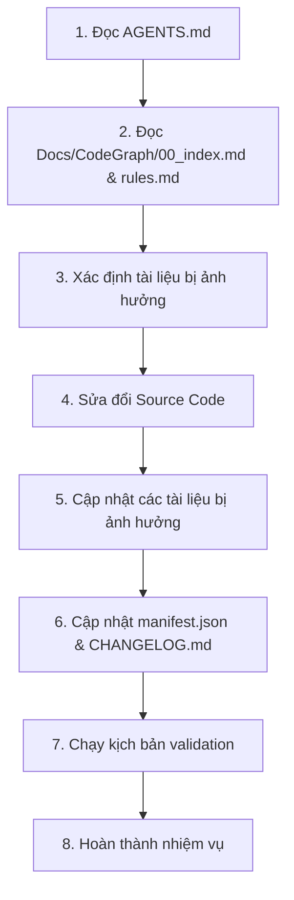

# FreeBook - AI Agent Development Workflow

> **AGENTS.md defines AI workflow only. Project-specific architecture, coding standards, runtime constraints, subsystem rules and implementation details must reside in `Docs/CodeGraph/rules.md`. AGENTS.md should reference those documents instead of duplicating their contents.**

---

## 1. Trước mỗi nhiệm vụ (Before Every Task)
Trước khi chỉnh sửa mã nguồn, mọi AI assistant bắt buộc phải:
1.  Đọc `.agents/AGENTS.md` (Workflow và quy trình hành vi này).
2.  Đọc `Docs/CodeGraph/00_index.md` (Mục lục và cấu trúc CodeGraph).
3.  Đọc tất cả các tài liệu CodeGraph liên quan đến phần sắp sửa đổi.
4.  Đọc `Docs/CodeGraph/rules.md` (Toàn bộ tri thức dự án, quy tắc viết code, kiến trúc, API và checklist).
5.  Hiểu rõ kiến trúc hiện tại và cách phân hệ vận hành trước khi đưa ra các thay đổi.

---

## 2. Quy trình chuẩn cho AI Assistant (Core Workflow Router)

AI phải thực hiện nhiệm vụ một cách nhất quán theo luồng 8 bước sau:

1.  **Đọc AGENTS.md**: Nắm rõ workflow AI.
2.  **Định vị tài liệu**: Đọc mục lục `00_index.md` và quy tắc `rules.md` để tìm đúng subsystem bị ảnh hưởng.
3.  **Xác định phạm vi cập nhật**: Tìm xem file tài liệu nào trong `Docs/CodeGraph/` cần cập nhật.
4.  **Thay đổi Source Code**: Thực hiện viết mã nguồn và tự kiểm tra chức năng.
5.  **Cập nhật CodeGraph tăng dần**: Chỉ cập nhật các tài liệu bị ảnh hưởng trực tiếp (cập nhật trong vùng comment `GENERATED`).
6.  **Cập nhật Metadata**: Cập nhật `manifest.json` (tính toán lại `sourceHash` và `generatedHash`) và ghi nhận vào `Docs/CodeGraph/CHANGELOG.md`.
7.  **Xác thực**: Chạy kịch bản `validate_links.py` để đảm bảo không lỗi link, không mồ côi.
8.  **Kết thúc**: Phản hồi với cụm từ kết quả tiêu chuẩn.

---

## 3. Thứ tự Ưu tiên Thẩm quyền (Priority of Authority / Source of Truth Hierarchy)

Thứ tự ưu tiên thẩm quyền của tài liệu và mã nguồn khi xảy ra xung đột thông tin được định nghĩa theo cấp bậc sau:
1.  **`Docs/CodeGraph/rules.md`** (Normative Specification / The current approved technical specification. Unless explicitly changed by the user or project maintainers, AI must treat it as the authoritative technical standard).
2.  **`Source Code`** (Actual Implementation / Triển khai thực tế - những gì code đang thực thi).
3.  **`Docs/CodeGraph/*`** (Descriptive Documentation / Tài liệu mô tả - những gì tài liệu mô tả về mã nguồn).
4.  **Các tài liệu khác** (Other documentation).

> [!NOTE]
> **This authority order is only used to resolve conflicts between artifacts. It does not define the normal development workflow.**
> *(Thứ tự ưu tiên thẩm quyền này chỉ được sử dụng khi xảy ra xung đột giữa các tài liệu hoặc mã nguồn. Nó không định nghĩa hay thay thế quy trình phát triển thông thường).*

*   **Bản chất**: `rules.md` là tài liệu quy phạm (những gì dự án cần tuân thủ), trong khi `Docs/CodeGraph/*` là tài liệu mô tả (những gì mã nguồn đang thực thi hiện tại).
*   **Quy trình xử lý sai lệch (Deviation Handling)**: AI phải thực hiện quy trình sau khi phát hiện sự sai lệch:
    *   **Xác minh**: Kiểm tra xem sai lệch là **chủ ý thiết kế mới** (intentional change) hay là **lỗi lập trình** (stale/bug).
    *   **Lỗi / Sai lệch**: Tiến hành sửa đổi `Source Code` để tuân thủ quy chuẩn trong `rules.md`.
    *   **Quy tắc cũ / Thay đổi kiến trúc**: Cập nhật `rules.md` trước (chỉ khi bản thân quy chuẩn kỹ thuật của dự án thay đổi) để ghi nhận quy tắc mới $\rightarrow$ Đồng bộ `Source Code` (nếu cần) $\rightarrow$ Cập nhật `Docs/CodeGraph/*` tương ứng để phản ánh trạng thái thực tế mới.
    *   **Yêu cầu trực tiếp từ người dùng (User-directed change)**: Nếu người dùng hoặc maintainer yêu cầu thay đổi tính năng, kiến trúc hoặc quy tắc (chỉ áp dụng khi yêu cầu của người dùng có sửa code):
        1. Thực hiện thay đổi theo yêu cầu trên **Source Code**.
        2. Đánh giá xem thay đổi đó có làm thay đổi quy chuẩn của dự án (**`rules.md`**) hay không.
        3. Nếu có, cập nhật **`rules.md`**.
        4. Cuối cùng cập nhật **`Docs/CodeGraph/*`** để phản ánh trạng thái mới.
    *   **Trường hợp không rõ (UNKNOWN)**: Nếu AI không đủ bằng chứng để xác định liệu sai lệch là chủ ý hay lỗi, **bắt buộc phải đánh dấu UNKNOWN** và yêu cầu người dùng xác nhận thay vì tự suy đoán.
    *   **Không tự ý sửa**: Tuyệt đối không tự ý sửa `Source Code` chỉ để khớp với `rules.md` khi chưa xác minh `rules.md` vẫn là quy tắc hiện hành.

*   **Lưu ý**: Đa số các tính năng thông thường (ordinary features) không cần sửa `rules.md`.

*   **Ví dụ minh họa (Examples)**:
    *   *Code khác CodeGraph* $\rightarrow$ Cập nhật CodeGraph.
    *   *Code khác rules.md vì rules.md cũ* $\rightarrow$ 1. Cập nhật rules.md; 2. Đồng bộ Source Code (nếu cần); 3. Cập nhật Docs/CodeGraph/* để phản ánh trạng thái mới.
    *   *Code khác rules.md do bug* $\rightarrow$ Sửa Source Code để tuân thủ rules.md.
    *   *Người dùng yêu cầu thay đổi tính năng/kiến trúc* $\rightarrow$ 1. Sửa Source Code; 2. Đánh giá và cập nhật rules.md (nếu đổi quy chuẩn); 3. Cập nhật Docs/CodeGraph/*.

---

## 4. Quy tắc Bảo trì & Cập nhật tăng dần (Maintenance Rules)
*   **Không tạo lại toàn bộ (No Full Regeneration)**: Chỉ phân tích và chỉnh sửa các tài liệu bị ảnh hưởng trực tiếp. Giữ nguyên các tài liệu khác.
*   **Bảo vệ ghi chú của con người (Preserve Human Edits)**:
    *   Tất cả nội dung tự động sinh bởi AI nằm trong khối comment:
        `<!-- GENERATED START -->`
        ...
        `<!-- GENERATED END -->`
    *   AI **chỉ được phép sửa đổi nội dung bên trong vùng này**.
    *   **Tuyệt đối không ghi đè, xóa hoặc sửa đổi** bất kỳ nội dung nào nằm ngoài vùng này (đó là các ghi chú, lưu ý thủ công của con người).
*   **Đồng bộ khi Rename / Delete / Move file**:
    *   Nếu một file Swift bị đổi tên, di chuyển hoặc xóa, AI phải quét toàn bộ các file trong `Docs/CodeGraph/` để cập nhật mọi đường dẫn tương đối và xóa bỏ các tham chiếu mồ côi (orphan references).

---

## 5. Quy tắc Kích hoạt Cập nhật (Trigger Rules)
CodeGraph bắt buộc phải được cập nhật khi có bất kỳ thay đổi nào sau đây trong mã nguồn:
*   Thêm file mới, xóa file hoặc di chuyển/đổi tên file Swift.
*   Thay đổi Public API của các Manager, Service, hoặc ViewModel.
*   Thay đổi định nghĩa Protocol hoặc SwiftData Model (`@Model`).
*   Thay đổi mối quan hệ phụ thuộc (Dependency) giữa các thành phần.
*   Thay đổi Máy trạng thái (State Machine) hoặc luồng sự kiện.
*   Thay đổi quan hệ sở hữu đối tượng (Ownership Graph) hoặc Audio/TTS Pipeline.

---

## 6. Tiêu chí Hoàn thành (Completion Criteria / Definition of Synchronized)
Một nhiệm vụ phát triển chỉ được coi là hoàn thành khi:
1.  Source Code đã được cập nhật thành công và chạy ổn định.
2.  Mọi tài liệu CodeGraph bị ảnh hưởng đã được cập nhật chính xác (ở cả YAML Front Matter và vùng `GENERATED`).
3.  Tệp `manifest.json` đã được cập nhật chính xác `sourceHash` và `generatedHash`.
4.  Tệp `CHANGELOG.md` đã được ghi nhận lịch sử thay đổi.
5.  Kịch bản Validation (`validate_links.py`) chạy **PASS 100%**, không còn liên kết chết hay cảnh báo nghiêm trọng.

**Response cuối cùng của AI bắt buộc phải chứa một trong hai cụm từ:**
*   `"CodeGraph updated."` (nếu có cập nhật tài liệu CodeGraph).
*   `"No CodeGraph update required."` (nếu không cần cập nhật tài liệu CodeGraph).

---

## 7. Phạm vi chỉnh sửa cho phép (Modification Scope)
*   AI có quyền tự cập nhật:
    *   `Docs/CodeGraph/*` (Các tài liệu phân tích)
    *   `Docs/CodeGraph/manifest.json`
    *   `Docs/CodeGraph/CHANGELOG.md`
*   AI **Chỉ được phép chỉnh sửa `.agents/AGENTS.md` khi có yêu cầu trực tiếp và rõ ràng từ người dùng**.

---

## 8. Khả năng tương thích tương lai (Future Compatibility)
Khi giới thiệu các phân hệ mới trong tương lai, AI cần cập nhật:
*   Đồ thị CodeGraph và phân hệ tương ứng trong `Docs/CodeGraph/`.
*   Quy tắc kỹ thuật trong `Docs/CodeGraph/rules.md`.
*   File kê khai `manifest.json`.
*   Chỉ cập nhật `.agents/AGENTS.md` khi bản thân quy trình workflow phát triển của AI thay đổi, không cập nhật cho các chi tiết triển khai tính năng thông thường.
