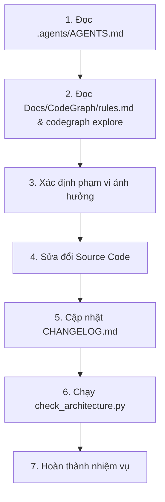

# FreeBook - AI Agent Development Workflow

> **AGENTS.md defines AI workflow only. Project-specific architecture, coding standards, runtime constraints, subsystem rules and implementation details must reside in `Docs/CodeGraph/rules.md`. AGENTS.md should reference those documents instead of duplicating their contents.**

---

## 1. Trước mỗi nhiệm vụ (Before Every Task)
Trước khi chỉnh sửa mã nguồn, mọi AI assistant bắt buộc phải:
1.  Đọc `.agents/AGENTS.md` (Workflow và quy trình hành vi này).
2.  Đọc `Docs/CodeGraph/rules.md` (Toàn bộ tri thức dự án, quy tắc viết code, kiến trúc, API và checklist — tài liệu có thẩm quyền cao nhất).
3.  Dùng công cụ MCP **`codegraph_explore`** (hoặc CLI `codegraph explore "<câu hỏi>"`) để định vị symbol / call path / subsystem liên quan — không đọc doc MB.
4.  Hiểu rõ kiến trúc hiện tại và cách phân hệ vận hành trước khi đưa ra các thay đổi.

---

## 2. Quy trình chuẩn cho AI Assistant (Core Workflow Router)

AI phải thực hiện nhiệm vụ một cách nhất quán theo luồng 8 bước sau:


```mermaid
graph TD
    1[1. Đọc .agents/AGENTS.md] --> 2[2. Đọc Docs/CodeGraph/rules.md & codegraph explore]
    2 --> 3[3. Xác định phạm vi ảnh hưởng]
    3 --> 4[4. Sửa đổi Source Code]
    4 --> 5[5. Cập nhật CHANGELOG.md]
    5 --> 6[6. Chạy check_architecture.py]
    6 --> 7[7. Hoàn thành nhiệm vụ]
```

1.  **Đọc AGENTS.md**: Nắm rõ workflow AI.
2.  **Định vị tài liệu & cấu trúc**: Đọc quy tắc `rules.md` và dùng `codegraph_explore` (hoặc `codegraph explore`) để tìm đúng subsystem / symbol bị ảnh hưởng — không đọc doc MB.
3.  **Xác định phạm vi cập nhật**: Xác định file Swift và quy tắc `rules.md` nào liên quan.
4.  **Thay đổi Source Code**: Thực hiện viết mã nguồn và tự kiểm tra chức năng.
5.  **Cập nhật CHANGELOG.md**: Ghi entry version `[1.3.NNN] - YYYY-MM-DD` (tiêu đề trùng subject commit). Khi file vượt ~30 entry thì đẩy phần cũ nhất sang `CHANGELOG.archive.md`.
6.  **Xác thực kiến trúc**: Chạy `python Scripts/check_architecture.py` — exit 0 = pass; chỉ chịu trách nhiệm violation mới do mình gây ra (script đang đỏ baseline 30).
7.  **Kết thúc**: Phản hồi với cụm từ kết quả tiêu chuẩn.

### 2.1. Quy tắc ủy quyền Unit Test

*   Không tạo mới, bổ sung hoặc chỉnh sửa unit test nếu người dùng chưa yêu cầu rõ ràng.
*   Quy tắc này không cấm chạy các unit test hiện có hoặc thực hiện các bước kiểm tra tĩnh/validation không làm thay đổi test.

### 2.2. Quy tắc Giao diện Header & Toolbar (UI Standard)

*   Mọi thay đổi hoặc bổ sung màn hình/view mới bắt buộc tuân thủ chuẩn Header & Toolbar: Icon font `.system(size: 17, weight: .semibold)`, khoảng cách tối thiểu `6pt`, hitbox tối thiểu `36x36pt` (khuyến nghị `36x38pt`), nút tròn `38x38pt`, pill cao `38pt` (chi tiết tại `Docs/CodeGraph/rules.md` §5.4).

---

## 3. Thứ tự Ưu tiên Thẩm quyền (Priority of Authority / Source of Truth Hierarchy)

Thứ tự ưu tiên thẩm quyền của tài liệu và mã nguồn khi xảy ra xung đột thông tin được định nghĩa theo cấp bậc sau:
1.  **`Docs/CodeGraph/rules.md`** (Normative Specification / The current approved technical specification. Unless explicitly changed by the user or project maintainers, AI must treat it as the authoritative technical standard).
2.  **`Source Code`** (Actual Implementation / Triển khai thực tế - những gì code đang thực thi).
3.  **`CHANGELOG.md`** (Audit trail / Lịch sử thay đổi theo version).
4.  **Các tài liệu khác** (Other documentation).

> [!NOTE]
> **This authority order is only used to resolve conflicts between artifacts. It does not define the normal development workflow.**
> *(Thứ tự ưu tiên thẩm quyền này chỉ được sử dụng khi xảy ra xung đột giữa các tài liệu hoặc mã nguồn. Nó không định nghĩa hay thay thế quy trình phát triển thông thường).*

*   **Bản chất**: `rules.md` là tài liệu quy phạm (những gì dự án cần tuân thủ), trong khi `Docs/CodeGraph/*` là tài liệu mô tả (những gì mã nguồn đang thực thi hiện tại).
*   **Quy trình xử lý sai lệch (Deviation Handling)**: AI phải thực hiện quy trình sau khi phát hiện sự sai lệch:
    *   **Xác minh**: Kiểm tra xem sai lệch là **chủ ý thiết kế mới** (intentional change) hay là **lỗi lập trình** (stale/bug).
    *   **Lỗi / Sai lệch**: Tiến hành sửa đổi `Source Code` để tuân thủ quy chuẩn trong `rules.md`.
    *   **Quy tắc cũ / Thay đổi kiến trúc**: Cập nhật `rules.md` trước (chỉ khi bản thân quy chuẩn kỹ thuật của dự án thay đổi) để ghi nhận quy tắc mới $\rightarrow$ Đồng bộ `Source Code` (nếu cần) $\rightarrow$ Cập nhật `Docs/CodeGraph/*` tương ứng để phản ánh trạng thái thực tế mới.
    *   **Yêu cầu trực tiếp từ người dùng (User-directed change)**: Nếu người dùng hoặc maintainer yêu cầu thay đổi tính năng, kiến trúc hoặc quy tắc (chỉ áp dụng khi yêu cầu của người dùng có sửa code):
        1. Thực hiện thay đổi theo yêu cầu trên **Source Code**.
        2. Đánh giá xem thay đổi đó có làm thay đổi quy chuẩn của dự án (**`rules.md`**) hay không.
        3. Nếu có, cập nhật **`rules.md`**.
        4. Cuối cùng cập nhật **`Docs/CodeGraph/*`** để phản ánh trạng thái mới.
    *   **Trường hợp không rõ (UNKNOWN)**: Nếu AI không đủ bằng chứng để xác định liệu sai lệch là chủ ý hay lỗi, **bắt buộc phải đánh dấu UNKNOWN** và yêu cầu người dùng xác nhận thay vì tự suy đoán.
    *   **Không tự ý sửa**: Tuyệt đối không tự ý sửa `Source Code` chỉ để khớp với `rules.md` khi chưa xác minh `rules.md` vẫn là quy tắc hiện hành.

*   **Lưu ý**: Đa số các tính năng thông thường (ordinary features) không cần sửa `rules.md`.

*   **Ví dụ minh họa (Examples)**:
*   *Code khác rules.md vì rules.md cũ* $\rightarrow$ 1. Cập nhật rules.md; 2. Đồng bộ Source Code (nếu cần).
*   *Code khác rules.md do bug* $\rightarrow$ Sửa Source Code để tuân thủ rules.md.
*   *Người dùng yêu cầu thay đổi tính năng/kiến trúc* $\rightarrow$ 1. Sửa Source Code; 2. Đánh giá và cập nhật rules.md (nếu đổi quy chuẩn); 3. Ghi CHANGELOG.md.

---

## 4. Quy tắc Bảo trì & Cập nhật tăng dần (Maintenance Rules)
*   **Không tạo lại toàn bộ (No Full Regeneration)**: Chỉ phân tích và chỉnh sửa các tài liệu bị ảnh hưởng trực tiếp. Giữ nguyên các tài liệu khác.
*   **Đồng bộ index cấu trúc**: `codegraph` tự động đồng bộ index (`.codegraph/`) khi file Swift đổi (thêm/xoá/đổi tên/sửa nội dung) qua file watcher. Khi codegraph báo *"pending index sync"*, kết quả cũ hơn code vừa sửa, hoặc sau `git pull`/đổi nhánh, **agent tự chạy `codegraph sync`** không cần hỏi. Nếu index thiếu (không có `.codegraph/`), người dùng chạy `codegraph init` tại root.
*   **Đồng bộ khi Rename / Delete / Move file**:
    *   `codegraph` tự bắt các thay đổi đường dẫn; không cần quét tay.
    *   Nếu một quy tắc ở `rules.md` thay đổi theo, cập nhật `rules.md` (chỉ khi bản thân quy chuẩn kỹ thuật đổi).

### 4.1. Thiết lập trên máy mới / checkout mới

Khi clone repo về máy khác (hoặc để lâu ngày rồi `git pull` nhiều thay đổi), codegraph **không tự build index** — lệnh `codegraph explore` sẽ báo *"no .codegraph/ index exists ... run 'codegraph init'"* và bảo agent không tự chạy init. Khởi tạo thủ công một lần:

1. Cài codegraph (binary + PATH): chạy `install.ps1` từ GitHub release, hoặc `codegraph upgrade` nếu đã có.
2. Tại root repo: `codegraph init` — build `.codegraph/` từ `codegraph.json` (bắt buộc; agent **không** tự chạy).
3. Wire các agent hỗ trợ: `codegraph install --yes --target=claude,codex,antigravity`.
4. WorkBuddy (không nằm trong danh sách `install`): tự tạo `~/.workbuddy-ai/mcp.json`:
   ```json
   {
     "mcpServers": {
       "codegraph": {
         "command": "codegraph",
         "args": ["serve", "--mcp"],
         "env": { "CODEGRAPH_TELEMETRY": "0", "CODEGRAPH_WATCH_DEBOUNCE_MS": "2000" }
       }
     }
   }
   ```
   rồi Connectors → mục **"Custom connectors"** góc trên bên phải → bấm **Trust**.
5. Đồng bộ lại sau idle dài / git pull / đổi nhánh: `codegraph sync` (hoặc `codegraph index` rebuild toàn bộ) — **agent tự chạy**, không cần hỏi. File watcher tự động đồng bộ khi session đang chạy, nhưng **không** bắt kịp thay đổi lúc máy tắt.

---

## 5. Quy tắc Kích hoạt Cập nhật (Trigger Rules)
`codegraph` tự động index mọi thay đổi cấu trúc (thêm/xoá/đổi tên/sửa Swift). Không có quy trình cập nhật tài liệu đồ thị thủ công nữa. Khi có thay đổi sau đây, chỉ cần đảm bảo `rules.md` vẫn đúng (cập nhật nếu quy chuẩn đổi) và ghi `CHANGELOG.md`:
*   Thêm file mới, xóa file hoặc di chuyển/đổi tên file Swift.
*   Thay đổi Public API của các Manager, Service, hoặc ViewModel.
*   Thay đổi định nghĩa Protocol hoặc SwiftData Model (`@Model`).
*   Thay đổi mối quan hệ phụ thuộc (Dependency) giữa các thành phần.
*   Thay đổi Máy trạng thái (State Machine) hoặc luồng sự kiện.
*   Thay đổi quan hệ sở hữu đối tượng (Ownership Graph) hoặc Audio/TTS Pipeline.

---

## 6. Tiêu chí Hoàn thành (Completion Criteria / Definition of Synchronized)
Một nhiệm vụ phát triển chỉ được coi là hoàn thành khi:
1.  Source Code đã được cập nhật thành công và chạy ổn định.
2.  `CHANGELOG.md` đã ghi entry version `[1.3.NNN] - YYYY-MM-DD` (đẩy phần cũ sang `CHANGELOG.archive.md` khi vượt ~30 entry).
3.  `python Scripts/check_architecture.py` exit 0 (chỉ chịu trách nhiệm violation mới).
4.  `codegraph` index đã đồng bộ (`.codegraph/` hiện diện; tự động qua file watcher).

**Response cuối cùng của AI bắt buộc phải chứa một trong hai cụm từ** (giữ quy ước dù không còn validator):
*   `"CodeGraph updated."` (nếu có thay đổi đáng kể).
*   `"No CodeGraph update required."` (nếu không cần).

---

## 7. Phạm vi chỉnh sửa cho phép (Modification Scope)
*   AI có quyền tự cập nhật:
    *   `Docs/CodeGraph/rules.md` (khi quy chuẩn kỹ thuật đổi)
    *   `Docs/CodeGraph/CHANGELOG.md`
    *   `CHANGELOG.md`
*   AI **Chỉ được phép chỉnh sửa `.agents/AGENTS.md` khi có yêu cầu trực tiếp và rõ ràng từ người dùng**.

---

## 8. Khả năng tương thích tương lai (Future Compatibility)
Khi giới thiệu các phân hệ mới trong tương lai, AI cần:
*   Cập nhật quy tắc kỹ thuật trong `Docs/CodeGraph/rules.md` (nếu đổi quy chuẩn).
*   Ghi `CHANGELOG.md`.
*   `codegraph` sẽ tự index mã nguồn mới — không cần khai báo thủ công.
*   Chỉ cập nhật `.agents/AGENTS.md` khi bản thân quy trình workflow phát triển của AI thay đổi, không cập nhật cho các chi tiết triển khai tính năng thông thường.
