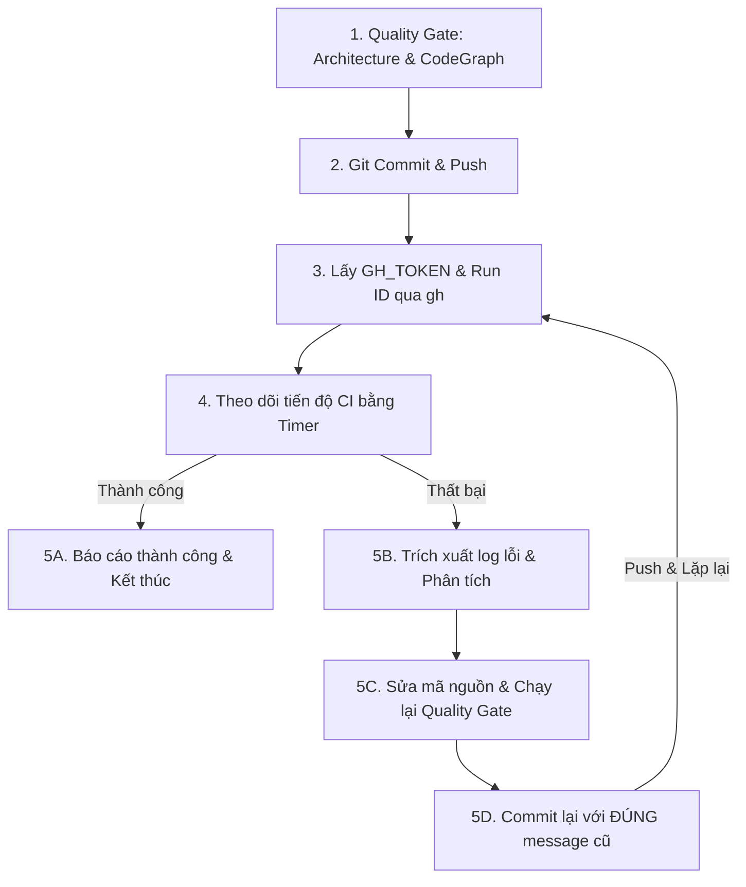

# Push & CI Monitor Skill

Skill này tự động hóa quy trình kiểm tra chất lượng, commit, push và theo dõi GitHub Actions CI bằng GitHub CLI (`gh`), đồng thời tự động sửa lỗi và commit lại bằng message cũ nếu quá trình build CI thất bại.

---

## Khi nào sử dụng skill này?

Sử dụng skill này khi người dùng yêu cầu:
- Duyệt và commit code, sau đó push lên repository.
- Theo dõi tiến trình GitHub Actions CI sau khi push.
- Tự động khắc phục lỗi nếu CI thất bại và commit lại với cùng message cũ.

---

## Quy trình 5 bước thực hiện



---

### Bước 1: Quality Gate trước khi commit

Trước khi commit bất kỳ thay đổi nào, bắt buộc phải vượt qua toàn bộ các cổng kiểm tra tĩnh:

1. **Kiểm tra kiến trúc (`check_architecture.py`)**:
   ```bash
   python Scripts/check_architecture.py
   ```
   - Đảm bảo **0** vi phạm mới do các thay đổi gây ra.
   - Các file mới phải $\le 400$ dòng và chỉ có 1 primary type ở top-level.
   - Các file legacy chỉ được phép giữ nguyên hoặc giảm số dòng dưới baseline.
   - Tuyệt đối không vi phạm View SwiftData Mutation hay Service SwiftUI Import.

2. **Kiểm tra CodeGraph tài liệu (`validate_links.py`)**:
   ```bash
   python Docs/CodeGraph/validate_links.py --explain
   ```
   - Xác định danh sách các doc bị stale (ảnh hưởng bởi các file Swift đã đổi).
   - Cập nhật nội dung các doc bị ảnh hưởng trong vùng `<!-- GENERATED START --> ... <!-- GENERATED END -->`.
   - Ghi nhận từng doc đã sửa bằng:
     ```bash
     python Docs/CodeGraph/validate_links.py --accept <doc_id...>
     ```
   - Đối với các doc vẫn giữ nguyên tính đúng đắn, ghi nhận bằng:
     ```bash
     python Docs/CodeGraph/validate_links.py --no-change-needed <doc_id...>
     ```

3. **Cập nhật `CHANGELOG.md`**:
   - Thêm entry phiên bản mới `[1.3.NNN] - YYYY-MM-DD` (tăng `NNN` lên 1 đơn vị so với bản gần nhất).
   - Tiêu đề entry phải **trùng khớp với subject của git commit**.
   - Nếu `CHANGELOG.md` vượt quá ~30 entry, đẩy các entry cũ nhất sang `CHANGELOG.archive.md` để giữ file chính gọn.

4. **Xác thực đọc-chỉ (Read-only)**:
   ```bash
   python Docs/CodeGraph/validate_links.py
   ```
   - Bắt buộc phải **PASS 100%** (không có link chết, không có file mồ côi, không còn doc nào stale).

---

### Bước 2: Commit & Push lên Git

1. **Lưu trữ commit message vào biến/context**:
   Xác định rõ commit message chuẩn theo quy ước (ví dụ: `feat: ...`, `fix: ...`).
   Ghi nhớ thông điệp này (`COMMIT_MSG`) để tái sử dụng nếu cần sửa lỗi.

2. **Stage và Commit**:
   ```bash
   git add -A && git commit -m "$COMMIT_MSG"
   ```

3. **Push lên nhánh tương ứng**:
   ```bash
   git push origin <branch_name>
   ```

---

### Bước 3: Lấy quyền xác thực & Tra cứu CI Run qua `gh`

Nếu môi trường chưa cấu hình `gh auth login`, tự động trích xuất token xác thực từ Git Credential Manager mà không làm phiền người dùng:

- **Trên Windows PowerShell**:
  ```powershell
  $token = ("protocol=https`nhost=github.com`n" | git credential fill | Select-String "password=").Line.Replace("password=", "").Trim()
  $env:GH_TOKEN = $token
  gh run list --limit 3
  ```

- **Trên macOS / Linux (bash/zsh)**:
  ```bash
  export GH_TOKEN=$(printf "protocol=https\nhost=github.com\n" | git credential fill | grep '^password=' | cut -d= -f2)
  gh run list --limit 3
  ```

Xác định **Run ID** mới nhất được kích hoạt bởi commit vừa push (trạng thái ban đầu thường là `queued` hoặc `in_progress`).

---

### Bước 4: Theo dõi tiến độ CI (Non-blocking)

> [!IMPORTANT]
> **Không bao giờ chạy polling loop liên tục** làm lãng phí tài nguyên và làm nghẽn context. Hãy sử dụng công cụ `schedule` với chế độ một lần (`DurationSeconds`) để chờ thông báo phản hồi.

1. **Chu kỳ theo dõi khuyến nghị**:
   - Sau khi push: đặt hẹn giờ **60 giây** để kiểm tra trạng thái khởi động của runner.
   - Khi job bước vào bước `Build and Archive App (Unsigned)`: đặt hẹn giờ **120 giây** mỗi lượt kiểm tra (bước này thường mất khoảng 4–8 phút trên macOS runner).

2. **Lệnh kiểm tra trạng thái**:
   ```powershell
   gh run view <run_id>
   gh run view --job=<job_id>
   ```

3. **Các giai đoạn chính của Workflow**:
   - `Generate Xcode Project` (`xcodegen generate`)
   - `Resolve and patch Package dependencies`
   - `Build and Archive App (Unsigned)` (`xcodebuild archive`)
   - `Package IPA` & `Upload IPA Artifact`
   - `Send IPA to Telegram`

---

### Bước 5: Xử lý Kết quả (Pass / Fail)

#### Trường hợp 1: CI THÀNH CÔNG (`✓ SUCCESS`)
1. Báo cáo hoàn tất cho người dùng kèm theo:
   - Run ID và link GitHub Actions run.
   - Tóm tắt các giai đoạn đã hoàn tất thành công.
2. Kết thúc câu phản hồi bằng: `"CodeGraph updated."` (hoặc `"No CodeGraph update required."`).

#### Trường hợp 2: CI THẤT BẠI (`X FAILURE`)
1. **Trích xuất thông tin lỗi**:
   - Chạy lệnh xem log thất bại:
     ```powershell
     gh run view --log-failed --job=<job_id>
     ```
   - Nếu log bị cắt ngắn hoặc nằm trong phần diagnostics, dump log ra file tạm và lọc các dòng lỗi:
     ```powershell
     gh run view --log --job=<job_id> > ci_log.txt
     Select-String -Path ci_log.txt -Pattern "error:" -Context 3,3
     ```

2. **Phân tích nguyên nhân**:
   - Các lỗi thường gặp khi compile trên macOS:
     - Lỗi truy cập phạm vi: method `public` sử dụng kiểu dữ liệu `internal` (ví dụ: `ChapterMetadataSnapshot`).
     - Lỗi thiếu tham số mặc định trong khai báo hàm (ví dụ: `desc: String?` thay vì `desc: String? = nil`).
     - Lỗi không tìm thấy symbol do khác biệt môi trường hoặc thiếu import.
     - Lỗi xung đột kiểu dữ liệu hoặc API không tồn tại trên target iOS.

3. **Sửa mã nguồn**:
   - Tiến hành chỉnh sửa chính xác các vị trí gây lỗi trong source code.
   - Xóa file log tạm sau khi trích xuất xong (`Remove-Item ci_log.txt -Force`).

4. **Kiểm tra lại chất lượng**:
   - Chạy `check_architecture.py` đảm bảo không vi phạm kiến trúc.
   - Chạy `validate_links.py --explain` và cập nhật CodeGraph/manifest nếu có file thay đổi.
   - Đảm bảo `validate_links.py` PASS 100%.

5. **Commit lại với ĐÚNG commit message cũ**:
   > [!WARNING]
   > Theo quy định, khi sửa lỗi sau CI fail, phải commit lại bằng **đúng commit message cũ ban đầu** (`$COMMIT_MSG`), không đổi nội dung message commit:
   ```bash
   git add -A && git commit -m "$COMMIT_MSG"
   git push origin <branch_name>
   ```

6. **Tiếp tục theo dõi**:
   - Lấy Run ID mới và quay trở lại **Bước 3** và **Bước 4** cho đến khi CI báo `✓ SUCCESS`.
