# Hướng dẫn Điều hướng CodeGraph - Dự án FreeBook

Tài liệu này đóng vai trò là điểm bắt đầu (Entrypoint) và bản đồ chỉ dẫn toàn bộ hệ thống tài liệu CodeGraph sống (Living Documentation) của dự án **FreeBook**.

## Ghi chú thủ công (Human Notes)
*Khu vực này dành riêng cho ghi chú thủ công của con người.*

<!-- GENERATED START -->
## Sơ đồ cấu trúc tài liệu CodeGraph

```mermaid
graph TD
    Index["00_index.md (Chỉ mục)"] --> Subsystems["11_subsystems.md (Phân hệ)"]
    Index --> Project["01_project.md (Kiến trúc tổng thể)"]
    
    Index --> Files["02_file_graph.md (Đồ thị File)"]
    Index --> Types["03_type_graph.md (Đồ thị Kiểu dữ liệu)"]
    Index --> Ownership["12_ownership_graph.md (Đồ thị Sở hữu)"]
    Index --> Calls["04_call_graph.md (Đồ thị Lời gọi hàm)"]
    Index --> States["05_state_graph.md (Máy trạng thái)"]
    Index --> Events["06_event_graph.md (Luồng Sự kiện)"]
    
    Index --> Dataflow["07_dataflow.md (Dòng chảy Dữ liệu)"]
    Index --> Lifecycles["08_lifecycle.md (Vòng đời SwiftUI)"]
    Index --> ResLifecycles["13_resource_lifecycle.md (Vòng đời Tài nguyên)"]
    
    Index --> DepRules["09_dependency_rules.md (Quy tắc phụ thuộc)"]
    Index --> Risks["10_risk_report.md (Báo cáo rủi ro kỹ thuật)"]
    Index --> Rules["rules.md (Quy định viết code)"]
    Index --> Complexity["14_complexity_report.md (Độ phức tạp & TODOs)"]
```

---

## Chi tiết các Tài liệu

### 1. Kiến trúc & Thiết kế Phân hệ
*   **[01_project.md](01_project.md)**: Phác thảo kiến trúc phân tầng của dự án FreeBook (Common, Models, Services, Views) và định nghĩa các nguyên tắc phát triển hệ thống.
*   **[11_subsystems.md](11_subsystems.md)**: Phân tích 14 phân hệ (Subsystems) chính của ứng dụng như Reader, TTS, Download, Audio, Extension Engine...

### 2. Đồ thị & Quan hệ thành phần
*   **[02_file_graph.md](02_file_graph.md)**: Đồ thị quan hệ phụ thuộc (Uses / Used by) và Import Graph của từng file trong số 87 file mã nguồn Swift.
*   **[03_type_graph.md](03_type_graph.md)**: Chi tiết về các lớp, struct, enum, protocol, actor và extension.
*   **[12_ownership_graph.md](12_ownership_graph.md)**: Biểu diễn mối quan hệ sở hữu đối tượng theo cấu trúc cây từ View -> ViewModel -> Manager -> Service.
*   **[04_call_graph.md](04_call_graph.md)**: Đồ thị cuộc gọi hàm quan trọng kèm theo đánh giá mức độ tin cậy và đánh dấu UNKNOWN cho các dynamic dispatch.
*   **[05_state_graph.md](05_state_graph.md)**: Phân tích các máy trạng thái điều khiển TTS, Tải xuống, Trình đọc truyện và Widget.
*   **[06_event_graph.md](06_event_graph.md)**: Bản đồ luồng sự kiện và cơ chế giao tiếp đa luồng.

### 3. Dòng chảy & Vòng đời
*   **[07_dataflow.md](07_dataflow.md)**: Dòng chảy dữ liệu qua các tầng và cơ chế bộ nhớ đệm (Cache).
*   **[08_lifecycle.md](08_lifecycle.md)**: Vòng đời của các SwiftUI Views và cơ chế hủy Task chạy ngầm.
*   **[13_resource_lifecycle.md](13_resource_lifecycle.md)**: Vòng đời các tài nguyên hệ thống đặc biệt (`AVAudioEngine`, background `Task`, SwiftData context, `WKWebView`).

### 4. Quy tắc phát triển & Phân tích rủi ro
*   **[09_dependency_rules.md](09_dependency_rules.md)**: Quy tắc phụ thuộc hợp lệ trong dự án để bảo toàn tính toàn vẹn của cấu trúc Clean Architecture.
*   **[10_risk_report.md](10_risk_report.md)**: Báo cáo rủi ro kỹ thuật phân loại theo Severity và Likelihood, liên kết trực tiếp với các tệp nguồn và tài liệu liên quan.
*   **[rules.md](rules.md)**: Hướng dẫn quy định lập trình chi tiết cho dự án, bao gồm cả Source of Truth, Maintenance Rules và Trigger Rules.
*   **[14_complexity_report.md](14_complexity_report.md)**: Báo cáo kích thước file, Cyclomatic Complexity ước lượng, nested closures, và TODOs.
<!-- GENERATED END -->
