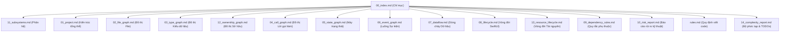

# Hướng dẫn Điều hướng CodeGraph - Dự án FreeBook

Tài liệu này đóng vai trò là điểm bắt đầu (Entrypoint) và bản đồ chỉ dẫn toàn bộ hệ thống tài liệu CodeGraph sống (Living Documentation) của dự án **FreeBook**.

## Ghi chú thủ công (Human Notes)
*Khu vực này dành riêng cho ghi chú thủ công của con người.*

<!-- GENERATED START -->
## Nút -/+ ngưỡng dọn truyện cũ, bấm ra ngoài là tắt bàn phím (1.3.266)

* **Tắt bàn phím khi bấm ra ngoài ô nhập, làm một lần cho toàn app.** [KeyboardDismissGesture](../../Sources/Common/Utils/KeyboardDismissGesture.swift#L1) (112 dòng, chỉ `import UIKit`) gắn một `UITapGestureRecognizer` lên chính `UIWindow` thay vì thêm `.onTapGesture` vào từng màn. SwiftUI không có công tắc tương đương: `.scrollDismissesKeyboard` chỉ phản ứng khi *kéo* danh sách, còn sửa từng màn thì phải chạm hàng chục view và sẽ ăn mất touch của nút bên dưới.
* **Ba thiết lập của recognizer là bắt buộc, không phải phòng xa**: `cancelsTouchesInView = false` để nút/hàng `List` bên dưới vẫn nhận touch (một tap vừa bấm nút vừa tắt bàn phím); `shouldRecognizeSimultaneouslyWith` trả `true` vì nếu không recognizer này chặn pan của scroll view và tap chọn hàng; `shouldReceive touch` bỏ qua touch rơi vào ô **đang nhập được** (leo ngược `superview` để bắt cả subview như nút clear của `UITextField`), nếu không bấm vào chính ô đang gõ lại tự tắt bàn phím.
* **Chỉ cài lên window ở level `.normal`** — mirror bộ lọc của `VisibleBrowserTabManager.findTopViewController` (`$0.windowLevel == .normal && !$0.isHidden`). Window của TTS widget/widget trình duyệt/toast nằm quanh level `.alert` và hit-test passthrough, còn bàn phím sống trong window hệ thống riêng nên tap vào bàn phím không bao giờ chạm recognizer này. `ReaderUITextView` là `UITextView` **chỉ đọc** nên tap vào chữ trong trình đọc vẫn tắt được bàn phím.
* **Cài trễ theo `keyboardWillShowNotification`, không cài lúc khởi động**: ở `App.init` chưa có window nào tồn tại. Mỗi lần bàn phím hiện lại quét scene, nên window sinh ra sau (scene mới, LiveContainer) cũng được phủ; recognizer đánh dấu bằng `UIGestureRecognizer.name` để không cài trùng. [AppLaunchRootView](../../Sources/App/FreeBookApp.swift#L63) gọi `activate()` một lần trong `onAppear`, các lần sau là no-op.
* **Ngưỡng bỏ quên có nút −/+ bước 1 ngày.** [StaleBookCleanupSettingsView](../../Sources/Views/Settings/Cleanup/StaleBookCleanupSettingsView.swift#L42) 209 → **238** dòng: hai nút kẹp hai đầu slider, mốc 7/365 chuyển xuống dưới thanh trượt. Lý do có nút: dải 7…365 quá dài để kéo tay dừng đúng một ngày. Cả nút và slider đều ghi qua `StaleBookCleanupPolicy.clampInactiveDays` nên không có đường ghi giá trị ngoài biên; `buttonStyle(.borderless)` là bắt buộc trong `Form`, nếu không cả hàng thành một vùng bấm.
* Gate: `check_architecture.py` giữ đúng **14 violation**, cùng một tập. 1 file mới 112 dòng, ≤ 400 và đúng 1 type top level; tổng file Swift 361 → **362**. `project.yml` khai theo thư mục nên không phải sửa nhưng **phải** `xcodegen generate`; host là Windows nên **không** biên dịch tại chỗ.

## Backup quy tắc mục lục, xuất nhập công cụ tra cứu nhanh (1.3.265)

* **Cấu hình dạng file/JSON tách khỏi khối plist cài đặt.** [BackupConfigArchiver](../../Sources/Services/Backup/BackupConfigArchiver.swift#L1) sở hữu nhánh archive mới `config/`: `config/toc_rules.json` (chép nguyên `translate/toc_rules.json`) và `config/search_engines.json` (danh sách công cụ tra cứu nhanh). Vẫn **không** thêm case `BackupScope` — cả hai file đi cùng cơ chế "luôn xuất, khôi phục theo cờ" của [BackupSettingsArchiver](../../Sources/Services/Backup/BackupSettingsArchiver.swift#L1), tức chịu chung công tắc `BackupRestoreWorker.Options.restoreSettings`, vì rawValue lạ trong `manifest.scopes` làm bản app cũ decode cả manifest thất bại.
* **Vì sao công cụ tra cứu phải rời khối plist**: `SearchEngine.storageKey` (`custom_search_engines`) nay nằm trong deny-list của `isExportable`. Khôi phục qua plist là **ghi đè cả mảng**, xoá sạch công cụ chỉ có ở máy nhận; qua `config/` thì [SearchEngineTransfer.merged](../../Sources/Models/Dictionaries/SearchEngineTransfer.swift#L1) gộp theo *chữ ký* (tên chuẩn hoá + mẫu URL) chứ không theo `id`, và phát `UUID()` mới khi `id` trùng — cùng một công cụ thêm ở hai máy không nhân đôi, còn `id` đụng nhau không làm vỡ identity của `ForEach`.
* **Chiều xuất đọc `Data` thô của khoá, không gọi `SearchEngine.loadEngines()`** — hàm đó **ghi** danh sách mặc định vào `UserDefaults` khi khoá còn rỗng, nên dùng nó trong luồng sao lưu là thay đổi trạng thái máy nguồn. Chiều nhập quy tắc mục lục dùng lại đúng ba hàm sẵn có của [TranslateUtils](../../Sources/Services/Translation/Utils/TranslateUtils.swift#L1): `validateImportedTOCRules` → `mergeTOCRules(current:imported:)` → `saveTOCRules` (kèm xoá cache regex + cache tên chương), không cài lại logic gộp lần hai.
* **`BackupManifest.Counts` thêm `config`** với `decodeIfPresent(...) ?? 0` như mọi khoá khác, nên `.fbbackup` tạo trước 1.3.265 vẫn decode được và hiện 0. [RestoreOptionsSheet](../../Sources/Views/Settings/Backup/RestoreOptionsSheet.swift#L1) bật sẵn công tắc khi `counts.settings > 0 || counts.config > 0` và thêm hàng "File cấu hình"; footer của [BackupHubView](../../Sources/Views/Settings/Backup/BackupHubView.swift#L1) sửa lại cho khỏi hứa sai — luật thay ký tự TTS **không** luôn có mặt, nó đi theo nhóm tuỳ chọn `.dictCustom` (subtitle của [BackupScope](../../Sources/Services/Backup/BackupScope.swift#L46) nói rõ điều này).
* **Xuất/nhập công cụ tra cứu nhanh ngay tại màn cấu hình.** [SearchEnginesConfigView](../../Sources/Views/Settings/Search/SearchEnginesConfigView.swift#L1) 116 → **259** dòng, dùng đúng khuôn nhập/xuất của repo: `DocumentPickerPresenter` đặt trong `.background`, `ShareSheet` qua `.sheet(item:)` với `ExportDocument` bọc URL tạm và `onDismiss` dọn file, `confirmationDialog` chọn Gộp/Thay thế kèm số đếm thật (`SearchEngineTransfer.newCount`). Codec chung nằm ở tầng `Models` vì cả View và archiver đều gọi — chặn file > 200 KB, > 50 công cụ, mẫu URL thiếu `%s`.
* Gate: `check_architecture.py` giữ đúng **14 violation**, cùng một tập. 2 file mới 107/109 dòng, đều ≤ 400 và đúng 1 type top level; tổng file Swift 359 → **361**. `project.yml` khai theo thư mục nên không phải sửa nhưng **phải** `xcodegen generate`; host là Windows nên **không** biên dịch tại chỗ.

## Backup kèm cài đặt, sửa nghĩa tại chỗ, không dọn truyện trên kệ (1.3.264)

* **Cài đặt & cấu hình vào được bản sao lưu mà vẫn không thêm case `BackupScope`.** [BackupSettingsArchiver](../../Sources/Services/Backup/BackupSettingsArchiver.swift#L1) chụp `UserDefaults.standard.dictionaryRepresentation()` thành **plist nhị phân** (`settings/user_defaults.plist`) — chọn plist chứ không JSON vì nó giữ đúng kiểu `Bool`/`Int`/`Double`/`Date`/`Data`/mảng/từ điển, thứ JSON làm mất. Khối này **luôn** được ghi vào archive (chỉ vài KB) và phía khôi phục mới hỏi bằng cờ riêng `BackupRestoreWorker.Options.restoreSettings`; lý do không thêm scope vẫn như 1.3.263: `manifest.scopes` là `[BackupScope]` với decoder tổng hợp nên một rawValue lạ làm bản app cũ **decode cả manifest thất bại**.
* **Lọc khoá theo luật hình dạng, không theo danh sách trắng.** `isExportable(key:)` chỉ nhận khoá bắt đầu bằng chữ **thường ASCII** (khoá của app là camelCase/snake_case, còn rác hệ thống là `Apple*`, `NS*`, `WebKit*`, `PK*`, `com.apple.*`, `kCF*`), rồi trừ đi deny-list: khoá API/token (`google_cloud_tts_custom_api_key`, `googleDriveClientId`), đường dẫn tuyệt đối theo máy (`ttsExtensionLocalPath`), mốc "lượt chạy cuối", hàng đợi retry xoá file, tiến độ đọc từng truyện (`lastChapterIndex_*`, `lastParagraphIndex_*`) và hẹn giờ tắt TTS. Nhờ vậy khoá cài đặt **mới thêm sau này tự động được sao lưu**, không phải nhớ khai. Refresh token của Drive nằm ở Keychain/file (`GoogleDriveTokenStore`) nên vốn không có đường lọt vào đây.
* **Ba chốt an toàn của chiều ghi**: mỗi giá trị phải qua `PropertyListSerialization.propertyList(["value": value], isValidFor: .binary)` trước khi vào snapshot (giá trị không hợp lệ làm `data(fromPropertyList:)` ném **ObjC exception không catch được**); chiều đọc lọc `isExportable` **lần nữa** vì file có thể do bản app khác tạo; và ghi cài đặt là **bước cuối** của `BackupRestoreWorker.restore()` — các bước trước không đọc `UserDefaults`, còn manager đang chạy vẫn giữ giá trị cũ trong RAM nên [BackupCoordinator](../../Sources/Services/Backup/BackupCoordinator.swift#L1) nối thêm "Mở lại app để cài đặt có hiệu lực" vào toast.
* **Màn "Quản lý nghĩa từ": mỗi nghĩa là một ô nhập sửa được, kèm nút lên/xuống.** Trạng thái chuyển từ khoá-theo-chuỗi sang khoá-theo-`UUID` trong [ManageDefinitionsDraft](../../Sources/Views/Dictionary/ManageDefinitionsDraft.swift#L1) — bắt buộc, vì nội dung ô nhập giờ thay đổi liên tục nên không còn là khoá ổn định, và hai nghĩa trùng chữ vẫn phải là hai hàng khác nhau để nút xoá/đổi chỗ biết đang tác động vào hàng nào. `ForEach(id: \.element.id)` thay cho `id: \.offset`.
* **Đĩa chỉ được ghi một lần, lúc đóng màn.** [ManageDefinitionsView](../../Sources/Views/Dictionary/ManageDefinitionsView.swift#L1) 343 → **186** dòng: bỏ 4 `TextField` "thêm nghĩa" và hộp thoại nhập nghĩa (thành thừa khi mọi hàng đều sửa được), giữ cờ `hasSaved` + `.onDisappear`, so `activeMeanings` với bản đọc từ đĩa và **bỏ qua nhóm không đổi**. Xoá là **xoá mềm** (gạch ngang, hoàn tác được trước khi đóng); `Row.preservesEmpty` giữ đúng quy ước nghĩa rỗng đầu chuỗi (`/foo`) để đóng màn không lặng lẽ viết lại từ điển.
* **Lượt dọn truyện cũ không bao giờ chạm truyện trên Kệ sách.** Theo yêu cầu tường minh của người dùng, [StaleBookCleanupCoordinator.staleBookIds](../../Sources/Services/Cleanup/StaleBookCleanupCoordinator.swift#L105) thêm `guard !book.isOnShelf` **trước** cả chốt `isLocalBook`, nên phạm vi dọn thu hẹp về đúng phần **lịch sử** (`isOnShelf == false` — xem qua ở Khám phá rồi rời đi). Cùng bộ lọc phục vụ `previewStaleCount` nên số đếm trong Cài đặt vẫn khớp số truyện thật sự bị xoá; hai footer của [StaleBookCleanupSettingsView](../../Sources/Views/Settings/Cleanup/StaleBookCleanupSettingsView.swift#L1) sửa lại cho khỏi hứa sai ("xoá cả truyện trên kệ" → "chỉ xoá truyện trong lịch sử").
* Gate: `check_architecture.py` giữ đúng **14 violation**, cùng một tập. 3 file mới lần lượt 123/126/73 dòng, đều ≤ 400 và đúng 1 type top level; tổng file Swift 356 → **359**. `project.yml` khai theo thư mục nên không phải sửa nhưng **phải** `xcodegen generate`; host là Windows nên **không** biên dịch tại chỗ.

## Tự xoá truyện cũ, tuỳ chọn số chương, backup từ điển TTS, xoá báo đã đọc (1.3.263)

* **Phân hệ mới `Services/Cleanup/`: tự động xoá truyện lâu không đọc.** [StaleBookCleanupPolicy](../../Sources/Services/Cleanup/StaleBookCleanupPolicy.swift#L1) là nguồn duy nhất của cửa mở/đóng (hai chế độ `.cooldown`/`.daily` như `DriveAutoBackupPolicy`), [StaleBookCleanupCoordinator](../../Sources/Services/Cleanup/StaleBookCleanupCoordinator.swift#L1) chỉ điều phối rồi **trả về `Outcome`** cho View tự hiện toast. Ba khác biệt cố ý so với hai tính năng nền có sẵn: cờ bật/tắt **mặc định `false`** (đây là xoá dữ liệu không hoàn tác được, không được bật hộ), hoãn khởi động **40s** — dài hơn 25s của lượt sao lưu Drive để bản sao lưu chạy **trước** khi có gì bị xoá, và `markRun()` gọi **trước** khi làm việc nên một lượt lỗi chờ tới kỳ sau chứ không quét lại mỗi lần mở app.
* **Ba lớp bảo vệ trước khi xoá**, tất cả nằm trong `staleBookIds`/`protectedBookIds`: truyện `isLocalBook` (nguồn nằm ngoài app, xoá là mất vĩnh viễn) **không bao giờ** bị dọn; truyện đang phát TTS hoặc còn widget nổi, và mọi task `DownloadManager` ở trạng thái `.pending`/`.running` bị loại — lọc sẵn ở đây để số đếm báo cho người dùng khớp số truyện thật sự bị xoá. Việc xoá thật vẫn đi qua **một** lệnh `BookStorageManager.shared.deleteBooksAsync`, coordinator không tự chạm file hay `ModelContext.delete` nào.
* **`ChapterLimitOption` enum → struct `RawRepresentable`** ([DownloadManager.swift#L8](../../Sources/Services/Download/DownloadManager.swift#L8)) để nhận mọi con số 1...1000 người dùng kéo tay, trong khi `rawValue` giữ nguyên nghĩa cũ (`0` = tất cả, số dương = số chương) ⇒ `DownloadTaskModel.limitRaw` **không đổi schema** và tác vụ lưu từ bản trước vẫn đọc lại đúng. `.custom` mang sentinel `-1`, chỉ là nhãn picker: [TaskOptionsSheet](../../Sources/Views/Download/TaskOptionsSheet.swift#L244) quy đổi qua `effectiveLimit` trước khi enqueue, và `limitValue` coi mọi số ≤ 0 là "không giới hạn" nên sentinel lỡ rơi xuống tầng dưới cũng không bao giờ tải 0 chương.
* **Từ điển phiên âm NghiTTS vào được backup mà không thêm case `BackupScope`.** Ba file ở `FreeBook/TTS/` (`non-vietnamese-words.plist`, `acronyms.plist`, `character_replacements.json`) đi kèm nhóm `.dictCustom` qua thư mục archive `dict/tts/` — thêm case mới sẽ làm bản app cũ decode `manifest.scopes` lỗi. Chiều phục hồi **gộp theo key** chứ không ghi đè (plist: key của archive thắng; JSON luật thay ký tự: giữ thứ tự bản trên máy, chỉ nối `pattern` mới), rồi nạp lại `TextPreprocessor`/`TTSReplacementManager` vì hai bộ nhớ trong này giữ bản đọc lúc khởi động.
* **Nội dung truyện local/TXT luôn được sao lưu, kể cả khi tắt nhóm `.content`** ([BackupExportWorker](../../Sources/Services/Backup/BackupExportWorker.swift#L57), [BackupRestoreWorker](../../Sources/Services/Backup/BackupRestoreWorker.swift#L207)): loại này không có nguồn online để tải lại, mất `.bin` là mất luôn nội dung. Hai chiều đối xứng nhau qua `BackupPayload.BookRecord.isLocalBook` — bản sao **có chủ ý** của `Book.isLocalBook`, phải sửa cả hai cùng lúc.
* **"Xoá thông báo chưa đọc" → "Xoá thông báo đã đọc"**: `deleteUnread()` thành [`deleteRead()`](../../Sources/Common/Services/NotificationInboxManager.swift#L84) (giữ lại phần chưa xem thay vì giữ nhật ký), kèm `hasRead` để mục menu tự mờ khi không có gì để dọn.
* Gate: `check_architecture.py` giữ đúng **14 violation**, cùng một tập. 4 file mới đều ≤ 400 dòng và đúng 1 type top level; tổng file Swift 352 → **356**. `project.yml` khai theo thư mục nên không phải sửa nhưng **phải** `xcodegen generate`; host là Windows nên **không** biên dịch tại chỗ.

## Nút back không chữ chạy thật, ô URL tự bôi đen, bypass browser nhiều tab (1.3.262)

* **Sửa lỗi của 1.3.260: appearance proxy chỉ nghe *setter*, không nghe getter.** Bản cũ đọc `UINavigationBar.appearance().standardAppearance` rồi sửa tại chỗ nên không có tác dụng — getter của proxy không trả về đối tượng đang có hiệu lực. [NavigationBarAppearance](../../Sources/Common/Utils/NavigationBarAppearance.swift#L1) nay **dựng 4 `UINavigationBarAppearance()` mới**: `standard`/`compact` `configureWithDefaultBackground()`, `scrollEdge`/`compactScrollEdge` `configureWithTransparentBackground()` — đúng mặc định iOS 15+ nên diện mạo thanh nav không đổi. Kèm `.font: .systemFont(ofSize: 0.1)` cạnh `.foregroundColor: .clear` để nhãn không còn **chiếm chỗ**, nếu không chevron bị đẩy lệch. Vẫn **không** dùng `UIBarButtonItem.appearance()` (sẽ xoá luôn chữ "Đóng"/"Xong"/"Huỷ").
* **Trình duyệt bypass thành trình duyệt nhiều tab, một chủ sở hữu duy nhất.** [BypassBrowserTabStore](../../Sources/Views/Common/BypassBrowserTabStore.swift#L1) là nơi **duy nhất** tạo/xoá `WKWebView` của phiên duyệt và là `WKNavigationDelegate` + `WKUIDelegate` dùng chung; trần **8 tab** vì mỗi tab là một `WKWebView`. Trước đây `BypassWebView` không hề gắn `WKUIDelegate` — đó là lý do link `target="_blank"` / `window.open` **không làm gì cả**.
* **`createWebViewWith` phải dùng lại `WKWebViewConfiguration` do WebKit trao và *không* được tự `load`.** Tạo config mới là mất `window.opener` và trang không nạp; tự `load(URLRequest)` là nạp hai lần. Đạt trần tab thì nạp link ngay trên tab hiện tại để không mất điều hướng. `webViewDidClose` đóng đúng tab tương ứng.
* **KVO thuộc tab, không thuộc `UIViewRepresentable`.** [BypassBrowserTab](../../Sources/Views/Common/BypassBrowserTab.swift#L1) tự giữ 6 `NSKeyValueObservation` (`isLoading`, `estimatedProgress`, `title`, `url`, `canGoBack`, `canGoForward`) nên **tab nền vẫn cập nhật**; store chuyển tiếp `objectWillChange` của từng tab lên chính nó (`[String: AnyCancellable]`) để View chỉ cần quan sát store. [BypassBrowserWebPane](../../Sources/Views/Common/BypassBrowserWebPane.swift#L1) đổi tab bằng cách đổi subview của một `UIView` container ⇒ mỗi tab giữ nguyên lịch sử và vị trí cuộn.
* **Chạm ô URL là bôi đen toàn bộ địa chỉ.** SwiftUI `TextField` (iOS 17) không có API chọn hết, nên [URLBarTextField](../../Sources/Views/Common/URLBarTextField.swift#L1) bọc `UITextField`: đặt `selectedTextRange` trong `textFieldDidBeginEditing` **hoãn một vòng run loop** (đặt ngay lập tức sẽ bị UIKit ghi đè bằng caret cuối chuỗi), dùng `selectedTextRange` thay `selectAll(nil)` để không bật kèm menu Cut/Copy/Paste. Cờ `isEditing` chặn observer URL của WebView ghi đè lúc người dùng đang gõ, và `updateUIView` chỉ gán `text` khi khác thật.
* Gate: `check_architecture.py` giữ đúng **14 violation** với tập vi phạm **y hệt**. [BypassWebView.swift](../../Sources/Views/Common/BypassWebView.swift#L1) 599 → **350** dòng (baseline legacy 599 — chỉ được giảm, và đã giảm); 6 file mới đều ≤ 400 dòng và đúng 1 type top level, không entry `architecture_allowlist.json` nào được thêm hay nới. Tổng file Swift 346 → **352**. API công khai `BypassWebView(urlString:host:onImport:)` **không đổi** nên 6 call site không phải sửa. `project.yml` không cần sửa nhưng **phải** `xcodegen generate`; host là Windows nên **không** biên dịch tại chỗ.

## Nhảy + tô kết quả tìm rồi tắt cuộn; tự tắt cuộn khi kéo tay; dọn tiện ích kho đã gỡ (1.3.261)

* **Vệt tô kết quả tìm lưu ý nghĩa, không lưu toạ độ.** [`ReaderSearchMatcher.Highlight`](../../Sources/Common/Utils/ReaderSearchMatcher.swift#L1) chỉ mang `(chapterIndex, paragraphIndex, query)`; `NSRange` được tính **lại mỗi lần render** bằng `firstHighlightRange(of:in:)` trên đúng chuỗi đang hiển thị. Chuỗi đó lấy từ `ParagraphCardView.displayText(for:isTranslationEnabled:)` — nay là `static` và là **nguồn duy nhất** của luật "dịch hay gốc" ([ParagraphCardView.swift](../../Sources/Views/Reader/ParagraphCardView.swift#L45)). Nhờ vậy bật/tắt dịch giữa đường chỉ làm vệt tự dời hoặc tự mất, **không bao giờ** trỏ sai ký tự — thứ sẽ xảy ra nếu cache `NSRange` tính trên chuỗi cũ.
* **Vệt TTS luôn thắng vệt tìm.** [ReaderView](../../Sources/Views/Reader/ReaderView.swift#L1) hợp nhất bằng `relativeHighlightRange ?? searchHighlightRange(...)`, nên bất biến của trục highlight giữ nguyên: range TTS vẫn truyền **thẳng** xuống `ReaderTextView`, `ReaderSelectionMapper.mapHighlight` (xoá ở 1.3.81) **không** được gọi lại. Bấm một kết quả tìm còn đặt `isAutoScrollDisabled = true` + `ttsAutoScrollGeneration += 1` và huỷ `scrollTarget` đang chờ nếu nó là `.ttsAuto` — nếu không, cú cuộn TTS kế tiếp sẽ kéo trang khỏi chỗ vừa nhảy tới.
* **Phân biệt "người cuộn" với "máy cuộn" bằng pan recognizer, không phải `contentOffset`.** Cú cuộn tự động của TTS cũng đi qua `ScrollViewProxy.scrollTo` nên cũng đổi `contentOffset`; quan sát offset sẽ tự tắt chế độ cuộn-theo-highlight ngay lần TTS cuộn đầu tiên. [ReaderUserScrollDetector](../../Sources/Views/Reader/Components/ReaderUserScrollDetector.swift#L1) gắn một `UIPanGestureRecognizer` lên `UIScrollView` bao ngoài với `cancelsTouchesInView = false`, `delaysTouchesBegan/Ended = false`, nhận diện **đồng thời** với mọi recognizer khác và **không bao giờ** đòi recognizer khác fail — nên không giành touch của `UITextView` (bôi đen chữ) hay của chính scroll view. Probe phải nằm **trong** content ScrollView (`.background` của `LazyVStack`) vì `parentScrollView` đi lên theo `superview`; đường gắn chính là `didMoveToWindow`, `updateUIView` chỉ là lưới an toàn (`attach` idempotent).
* **Bốn cửa chặn để không tự tắt oan** ([ReaderView+Controls.swift](../../Sources/Views/Reader/Extensions/ReaderView+Controls.swift#L234)): đã tắt sẵn, TTS không đọc truyện này, đang khôi phục vị trí đọc (`isRestoringReaderPosition` — cú cuộn sâu của máy), và đang mở `FloatingSelectionMenu` (kéo để nới vùng bôi đen). Ngưỡng 24 pt và cờ `didReportForCurrentDrag` giữ đúng **một** lần báo cho mỗi cú kéo. Không hiện toast: `ToastManager.show` ghi thẳng vào Trung tâm thông báo nên báo ở đây là sinh thông báo chưa đọc mỗi lần người dùng cuộn tay; icon nút cuộn ở header đã tự đổi trạng thái.
* **Kho gỡ tiện ích ⇒ gỡ luôn bản ghi cục bộ, chừa tiện ích đã cài.** [`pruneRepositoryExtensions`](../../Sources/Services/Extensions/ExtensionTransactionCoordinator.swift#L113) nhận [PruneRepositoryExtensionsCommand](../../Sources/Models/Extensions/PruneRepositoryExtensionsCommand.swift#L1) và xoá đúng những `Extension` thuộc kho có `localPath` rỗng mà `keepPackageIds` không chứa. Xoá đi qua coordinator vì `Sources/Views/**` bị cấm `modelContext.delete`. Lọc trên RAM qua quan hệ `Repository.extensions` thay vì predicate đi xuyên quan hệ; ext import từ zip có `repository == nil` nên không bao giờ nằm trong tập xét.
* **Hai lằn ranh an toàn của prune.** `keepPackageIds` rỗng ⇒ **không xoá gì** (một lượt fetch trả danh sách rỗng vì kho lỗi/mạng trả file trắng sẽ không quét sạch kho), và `syncExtensions` vẫn thoát sớm ở `guard !items.isEmpty`. Tập giữ lấy `packageId` từ **chính danh sách command vừa upsert**, không tự chuẩn hoá lại tên — lệch hàm chuẩn hoá là lượt đồng bộ vừa ghi xong sẽ tự xoá lại thứ nó vừa tạo. Prune chạy **sau** khi upsert `.success` và chỉ xoá bản ghi, không đụng file: tiện ích đã cài bị loại ngay ở bộ lọc nên không có thư mục nào cần thu hồi.
* Gate: `check_architecture.py` giữ đúng **14 violation** với tập vi phạm **y hệt** — 2 file mới 143/22 dòng, đúng 1 type top-level (`Coordinator`/`ProbeView` nest trong `ReaderUserScrollDetector`, `Highlight` nest trong `ReaderSearchMatcher`), không entry `architecture_allowlist.json` nào được thêm hay nới. `ReaderView.swift` 2241 → **2286** (vi phạm size **có sẵn**, baseline 2053 — nặng thêm về lượng, không sinh loại vi phạm mới). Tổng file Swift 344 → **346**. `project.yml` không cần sửa nhưng **phải** `xcodegen generate`; host là Windows nên **không** biên dịch tại chỗ và **chưa** kiểm trên máy thật.

## Tự động sao lưu lên Drive, nút tìm ra header, thông báo đánh dấu đã đọc, nút back không chữ (1.3.260)

* **Tự động sao lưu lên Google Drive dùng lại đúng khuôn "kiểm tra chương mới".** Cửa mở/đóng nằm ở [DriveAutoBackupPolicy](../../Sources/Services/Backup/DriveAutoBackupPolicy.swift#L1) (UserDefaults, hai chế độ `cooldown` mặc định 24 giờ / `daily` mặc định sau 22:00) — không có bản sao cấu hình thứ hai, `@AppStorage` của [DriveAutoBackupSettingsView](../../Sources/Views/Settings/Backup/DriveAutoBackupSettingsView.swift#L1) bind **đúng key** mà policy đọc. Lượt chạy nằm ở [BackupCoordinator+AutoDrive](../../Sources/Services/Backup/BackupCoordinator+AutoDrive.swift#L1): dựng archive → upload resumable → dọn bản cũ, và **trả về** `AutoDriveBackupOutcome` chứ không tự hiện toast (`Sources/Services/**` bị cấm gọi `ToastManager`); [MainTabView](../../Sources/Views/MainTabView.swift#L61) mới là nơi `.task` hoãn ~25 s qua lúc khởi động rồi hiện đúng một toast.
* **Giữ 5 bản, và chỉ dám xoá bản của chính nó.** `BackupPaths` tách tiền tố `freebook-auto-` khỏi `freebook-` ([BackupPaths.swift](../../Sources/Services/Backup/BackupPaths.swift#L1)); cả `pruneRemoteAutoBackups` (Drive) và `pruneLocalAutoBackups` (thư mục `backups/`) đều lọc `isAutoBackupFileName` trước khi `dropFirst(maxVersions)` — bản người dùng tự tạo, tự đổi tên hoặc tự tải lên **không bao giờ** bị xoá hộ dù nằm cùng thư mục. Xoá lỗi một file thì log rồi bỏ qua file đó: bản vừa upload vẫn còn nên không có gì phải rollback.
* **`markRun()` chạy trước việc nặng, không phải sau khi thành công.** Thất bại ⇒ chờ tới lượt sau, thay vì nén lại cả thư viện mỗi lần mở app. Nhóm nội dung mặc định của lượt tự động **loại** `.content` và `.dictShared` (tải lại được, và là phần phình archive nhiều nhất) nhưng luôn union `.books`; **không** thêm case `BackupScope` nào — `BackupScope` là `Codable` và rawValue của nó nằm trong `manifest.scopes`, thêm case là bản app cũ decode lỗi.
* **`isBusy`/`progress` vẫn một khoá duy nhất.** Hai thuộc tính đó là `private(set)` nên extension ở file khác không ghi được; thay vì nới access hay nhồi cả tính năng vào [BackupCoordinator.swift](../../Sources/Services/Backup/BackupCoordinator.swift#L266), file gốc mở đúng hai cửa nội bộ `setBusy`/`setProgress` — nhờ đó lượt tự động và các luồng bấm tay (tạo bản, upload, khôi phục, tải về) không bao giờ chạy chồng nhau.
* **"Tìm trong chương" ra khỏi menu `ellipsis`.** [ReaderHeaderFooterOverlayView](../../Sources/Views/Reader/ReaderHeaderFooterOverlayView.swift#L1) thêm nút `magnifyingglass` (44×44) đứng cạnh nút bật/tắt cuộn theo TTS; closure `onOpenReaderSearch` đã có từ 1.3.258 nên không call site nào phải sửa, và mục cũ trong menu bị gỡ để không có hai đường vào cùng một sheet.
* **Bấm một thông báo = đánh dấu đúng thông báo đó.** [NotificationInboxManager](../../Sources/Common/Services/NotificationInboxManager.swift#L1) thêm `markRead(_:)` (bỏ qua record đã đọc nên không ghi đĩa lại) và `hasUnread`; hàng toast trong [NotificationInboxView](../../Sources/Views/Shelf/ShelfMain/NotificationInboxView.swift#L1) thành `Button` `.plain` phủ toàn hàng. **Theo yêu cầu tường minh của người dùng**, `clearAll()` bị thay bằng `deleteUnread()` — mục menu đổi tên thành "Xoá thông báo chưa đọc" để hành vi tự mô tả, phần **đã đọc** được giữ lại như nhật ký và chỉ mất khi vuốt xoá từng dòng. Không hiện toast xác nhận: `ToastManager.show` ghi thẳng vào chính hộp thư này nên báo thành công là sinh ra một thông báo chưa đọc mới.
* **Nút back trên toàn app chỉ còn mũi tên.** iOS 17 không có `.navigationBarBackButtonDisplayMode(.minimal)` (iOS 18+), nên [NavigationBarAppearance](../../Sources/Common/Utils/NavigationBarAppearance.swift#L1) sửa **tại chỗ** `UINavigationBar.appearance().standardAppearance` (và 3 appearance còn lại khi khác `nil`), đặt `backButtonAppearance.*.titleTextAttributes` màu `.clear` — sửa tại chỗ để giữ thanh nav mờ mặc định thay vì dựng appearance mới. Gọi một lần trong `init()` của [FreeBookApp](../../Sources/App/FreeBookApp.swift#L1). **Không** dùng `UIBarButtonItem.appearance()` vì nó sẽ xoá luôn chữ "Đóng"/"Xong"/"Huỷ". Hai nút chữ `"Quay lại"` **cố ý giữ nguyên** vì là nút hành động, không phải nút back của nav bar: overlay tải chương ở [BookDetailView.swift](../../Sources/Views/BookDetail/BookDetailView.swift#L611) và `chapterBootstrapErrorView` ở [ReaderView+LoadingView.swift](../../Sources/Views/Reader/Extensions/ReaderView+LoadingView.swift#L90).
* Gate: `check_architecture.py` giữ đúng **14 violation** với tập vi phạm **y hệt** — 4 file mới lần lượt 44/123/125/143 dòng, đúng 1 type top-level (`Mode` nest trong `DriveAutoBackupPolicy`, `AutoDriveBackupOutcome` nest trong extension của `BackupCoordinator`), không entry `architecture_allowlist.json` nào được thêm hay nới. Tổng file Swift 340 → **344**. `project.yml` không cần sửa (target khai `sources: - path: Sources`) nhưng **phải** `xcodegen generate`; host là Windows nên **không** biên dịch tại chỗ và **chưa** kiểm trên máy thật — CI chỉ chứng minh *biên dịch được*.

## Gỡ tìm toàn văn toàn cục; tìm trong Reader + Trung tâm thông báo (1.3.258)

* **Gỡ hẳn phân hệ tìm toàn văn FTS5 của 1.3.257 vì nó gây crash.** Xoá cả `Sources/Services/Search/` (7 file) và 3 file View (`ShelfContentSearchView`, `ChapterSearchIndexSettingsView`, `ChapterSearchSettingsSection`). Mọi lời gọi `ChapterSearchIndex.shared.*` ở [ChapterPersistenceStore](../../Sources/Services/ChapterText/ChapterPersistenceStore.swift#L1), [ShelfView+BookImport](../../Sources/Views/Shelf/ShelfMain/Extensions/ShelfView+BookImport.swift#L1), [BackupChapterRestorer](../../Sources/Services/Backup/BackupChapterRestorer.swift#L1), [ExportContentProvider](../../Sources/Services/Export/ExportContentProvider.swift#L1), [BookStorageManager](../../Sources/Services/Download/BookStorageManager.swift#L1) đã bị gỡ; `ShelfSearchView` về đúng hình dạng cũ (chỉ tìm theo tên truyện, không còn `SearchScope`). [MainTabView](../../Sources/Views/MainTabView.swift#L83) dọn best-effort một lần thư mục `applicationSupportDirectory/search/` còn sót của người đã bật 1.3.257 — chỉ mục là dữ liệu phái sinh nên xoá luôn cho gọn.
* **Tìm trong Reader chạy hoàn toàn trên cache RAM ⇒ không có đường crash.** [ReaderSearchMatcher](../../Sources/Common/Utils/ReaderSearchMatcher.swift#L1) là helper thuần: chuẩn hoá không dấu + case-insensitive (`folding(options:)`), duyệt các chương `state == .loaded` trong [`ReaderViewModel.cache`](../../Sources/Views/Reader/ChapterCache.swift#L1) và khớp cả `original` lẫn `translated` của từng `ParagraphItem`. Không đọc đĩa/mạng, không dựng chỉ mục — nguồn dữ liệu là "chương đang đọc + vài chương lân cận đã cache".
* **Nhảy tới kết quả tái dùng cơ chế điều hướng sẵn có.** [ReaderSearchView](../../Sources/Views/Reader/ReaderSearchView.swift#L1) (sheet, debounce 250 ms) gọi `onSelect(chapterIndex, paragraphIndex)`; [ReaderView](../../Sources/Views/Reader/ReaderView.swift#L1) cùng chương thì đặt `scrollTarget`, khác chương thì `requestChapter(at:paragraphIndex:source:.chapterList)` — đúng đường mà danh sách chương/TTS-sync đang dùng, không thêm ánh xạ toạ độ mới. Mở từ mục "Tìm trong chương" ở menu `ellipsis` của [ReaderHeaderFooterOverlayView](../../Sources/Views/Reader/ReaderHeaderFooterOverlayView.swift#L1).
* **Trung tâm thông báo đặt ở `Common`, không phải `Services`.** [NotificationInboxManager](../../Sources/Common/Services/NotificationInboxManager.swift#L1) được gọi thẳng từ [ToastManager.show](../../Sources/Common/Services/ToastManager.swift#L39) (choke point duy nhất mọi toast đi qua) — mà luật kiến trúc cấm `Services/**` gọi `ToastManager` và `import SwiftUI`, nên cả phân hệ (`NotificationInboxRecord`, `NotificationInboxStore` actor sở hữu `notifications.json`, `NotificationInboxManager`) nằm ở `Common`, observe qua Combine như `NewChapterInboxManager`. Store giữ tối đa 200 record, ghi `.atomic`, decode lỗi ⇒ rỗng.
* **Chương mới hiện rõ "mỗi truyện mấy chương" bằng nguồn có sẵn.** [NotificationInboxView](../../Sources/Views/Shelf/ShelfMain/NotificationInboxView.swift#L1) (là View nên được `@Query` tra tên truyện) gộp hai loại nội dung nhóm theo ngày: chương mới (từ `NewChapterInboxManager` — mỗi `NewChapterRecord` sẵn có `newChapterCount`/`isCountExact`/`latestChapterTitle`, hiện "N chương mới" hoặc "≥N chương mới") và nhật ký toast. Nút chuông ở leading `.toolbar` của [ShelfView](../../Sources/Views/Shelf/ShelfMain/ShelfView.swift#L1) (hiện trên cả 3 tab con), badge = `unreadCount + totalNewBooks`.
* Gate: `check_architecture.py` giữ đúng **14 violation** với tập vi phạm **y hệt** — 6 file mới đều ≤ 299 dòng và đúng 1 type top-level (`Paragraph`/`Chapter`/`Hit` nest trong `ReaderSearchMatcher`, `InboxItem` nest trong `NotificationInboxView`), không entry `architecture_allowlist.json` nào được thêm hay nới. `ChapterPersistenceStore.swift` 926 → **915** (gỡ lời gọi index). Tổng file Swift 344 → **340** (−10 +6). `project.yml` không cần sửa (target khai `sources: - path: Sources`) nhưng **phải** `xcodegen generate`; host là Windows nên không biên dịch tại chỗ và **chưa** kiểm trên máy thật — CI chỉ chứng minh *biên dịch được*.

## Hộp thư chương mới (1.3.256)

* **Phân hệ mới `Sources/Services/NewChapters/` (5 file) theo dõi truyện online mà không đụng schema SwiftData.** `ModelContainer` ở [FreeBookApp.swift](../../Sources/App/FreeBookApp.swift#L1) khai đúng 5 `@Model` và **không** có `VersionedSchema`/`SchemaMigrationPlan`, nên thêm thuộc tính vào `Book` là rủi ro migration cho dữ liệu mà **một lượt tải mục lục dựng lại được**. Vì vậy mốc theo dõi nằm ở [new_chapters.json](../../Sources/Services/NewChapters/NewChapterStore.swift#L17) — actor `NewChapterStore` là chủ duy nhất, ghi `.atomic`, decode lỗi ⇒ log + `[:]` chứ không bao giờ crash. Tích hợp sao lưu/khôi phục **chưa** làm ở đợt này.
* **Hai mốc khác nhau, đừng gộp**: [`NewChapterRecord`](../../Sources/Services/NewChapters/NewChapterRecord.swift#L17) tách `seenChapterCount`/`seenLastChapterUrl` (người dùng **đã thấy** — chỉ đổi khi mở truyện, qua `markSeen`) khỏi `probedChapterCount`/`probedLastChapterUrl` (kết quả **lượt dò cuối**). Gộp hai thứ này là badge tự tắt ngay lượt kiểm tra kế tiếp dù người dùng chưa đọc gì.
* **Kiểm tra chỉ tải mục lục, và có trần trang.** [`NewChapterProbe`](../../Sources/Services/NewChapters/NewChapterProbe.swift#L14) gọi **duy nhất** `BookDetailLoader` (`fetchFirstPageTOC` → `fetchRemainingPages`, hoặc `fetchPageTOC` mới cho **một** trang) nên không có đường nào lỡ tải nội dung chương. Mục lục quá `maxTOCPagesPerCheck = 8` trang ⇒ chỉ lấy **trang cuối**, biết "có chương lạ" nhưng không biết tổng số ⇒ `isCountExact = false` và badge hiện **dấu chấm** thay vì một con số sai. Lần kiểm tra đầu tiên lấy mốc từ mục lục **đã lưu trong máy** (`ChapterStore.fetchOrderedTOC`) để thư viện sẵn có không bị báo "toàn bộ là chương mới".
* **Không chặn khởi động, không spam toast.** [`ShelfView`](../../Sources/Views/Shelf/ShelfMain/ShelfView.swift#L1) gắn `.task { await runAutoNewChapterCheck() }` — chạy **sau** khi Kệ sách đã hiện và tự thoát khi chưa hết cooldown (mặc định 6 giờ) hoặc chưa tới giờ người dùng chọn ở chế độ "mỗi ngày một lần". Một lượt = tối đa `maxBooksPerBatch = 20` truyện, tuần tự, cách nhau 0,4 s, **một** toast; `Outcome.newlyFound` trừ phần đã biết từ trước nên lượt sau không báo lại chương cũ. Lượt tự động im lặng khi không có gì mới; refresh tay (toàn bộ hoặc từng truyện) luôn báo kết quả.
* **Ranh giới tầng giữ nguyên**: `Services/NewChapters/**` không `import SwiftUI`, không `ToastManager.shared` — `NewChapterInboxManager` **trả về** `BatchSummary` và [ShelfView+NewChapters.swift](../../Sources/Views/Shelf/ShelfMain/Extensions/ShelfView+NewChapters.swift#L109) mới hiện toast. Badge tab ở [MainTabView.swift](../../Sources/Views/MainTabView.swift#L1) dùng `.badge(newChapters.totalNewBooks)` (`0` không vẽ gì); [BookListItemView](../../Sources/Views/Common/BookListItemView.swift#L1) **không** bị sửa vì nó dùng chung với Khám phá và sheet chia sẻ.
* Gate: `check_architecture.py` giữ đúng **14 violation** với tập vi phạm **y hệt** — 8 file mới ≤ 209 dòng, đúng 1 type top level mỗi file; `ShelfView.swift` 836 → **867** (baseline 942), không entry `architecture_allowlist.json` nào được thêm hay nới. Tổng file Swift 326 → **334**. `project.yml` không cần sửa (target khai `sources: - path: Sources`) nhưng **phải** `xcodegen generate`; host là Windows nên không biên dịch tại chỗ và **chưa** kiểm trên máy thật — CI chỉ chứng minh *biên dịch được*.

## Nhập truyện PDF chỉ lấy lớp văn bản (1.3.255)

* **PDF không đi qua `Data`.** Mọi format khác nạp cả file vào RAM trước khi phân nhánh; PDF thì không thể (tài liệu vài trăm MB). [BookImportService.swift](../../Sources/Services/Import/BookImportService.swift#L107) vì vậy tách nhận diện thành hai đường: `BookImportFormat.detect(fileNameOnly:)` ([BookImportFormat.swift](../../Sources/Services/Import/BookImportFormat.swift#L104)) trả `nil` khi đuôi lạ, và **chỉ khi đó** mới `loadData` để dò magic bytes (`%PDF-` trong 1 KB đầu). Nhánh PDF truyền URL cho PDFKit, `page.string` dựng text từng trang. Các nhánh cũ dùng `try fileData ?? loadData(...)` nên hành vi của TXT/HTML/EPUB/MOBI/DOCX/FB2 không đổi một ly.
* **Một nơi biết PDFKit.** [PdfDocumentReader.swift](../../Sources/Services/Import/PdfDocumentReader.swift#L17) giữ cả ba quyết định nhạy cảm: không nạp cả file, **không vượt bảo vệ** (`document.isLocked` ⇒ `throw .passwordRequired`; sai mật khẩu ⇒ `.wrongPassword`; PDFKit tự thử mật khẩu rỗng lúc khởi tạo nên file chỉ có owner password vẫn mở được — không có đường dò mật khẩu nào ở đây), và **không OCR**. Outline làm phẳng theo thứ tự xuất hiện với chặn `maxOutlineDepth = 8` / `maxOutlineEntries = 10_000`; mục không trỏ được tới trang (`destination?.page`, fallback `PDFActionGoTo`) bị bỏ. `normalize` mỗi trang cho ra **cùng dạng** với `XhtmlTextExtractor` để `TxtBookParser` thấy đầu vào như nhau.
* **Biên chương của PDF là biên trang.** [PdfBookParser.swift](../../Sources/Services/Import/PdfBookParser.swift#L17) rơi theo thứ tự **outline → quy tắc TOC → mỗi trang một chương** (case cuối chỉ khi người dùng ép `spine`). Nhiều mục outline trỏ cùng một trang thì gộp về mục đầu và mục trỏ lùi bị bỏ để dãy trang luôn tăng — cắt trong lòng trang cần toạ độ đích, không đáng đổi lấy rủi ro sai thứ tự. Phần trước mục đầu tiên thành `"Mở đầu"` như TXT. Limiter chung của Phase 1 vẫn chạy sau đó nên PDF không outline cũng không tạo ra chương khổng lồ.
* **Scan thì báo, hỗn hợp thì hỏi.** Trang có < 16 ký tự coi như không có lớp văn bản (bản scan vẫn cho ra số trang/watermark, xét chuỗi rỗng là để lọt); **mọi** trang như vậy ⇒ `ImportError.noTextLayer` ("chỉ có ảnh scan… app không hỗ trợ OCR"). Một phần trang như vậy ⇒ `ParsedBook.warningNote` ([ParsedBook.swift](../../Sources/Services/Import/ParsedBook.swift#L27)) ghi rõ `N/M trang`, và [BookImportConfirmationSheet.swift](../../Sources/Views/Shelf/ShelfMain/BookImportConfirmationSheet.swift#L91) **chặn nút "Nhập"** tới khi người dùng tự tick "Tôi hiểu, chỉ nhập phần có văn bản". Text của các trang mỏng **vẫn được giữ** trong nội dung: ngưỡng chỉ để đếm và cảnh báo, không loại nội dung thật.
* **Tài liệu khoá: hỏi mật khẩu, không xoá file tạm.** `passwordRequired`/`wrongPassword` là hai `ImportError` mới; [ShelfView+BookImport.swift](../../Sources/Views/Shelf/ShelfMain/Extensions/ShelfView+BookImport.swift#L47) tách `startImportParse(tempFileUrl:fileName:password:)` dùng chung cho lần chọn file và lần thử lại, và **chỉ** xoá file tạm ở nhánh lỗi *khác* chuyện thiếu mật khẩu. Mật khẩu đã mở được giữ trong `PendingImport.password` để "Phân tích lại" không hỏi lại, và **không bao giờ** được log. `showsDecodeRow` thêm `.pdf` vào nhóm ẩn hàng Bảng mã (PDFKit tự giải mã).
* Gate: `check_architecture.py` giữ đúng **14 violation** với tập vi phạm **y hệt** — 2 file mới 131/136 dòng, đúng 1 type top-level (`OutlineEntry` **nest** trong `PdfDocumentReader`); `ShelfView.swift` 811 → **836** (baseline 942, vẫn dưới ngưỡng), không entry `architecture_allowlist.json` nào được thêm hay nới. `Sources/Services/Import/**` vẫn không `import SwiftUI`, không `ToastManager.shared`. Tổng file Swift 324 → **326**. `project.yml` không cần sửa (PDFKit là framework hệ thống, target khai `sources: - path: Sources`) nhưng **phải** `xcodegen generate`; host là Windows nên không biên dịch tại chỗ và **chưa** kiểm trên máy thật — CI chỉ chứng minh *biên dịch được*.

## Sao lưu ảnh bìa của truyện nhập từ file (1.3.254)

* **Chỗ hổng đã lấp.** Truyện nhập từ file (TXT/EPUB/HTML/MOBI/DOCX) lưu bìa **chỉ** ở `covers/<sha256(bookId)>.jpg` với `coverUrl` rỗng ([ShelfView+BookImport.swift](../../Sources/Views/Shelf/ShelfMain/Extensions/ShelfView+BookImport.swift#L139)), nên archive `.fbbackup` cũ khôi phục xong là truyện đó mất bìa vĩnh viễn. Nay [BackupCoverArchiver.swift](../../Sources/Services/Backup/BackupCoverArchiver.swift#L1) gom entry `covers/<slug>.jpg` ([BackupPaths.swift](../../Sources/Services/Backup/BackupPaths.swift#L19)) cho **đúng** những truyện có `hasUnrecoverableCover` — `coverUrl` không phải `http(s)` ([BackupPayload.swift](../../Sources/Services/Backup/BackupPayload.swift#L72)). Bìa của truyện online vẫn bị bỏ qua để archive không phình vài chục MB ảnh tải lại được.
* **Không thêm `BackupScope`.** `BackupScope` là `Codable` và rawValue của nó được ghi vào `manifest.scopes`, nên thêm case mới sẽ làm bản app cũ đọc file mới bị lỗi decode. Bìa vì vậy đi kèm nhóm bắt buộc `books`, không có toggle riêng. Ngược lại `BackupManifest.Counts` **có** thêm `covers`, kèm `CodingKeys` + `init(from:)` viết tay dùng `decodeIfPresent(...) ?? 0` cho **mọi** khoá ([BackupManifest.swift](../../Sources/Services/Backup/BackupManifest.swift#L52)) — `init(from:)` tổng hợp của Swift không dùng giá trị mặc định của thuộc tính, thiếu decoder này là mọi `.fbbackup` cũ decode lỗi.
* **Khôi phục vẫn là gộp.** Máy đang có file bìa thì giữ bìa của máy (`skippedCovers`), chỉ điền chỗ thiếu; byte JPEG được chép nguyên, **không** giải mã lại qua UIKit để bìa không bị nén thêm lần nữa. `BackupProgress.Phase` thêm `copyingCovers`/`restoringCovers`, `RestoreOptionsSheet` thêm hàng "Ảnh bìa truyện nhập" (ẩn khi `counts.covers == 0` để archive cũ không hiện số 0). [BackupSizeEstimator.swift](../../Sources/Services/Backup/BackupSizeEstimator.swift#L1) **giữ nguyên**: `covers/` chứa cả bìa online tải lại được nên cộng cả thư mục vào ước tính nhóm `books` là sai số lớn hơn là không cộng.

## Xuất truyện TXT, EPUB, FB2, MOBI trong một tác vụ (1.3.253)

* **Hai ý định được tách hẳn.** `Tải truyện` = chỉ lấy chương về cache; `Xuất truyện` = lấy chương → cache → render → **kiểm file tồn tại** → sẵn sàng chia sẻ, tất cả trong **một** tác vụ. Trước đây `.exportTxt` là nhánh hard-code trong `DownloadManager` với `txtAccumulator`/`TxtExportFileWriter`; nay `TaskType` có 4 case xuất (`exportTxt`, `exportEpub`, `exportFb2`, `exportMobi`) và thân vòng lặp chỉ nói chuyện với hai trừu tượng: [ExportContentProvider.swift](../../Sources/Services/Export/ExportContentProvider.swift) (lấy chương, **dùng chung** với tác vụ tải) và protocol [ExportRenderer.swift](../../Sources/Services/Export/ExportRenderer.swift) (`append`/`finish`/`discard`). Chương vừa tải xong được đưa **ngay** vào renderer của chính tác vụ đó — không còn vòng thứ hai đọc lại `.bin`.
* **Không có field SwiftData nào được thêm.** Định dạng bền hoá bằng **raw value mới của `TaskType`** trong cột `taskTypeRaw` sẵn có của `DownloadTaskModel`; `exportStage`/`exportSummary` là field **tạm** trên `DownloadTask` trong RAM; chia sẻ lại vẫn đọc `exportFilePath` đã lưu. Nhờ vậy không chạm schema 5 `@Model` (app chỉ có lightweight migration ngầm, không `VersionedSchema`). Điểm dừng thiết kế cho một field `exportOptionsJson` (dải chương tuỳ ý, bật/tắt bìa–mục lục, bền hoá dòng tổng kết) được **báo lại chứ không cài**.
* **"Hoàn thành" là một khẳng định có kiểm chứng.** Tác vụ chỉ `.completed` khi `finish()` trả về [ExportArtifact](../../Sources/Services/Export/ExportArtifact.swift), `artifact.exists == true` **và** path đã ghi vào DB — không đủ thì `throw ExportRenderError.cannotCreateFile` rồi `.failed`. Bản xuất thiếu chương **không** được báo thành công im lặng: [DownloadTaskOutcomeCalculator.swift](../../Sources/Services/Download/DownloadTaskOutcomeCalculator.swift) trả 0 chương ⇒ `.failed`, > 0 chương ⇒ `.completed` **kèm** `exportSummary` `"Đã xuất X/Y chương (thiếu M, lỗi F)"` (nil khi đủ) — dòng này hiện cả trên tracker và trong toast. Ba giai đoạn ([ExportStage.swift](../../Sources/Services/Export/ExportStage.swift)) khiến khoảng lặng sau chương cuối không còn khó hiểu.
* **Ranh giới Services/Views của share sheet.** `DownloadManager` **không** còn `import UIKit`, không tự tìm `rootViewController`: nó phát `.exportReady(filePath:bookTitle:)` qua [DownloadPresentationEvent.swift](../../Sources/Services/Download/Events/DownloadPresentationEvent.swift), `AppLaunchRootView` (subscriber UI duy nhất) chuyển cho [ExportShareCoordinator.swift](../../Sources/Views/Common/ExportShareCoordinator.swift). Bản xuất xong lúc app ở background được **giữ lại** và bàn giao ở `scenePhase == .active` trong [MainTabView.swift](../../Sources/Views/MainTabView.swift) thay vì mất hẳn. Chia sẻ lại từ tracker giữ nguyên.
* **Bốn renderer, ba ràng buộc thư viện.** TXT ([TxtExportRenderer.swift](../../Sources/Services/Export/TxtExportRenderer.swift)) giữ **nguyên từng byte** bố cục bản xuất cũ. EPUB 3 ([EpubExportRenderer.swift](../../Sources/Services/Export/EpubExportRenderer.swift)) phải tự viết ZIP stored-only ([ZipStoreWriter.swift](../../Sources/Services/Export/ZipStoreWriter.swift), CRC-32 bảng tra, local header + central directory + EOCD) vì ranh giới cô lập `BackupZipArchive` cấm `import ZIPFoundation` ở file khác — và EPUB bắt buộc entry `mimetype` **không nén đứng đầu**, thứ mà `FileManager.zipItem` không đảm bảo. FB2 ([Fb2ExportRenderer.swift](../../Sources/Services/Export/Fb2ExportRenderer.swift)) chảy thẳng ra đĩa, bìa base64 ghi ở `finish()`. MOBI ([MobiExportRenderer.swift](../../Sources/Services/Export/MobiExportRenderer.swift) + [MobiHeaderBuilder.swift](../../Sources/Services/Export/MobiHeaderBuilder.swift) + [BigEndianBytes.swift](../../Sources/Services/Export/BigEndianBytes.swift)) ghi PalmDB/PalmDOC **không nén** (`compression = 1`, `encryptionType = 0`) + MOBI header 232 byte + EXTH (100/103/503/201): text được staged ra file tạm trước, mục lục `filepos` dùng chỗ trống **10 chữ số cố định** rồi vá tại chỗ trong lượt copy 4096 byte — vì `filepos` là **offset byte tuyệt đối**, không biết trước khi biết độ dài toàn văn. Quá 65535 record ⇒ `sizeLimitExceeded` thay vì file hỏng.
* **Vẫn một chủ cho mỗi việc.** Cắt đoạn dùng chung [ExportParagraphSplitter.swift](../../Sources/Services/Export/ExportParagraphSplitter.swift) (giống hệt `formatChapter` cũ) nên 4 định dạng thấy **cùng** danh sách đoạn cho cùng một chương; escape XML/HTML + bỏ ký tự điều khiển dùng chung [ExportTextEscaper.swift](../../Sources/Services/Export/ExportTextEscaper.swift) (một `\u{0}` lọt vào là EPUB/FB2 sai chuẩn); ghi file tạm dùng chung [ExportStagingFile.swift](../../Sources/Services/Export/ExportStagingFile.swift) (`.part` → `commit()` mới rename, `discard()` ở **mọi** nhánh huỷ/lỗi) thay cho `TxtExportFileWriter` bị xoá. Tên file mang định dạng + timestamp ([ExportFileNaming.swift](../../Sources/Services/Export/ExportFileNaming.swift)) nên **không** âm thầm ghi đè bản xuất trước.
* **UI**: `TaskOptionsSheet` thêm picker "Định dạng bản xuất" + dòng xem trước `"Đã tải X/Y chương — thiếu Z chương"` (đọc `ChapterStore.fetchOrderedTOC`, không phải bảng SwiftData `Chapter`); nhãn menu ở Kệ sách/Chi tiết đổi `"Xuất ebook TXT"`/`"Xuất TXT"` → `"Xuất ebook"`. **Thay đổi hành vi có chủ ý**: "Xuất ebook từ truyện đã tải" trong tracker giờ **mở sheet tuỳ chọn** (để chọn định dạng và thấy trước số chương thiếu) thay vì enqueue thẳng TXT.
* Gate: `check_architecture.py` giữ đúng **14 violation** với tập vi phạm **y hệt** — 21 file mới đều ≤ 207 dòng và đúng 1 type top-level, `DownloadManager.swift` 484 → **437** (baseline 640, đúng chiều giảm), không entry `architecture_allowlist.json` nào được thêm hay nới. `Sources/Services/Export/**` không `import SwiftUI`/`UIKit`, không `ToastManager.shared`, không `import ZIPFoundation`. Tổng file Swift 303 → **323** (+21 mới, −1 xoá). `project.yml` không cần sửa (target khai `sources: - path: Sources`) nhưng **phải** `xcodegen generate`; host là Windows nên không biên dịch tại chỗ và **chưa** kiểm trên máy thật — CI chỉ chứng minh *biên dịch được*.

## Nhập truyện PRC, DOCX, FB2 và tách chương quá dài (1.3.252)

* **`.prc` sai chương vì hai lỗi độc lập, sửa cả hai.** (1) [MobiArchiveReader.swift](../../Sources/Services/Import/MobiArchiveReader.swift) trước đây **không** kiểm chữ ký PalmDB ở byte 60…67, nên biến thể `.prc` không thuộc họ PalmDOC/MOBI (eReader, iSilo…) bị đọc như MOBI rồi ra rác im lặng; giờ `"BOOKMOBI"` ⇒ MOBI, `"TEXtREAd"` ⇒ **text thuần**, còn lại `throw .malformed("biến thể PalmDB '…' chưa hỗ trợ")`. (2) [MobiBookParser.swift](../../Sources/Services/Import/MobiBookParser.swift) đẩy **mọi** file PalmDB vào `HtmlBookParser`, mà `text()` của SwiftSoup gộp mọi whitespace nên thân `TEXtREAd` (không có một thẻ HTML nào) mất sạch ranh giới dòng ⇒ luôn còn **1 chương**. Nay `Package.isPlainText` rẽ sang `TxtBookParser` sau khi chuẩn hoá `\r\n`/`\r`/`\u{0C}` về `\n`; vẫn còn cửa `looksLikeHtml` để `TEXtREAd` chứa HTML đi đường HTML. Chặn DRM (`encryptionType != 0`) và HUFF/CDIC (`compression == 17480`) giữ nguyên.
* **DOCX**: [DocxArchiveReader.swift](../../Sources/Services/Import/DocxArchiveReader.swift) giải nén qua `BackupZipArchive.extract` (**không** `import ZIPFoundation`) và dọn thư mục tạm ngay trong `defer` — khác `EpubArchiveReader`, caller không phải quản lý vòng đời. Thiếu `word/document.xml` ⇒ báo rõ *"định dạng .doc cũ chưa hỗ trợ"*. [DocxBookParser.swift](../../Sources/Services/Import/DocxBookParser.swift) đọc OOXML bằng `XMLParser` (không SwiftSoup: `w:`-namespace là XML chặt chẽ) rồi rơi theo thứ tự **Heading 1–3 → mốc sang trang → quy tắc TOC → 1 chương**. Heading chỉ được tin khi có ≥ 2 heading **và** không chiếm quá nửa số đoạn (tài liệu gán Heading cho mọi dòng thì heading không còn nghĩa ranh giới); nguồn heading là `<w:pStyle w:val>` (so tiền tố `heading` sau khi bỏ khoảng trắng/`_`/`-` vì `w:val` là **style ID** độc lập ngôn ngữ: Word ghi `Heading1`, LibreOffice ghi `Heading_20_1`) **hoặc** `<w:outlineLvl>` (0-based). Mốc sang trang gom cả `<w:br w:type="page"/>`, `<w:pageBreakBefore/>` và `<w:sectPr>` trong `<w:pPr>` (đánh dấu **kết thúc** section ⇒ đoạn sau sang trang mới). Ảnh và định dạng chữ bị bỏ; DOCX không có khái niệm ảnh bìa.
* **FB2**: [Fb2BookParser.swift](../../Sources/Services/Import/Fb2BookParser.swift) là format có mục lục đáng tin **thứ hai sau EPUB** — cấu trúc `section`/`title`/`p` có sẵn nên không phải đoán ranh giới bằng regex. Lấy `book-title`, `author` (ghép các phần tên), `annotation` làm mô tả, và ảnh bìa từ `<binary>` base64. An toàn XML: `shouldResolveExternalEntities = false` + `externalEntityResolvingPolicy = .never`, **cộng thêm** từ chối thẳng file khai `<!ENTITY` trong 8 KB đầu (không nhờ parser tự chống billion-laughs), và `href` bìa chỉ nhận dạng `#id` trỏ vào chính file ⇒ không có đường đọc file ngoài. `<body name="notes">` bị bỏ vì là chú thích. Thứ tự đọc không bao giờ đảo: `section` con mở ra thì text trực tiếp của `section` cha được **xả trước**, và text nằm ngoài mọi `section` vẫn thành chương khi `</body>`.
* **Một bước hậu xử lý chung chặn chương quá dài**: [ChapterLengthLimiter.swift](../../Sources/Services/Import/ChapterLengthLimiter.swift) tách chương > **30 000** ký tự thành các phần ~**15 000**, ưu tiên ranh giới **đoạn → câu → dòng → biên ký tự an toàn**. Ba bất biến: **không mất chữ** (mỗi đơn vị giữ `\n` của chính nó), **không phần rỗng** (đuôi quá ngắn gộp lại phần trước), **không tách lại phần đã tách** (bỏ qua chương có `partIndex != nil`, nên "Phân tích lại" nhiều lần vẫn ra đúng một kết quả). Cắt luôn đi theo `Character` (grapheme cluster), **tuyệt đối không** dùng `NSRange` UTF-16 để cắt `String`. Tiêu đề thành `Lời thì thầm của đá (1)`, `(2)`… còn provenance (`originalTitle`/`sourceOrdinal`/`partIndex`/`partCount`/`splitReason`) là field **tạm thời** trên [ParserChapter](../../Sources/Services/Import/ParserChapter.swift) — chỉ sống tới khi sheet đóng, `performImport` chỉ đọc `title` + `content`. Nhờ có `partIndex` nên không bao giờ phải suy ngược từ hậu tố `" (2)"`.
* **Limiter không thể bị quên**: [BookImportService.swift](../../Sources/Services/Import/BookImportService.swift) đổi cấu trúc `parse(_:)` sao cho mỗi nhánh format chỉ dựng `parsed`/`autoDecodeID`/`probe`, còn **phần đuôi dùng chung** kiểm chương rỗng → `ChapterLengthLimiter.apply` → trả `Result`. Thêm format mới không có đường bỏ sót bước này. `structureNote` vẫn giữ số chương **parser tìm được** (mô tả cách tìm ranh giới), số chương sau cùng và báo cáo tách do sheet tự tính — hai dòng bổ nghĩa cho nhau chứ không mâu thuẫn.
* **Nhận diện & picker**: [BookImportFormat.swift](../../Sources/Services/Import/BookImportFormat.swift) thêm `case docx`, `case fb2`; picker mở thêm `prc`, `docx`, `fb2`; `.mobi` hiện `"MOBI/AZW3/PRC"`. Hai format cùng là ZIP nên nhánh magic bytes phân biệt **không cần giải nén**: `epub+zip` nằm trong 512 byte đầu (EPUB bắt buộc entry `mimetype` không nén đứng đầu) ⇒ EPUB, thấy chuỗi `word/document.xml` ⇒ DOCX. FB2 phải xét **trước** HTML vì nó cũng là XML nên khớp dấu hiệu `<?xml`.
* **Sheet xác nhận**: [BookImportConfirmationSheet.swift](../../Sources/Views/Shelf/ShelfMain/BookImportConfirmationSheet.swift) thêm dòng cảnh báo màu cam `"Đã tách N chương quá dài thành M phần"` (từ `ChapterLengthLimiter.report`), và `showsDecodeRow` đổi thành `switch` **liệt kê đủ** mọi case (EPUB/DOCX/FB2 ẩn hàng Bảng mã vì tự khai bảng mã trong file) — thêm format mới sẽ **không biên dịch được** thay vì âm thầm xử lý sai.
* Gate: `check_architecture.py` giữ đúng **14 violation** với tập vi phạm **y hệt** — 4 file mới ≤ 315 dòng và đúng 1 type top-level (delegate `XMLParser` **nest** trong enum), `MobiArchiveReader` 305 → **336**, không entry `architecture_allowlist.json` nào được thêm hay nới, không baseline nào bị nới. Tổng file Swift 299 → **303**, phân hệ `Sources/Services/Import/` 14 → **18** file. Không biên dịch tại chỗ (host Windows, `xcodebuild` chỉ chạy trên macOS) và **không** kiểm được trên máy thật ở lần sửa này — CI chỉ chứng minh *biên dịch được*.

## Nhập truyện từ EPUB, HTML, MOBI/AZW3 ngoài TXT (1.3.251)

* **Phân hệ mới `Sources/Services/Import/`** (14 file, ≤ 306 dòng/file): đường nhập file của Kệ sách nhận thêm **EPUB**, **HTML/HTM** và **MOBI/AZW3 (thử nghiệm)** cạnh TXT. Điểm vào duy nhất là [BookImportService.swift](../../Sources/Services/Import/BookImportService.swift) (`parse(_ request:) async throws -> Result`), nó dò định dạng bằng [BookImportFormat.swift](../../Sources/Services/Import/BookImportFormat.swift) (ưu tiên `pathExtension`, fallback magic bytes: `PK\x03\x04` ⇒ epub, `"BOOKMOBI"`/`"TEXtREAd"` ở byte 60…67 ⇒ mobi, thấy `<html`/`<?xml` ⇒ html) rồi rẽ về một parser. **Không pipeline lưu trữ thứ hai**: mọi format chỉ sinh ra một `ParsedBook`, còn chuỗi ghi (`AddBookToShelfCommand` → `ChapterStore.replaceFullTOC` → `BookBinManager.writeChapterContent` + `upsertCachedChapter`) là **đúng chuỗi TXT đang chạy**, không sửa một dòng nào.
* **TXT dời chỗ, không đổi hành vi**: thân `parseTxtBook` cũ chuyển nguyên văn sang [TxtBookParser.swift](../../Sources/Services/Import/TxtBookParser.swift) (kể cả `"Mở đầu"`, `trimmingCharacters` từng dòng, cách bỏ dòng trống); ba DTO `ParserChapter`/`ParsedBook`/`TXTReanalysisResult` rời tầng View — hai cái đầu thành [ParserChapter.swift](../../Sources/Services/Import/ParserChapter.swift)/[ParsedBook.swift](../../Sources/Services/Import/ParsedBook.swift) ở Services (nếu không thì parser ở Services không trả về được, tức đảo chiều Views → Services), cái thứ ba bị `BookImportService.Result` thay. `ParsedBook` mọc thêm `author`/`desc`/`coverData`/`remoteCoverUrl`/`structureNote` **đều có default `nil`** nên call site TXT cũ biên dịch y nguyên.
* **HTML là nền của cả MOBI**: [XhtmlTextExtractor.swift](../../Sources/Services/Import/XhtmlTextExtractor.swift) dùng SwiftSoup để đổi ` `, `
`, `
`, `</h1>`…`</h6>`, `</li>` thành ranh giới dòng rồi mới `.text()` — vì `text()` của SwiftSoup **gộp mọi whitespace**, ranh giới được cài bằng sentinel `@@FBNL@@` chèn trước khi parse chứ không thể trông vào newline. Nó cũng bỏ hẳn `script, style` (thứ mà `String.cleanHTML()` **không** làm — nên đường nhập không dùng hàm đó, và `cleanHTML()` giữ nguyên cho caller cũ), cắt heading `h1`–`h3`, và cắt một file XHTML thành nhiều đoạn theo danh sách `id` neo. [HtmlBookParser.swift](../../Sources/Services/Import/HtmlBookParser.swift) rơi theo thứ tự: `<mbp:pagebreak>` ≥ 2 mảnh → heading ≥ 2 → `plainText` đưa vào `TxtBookParser` (quy tắc TOC) → giữ 1 chương.
* **EPUB lấy mục lục thật**: [EpubArchiveReader.swift](../../Sources/Services/Import/EpubArchiveReader.swift) giải nén qua `BackupZipArchive.extract` (**không** `import ZIPFoundation` — ranh giới cô lập của `BackupZipArchive` được giữ), đọc `META-INF/container.xml` bằng `XMLParser` để tìm OPF, và `resolve(href:)` bắt buộc kiểm kết quả vẫn nằm trong thư mục gốc (chặn `../` zip-slip). [EpubOpfParser.swift](../../Sources/Services/Import/EpubOpfParser.swift) lấy `dc:title`/`dc:creator`/`dc:description` + manifest + spine + `coverId`; [EpubNavParser.swift](../../Sources/Services/Import/EpubNavParser.swift) đọc `toc.ncx` (EPUB2, flatten `navPoint` lồng nhau **giữ cả cấp con** — mục lục truyện dài hay để volume ở cấp 1, chương ở cấp 2) hoặc `nav[epub|type=toc]` (EPUB3). [EpubBookParser.swift](../../Sources/Services/Import/EpubBookParser.swift) thử `tocIndex` → `spine` → `tocRules`, và `defer` xoá thư mục tạm nên không để lại `<uuid>-epub/`.
* **MOBI/AZW3 là thử nghiệm, chỉ file không DRM**: [MobiArchiveReader.swift](../../Sources/Services/Import/MobiArchiveReader.swift) đọc PalmDB + PalmDOC + MOBI header + EXTH (100 = tác giả, 103 = mô tả, 201 = bìa, 503 = tên sách) với **mọi offset được kiểm biên trước khi đọc**; `encryptionType != 0` ⇒ `throw .drmProtected` ("File có DRM, không thể nhập.") — chặn cứng, không thử phá; `compression == 17480` (HUFF/CDIC) ⇒ `.unsupportedCompression`. [PalmDocDecompressor.swift](../../Sources/Services/Import/PalmDocDecompressor.swift) làm LZ77 của PalmDOC **và** cắt trailing entry theo `extraDataFlags` (bỏ bước cắt là mỗi biên 4096 byte lẫn vài ký tự rác). [MobiBookParser.swift](../../Sources/Services/Import/MobiBookParser.swift) đưa khối HTML thu được **thẳng** vào `HtmlBookParser`; **không** cài SKEL/FDST của KF8, **không** đọc INDX nhị phân — đó chính là lý do MOBI được ghi là thử nghiệm.
* **Giải mã vẫn một chủ**: [TextEncodingDecoder.swift](../../Sources/Common/Utils/TextEncodingDecoder.swift) 44 → **102 dòng**, thêm `option(forCharsetName:)` (ánh xạ tên IANA `utf-8`/`gb2312`/`gbk`/`gb18030`/`big5`/`windows-125x`/`iso-8859-1`… về `TextEncodingOption`) và `decodeDeclared(_:charsetName:)`. **Không thêm case nào vào `TextEncodingOption`** — 20 case và thứ tự ưu tiên auto-detect của TXT giữ nguyên tuyệt đối. Thứ tự áp dụng: người dùng chọn tay → khai báo trong file (`<meta charset>` của HTML, `codepage` của MOBI, `<?xml encoding=…>` của EPUB) → auto-detect như cũ.
* **Bìa và metadata không cần code lưu trữ mới**: theo đúng tiền lệ `BookInfoEditView`, `parsed.coverData` ⇒ `ImageCacheManager.shared.saveCover(data:for:)` và `coverUrl` để rỗng (`BookCoverView` ưu tiên file bìa local); không có bìa nhúng thì `parsed.remoteCoverUrl` vào `AddBookToShelfCommand.coverUrl`. `author`/`desc` rơi về `"Local"` và `"Truyện nhập cục bộ từ file …"` y như TXT khi file không khai — và vì `Book.isLocalBook` chỉ xét `extensionPackageId`/`detailUrl`/`sourceName`, đổi hai field này **không** làm mất tính "sách local".
* **UI**: menu Kệ sách đổi nhãn `"Nhập truyện TXT"` → `"Nhập truyện từ file"`, picker dùng `BookImportFormat.pickerContentTypes`. Sheet xác nhận thêm hàng **"Cấu trúc"** (Tự động / Theo mục lục / Theo thứ tự spine / Theo quy tắc TOC) cạnh Bảng mã + Quy tắc TOC, hiện `parsed.structureNote` ("cách tách" đã dùng), và **ẩn** hàng Bảng mã khi format là EPUB (XHTML luôn UTF-8 theo chuẩn ⇒ lựa chọn vô nghĩa). Đổi tên cho khớp phạm vi mới: `ShelfView+TXTImport.swift` → [ShelfView+BookImport.swift](../../Sources/Views/Shelf/ShelfMain/Extensions/ShelfView+BookImport.swift), `TXTImportConfirmationSheet` → [BookImportConfirmationSheet](../../Sources/Views/Shelf/ShelfMain/BookImportConfirmationSheet.swift) (ba picker sang [+Pickers.swift](../../Sources/Views/Shelf/ShelfMain/Extensions/BookImportConfirmationSheet+Pickers.swift)), `importTxtBook` → `importLocalBook`, `reanalyzeTxt` → `reanalyzeImport`, `isParsingTXT` → `isParsingImport`.
* **Giới hạn đã biết, cố ý**: (1) **ảnh trong nội dung bị bỏ** — Reader là `UITextView` plain text, không có đường hiển thị ảnh nội tuyến; chỉ ảnh bìa được giữ. (2) In nghiêng/đậm và tiêu đề nhỏ **mất** vì chương lưu là plain text trong `.bin`. (3) Nhập lại cùng một file **tạo truyện mới** (`bookId = UUID().uuidString`, không dedupe) — hành vi TXT có từ trước, không thay đổi. (4) MOBI/AZW3: file DRM và HUFF/CDIC bị **từ chối kèm thông báo**, ranh giới chương của KF8 có thể lệch nên phải "Phân tích lại" với quy tắc TOC. (5) HTML nhiều file / cả thư mục **không** hỗ trợ (picker `asCopy: true` chỉ copy một file, nên ảnh tương đối trong HTML cũng bị bỏ).
* Gate: `check_architecture.py` giữ đúng **14 violation** với tập vi phạm **y hệt** — 15 file mới đều ≤ 306 dòng và đúng 1 type top-level (type con **nest** trong `BookImportService`), không entry `architecture_allowlist.json` nào được thêm hay nới, không baseline nào bị nới. `ShelfView.swift` 827 → **811** (baseline 942, đúng chiều giảm). `Sources/Services/Import/**` không `import SwiftUI`, không gọi `ToastManager.shared` (lỗi trả bằng `throw`, View đổ `localizedDescription` vào toast), không `import ZIPFoundation`. Tổng file Swift 284 → **299**. Không biên dịch tại chỗ (host Windows, `xcodebuild` chỉ chạy trên macOS) — CI chỉ chứng minh *biên dịch được*.

## Tối ưu xuất TXT, mục lục, từ điển; dời sửa thông tin truyện (1.3.250)

* **Sửa một từ điển không còn nạp lại cả từ điển**: `saveCustomEntry`/`deleteCustomEntry` ([TranslationManager.swift#L85](../../Sources/Services/Translation/Manager/TranslationManager.swift#L85)) trước đây kết thúc bằng `loadAllDictionaries()` — 4 `DoubleArrayTrie.load` (mỗi lần cấp `fastCharMap` 65536 phần tử) cộng đọc lại `ChinesePhienAmWords.txt` thành hàng trăm nghìn entry, cho **một** từ. Nay `bookId == nil` ⇒ `reloadCustomDictionary(isName:)` (chỉ parse `Custom{Names,VietPhrase}.txt`, dựng lại đúng một `TextDictionary`, rồi `updateDeletedState` để dòng tombstone `word=` đi cùng nhịp); `bookId != nil` ⇒ chỉ `bookDicts.removeValue(forKey:)` vì `getBookDictionaries` tự nạp lazy ở lần dịch kế tiếp. Không đụng 4 file `.dat` lẫn `phienAmMap`; khởi động, tải/thay từ điển chung và khôi phục backup **vẫn** đi đường `loadAllDictionaries()` đầy đủ.
* **Chuỗi "sửa từ ⇒ dịch lại chương" không mất mắt nào**: cả hai đường CRUD vẫn post `notifyDictionariesDidUpdate(bookId:scope:)` ⇒ `TranslateUtils.invalidateCache` bump generation ⇒ token dịch đổi ⇒ `processAndSaveChapter` không ăn cache. `DictionaryCache.persistAndUpdate` nay parse `loadEntries` **trong** `Task.detached` (trước đó parse trên actor của caller, tức MainActor khi gọi từ View) và cũng gọi `reloadCustomDictionary` thay vì reload toàn bộ; `importEntries` parse **một** lần thay vì ba.
* **Nút "Cập nhật" ở màn Dịch: đúng một lần dịch lại**: `saveDefinition` ([ReaderView.swift#L1364](../../Sources/Views/Reader/ReaderView.swift#L1364)) bỏ `updateCachedTranslatedContent` gọi thẳng **và** bỏ `scheduleCoalescedTranslationRefresh` tường minh — đường `.onReceive(.translationDictionariesDidUpdate)` đã có scope + debounce 150 ms + deferral, và `checkAndReleaseDeferredTranslationRefresh()` ở cuối bung phần bị defer khi overlay đóng. Trước: ≥ 2 lần dựng lại toàn chương cho một từ. `suggestionChips` thôi làm computed property (~6 `findLongestMatch` + `getHanViet` **mỗi lần body evaluate**, tức mỗi ký tự gõ vào ô nghĩa) — chuyển sang `@State` nạp một lần qua `refreshSuggestionChips(for:)` ở [ReaderView+Suggestions.swift](../../Sources/Views/Reader/Extensions/ReaderView+Suggestions.swift).
* **Mục lục: diff trước, ghi sau**: file mới [ChapterTOCDiff.swift](../../Sources/Services/ChapterText/ChapterStore/ChapterTOCDiff.swift) so từng field `(index, url, title, host, titleTrans-nếu-mới-khác-rỗng)` **không cấp phát chuỗi**, trả `.unchanged` / `.appendOnly(tailStart:)` / `.full`; mọi trường hợp không chắc rơi về `.full`, và chương TTS đang được bảo vệ mà TOC mới không chứa cũng ép `.full`. `replaceFullTOC`/`upsertPage` gọi nó ngay sau lần `fetchOrderedTOC` đầu: `.unchanged` **không mở transaction**, `.appendOnly` chỉ `REPLACE` phần đuôi và bỏ hẳn pass xoá stale. Lần `fetchOrderedTOC` **thứ hai** (chỉ để tính checksum/parity) bị bỏ — `computeDeterministicChecksum` xoá luôn, thay bằng `countChapters(bookId:)` (`SELECT COUNT(*)`, O(1)) nên truyện 2000 chương hết phải materialize 2000 hàng hai lượt.
* **Caller mục lục đọc kết quả thay vì tự diff**: nút "Cập nhật mục lục" trong Reader ([ReaderChapterListView+Refresh.swift](../../Sources/Views/Reader/Extensions/ReaderChapterListView+Refresh.swift)) bỏ `fetchOrderedTOC` full + 2×N chuỗi nội suy để so sánh; "đã mới nhất" giờ là `inserted == 0 && updated == 0 && deleted == 0` từ `SaveTOCResult`, câu toast giữ **nguyên văn**. `reloadBookData()` gom 4 hop `await MainActor.run` thành một, chỉ `updateBookMetadata` khi field thật khác, và chỉ `refreshLocalTOCSnapshots()` khi engine thật sự ghi hàng nào — kéo refresh liên tục ở Chi tiết không còn ghi DB và không gán lại mảng `@State` mỗi lần. `saveChapterList` chỉ `context.save()` khi có `createSnapshot`.
* **Xuất TXT hết nặng ở phần không liên quan tới mạng**: với "Chỉ xuất chương đã tải" không có một request nào, nhưng **mỗi chương** trước đây tốn một `ModelContext` mới + `fetch(FetchDescriptor<DownloadTaskModel>())` **toàn bảng** + `save()` (fsync) + một mutation `@Published tasks` ⇒ SwiftUI render lại. File mới [DownloadManager+TaskStore.swift](../../Sources/Services/Download/DownloadManager+TaskStore.swift) giữ **một** `ModelContext` cho cả phiên, fetch theo `#Predicate` trên `id` (`UUID`, không vướng bug predicate chuỗi của SQLite iOS 17) + `fetchLimit = 1`, và coalesce `save()` (ghi chắc chắn ở `markCompleted`/`markFailed`/`markCancelled`); `@Published tasks` chỉ đổi tối đa ~10 lần/giây, luôn phát giá trị cuối. Bỏ hop MainActor chỉ để hỏi cancel.
* **RAM xuất TXT phẳng và không để lại file dở**: `txtAccumulator` (giữ **cả** bản xuất trong RAM rồi ghi một lần) thay bằng `TxtExportFileWriter.swift` (xoá ở 1.3.253, vai trò chuyển sang [ExportStagingFile.swift](../../Sources/Services/Export/ExportStagingFile.swift)) — ghi dần vào `<tên>.txt.part` qua `FileHandle`, `finish()` mới rename, `discard()` ở **mọi** nhánh huỷ/lỗi. `BookBinManager` thêm cache `resolvedBinURLs` nên mỗi truyện chỉ còn **một** lượt `sha256Hex` + `validatePathSafety` + kiểm migrate legacy cho cả vòng lặp, thay vì 2× mỗi thứ **mỗi chương**.
* **"Sửa thông tin truyện" dời khỏi Chi tiết**: `@State showingEditInfo`, `.sheet` và item menu ở [BookDetailView.swift](../../Sources/Views/BookDetail/BookDetailView.swift) bị xoá cùng `refreshDisplayedBookInfo()` (mất caller cuối); `ShelfView` nhận `@State editingInfoBook: Book?` + **một** `.sheet(item:)` dùng chung và một item context menu cho **cả** tab Kệ sách và Lịch sử. Sau khi lưu, `@Query` của ShelfView tự cập nhật nên không còn hàm refresh tay nào. `BookInfoEditView.swift` giữ nguyên chỗ cũ dưới `BookDetail/` (chỉ đổi caller) — tên thư mục hơi lệch nghĩa, đổi lấy việc không churn cấu trúc.
* Gate: `check_architecture.py` **16 → 14 violation**, tập còn lại là tập con thật sự — mất `LINE_LIMIT_EXCEEDED` của `ShelfView.swift` (1076 → **827**, baseline 942) nhờ tách `+TXTImport` (283 — đổi tên thành `+BookImport` ở 1.3.251) và của `DownloadManager.swift` (688 → **484**, baseline 640) nhờ tách `+TaskStore` (249) + `TxtExportFileWriter` (97). `ReaderView.swift` 2268 → **2186** và `ChapterStoreDatabase.swift` 955 → **954** đều đi đúng chiều; `ChapterPersistenceStore.swift` giữ 915. Không entry allowlist nào được thêm hay nới, không baseline nào bị nới. Tổng file Swift 279 → **284**. Không biên dịch tại chỗ (host Windows, `xcodebuild` chỉ chạy trên macOS) — CI chỉ chứng minh *biên dịch được*.

## Sửa trình soạn script, khôi phục giữ thứ tự, sắp ext có cập nhật lên đầu (1.3.247)

* **Khôi phục giữ đúng thứ tự đọc của máy nguồn**: `BackupPayload.BookRecord` vốn đã mang `lastReadDate`, nhưng `AddBookToShelfCommand` không có field đó nên `BookTransactionCoordinator.addBookToShelf` dập `Date()` cho mọi truyện được chèn — kệ sách sắp theo `@Query(sort: \Book.lastReadDate, order: .reverse)` nên toàn bộ thứ tự cũ biến thành thứ tự chèn. Nay command có `lastReadDate: Date?` (mặc định `nil` ⇒ thêm sách thủ công giữ nguyên hành vi) và `BackupLibraryWriter` truyền mốc trong backup xuống. Thứ tự **chương** không liên quan: cả ba câu lệnh TOC đều `ORDER BY chapter_index ASC` và `BackupChapterRestorer` đã sort theo `index`.
* **Hết giật khung khi khôi phục**: dải tiến độ có chiều cao cố định — `Text` chốt `lineLimit(2, reservesSpace: true)` và luôn dùng `ProgressView(value:)` kiểu `.linear` (`value: nil` = vô định) thay vì đổi qua lại giữa thanh và spinner; `animation(nil, value: message)` chặn nội suy khi đổi chữ. Dùng ở cả `BackupHubView` và `GoogleDriveBackupListView`.
* **Một chạm khôi phục từ Drive**: `BackupCoordinator.restoreEverythingFromDrive` tải về → nhập vào `backups/` → `prepare` → khôi phục **toàn bộ** `BackupScope.defaultSelection`, không hiện `RestoreOptionsSheet`. Vì mọi entry point công khai đều `guard !isBusy`, thân khôi phục được tách thành `performRestore` (không tự giữ khoá) để cả chuỗi chạy dưới **một** lượt `isBusy`. Vẫn chặn khi TTS đang phát — khôi phục ghi vào đúng hàng mà TTS đang sở hữu tiến độ.
* **Trình soạn script, ba lỗi**: (1) đuôi file bị bàn phím che vĩnh viễn khi tài liệu ngắn hơn khung — `UIScrollView` không cuộn được nếu content không dài hơn viewport, nên `CodeEditorTextView` quan sát `keyboardWillShow/ChangeFrame/Hide`, đổi khung bàn phím về toạ độ window và cộng **đúng phần phủ lên chính nó** vào `contentInset.bottom` (tính lại trong `layoutSubviews` vì SwiftUI có thể đã tự thu nhỏ khung ⇒ phần phủ bằng 0). (2) Màu cú pháp trục trặc: chuỗi và ghi chú nay nằm trong **một** alternation regex nên match bắt đầu trước thắng (`"https://x"` là chuỗi, `// "abc"` là ghi chú), các lượt sau bị loại nếu giao vùng đã bảo vệ; và mỗi lần gõ chỉ sửa attribute **tại chỗ** trên `textStorage` + đặt lại `typingAttributes` thay vì gán lại `attributedText` (nguồn của việc ký tự mới thừa hưởng màu token trước). (3) Bấm ra ngoài không tắt bàn phím: hai thanh dưới cùng thành vùng `contentShape(Rectangle()).onTapGesture { dismissKeyboard() }`, kèm nút `keyboard.chevron.compact.down` mở đầu thanh ký tự nhanh.
* **Ext có bản cập nhật chưa áp dụng sắp lên đầu**: thêm khoá đầu tiên `hasUpdate` vào `RepositoryFilterPolicy.sortExtensions` (đứng trước đã-cài → được-ghim → tên A→Z). `hasUpdate` chỉ đúng khi `remoteVersion > version` **và** `localPath` khác rỗng nên khoá mới luôn nằm trong nhóm đã cài, không phá thứ tự cài/chưa cài. Sắp xếp làm trên RAM, không thêm predicate vào `@Query`.
* Gate: `check_architecture.py` **17 → 16 violation**; cái mất đi là `LINE_LIMIT_EXCEEDED` của `ExtensionScriptEditorView.swift` (583 → **384**, baseline 474) nhờ tách `+Picker` (117) và `+Toolbars` (119). Không entry allowlist nào được thêm hay nới. Tổng file Swift 277 → **279**. Không biên dịch tại chỗ (host Windows, `xcodebuild` chỉ chạy trên macOS) — CI chỉ chứng minh *biên dịch được*.

## Sao lưu/khôi phục, tăng tốc cập nhật ext, sửa thông tin truyện (1.3.246)

* **Phân hệ mới `Sources/Services/Backup/`** (24 file, gồm 6 file `GoogleDrive/`) + `Sources/Views/Settings/Backup/` (5 file): xuất/nhập một archive `.fbbackup` (ZIP) phủ truyện, TOC + nội dung chương đã tải, ảnh bìa truyện nhập từ file, kho, ext, từ điển riêng từng truyện, custom VP/Name và từ điển chung. Vào từ Cài đặt → "Sao Lưu & Khôi Phục". Chi tiết cây entry và luật offset ở [11_subsystems.md](11_subsystems.md), vòng đời file tạm ở [13_resource_lifecycle.md](13_resource_lifecycle.md).
* **Restore là merge, không bao giờ xoá**: bookId/url kho/packageId đã có thì giữ bản local (ext chỉ bị thay khi `version` trong backup lớn hơn); từ điển đi qua `mergedRecords(imported:existing:isMerge: true)` nên **tombstone** (record giá trị rỗng trong `Custom*.txt` / `books/<bookId>/*.txt`) được mang theo miễn phí, không cần định dạng riêng cho "mục đã xoá".
* **Không backup ảnh bìa** (quyết định của người dùng): bìa tải lại được từ `coverUrl`. Hệ quả đã biết: bìa do người dùng chọn từ thư viện ảnh sẽ **mất** khi restore sang máy khác.
* **Google Drive**: PKCE S256 + `ASWebAuthenticationSession` (Google chặn WKWebView nhúng), client iOS **không có client_secret**, scope tối thiểu `drive.file`, thư mục `FreeBookBackups`, upload resumable chunk 8 MiB. Client ID đi đường GitHub secret `GOOGLE_DRIVE_CLIENT_ID` → build setting → Info.plist, y hệt `GOOGLE_CLOUD_TTS_API_KEY`, kèm override `UserDefaults("googleDriveClientId")` cho build local. Thiếu client id ⇒ tab Drive hiện "chưa cấu hình", **kênh local vẫn chạy đủ**. Refresh token nằm ở Keychain (`kSecAttrAccessibleAfterFirstUnlock`), fallback file có `FileProtectionType.completeUntilFirstUserAuthentication`; không log token.
* **Cập nhật ext nhanh hơn**: nguyên nhân thật là `syncExtensions` chạy **tuần tự trên MainActor** — mỗi ext một request `URLSession` (timeout mặc định 60 s) và **một `context.save()` riêng**, mà `allExtensions` là `@Query` nên mỗi save kéo view render lại. Nay `ExtensionSyncCommandBuilder` tải/parse `plugin.json` **song song ngoài main** (6 lượt đồng thời, timeout 10 s) và `ExtensionTransactionCoordinator.upsertExtensions` ghi **một transaction duy nhất**. Thứ tự fallback resolve field giữ y nguyên. Không thêm store SQLite, không migrate lúc khởi động, không đổi `@Query` nào.
* **Sửa thông tin truyện** (tên, tác giả, bìa theo URL hoặc ảnh trong máy) từ menu `…` của Chi tiết truyện: `BookTransactionCoordinator.updateBookInfo` tính lại luôn `titleTrans`/`authorTrans` — `updateBookMetadata` cũ không làm việc đó nên kệ sách sẽ hiện tên dịch cũ.
* Gate: `check_architecture.py` **18 → 17 violation**; không violation mới nào xuất hiện, cái mất đi là `LINE_LIMIT_EXCEEDED` của `BookDetailView.swift` (1213 → **1181**, dưới baseline 1201). 33 file mới đều ≤ 236 dòng và đúng một type top-level nên không entry allowlist nào được thêm hay nới. Hai file sát baseline cũng đi đúng chiều: `SettingsView.swift` 453 → 439 (baseline 453), `RepositoryManagerView.swift` 751 → 709 (baseline 751). Tổng file Swift 244 → **277**. Không biên dịch tại chỗ (host Windows, `xcodebuild` chỉ chạy trên macOS) — CI chỉ chứng minh *biên dịch được*.

## Tìm kiếm truyện đích, copy VP/Name, widget trình duyệt kéo được (1.3.244)

* **Tìm truyện trong sheet chia sẻ từ điển**: thanh tìm kiếm của Kệ sách được trích thành `Views/Common/BookSearchBarView.swift` (41 dòng) và dùng lại nguyên vẹn ở `BookShareTargetSheet`; lọc realtime bằng `ShelfBookSearchMatcher` (khớp tên/tác giả, cả bản dịch), không debounce, không đụng logic chọn đích.
* **Copy VP/Name giữa Riêng và Chung** bằng một icon `arrow.left.arrow.right` nhét đúng vào hàng đang có, giữa `Sửa` và `Xóa`, cùng cỡ/padding/kiểu nút. Ý nghĩa do **phạm vi danh sách** quyết định (chung ⇒ "Chuyển qua Riêng", riêng ⇒ "Chuyển qua Chung"), *loại* đích chọn trong Menu nên đủ **4 tổ hợp mỗi chiều**. Đây là **copy**: nguồn không bị sửa hay xoá.
* Không tầng lưu trữ mới nào được tạo: đích `.globalCustom` đi vào `DictionaryCache.upsertEntry` (ghi `Custom{VietPhrase,Names}.txt`), đích `.privateBook` đi vào `TranslationManager.saveCustomEntry` (ghi `books/<bookId>/*.txt`). Cả hai đều `removeAll(key)` rồi `insert(at: 0)` ⇒ **ghi đè hoàn toàn, không trùng key, không merge**; `VietPhrase.dat`/`Names.dat` dựng sẵn **không có đường ghi nào** trong `Sources/`, key chỉ có ở built-in sẽ sinh override ở tầng custom mà built-in vẫn nguyên. Thứ tự tra: riêng > chung custom > built-in.
* Chiều chung → riêng **luôn** dùng `bookId` của màn Từ điển đang mở (`DictionaryHubView` truyền xuống `contextBookId`) — không picker, không "sách nghe gần nhất", không sách toàn cục; thiếu ngữ cảnh thì không copy và hiện toast lỗi.
* **Cài đặt "Mở trình duyệt ở chế độ thu nhỏ"** (`VisibleBrowserSettings.opensMinimized`, `@AppStorage` trong `BrowserSettingsSection`): khi bật, `openContainer` gọi `prepareContainerMinimized()` — `loadViewIfNeeded()` gắn WKWebView của tab active mà **không present**, rồi vào đúng trạng thái `isHidden`. Tắt thì hành vi y như trước; tab/trình duyệt đang mở không bị ảnh hưởng.
* **Nháy widget trình duyệt khi có tab ≥ 10 s** và chỉ khi đang thu nhỏ: `VisibleBrowserPulseMonitor` giữ **một** `Timer` one-shot hẹn đúng thời gian còn lại tới mốc 10 s, đánh giá lại theo `stateDidChangeNotification` sẵn có; tuổi tab suy từ `VisibleBrowserTabItem.createdAt` nên mở rộng rồi thu nhỏ lại là tính lại từ tuổi thật. Nháy biểu diễn bằng `opacity` của SwiftUI nên `alpha` của window vẫn 1 và `hitTest` không đổi.
* **Widget trình duyệt kéo được y như widget TTS**: dựng họ thứ hai cùng kiến trúc (`BrowserFloatingWidgetUIWindow` custom `hitTest` + `BrowserFloatingWidgetContainerViewController` với `UIPanGestureRecognizer` ghi thẳng `center` + `UIHostingController`), window ở level `alert - 2` (TTS giữ `alert - 1`). Phần dùng chung được trích ra đúng một mảnh: `FloatingWidgetGeometry` (3 hàm thuần) — không base class, không chia sẻ state. `VisibleBrowserReopenView` 136 → 51 dòng, chỉ còn vẽ.
* Gate: `check_architecture.py` giữ **18 violation** với tập vi phạm y hệt; 12 file mới đều ≤ 197 dòng và đúng một type top-level nên không entry allowlist nào được thêm/nới; tổng file Swift 232 → **244**. Không biên dịch tại chỗ (host Windows).

## ReaderView quan sát lại ReaderViewModel (1.3.243)

* Nguyên nhân thật của "đơ khi Next/Prev": `ReaderViewModel` là `ObservableObject` nhưng `ReaderView` giữ nó trong `@State` — `@State` **chỉ giữ tham chiếu, không subscribe `objectWillChange`**. Mọi `@Published` của view model (kể cả `pendingNavigationIndex`, `navigationCommit` mà cổng render 1.3.242 đọc) không làm Reader dựng lại body; Reader chỉ được vẽ lại nhờ nguồn invalidate vô can (`ttsState` publish, một `@State` khác đổi, notification, `@Query`). Khoảng chờ từ cú bấm tới frame đầu tiên bằng đúng khoảng chờ tới sự kiện vô can kế tiếp — log thiết bị đo 0.6–4.3 s.
* Hệ quả: ba lần sửa trước (`Task.yield()` 1.3.240, `Task.sleep` 32 ms 1.3.241, cổng handshake skeleton 1.3.242) đều **không thể** có tác dụng — chúng sắp xếp lại việc *bên trong* một update pass mà không có gì kích hoạt.
* File mới `Views/Reader/Components/ReaderViewModelInvalidationRelay.swift` (40 dòng): `@StateObject` của `ReaderView`, forward `ReaderViewModel.objectWillChange` sang chính nó. Đăng ký trong `ensureViewModel` ngay sau `viewModel = newViewModel`, bỏ trong `.onDisappear`; `observe(_:)` idempotent theo identity nên bootstrap chạy lại không tạo thêm subscription. Không lọc theo thuộc tính — chính việc phải nhớ danh sách `@Published` là mầm của bug này.
* Đường chọn chương từ danh sách chương không bị đơ vì đóng sheet tự sinh một chuỗi update pass; đó là lý do triệu chứng chỉ xuất hiện ở Next/Prev và cú nhảy từ widget TTS.
* `check_architecture.py` giữ **18 violation** với tập vi phạm y hệt; file mới dưới trần 400 dòng, đúng một type top-level.

## Tối ưu năng lượng Reader khi TTS (1.3.239)

* KVO `UIScrollView.contentOffset` trong `ReaderTextView.Coordinator` chuyển từ *cài vô điều kiện mỗi `updateUIView`* sang *cài lazy khi có selection thật*: `setupScrollObservation` chỉ gọi từ `textViewDidChangeSelection` khi `selectedRange.length > 0`, và `teardownScrollObservation()` chạy ngay khi selection về rỗng. Trạng thái thường ngày của Reader: **0 observer** thay vì một observer cho mỗi paragraph đang realized.
* `handleSelectionOrScrollUpdate` thoát sớm theo `selectedRange.length` **trước** khi đo độ dài text, và dùng `textView.textStorage.length` (O(1), đã là UTF-16) thay cho `((textView.text ?? "") as NSString).length`. Thêm dedup `lastPublishedSelection`: bỏ qua `onSelectionChange` khi range không đổi và minY/maxY lệch < 0.5 pt, nên `ReaderView` không còn ghi lại ~8 `@State` mỗi frame cuộn khi đang có selection.
* `ReaderEnergyDiagnostics` tách sang file riêng và **miễn phí khi log tắt**: cờ `isEnabled` chốt một lần trong `beginReaderSession()`, mọi `record*`/`flush` mở đầu bằng `guard isEnabled`, `Window` thành `final class` (hết COW của `Set<ObjectIdentifier>`), `systemUptime` chỉ đọc mỗi 64 event. Đánh đổi: bật/tắt log giữa lúc Reader đang mở chỉ có hiệu lực từ lần mở Reader kế tiếp.
* Dọn `translationRefreshToken` (không có điểm ghi nào) khỏi `ReaderView` và `ParagraphCardView` + `==` của nó. `completeReaderPositionRestore` không còn `paragraphTracker.removeAll()` — map frame rỗng làm tick TTS đầu tiên sau restore luôn thấy "ngoài viewport" và sinh một cú `scrollTo` thừa.
* Hiệu ứng highlight/auto-scroll **không đổi**: giữ `minimumFrameDelta = 8`, giữ anchor `.center`, giữ việc bám theo `currentParentParagraphIndex`, giữ hành vi cuộn tay. `check_architecture.py` giữ **18 violation** (không đổi tập vi phạm).

## Tách file theo luật một-primary-type (1.3.236)

* Tám file vi phạm `MULTI_PRIMARY_TYPES` được tách thành **14 file mới**, mỗi file đúng một type top-level. Không đổi logic, chỉ đổi nơi khai báo.
* Hai file vi phạm `NEW_FILE_TOO_LARGE` cũng được giải quyết bằng chính phép tách đó: `VisibleBrowserTabManager.swift` 448 → 234 dòng, `VisibleWebViewLoader.swift` 404 → 285 dòng.
* Hai type phải nâng access level khi rời file gốc (`private` → mặc định internal): `SizeReader`, `BookTitleTranslationBackfill`.
* Kết quả gate: `check_architecture.py` **28 → 18 violation**. Phần còn lại là 16 `LINE_LIMIT_EXCEEDED` (cần tách *thành viên* chứ không phải tách type) và 2 `VIEW_SWIFTDATA_MUTATION` thật — xem [10_risk_report.md](10_risk_report.md).

## Dọn code chết, bỏ tầng test và scaffolding chẩn đoán (1.3.235)

* **Tầng test bị loại bỏ hoàn toàn** theo yêu cầu trực tiếp của người dùng: 20 file dưới `Tests/` bị `git rm` (vẫn tra được trong git history) và target `FreeBookTests` bị bỏ khỏi `project.yml`. Từ đây `Sources/` là toàn bộ mã được biên dịch.
* **5 file bị xoá**: `Services/TTS/Helpers/{TTSHighlightCalculator,TTSParagraphSplitter,TTSVoiceResolver}.swift` (thư mục `Helpers/` biến mất), `Views/Reader/ReaderViewModelObserver.swift`; `Views/Reader/ReaderParagraphBuilder.swift` được đổi tên thành `ReaderParagraphBuildResult.swift` sau khi xoá enum builder chết (DTO `ReaderParagraphBuildResult` vẫn được `ReaderViewModel+Translation` dùng).
* **~30 symbol chết bị xoá** khỏi 20 file, gồm cả hai alias tương thích ngược không còn ai dùng (`SearchNovelResult`, `TTSProcessedChapter`) và abstraction rỗng `GlobalToastModifier`/`globalToast()` (toast do `ToastUIWindow` vẽ trực tiếp).
* **Scaffolding chẩn đoán `logRemoteTrace`** (đã tự đánh dấu `REMOVE_AFTER_TTS_REMOTE_DIAGNOSIS`, chỉ chạy trong `#if DEBUG` nên vô hiệu trên LiveContainer) bị xoá cùng 3 tham số chỉ dùng để nuôi nó ở `dispatchRemoteTransportCommand`.
* Kết quả gate: `check_architecture.py` **30 → 28 violation**; `TTSManager.swift` 4097 → 4003 dòng; `TTSChapterPrefetcher.swift` 402 → 375 nên hết vi phạm `NEW_FILE_TOO_LARGE`; `TranslationManager.swift` xuống dưới baseline.

## Lấp buffer ở biên chương bằng prefix audio chương kế (1.3.234)

* File mới `Sources/Services/TTS/TTSNextChapterPrefixCache.swift` (`@MainActor`, singleton `.shared`) nạp trước các chunk **index >= 1** của chương kế tiếp cho cả NghiTTS, Google và Extension TTS; chunk 0 vẫn do `TTSChapterPrefetcher` sở hữu.
* File mới `Sources/Services/TTS/Extensions/TTSManager+NextChapterPrefix.swift` chứa toàn bộ điểm nối: `requestRemoteNextChapterPrefixIfNeeded`, `requestNghiNextChapterPrefixIfNeeded`, `mergeNextChapterPrefixAudio(for:)`, `cancelNextChapterPrefixWork`, `resetNextChapterPrefixCache`.
* Số chunk prefix dùng đúng đơn vị đo của từng engine: Google/Ext giữ độ sâu phía trước bằng `preload_size`/`googlePrefetchCount` kể cả khi vượt biên chương; NghiTTS kéo dài chính watermark `nghittsSafeCachedTimeThreshold` (8s) qua biên chương và nạp cho đủ ngưỡng trong phần trần `maxTotalAudioPayloads` còn trống. Trần payload audio không đổi — chi tiết bất biến ở [rules.md](rules.md).

## Khắc phục lỗi pop Chi tiết truyện khi vuốt tab Home Khám phá (1.3.228)

* Khai báo `DiscoveryDetailRoute` (bất biến, `Identifiable`, `Hashable`) giữ metadata điều hướng `bookId`, `extensionPackageId`, `initialDetailUrl`, `sourceName`, `initialHost`.
* Nâng `@State private var selectedDetailRoute: DiscoveryDetailRoute?` và `.navigationDestination(item: $selectedDetailRoute)` lên root `NavigationStack` trong `DiscoveryView`.
* `DiscoveryCategoryTabView` loại bỏ `@State selectedNovel` và `.navigationDestination` cục bộ, chuyển sang truyền callback `onSelectNovel: (ExtensionItemResult) -> Void` lên view cha, bảo toàn route state không bị ảnh hưởng bởi lifecycle hay re-evaluation của `TabView`.

## Mở rộng vùng bấm lịch sử tìm kiếm (1.3.227)

* `ShelfSearchView.historyView` và `SearchView.searchHistoryView` cho label nút chọn lịch sử chiếm toàn bộ chiều rộng còn lại và dùng `Rectangle` làm hit-test shape; khoảng trống từ nội dung đến trước nút xóa nay kích hoạt đúng action chọn lịch sử.
* Nút `x` vẫn là button độc lập, nên xóa mục không đồng thời chọn mục hoặc chạy tìm kiếm. Chiều cao, padding, divider, scroll và logic lọc giữ nguyên.

## Chuẩn hóa hằng số Extension.type (1.3.226)

* Namespace public `ExtensionType` tập trung bốn giá trị chuẩn `novel`, `chineseNovel`, `comic`, và `tts`; `Extension.type` vẫn là `String`, nên schema SwiftData, dữ liệu persisted và type mở rộng không biết trước không thay đổi.
* Model command, metadata import, repository policy, Discovery, search-all, TTS Settings và UI quản lý extension dùng chung các hằng số này cho phép so sánh/default. Sentinel UI `"all"` cùng script key/action runtime `"tts"` vẫn giữ nguyên vì không biểu diễn `Extension.type`.

## Loại extension TTS khỏi tìm kiếm tất cả nguồn truyện (1.3.225)

* `SearchView.searchableExtensions` lọc chính xác `type != "tts"` tại ranh giới màn tìm kiếm. Chế độ tất cả nguồn dùng cùng danh sách cho task group, `sourceStates`, render nhóm kết quả và màn `Xem thêm`, nên mọi entry point Discovery/Shelf/Reader/BookDetail không còn gọi script search của extension giọng đọc.
* Luồng tìm một nguồn cụ thể và API `SearchView` không đổi; không mở rộng bộ lọc sang type khác hoặc tự sửa chính sách enabled/installed của caller.

## Local TXT titleTrans, bounded confirmation preview, and toggle-independent chapter search (1.3.224)

* TXT import models are `Sendable`; after confirmation, `ShelfView` translates chapter titles and builds the full `[ChapterMetadataSnapshot]` inside a detached user-initiated task. Every new local chapter is persisted with original `title` plus `titleTrans`, while the MainActor only coordinates UI state and the existing SwiftData book transaction.
* `TXTImportConfirmationSheet` renders all chapters when the count is at most six; larger imports render indices 1-3, one omitted-count row, and the final three indices. Reanalysis automatically recomputes the same bounded preview.
* ChapterStore search no longer accepts `searchTrans`: SQLite always matches `title LIKE ? OR title_trans LIKE ?`. Reader results still use the translation toggle only for presentation, and BookDetail local snapshot/SwiftData filters also search both stored fields regardless of that toggle. Existing local books are not migrated automatically.

## Handoff liền mạch từ wait layer sang sheet xác nhận nhập TXT (1.3.223)

> Từ 1.3.251: `isParsingTXT` nay là `isParsingImport`, `TXTImportConfirmationSheet` nay là `BookImportConfirmationSheet`.

* Khi parse TXT thành công, `ShelfView` gán `pendingImport` nhưng tiếp tục giữ `isParsingTXT = true`; wait layer chỉ tắt trong `TXTImportConfirmationSheet.onAppear`. Nhánh lỗi copy/decode/parse vẫn tắt wait layer và hiện Toast như trước, nên không còn khoảng trống chỉ hiện Shelf giữa hai trạng thái.
* Danh sách chương trong `TXTImportConfirmationSheet` đổi từ eager `VStack + Array(enumerated())` sang `LazyVStack + parsed.chapters.indices`, giảm thời gian dựng sheet và bộ nhớ tạm với truyện có nhiều chương. DocumentPicker, thuật toán parse/reanalyze và quy trình import database không đổi.

## Đồng bộ toggle dịch Shelf/History và chiều cao lịch sử ShelfSearch (1.3.222)

* `BookListItemView` chỉ gọi `translateAuthorHanViet` khi `isTranslationEnabled` bật; khi tắt, Shelf/History/ShelfSearch hiển thị `item.author` gốc.
* Reader tách `originalChapterTitle(at:)` khỏi `chapterTitle(at:)`: progress snapshot lấy `CachedChapter.originalTitle` hoặc tên TOC online gốc, không lấy `CachedChapter.title` đã dịch. `ReadingProgressStore` bỏ title snapshot rỗng và tiếp tục fallback sang `ChapterStore.title`/`Chapter.title` gốc trước khi giữ giá trị hiện tại.
* Action `ShelfView.retranslateChapterTitles` chỉ cập nhật `titleTrans` trong ChapterStore; không còn dịch và ghi ngược vào `Book.currentChapterTitle`. Theo phạm vi được duyệt, không có migration/repair tự động cho dữ liệu `currentChapterTitle` cũ đã bị nhiễm; lần lưu progress mới có title gốc sẽ thay thế theo luồng bình thường.
* `ShelfSearchView.historyView` dùng chiều cao `header + spacing + min(matchingHistory.count, 4) × rowHeight`; không render vùng history khi query không có match, co đúng số dòng từ 1–4 và chỉ cho cuộn khi có trên 4 kết quả. Query rỗng giữ layout lịch sử toàn màn hình.

## Thêm rule thay thế TTS theo cơ chế xóa cũ rồi thêm mới (1.3.221)

* `TTSReplacementManager.addRule(_:)` trở thành upsert theo `pattern` chính xác, có phân biệt hoa/thường: xóa toàn bộ rule cũ trùng pattern, append rule mới xuống cuối danh sách rồi ghi `character_replacements.json` đúng một lần. Nhờ đó dữ liệu trùng lịch sử cũng được gom còn một rule và thứ tự áp dụng tuần tự phản ánh lần thêm mới nhất.
* Public API trả `AddRuleResult.added`/`.replaced` và được đánh dấu `@discardableResult`, nên màn quản lý hiện có vẫn tương thích trong khi Reader có thể hiển thị Toast `"Đã thêm"` hoặc `"Đã cập nhật"` chính xác.
* Phạm vi không đổi `updateRule(_:)` theo ID và không đổi chính sách import JSON.

## Đồng bộ thẻ Download với Kệ/Lịch sử, title Detail đầy đủ và tuỳ chọn Phồn thể → Giản thể theo truyện (1.3.220)

* `DownloadTrackerView.taskRow` đồng bộ cover và title với `BookListItemView` style `.shelfOrHistory`: `BookCoverView` 50x70, title `.system(size: 14.5, weight: .semibold)` tối đa 2 dòng. Badge loại/trạng thái, tiến độ, action và context menu không đổi.
* `BookDetailHeaderView` thêm `.fixedSize(horizontal: false, vertical: true)` cho title; title được phép chiếm đủ chiều cao cần thiết trong cột cạnh cover thay vì bị cắt khi bản gốc/bản dịch dài.
* Reader có lựa chọn menu `"Văn bản trước khi dịch"` (Giữ nguyên / Phồn thể → giản thể), chỉ hiện khi bật Quick Translate. Trạng thái lưu riêng theo `convertTraditionalToSimplified_<bookId>`, được đọc lúc bootstrap và đổi lựa chọn sẽ làm mới bản dịch chương đang đọc, metadata Reader, TOC/paging/search và popup dịch từ/câu.
* `TranslateUtils` chuyển chuỗi qua ICU transform `StringTransform("Traditional-Simplified")` trước khi tra từ điển khi caller chọn tuỳ chọn; `translateMeta`, `translateContent`, `translateChapterTitle`, và hai API trả `TranslatedTextResult` nhận thêm cờ mặc định `false`. Span dùng input đã chuyển đổi chỉ khi độ dài UTF-16 không đổi; nếu không, trả mảng rỗng để `ReaderSelectionMapper` dùng fallback an toàn.
* `ReaderViewModel`/`CachedChapter` mang cờ chuyển đổi trong identity cache, nên cache cũ không thể được tái dùng sau khi đổi cấu hình. Đường production dựng `[ParagraphItem]` ở `Sources/Views/Reader/Extensions/ReaderViewModel+Translation.swift` (và worker danh sách chương) giữ API tương thích ngược nhờ default `false`. *(Cập nhật 1.3.235: bản song song `ReaderParagraphBuilder` đã bị xoá, nay chỉ còn **một** đường dựng đoạn ở `ReaderViewModel+Translation.swift`.)*
* TTS đọc cùng cấu hình theo truyện khi prepare/start: title và nội dung chương hiện tại được chuyển phồn → giản trước VietPhrase, đồng thời key của prepared chapter, snapshot, auto-advance và text/audio prefetch chương kế đều mang cờ để không tái dùng kết quả sai cấu hình. Metadata Now Playing cũng dùng cùng cờ session; thay đổi trong lúc phát hủy prefetch/metadata cũ, còn đoạn hiện tại đã dựng tiếp tục cho đến lần dựng chương kế tiếp.

## Revert dùng BookListItemView trong DownloadTrackerView, chuẩn hoá BookListItemView 2 style và bỏ chevron NavigationLink (1.3.219)

* `DownloadTrackerView.taskRow` revert về HStack cover+title custom gốc (cover `BookCoverView` 44x60, title `.headline` lineLimit(1), badge taskType xanh/cam, `statusBadge`, ProgressView + "Tiến độ x/y chương", nút cancel/share/retry theo status, contextMenu share/retry/exportFromCached/delete). Bỏ `extension DownloadTask: BookDisplayable` và tham số `isTranslationEnabled` trong `taskRow` (vẫn giữ `@AppStorage("isTranslationEnabled")` ở view để dịch title nội bộ qua `TranslateUtils.translateMeta` và dùng trong Toast `exportFromCached`). Giữ `.contentShape(Rectangle())`.
* `BookListItemView` (`Sources/Views/Common/BookListItemView.swift`) chuẩn hoá 2 style qua `enum BookListItemStyle { case shelfOrHistory, discovery }`: `.shelfOrHistory` default `showChapter=true`/`showDescription=false` (Kệ sách, lịch sử, sheet chọn truyện), `.discovery` default `showChapter=false`/`showDescription=true` (genre/discovery). Cover 50x70 + title `.system(size:14.5, weight:.semibold)` lineLimit(2) đồng bộ mọi style; init mới nhận `showChapter`/`showDescription` dạng `Bool?` (nil → theo style). HStack author/source chỉ render khi `hasAuthor || hasSource`.
* Caller cập nhật: `CategoryNovelsListView` và `DiscoveryCategoryTabView` đổi sang `BookListItemView(item: novel, style: .discovery)` (bỏ override cover 60x80 → về 50x70). `ShelfView`, `ShelfSearchView`, `BookShareTargetSheet` dùng default `.shelfOrHistory` (BookShareTargetSheet vẫn override `showChapter: false`).
* Bỏ chevron `>` của NavigationLink trong `List`: `CategoryNovelsListView` và `DiscoveryCategoryTabView` đổi `NavigationLink` → `Button` + `@State selectedNovel: ExtensionItemResult?` + `.navigationDestination(item: $selectedNovel)`; thêm `Hashable` cho `ExtensionItemResult` (`ExtensionManager.swift`). Row vẫn bấm đi chi tiết `BookDetailView` (giữ nguyên params `bookId`, `extensionPackageId`, `initialDetailUrl`, `sourceName`, `initialHost`).
* Fix wait layer import TXT trong `ShelfView`: 3 overlay chờ (`isParsingTXT`, `isImporting`, `isProcessingDeletion`) dời ra khỏi closure `.sheet(item: $pendingImport)` thành sibling của `VStack` trong `ZStack` — trước đây nằm trong sheet content nên không hiển thị khi `pendingImport == nil` (chỉ hiện lúc sheet xác nhận). Sheet giờ chỉ chứa `TXTImportConfirmationSheet`.
* Thay đổi thuần UI + conformance `Hashable` (DTO) — không đổi public API Service/Manager, không đổi dependency tầng logic.

## Tái sử dụng BookListItemView trong DownloadTrackerView và bỏ chevron NavigationLink (1.3.218)

* `DownloadTrackerView.taskRow` bỏ HStack cover+title custom → dùng `BookListItemView(item: task, showChapter: false)`; `DownloadTask` conform `BookDisplayable` (title→`bookTitle`, coverUrl→`bookCoverUrl`, còn lại author/sourceName/description/currentChapter*/sourceName = rỗng; `bookId` có sẵn). Badge taskType, statusBadge, ProgressView, nút cancel/share/retry và contextMenu giữ nguyên nhưng đặt dưới row truyện. Bỏ `@AppStorage("isTranslationEnabled")` khỏi `taskRow` (BookListItemView tự dịch title nội bộ) — giữ lại property để dùng trong Toast `exportFromCached` (bọc `translateBookTitleIfNeeded`).
* Xóa chevron `>` mặc định của NavigationLink đi chi tiết truyện bằng `.buttonStyle(.plain)` trên NavigationLink ở `CategoryNovelsListView` (genre) và `DiscoveryView` (`DiscoveryCategoryTabView`, home tabs) — row vẫn bấm được, không còn mũi tên lệch trong hàng dùng `BookListItemView`.
* Thay đổi thuần UI + thêm conformance display (`DownloadTask: BookDisplayable`) — không đổi public API Service/Manager, không đổi dependency tầng logic.

## Import TXT: bảng mã giải mã đa dạng, xác nhận trước khi nhập, overlay Material (1.3.217)

* File mới `Sources/Common/Utils/TextEncodingDecoder.swift`: `enum TextEncodingDecoder` với `static func decode(_ data: Data) -> String` thử tuần tự 20 bảng mã theo thứ tự an toàn: UTF-8 (tự xử lý BOM), UTF-16LE/BE (strip BOM thủ công), UTF-32LE/UTF-32(BOM)/UTF-32BE, GB18030 (`CFStringEncodings.GB_18030_2000`), GBK (`GBK_95`), Big5-HKSCS (`big5_HKSCS_1999`), Big5 (`big5`), EUC-JP (`.japaneseEUC`), windowsVietnamese/CP1258 (VNI), VSCII/TCVN3 (`VISCII`), ISO-8859-1, windows-1250/1251/1252/1253/1254, ASCII. Mã đơn byte đặt cuối vì hầu như không bao giờ fail — tránh nuốt nhầm file tiếng Trung thành Latin-1/CP125x. Trả `""` nếu không decode được.
* `JSExecutor.decodeData` (`Sources/Services/Extensions/Engine/JSExecutor.swift`) đổi từ logic tự viết (UTF-8→GB18030→Big5→UTF-16→isoLatin1→CP1252→ASCII) sang gọi `TextEncodingDecoder.decode(data)` — dùng chung helper.
* Import TXT trong `ShelfView` tách 3 giai đoạn: `importTxtBook(from:)` copy file → đọc `Data` → `TextEncodingDecoder.decode` → `parseTxtBook`, set `pendingImport` + `showImportConfirmation = true` (file tạm giữ nguyên); `performImport()` chạy khi bấm "Nhập" (tạo Book + ghi TOC + từng chương + progress, xóa temp khi xong/error); `cancelImport()` xóa temp + đóng sheet. Thêm struct `PendingImport { tempFileUrl, fileName, parsed }`.
* Sheet mới `Sources/Views/Shelf/ShelfMain/TXTImportConfirmationSheet.swift` hiện tên truyện, số chương, tên file và danh sách toàn bộ chương (`.caption`) để kiểm tra parse trước khi nhập; nút "Hủy" (red, `cancelImport`) và "Nhập" (`.borderedProminent`, `performImport`).
* Overlay import và overlay xóa sách được bọc trong ZStack riêng (fix lỗi TupleView khi để Color + card là 2 biểu thức trong cùng `if` → card bị lệch xuống dưới), dùng card `.ultraThinMaterial` + shadow; import thêm icon `square.and.arrow.down.fill`, title "Đang nhập truyện", spinner vòng xoay khi `importIsIndeterminate` (chuẩn bị/đọc/parse/tạo sách/ghi xuống bộ nhớ) và thanh linear + % khi ghi chương.

## Đồng bộ badge nguồn sách thành capsule xám giữa detail, BookListItemView và ReaderChapterListView (1.3.216)

* Badge hiển thị tên nguồn/extension (và "Local") ở `BookDetailHeaderView`, `BookListItemView` và `ReaderChapterListView` đồng nhất thành capsule xám trung tính: icon extension (ExtensionIconView 14-16pt, fallback `puzzlepiece.extension` 12-14pt) + chữ `.caption2` medium màu `.secondary`, nền `Color.secondary.opacity(0.12)` bo `Capsule()`, padding `(6, 2)`. Bỏ pill xanh `Color.blue.opacity(0.1)` + `.blue`.
* `BookDisplayable` (trong `BookListItemView.swift`) thêm 2 property có default qua `extension BookDisplayable`: `extensionLocalPath: String` (default `""`) và `extensionIconUrl: String?` (default `nil`). `BookListItemView` thêm 2 init param tương ứng; `Book` conformance không cần override (dữ liệu do caller truyền vào).
* Caller truyền icon extension cho item `Book`: `ShelfView.bookItemView`, `ShelfSearchView` (thêm `@Query allExtensions`) và `BookShareTargetSheet` (thêm `@Query allExtensions`) resolve `allExtensions.first(where: { $0.packageId == book.extensionPackageId })` rồi truyền `localPath`/`iconUrl`. `ExtensionItemResult` (Discovery/genre) dùng default → sourceName rỗng nên không hiện badge.
* `ReaderChapterListView` dùng sẵn đối tượng `ext` để lấy `localPath`/`iconUrl`, không cần đổi API view.
* Thay đổi thuần UI + mở rộng protocol display (`BookDisplayable`) có default — không đổi public API Service/Manager, không đổi font size.

## Giảm cỡ chữ toàn bộ BookListItemView và BookDetailHeaderView (1.3.215)

* `Sources/Views/Common/BookListItemView.swift`: title từ `.headline` (17pt semibold) → `.system(size: 14.5, weight: .semibold)`; author từ `.subheadline` (15pt) → `.system(size: 13)`; dòng "Đang đọc" từ `.caption` (12pt) → `.caption2` (11pt). Badge nguồn/Local và description giữ `.caption2`.
* `Sources/Views/BookDetail/BookDetailHeaderView.swift`: title từ `.title3.bold` (20pt bold, `lineLimit(3)`) → `.headline` (17pt semibold) và **bỏ `lineLimit`** (không giới hạn số dòng); section "Thể loại"/"Giới thiệu" từ `.headline` (17pt) → `.system(size: 14.5, weight: .semibold)`; author từ `.subheadline` (15pt) → `.system(size: 13)`; tên nguồn từ `.caption.medium` (12pt) → `.caption2.medium` (11pt); phần giới thiệu (ExpandableTextView) từ `.body` (17pt) → `.system(size: 14.5)`. Metadata `caption2` và genre tags giữ nguyên.
* Thay đổi thuần UI (font size + bỏ giới hạn dòng title detail), không đổi public API, protocol hay dependency.

## Badge tên nguồn (extension / Local) trong danh sách chương Reader và BookListItemView (1.3.214)

* `ReaderChapterListView.header` hiển thị thêm badge pill xanh bên cạnh dòng `"N chương"`: sách local (`isLocalTXTBook`) hiện `"Local"`, sách online hiện `ext.name` (khi `ext != nil` và name không rỗng). Giữ nguyên `Spacer(minLength: 4)` và nút refresh/sort.
* `BookDisplayable` (trong `BookListItemView.swift`) thêm `isLocalBook: Bool` với default `false`; `Book` thoả mãn qua computed property `Book.isLocalBook`, `ExtensionItemResult` dùng default. Pill nguồn trong `BookListItemView` hiện `"Local"` khi `isLocalBook`, ngược lại hiện `sourceName`.

## Revert về c78d042: bỏ fullScreenCover Detail + Bottom Sheet danh sách chương, giữ lại các tính năng logic (1.3.213)

* Hoàn tác chuỗi trình bày sau `c78d042` — Detail trở lại mở bằng `NavigationLink` push trong NavigationStack của tab (tab bar hiện), Reader mở bằng `.fullScreenCover(item: $readerRoute)` cục bộ trong `BookDetailView`, danh sách chương quay lại overlay custom (`readerChapterListOverlay` + Capsule + `dismissGesture`). Bỏ `DetailRouter`/`ReaderRouter`/root presentation hub, `BookDetailRoute`/`ReaderRouterRoute`, `ReaderRouter.swift`, và các fix trình bày reader (re-creation loop, transparent detail, top-chrome, ignoresSafeArea).
* Giữ nguyên (thêm lại) các tính năng logic phát triển sau `c78d042`: chuẩn hóa `VietPhraseTokenizer` (tiếng Việt có dấu, số thập phân, gom cụm Latin/ASCII), `TranslateUtils` gom token tên tác giả, cải tiến `ExpandableTextView` (căn lề 2 bên Description, layout-safe, sửa nút "Xem thêm", fix comment, `WrappingLabel` public cho CI) kèm `Tests/ExpandableTextViewTests.swift`, khôi phục chính xác chunk TTS trong `TTSManager`, tối ưu `TTSQuickTimerSheet` (spacing, nút cài đặt, detents 0.85), tối ưu `BookListItemView`/`BookDetailHeaderView`, cải tiến Lịch Sử Đọc trong `ShelfView` (sort theo `lastReadDate`, `removeFromHistory` thông minh khi sách còn trên kệ), và toast thông minh cập nhật mục lục trong `ReaderChapterListView+Refresh`.

## newVisibleBrowser API parity, full runtime syntax checking and integrated line number gutter in Script Editor (1.3.200)

* `VisibleWebViewLoader` and `JSExecutor` upgraded to achieve full feature parity with headless `newBrowser`:
  - Added `launchAsync(url)`, `html(timeout)`, `waitUrl(urls, timeout)` supporting array of target URLs, `block(patterns)`, `urls()` (intercepted URLs up to 200), and `getVariable(name)`.
  - Added native bridge blocks: `_nativeBrowserLaunchAsyncVisible`, `_nativeBrowserBlockVisible`, `_nativeBrowserGetUrlsVisible`, and multi-target `_nativeBrowserWaitUrlVisible`.
* Added `JSExecutor.validateSyntax(_ scriptContent: String)` for evaluating script syntax with full VBook runtime globals (`load`, `Qt`, `UserAgent`, `Crypto`, `Engine`, `Response`, `localStorage`, `localConfig`, etc.).
* `ExtensionScriptEditorView` and `HighlightingCodeEditor` enhancements:
  - `CodeEditorTextView`: Line number gutter drawn directly in `draw(_ rect:)` via `layoutManager.lineFragmentRect(forGlyphAt:)`, guaranteeing 100% pixel-perfect vertical alignment even when long lines wrap into multiple visual lines.
  - Searchable Script Picker: Replaced horizontal pill scroll with searchable select dropdown sheet (`SearchableScriptPickerSheet`) displaying file icons, file names (`displayName`), relative paths, and modified indicators with real-time keyword filtering.

## Modern TTS sleep timer bottom sheet replacing confirmation dialog and alert (1.3.199)

* Introduced `TTSQuickTimerSheet` (`Sources/Views/TTSWidget/TTSQuickTimerSheet.swift`) presented as a modern SwiftUI bottom sheet (`presentationDetents([.fraction(0.68), .large])`).
* Replaced plain system `.confirmationDialog` and text field `.alert` in `TTSFloatingWidgetView`.
* Features real-time countdown status banner with quick cancellation, 6 preset duration tiles (`15m`, `30m`, `45m`, `60m`, `90m`, and `Hết chương`), custom stepper/slider (5–180m), and quick settings shortcut.

## Separate description and content fields in ExtensionItemResult and enhanced comment presentation (1.3.198)

* `ExtensionItemResult` expanded with dedicated `content: String` property alongside `description: String`.
* `ExtensionManager.search` and `ExtensionManager.executeCustomScript` parse `description` (`desc`/`description`) and `content` (`content`) as separate fields, preventing comment text and metadata from conflating.
* `CommentSectionView` and `AllCommentsView` render `comment.name` with `comment.description` (timestamp, rating, chapter metadata) in the header, and `comment.content` (fallback to `description`) in the comment body.
* `SearchView` falls back gracefully across `description` -> `content` -> `author`.

## Rhino and VBook Android compatibility runtime enhancements (1.3.197)

* `JSExecutor`, `JSDom`, `WebViewLoader` and `JSCrypto` upgraded with comprehensive Rhino / VBook Android JavaScript compatibility APIs:
  - `Qt.translate`: Connects to `TranslateUtils` and `TranslationManager` native translation engine supporting `"vi"`, `"vp"`, `"hv"` modes, `chapter_name`, `first_line_chapter_name`, `first_capitalize`, `person_name`, and returns `{ translateText, segments }`.
  - `Storage`: Added `localStorage` (persistent per-extension), `cacheStorage` (in-memory RAM cache), `localConfig` (reads injected user and plugin config via `getItem`/`get`), and `localCookie` (`setCookie`, `getCookie`).
  - `fetch`: Extended `response` with `statusText`, `url`, `headers` (dictionary access + `.get()`), `header(key)`, `blob()`, `request` (`{ url, headers }`), and `options.timeout` (ms).
  - `JSDom`: Added `element.attributes()` (`[String: String]`), `elements.isEmpty()`, and `elements.map(callback)` directly on `JSElements`.
  - `Engine.newBrowser`: Added `launchAsync(url)`, `waitUrl(urls, timeout)` supporting array of URLs, `html(timeout)`, `block(patterns)`, `urls()`, and `getVariable(name)`.
  - `Utilities`: Added `Log.log(...)`, `UserAgent.system()`, and smart `Script.execute(scriptOrName, functionName, ...args)` supporting extension script file loading.

## TTS floating widget and Global Toast presented via dedicated passthrough UIWindows (1.3.195)

* `TTSFloatingWidgetWindowManager` presents `FloatingWidgetUIWindow` (`windowLevel = .alert - 1`, non-key, `isHidden = false/true`) on the active `UIWindowScene`, ensuring the TTS floating widget stays visible above `ReaderView` (`fullScreenCover`), `BypassWebView` (`fullScreenCover`), and `TabbedVisibleBrowserViewController` (`pageSheet`).
* `FloatingWidgetUIWindow.hitTest` provides the authoritative native hit-testing: when a `presentedViewController` is active (e.g. `confirmationDialog`, `.alert`, or `TTSSettingsSheet`), touches dispatch to `super.hitTest` for full dialog/sheet interaction; otherwise, points inside `widgetContainerView.bounds` dispatch to subviews, while outside points return `nil` to pass through to underlying reader/browsers.
* `FloatingWidgetContainerViewController` manages bounded widget sizing (212x56/80 or 52x52), native `UIPanGestureRecognizer` drag (instant 1:1 finger tracking, no SwiftUI diffing delay), `UITapGestureRecognizer` (enabled only in `.peeking` mode), and spring animation snap/resizing. `TTSSettingsSheet` is presented directly within `FloatingWidgetUIWindow` with injected `modelContainer`, enabling `@Query` SwiftData queries for TTS extensions without modal presentation conflicts with `ReaderView` on the main window.
* `CoverRotationState` (owned by `FloatingWidgetContainerViewController`) drives smooth 20s/rev (18°/s) vinyl disc rotation via `TimelineView(minimumInterval: 1/30s, paused: !shouldAnimateCover)`. Ticks are strictly read-only, angle freezes accurately on pause, catches up seamlessly after widget suppression, and resets only on distinct book transitions (`lastDistinctBookId`).
* `ToastManager` manages a dedicated passthrough `ToastUIWindow` (`windowLevel = .alert`, non-key, `hitTest = nil`), ensuring all application toasts float above full-screen reader, browser, and modal sheets without blocking touch events.

## Reader presented as fullScreenCover instead of navigation push (1.3.192)

* Reader is no longer pushed onto a tab's `NavigationStack` with `.toolbar(.hidden, for: .tabBar)`. All 4 entry points (`ShelfView` shelf/history rows + TTS-widget route, `ShelfSearchView`, `BookDetailView`) now present `ReaderView` via `.fullScreenCover(item:)` wrapped in its own `NavigationStack`. The main `TabView` hierarchy is never re-laid-out and the tab bar is never hidden/shown, so the tab bar no longer appears late (janky restoration) after closing the full-screen reader.
* `ReaderView` dropped `.toolbar(.hidden, for: .tabBar)`; its hidden `NavigationLink`s (BookDetail / change source) push onto the cover's own stack, and `@Environment(\.dismiss)` dismisses the cover. `ShelfReaderRoute` is reused by `ShelfSearchView`; `BookDetailView.ReaderRoute` stays as the `fullScreenCover(item:)` item.

## Return to shelf tab after successful source change (1.3.182)

* `SearchView.executeSourceChange` posts a new `sourceChangedNavigateToShelf` notification (userInfo `["shelfTab": 1|2]`) right before `onSourceChanged?()` on success. Target sub-tab = `createSnapshot.isOnShelf ? 1 : 2` (new book inherits `isOnShelf`/`isHistory` from the old book), matching `ShelfView.historyBooks = isHistory && !isOnShelf`.
* `MainTabView` observes `sourceChangedNavigateToShelf` → `selectedTab = 0` (Kệ Sách main tab). `ShelfView` observes it → internal `selectedTab` = the `shelfTab` value (1 = Kệ Sách, 2 = Lịch Sử).
* `ReaderView.onSourceChanged` now also `dismiss()`es the Reader after a 0.3s delay (existing `DispatchQueue.main.asyncAfter` pattern) so the flow always lands on the shelf root even when the change was triggered from the Reader (old book is deleted on success in the non-TTS branch).
* `BookDetailView.onSourceChanged` mirrors the Reader: it resets `navigateToChangeSource = false` first (SearchView was pushed via `NavigationLink(isActive:)`; calling `dismiss()` alone left the push "active" so the SearchView stayed stuck) then `dismiss()`es the detail after a 0.3s delay. The MainTabView observer handles the main-tab switch.

## Add "Xoá khỏi kệ sách" (off-shelf) to shelf context menu (1.3.173)

* `BookTransactionCoordinator.removeFromShelf(bookId:in:)` (new) sets `isOnShelf = false` + `isHistory = true` + `lastReadDate = Date()` and saves — unlike `setOnShelf(false)` (which forces `isHistory = false` and would hide the book from both tabs), this keeps the book visible in the Lịch sử tab (`historyBooks = isHistory && !isOnShelf`).
* `ShelfView` shelf-tab context menu: added a new "Xoá khỏi kệ sách" button (`bookmark.slash`) calling `removeFromShelfOnly(_:)` (off-shelf only), and renamed the existing destructive "Xóa khỏi kệ sách" to "Xoá" (`trash.fill`), keeping its full-delete behavior via `removeFromShelf(_:)` (`BookStorageManager.deleteBookAsync`).

## Widen FloatingSelectionMenu cells (1.3.173)

* `Sources/Views/Reader/Components/FloatingSelectionMenu.swift`: `buttonWidth` 46→52 (cells 2-4), `ngheWidth` 56→62 (Nghe column), and `menuWidth` 199→223 to stay in sync (`menuWidth = ngheWidth + 1 + 3*buttonWidth + 4`). Layout uses `HStack(spacing:0)` + explicit `.frame(width:)`, so cells widen automatically; keeping `menuWidth` correct preserves the x-clamp so the menu is not clipped at screen edges.

## Normalize JS object parsing via JSON round-trip (1.3.173)

* **Root cause**: `ExtensionManager.detail(...)` parsed the JS dictionary via `cleanVal.toDictionary()` then read `dict["name"] as? String`. `JSValue.toDictionary()` bridges the `name` value (a long CJK string going through `formatTocName()`) to a non-`String` type, so `as? String` returned `nil` → `""` while `author` (also a CJK string) bridged fine — the raw `Response.success` still contained `name`. This is why the shuhaige book name was not displayed in the detail screen (diagnostic log confirmed `detail parsed info: name= | author=???`).
* **Fix**: added `ExtensionManager.parseJSObject(_ jsValue:) -> [String: Any]?` which runs the JS object through `JSON.stringify` (reusing `stringify`) + `JSONSerialization`, normalizing every value to standard Foundation types (NSString/NSNumber/NSArray/NSDictionary) so `as? String` works reliably. Guards against empty/`"undefined"` (JSON.stringify failure).
* `detail` (`ExtensionManager.swift:409`) now uses `parseJSObject(cleanVal)` instead of `cleanVal.toDictionary()`, which fixes `name`/`author`/`cover`/`description`/`detail`/`host`/`link` **and** the genres/suggests/comments `item["title"]/["input"]/["script"] as? String` reads in one place (they flow from the same `dict`).
* `executeCustomScript` fallback dict branches (`:632`, `:636`) also switched to `parseJSObject(cleanVal)` for consistency.
* **Kept as-is for performance**: the main `executeCustomScript` array path (`:727`), `toc`/`search`/`genre`/`home` (all read via `?.toString()` on JSValue) — lightweight and already correct; JSON round-trip is only applied to small objects to avoid heavy 3-4x memory/CPU cost on large payloads (base64 TTS, chapter content, large book arrays).

## Enable detail parsed name diagnostic log (1.3.172)

* `ExtensionManager.detail(...)` uncomments (previously disabled) the app-side log at `ExtensionManager.swift:470`: `AppLogger.shared.log("✅ [ExtensionManager] detail parsed info: name=\(result.name) | author=\(result.author)")`. Purpose: while investigating why the shuhaige extension's book name is not displayed in the detail screen, capture the exact `NovelDetailResult.name` the app parsed from the JS dictionary (the raw `Response.success` already logs the name, but the parsed DTO value was not logged). Run once on a Mac/CI to confirm whether the parsed name is populated or empty; then revert this diagnostic log if no longer needed.

## Rename SearchNovelResult to ExtensionItemResult & pure data-driven filtering (1.3.173)

* Renamed DTO `SearchNovelResult` to `ExtensionItemResult` in `Sources/Services/Extensions/Manager/ExtensionManager.swift` to reflect its true generic role for novels, genres, similar recommendations, and comments/reviews. Added `public typealias SearchNovelResult = ExtensionItemResult` for backward compatibility. *(Cập nhật 1.3.235: alias này đã bị xoá vì không còn tham chiếu nào; tên chính thức duy nhất là `ExtensionItemResult`.)*
* `ExtensionManager.executeCustomScript` eliminates script-name hardcoding (`isCommentScript` via `scriptFileName.contains("comment")`), replacing it with 100% data-driven validation: `guard hasLink || hasContent else { continue }` where `hasLink = !link.isEmpty` (novel items) and `hasContent = !(dict["content"]?.toString() ?? "").isEmpty` (comment/review items like `book_review.js`, `review.js`, `comment.js`). `author` fallback changed to `""`.
* All consumer components synchronized: `PaginatedNovelLoader`, `NovelListUtils`, `BookListItemView` (`ExtensionItemResult: BookDisplayable`), `CommentSectionView`, `AllCommentsView`, `SuggestRowView`, and `SearchView`.

## Keep reader highlight on TTS pause (1.3.172)

* `ReaderView.chapterContentView` no longer requires `ttsState.snapshot.isPlaying` to render the TTS reading highlight. `pause()` calls `publishLifecycleState(isPlaying: false)` without `isStopped`, so `highlightRange`/`currentParentParagraphIndex`/`playingBookId`/`playingChapterIndex` are preserved; dropping the `isPlaying` guard keeps the current chunk highlighted while paused. Stop (`isStopped: true`) still nils range/bookId/parentIndex, so highlight disappears on stop and on book/chapter change (other guards) as before.

## Unify genres/discovery/search list loading (1.3.172)

* New `Sources/Common/Utils/NovelListUtils.swift` centralizes the previously file-local list helpers: `normalizeLink(_:)` (strip scheme/host, ensure leading "/") and `filterAndDeduplicate(_:)` (drop empty name/link, dedupe by normalized link). The four `fileprivate func normalizeLink` copies (`CategoryNovelsListView`, `DiscoveryView`, `SearchView`, `SuggestRowView`) and `SearchView.filterAndDeduplicate` are removed; `SuggestRowView` and `SearchView` now call the shared helpers directly.
* New `Sources/Services/Extensions/PaginatedNovelLoader.swift` (`@MainActor`, `ObservableObject`, `import Combine` — no SwiftUI) encapsulates the paginated `executeCustomScript` flow: `novels/isLoading/isLoadingMore/errorMessage/canLoadMore`, `loadInitial()/loadMore()/reload()`, dedupe across pages, retry 3×/2s on load-more failure, and the unified `canLoadMore = results.count >= 10 && (nextPage != nil || input.contains("{0}"))` rule.
* `CategoryNovelsListView` (genres) and `DiscoveryCategoryTabView` (home tabs) are refactored to own a `@StateObject PaginatedNovelLoader` instead of local `@State`; discovery keeps its lazy-tab `checkAndLoadData`/`scheduleInitialLoad` (delegating to `loader.loadInitial()`) and both keep the scroll lazy-load footer (`ProgressView` `.onAppear` → `loader.loadMore()`). The two accepted behavior deltas are now unified: `canLoadMore` follows discovery's rule, and pull-to-refresh (`reload()`) dedupes for both (fixing discovery's previous reload that set `novels = results` with no dedupe).

## Paste button & dictionary share between books (1.3.172)

* `ReaderDefinitionOverlayView.suggestionChipsView` adds a paste button (`doc.on.clipboard`) between the gear button and the chip `ScrollView`, same round blue-icon style. `pasteFromClipboard()` reads `UIPasteboard.general.string`; empty clipboard → toast "Không có nội dung trong clipboard", otherwise it replaces `customMeaning` (consistent with tapping a chip).
* `DictionaryListView` (per-book only, `bookId != nil`) adds a toolbar menu item "Chia sẻ sang truyện khác" opening `BookShareTargetSheet` (moved to its own file), which lists all `Book`s sorted by `lastReadDate` desc (excluding the current book). Picking a target asks for a mode: "Thay thế hoàn toàn" / "Gộp (trùng key thì thay mới)".
* The per-book book row is extracted into a shared generic component `BookListItemView<Item: BookDisplayable>` (`Sources/Views/Common/BookListItemView.swift`). `BookDisplayable` is a display protocol (`bookId/title/author/coverUrl/sourceName/description/currentChapterTitle/currentChapterIndex`) conformed by `Book` (via `desc`) and `SearchNovelResult` (name→title, cover→coverUrl, link→bookId). The row shows cover (`BookCoverView`, size-configurable) + translated title, then either description (when `showDescription` is true) or author (Hán-Việt) + source pill, plus an optional "Đang đọc" chapter line (`showChapter`, default true). It is now reused by `ShelfView`, `BookShareTargetSheet`, `CategoryNovelsListView` (genre, `showDescription: true`), and `DiscoveryCategoryTabView` (home tabs, `showDescription: true` — its raw `AsyncImage` cover is replaced by `BookCoverView`). `SuggestRowView` keeps its own 2-column grid card (already uses `BookCoverView`).
* Refactor for reuse: the per-book merge/replace logic is extracted once into `DictionaryTextFileStore.mergedRecords(imported:existing:isMerge:)`, used by both `importFile` and `shareToBook`; the shared mode-selection dialog is extracted into a `dictionaryModeDialog` ViewModifier (`DictionaryImportModeDialog.swift`) reused by import and the share sheet. `shareToBook` reads source records from `books/{source}/{type}.txt`, writes merged/replaced records to `books/{target}/{type}.txt`, then clears caches (`TranslateUtils.clearCache()`, `TranslationManager.clearBookDictCache(for: target)`); an empty source shows a toast and aborts.

## Reader selection menu label 7pt & marquee revert (1.3.171)

The marquee (scrolling-text) feature introduced in 1.3.169/1.3.170 was fully reverted. `Sources/Views/Reader/Components/MarqueeText.swift` was deleted; `FloatingSelectionMenu.menuItemContent` uses a plain `Text(label)` again — label at 7pt bold with `lineLimit(1)`, centered horizontally (`.frame(maxWidth: .infinity)`) and vertically (`.frame(height: 15, alignment: .center)`), while the icon stays 15pt and both rows share a 15pt frame so icon and text have equal height. Layout is unchanged: 46×46 square cells, Nghe 56×93 merging both rows, one faint vertical divider between Nghe and the rest, faint horizontal divider between the two rows. `ReaderHeaderFooterOverlayView` restores plain `Text` with `lineLimit(1)/truncationMode(.tail)` for the book title (16 bold) and chapter title (13 medium), keeping colors, layout, and the `onOpenChapterList` action.

## Reader selection "Đọc" speed 1.5 (1.3.168)

`ReaderView.readSelectedText()` now synthesizes Google TTS with `speed: 1.5` (was 1.0). The Siri fallback `fallbackSiriReadSelectedText()` sets `utterance.rate = AVSpeechUtteranceMaximumSpeechRate` (the fastest AVSpeechSynthesizer allows, max 1.0).

## Reader FloatingSelectionMenu layout & clamping fix (1.3.167)

`FloatingSelectionMenu` was restructured so the "Nghe" button truly merges both rows in column 1 (full menu height `80 + 1 + 42 = 123pt`), replacing the old `Color.clear` spacer. Columns 2-4 are a two-row `VStack` — row 1: Phiên âm / Copy / Đọc (80pt); horizontal divider only within columns 2-4; row 2 reordered to Dịch / Thay thế / Xoá (42pt). UI is more compact: `buttonWidth` 52→46, `gap` 36→24, icon 16→15, menu height 145→123. A new `screenHeight` parameter is threaded from `ReaderView` (via `ReaderFloatingMenuOverlayView`) so the menu's y position is clamped: prefer placing above the selection (`localMinY - gap - menuHeight/2`) when it fits, otherwise below (`localMaxY + gap + menuHeight/2`), finally clamped into `[margin + menuHeight/2, screenHeight - margin - menuHeight/2]` (`margin = 16`). This keeps the menu fully on-screen near edges (no lost rounded corners) and away from the selected text whenever space allows.

## Reader AddWordSheet suggest chips (1.3.166)

`AddWordSheet` (shown from Reader's "Phiên âm" selection action via `showSuggestions: true`) no longer auto-fills the value field. It renders a "Gợi ý phiên âm" section with up to three tappable chips: the library transliteration (`TextPreprocessor.lookupWord`, blue) when present, plus always-visible rule chips from `JapaneseTransliterator.transliterateRomaji` and `EnglishTransliterator.transliterateWord` (gray). Tapping a chip fills the value. The library lookup is debounced 300ms through a cancellable `suggestionLoadTask` on every key change and canceled on disappear. `TTSDictionaryEditView` keeps `showSuggestions` false, so its add flow stays unchanged.

## NghiTTS safeCachedTimeSeconds prefetch update (1.3.116)

NghiTTS now uses a user-configurable, persistent `nghittsSafeCachedTimeSeconds` duration setting (`UserDefaults` key `"nghittsSafeCachedTimeSeconds"`, default 8s, range 4-20s). The scheduler calculates `cachedTime` across a contiguous playable chain (stopping at the first missing gap), schedules a single deadline wake task (`nghiWakeTask`), caps audio reserve at max 5 logical payloads, and coordinates inference via a 4-level priority queue (`PiperSynthesisCoordinator`). Thermal state is diagnostic-only. See state, call, ownership, lifecycle, and risk documents for the revised pipeline.

## Sơ đồ cấu trúc tài liệu CodeGraph

```mermaid
graph TD
    Index["00_index.md (Chỉ mục)"] --> Subsystems["11_subsystems.md (Phân hệ)"]
    Index --> Project["01_project.md (Kiến trúc tổng thể)"]
    
    Index --> Files["02_file_graph.md (Đồ thị File)"]
    Index --> Types["03_type_graph.md (Đồ thị Kiểu dữ liệu)"]
    Index --> Ownership["12_ownership_graph.md (Đồ thị Sở hữu)"]
    Index --> Calls["04_call_graph.md (Đồ thị Lời gọi hàm)"]
    Index --> States["05_state_graph.md (Máy trạng thái)"]
    Index --> Events["06_event_graph.md (Luồng Sự kiện)"]
    
    Index --> Dataflow["07_dataflow.md (Dòng chảy Dữ liệu)"]
    Index --> Lifecycles["08_lifecycle.md (Vòng đời SwiftUI)"]
    Index --> ResLifecycles["13_resource_lifecycle.md (Vòng đời Tài nguyên)"]
    
    Index --> DepRules["09_dependency_rules.md (Quy tắc phụ thuộc)"]
    Index --> Risks["10_risk_report.md (Báo cáo rủi ro kỹ thuật)"]
    Index --> Rules["rules.md (Quy định viết code)"]
    Index --> Complexity["14_complexity_report.md (Độ phức tạp & TODOs)"]
```

---

## Chi tiết các Tài liệu

### 1. Kiến trúc & Thiết kế Phân hệ
*   **[01_project.md](01_project.md)**: Phác thảo kiến trúc phân tầng của dự án FreeBook (Common, Models, Services, Views) và định nghĩa các nguyên tắc phát triển hệ thống.
*   **[11_subsystems.md](11_subsystems.md)**: Phân tích 14 phân hệ (Subsystems) chính của ứng dụng như Reader, TTS, Download, Audio, Extension Engine...

### 2. Đồ thị & Quan hệ thành phần
*   **[02_file_graph.md](02_file_graph.md)**: Đồ thị quan hệ phụ thuộc (Uses / Used by) và Import Graph của từng file trong số 218 file mã nguồn Swift.
*   **[03_type_graph.md](03_type_graph.md)**: Chi tiết về các lớp, struct, enum, protocol, actor và extension.
*   **[12_ownership_graph.md](12_ownership_graph.md)**: Biểu diễn mối quan hệ sở hữu đối tượng theo cấu trúc cây từ View -> ViewModel -> Manager -> Service.
*   **[04_call_graph.md](04_call_graph.md)**: Đồ thị cuộc gọi hàm quan trọng kèm theo đánh giá mức độ tin cậy và đánh dấu UNKNOWN cho các dynamic dispatch.
*   **[05_state_graph.md](05_state_graph.md)**: Phân tích các máy trạng thái điều khiển TTS, Tải xuống, Trình đọc truyện và Widget.
*   **[06_event_graph.md](06_event_graph.md)**: Bản đồ luồng sự kiện và cơ chế giao tiếp đa luồng.

### 3. Dòng chảy & Vòng đời
*   **[07_dataflow.md](07_dataflow.md)**: Dòng chảy dữ liệu qua các tầng và cơ chế bộ nhớ đệm (Cache).
*   **[08_lifecycle.md](08_lifecycle.md)**: Vòng đời của các SwiftUI Views và cơ chế hủy Task chạy ngầm.
*   **[13_resource_lifecycle.md](13_resource_lifecycle.md)**: Vòng đời các tài nguyên hệ thống đặc biệt (`AVAudioEngine`, background `Task`, SwiftData context, `WKWebView`).

### 4. Quy tắc phát triển & Phân tích rủi ro
*   **[09_dependency_rules.md](09_dependency_rules.md)**: Quy tắc phụ thuộc hợp lệ trong dự án để bảo toàn tính toàn vẹn của cấu trúc Clean Architecture.
*   **[10_risk_report.md](10_risk_report.md)**: Báo cáo rủi ro kỹ thuật phân loại theo Severity và Likelihood, liên kết trực tiếp với các tệp nguồn và tài liệu liên quan.
*   **[rules.md](rules.md)**: Hướng dẫn quy định lập trình chi tiết cho dự án, bao gồm cả Source of Truth, Maintenance Rules và Trigger Rules.
*   **[14_complexity_report.md](14_complexity_report.md)**: Báo cáo kích thước file, Cyclomatic Complexity ước lượng, nested closures, và TODOs.

#### Reader/TTS unified pipeline (2026-07)

- `ChapterTextNormalizer` is the single source for LF newlines, trimmed non-empty lines, **sparse paragraph IDs (`ChapterTextLine.id` is the raw line index and counts blank lines, so IDs are not array offsets and must be looked up by `id`, never used as an array index)**, and UTF-16 ranges. Because those ranges are computed before blank lines are dropped, `ChapterTextLine.utf16Range` must not be used to slice `NormalizedChapterText.content`. `ChapterContentRepository` produces one normalized `ChapterDocument` for both Reader and TTS.
- Reader uses `ReaderLoadState` with bootstrap retry/clamping, typed failures, generation checks, cache-first rendering, and a short opacity crossfade only for newly fetched content. `ReaderRoute.chapterIndex` preserves the selected TOC index through navigation.
- `TTSParagraphBuilder` chunks normalized lines without renumbering parent paragraph IDs; replacement output is checked before synthesis. TTS asynchronous work is guarded by session identity and TTS owns progress while playing.
- `ReadingProgressStore` coalesces RAM snapshots in an actor and flushes from background contexts on checkpoints, dismissal, and app backgrounding. Legacy window/tab Reader, duplicate progress repository, and `TTSSession` mirror are removed.
- `TTSFloatingWidgetView` now renders a horizontal capsule with circular cover/play/next/close controls. `FloatingWidgetViewModel` persists edge/vertical placement, expands while dragged away from the edge, and peeks as a cover half-disc after idle or edge snapping.
- The TTS capsule uses a compact 174x56 layout, reduced control sizes, and zero horizontal inset in the expanded state so its selected edge is flush with the screen while the overlay remains bounded to the widget frame.
- Reader bootstrap resolves a local chapter snapshot directly from `ModelContext` when the parent `@Query` is not ready, and propagates late online TOC updates into the active ViewModel. The TTS widget keeps only its own bounds in the overlay layout so Reader content remains tappable.
- Chapter loading is local-first through shared memory, `ChapterPersistenceStore`/SwiftData, then extension fetch. Reader/TTS share immutable documents and in-flight work while retaining independent book/session/navigation ownership.
- Shared chapter memory is bounded by a 12-entry/12-MiB cost-aware LRU. In-flight work keeps per-consumer waiters, allowing Reader cancellation to return immediately while preserving a load still needed by TTS and canceling the underlying extension task after the final waiter leaves.
- Repository rows use an explicit confirmed trash action instead of swipe-delete/toggle, preserving horizontal page gestures between extension tabs.
- `BookStorageManager` acts as the single coordinator for book deletion, handling database deletion and side-effects (canceling downloads, stopping TTS, clearing reader fallback progress) before asynchronously deleting sandbox files (such as `.bin` and cover `.jpg` files) in a background thread. Failed deletions are pushed to a `UserDefaults` queue and retried at app launch.
- Cover images and chapter `.bin` files use SHA-256 hashed filenames of `bookId` with automatic path safety validation and secure legacy fallback.
- `ReaderChapterListStore` restricts memory footprint for TOC rows via page fetching (TOC pagination) and a sliding window of 3 adjacent pages (maximum 300 active rows) for large books.
- `Chapter.generateId(bookId:url:index:)` generates length-prefixed identifiers to prevent collision, while legacy chapter IDs remain intact.
- Improved cooperative cancellation checks in `DownloadManager` during download and text export tasks.
- Dictionary updates enqueue one cancelable Reader refresh that rebuilds the displayed chapter first, then loaded/preloaded chapters by distance. Translation work runs off the MainActor and updates full `ParagraphItem` mappings without clearing live TTS audio prefetch; pressing Reader's listen action starts a new TTS session from the refreshed VP/Name content.
- `TranslateUtils.tokenize` pre-scans VietPhrase candidates ($L \ge 2$) and resolves overlaps by prioritizing longer length (`length DESC`), then earlier start index (`lowerBound ASC`), while preserving single Chinese character fallback lookup in `performTranslation`.

- Google/Ext giữ cửa sổ cache `[N, N + count]` (`count = max(1, min(10, currentPrefetchCount))`) và tổng hợp qua một `RemoteTTSSynthesisCoordinator`; chỉ một operation chạy tại một thời điểm, ưu tiên chunk hiện tại. Thermal state chỉ là telemetry — không dừng hay thu hẹp prefetch theo `.serious/.critical`.
- Ext TTS dùng `ExtTTSRuntime` actor để tái sử dụng một `JSExecutor` theo script/config, trong khi các script bóc tách nội dung vẫn dùng executor ngắn hạn.
- NghiTTS dùng `NghiSynthesisPolicy` để giới hạn ONNX/XNNPACK ở một worker và `PiperSynthesisCoordinator` xếp hàng theo 4 mức ưu tiên; cửa sổ prefetch giữ đoạn hiện tại `N`, đoạn kế `N+1`, tối đa 2 optional reserve (`maxOptionalReserveItems`) từ `N+2`, theo watermark cached-time (`defaultSafeCachedTimeThreshold = 8.0`s). Thermal state là diagnostic-only, không gating refill/prefetch.

<!-- GENERATED END -->
