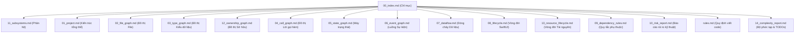

# Hướng dẫn Điều hướng CodeGraph - Dự án FreeBook

Tài liệu này đóng vai trò là điểm bắt đầu (Entrypoint) và bản đồ chỉ dẫn toàn bộ hệ thống tài liệu CodeGraph sống (Living Documentation) của dự án **FreeBook**.

## Ghi chú thủ công (Human Notes)
*Khu vực này dành riêng cho ghi chú thủ công của con người.*

<!-- GENERATED START -->
## Sao lưu/khôi phục, tăng tốc cập nhật ext, sửa thông tin truyện (1.3.246)

* **Phân hệ mới `Sources/Services/Backup/`** (23 file, gồm 6 file `GoogleDrive/`) + `Sources/Views/Settings/Backup/` (5 file): xuất/nhập một archive `.fbbackup` (ZIP) phủ truyện, TOC + nội dung chương đã tải, kho, ext, từ điển riêng từng truyện, custom VP/Name và từ điển chung. Vào từ Cài đặt → "Sao Lưu & Khôi Phục". Chi tiết cây entry và luật offset ở [11_subsystems.md](11_subsystems.md), vòng đời file tạm ở [13_resource_lifecycle.md](13_resource_lifecycle.md).
* **Restore là merge, không bao giờ xoá**: bookId/url kho/packageId đã có thì giữ bản local (ext chỉ bị thay khi `version` trong backup lớn hơn); từ điển đi qua `mergedRecords(imported:existing:isMerge: true)` nên **tombstone** (record giá trị rỗng trong `Custom*.txt` / `books/<bookId>/*.txt`) được mang theo miễn phí, không cần định dạng riêng cho "mục đã xoá".
* **Không backup ảnh bìa** (quyết định của người dùng): bìa tải lại được từ `coverUrl`. Hệ quả đã biết: bìa do người dùng chọn từ thư viện ảnh sẽ **mất** khi restore sang máy khác.
* **Google Drive**: PKCE S256 + `ASWebAuthenticationSession` (Google chặn WKWebView nhúng), client iOS **không có client_secret**, scope tối thiểu `drive.file`, thư mục `FreeBookBackups`, upload resumable chunk 8 MiB. Client ID đi đường GitHub secret `GOOGLE_DRIVE_CLIENT_ID` → build setting → Info.plist, y hệt `GOOGLE_CLOUD_TTS_API_KEY`, kèm override `UserDefaults("googleDriveClientId")` cho build local. Thiếu client id ⇒ tab Drive hiện "chưa cấu hình", **kênh local vẫn chạy đủ**. Refresh token nằm ở Keychain (`kSecAttrAccessibleAfterFirstUnlock`), fallback file có `FileProtectionType.completeUntilFirstUserAuthentication`; không log token.
* **Cập nhật ext nhanh hơn**: nguyên nhân thật là `syncExtensions` chạy **tuần tự trên MainActor** — mỗi ext một request `URLSession` (timeout mặc định 60 s) và **một `context.save()` riêng**, mà `allExtensions` là `@Query` nên mỗi save kéo view render lại. Nay `ExtensionSyncCommandBuilder` tải/parse `plugin.json` **song song ngoài main** (6 lượt đồng thời, timeout 10 s) và `ExtensionTransactionCoordinator.upsertExtensions` ghi **một transaction duy nhất**. Thứ tự fallback resolve field giữ y nguyên. Không thêm store SQLite, không migrate lúc khởi động, không đổi `@Query` nào.
* **Sửa thông tin truyện** (tên, tác giả, bìa theo URL hoặc ảnh trong máy) từ menu `…` của Chi tiết truyện: `BookTransactionCoordinator.updateBookInfo` tính lại luôn `titleTrans`/`authorTrans` — `updateBookMetadata` cũ không làm việc đó nên kệ sách sẽ hiện tên dịch cũ.
* Gate: `check_architecture.py` **18 → 17 violation**; không violation mới nào xuất hiện, cái mất đi là `LINE_LIMIT_EXCEEDED` của `BookDetailView.swift` (1213 → **1181**, dưới baseline 1201). 33 file mới đều ≤ 236 dòng và đúng một type top-level nên không entry allowlist nào được thêm hay nới. Hai file sát baseline cũng đi đúng chiều: `SettingsView.swift` 453 → 439 (baseline 453), `RepositoryManagerView.swift` 751 → 709 (baseline 751). Tổng file Swift 244 → **277**. Không biên dịch tại chỗ (host Windows, `xcodebuild` chỉ chạy trên macOS) — CI chỉ chứng minh *biên dịch được*.

## Tìm kiếm truyện đích, copy VP/Name, widget trình duyệt kéo được (1.3.244)

* **Tìm truyện trong sheet chia sẻ từ điển**: thanh tìm kiếm của Kệ sách được trích thành `Views/Common/BookSearchBarView.swift` (41 dòng) và dùng lại nguyên vẹn ở `BookShareTargetSheet`; lọc realtime bằng `ShelfBookSearchMatcher` (khớp tên/tác giả, cả bản dịch), không debounce, không đụng logic chọn đích.
* **Copy VP/Name giữa Riêng và Chung** bằng một icon `arrow.left.arrow.right` nhét đúng vào hàng đang có, giữa `Sửa` và `Xóa`, cùng cỡ/padding/kiểu nút. Ý nghĩa do **phạm vi danh sách** quyết định (chung ⇒ "Chuyển qua Riêng", riêng ⇒ "Chuyển qua Chung"), *loại* đích chọn trong Menu nên đủ **4 tổ hợp mỗi chiều**. Đây là **copy**: nguồn không bị sửa hay xoá.
* Không tầng lưu trữ mới nào được tạo: đích `.globalCustom` đi vào `DictionaryCache.upsertEntry` (ghi `Custom{VietPhrase,Names}.txt`), đích `.privateBook` đi vào `TranslationManager.saveCustomEntry` (ghi `books/<bookId>/*.txt`). Cả hai đều `removeAll(key)` rồi `insert(at: 0)` ⇒ **ghi đè hoàn toàn, không trùng key, không merge**; `VietPhrase.dat`/`Names.dat` dựng sẵn **không có đường ghi nào** trong `Sources/`, key chỉ có ở built-in sẽ sinh override ở tầng custom mà built-in vẫn nguyên. Thứ tự tra: riêng > chung custom > built-in.
* Chiều chung → riêng **luôn** dùng `bookId` của màn Từ điển đang mở (`DictionaryHubView` truyền xuống `contextBookId`) — không picker, không "sách nghe gần nhất", không sách toàn cục; thiếu ngữ cảnh thì không copy và hiện toast lỗi.
* **Cài đặt "Mở trình duyệt ở chế độ thu nhỏ"** (`VisibleBrowserSettings.opensMinimized`, `@AppStorage` trong `BrowserSettingsSection`): khi bật, `openContainer` gọi `prepareContainerMinimized()` — `loadViewIfNeeded()` gắn WKWebView của tab active mà **không present**, rồi vào đúng trạng thái `isHidden`. Tắt thì hành vi y như trước; tab/trình duyệt đang mở không bị ảnh hưởng.
* **Nháy widget trình duyệt khi có tab ≥ 10 s** và chỉ khi đang thu nhỏ: `VisibleBrowserPulseMonitor` giữ **một** `Timer` one-shot hẹn đúng thời gian còn lại tới mốc 10 s, đánh giá lại theo `stateDidChangeNotification` sẵn có; tuổi tab suy từ `VisibleBrowserTabItem.createdAt` nên mở rộng rồi thu nhỏ lại là tính lại từ tuổi thật. Nháy biểu diễn bằng `opacity` của SwiftUI nên `alpha` của window vẫn 1 và `hitTest` không đổi.
* **Widget trình duyệt kéo được y như widget TTS**: dựng họ thứ hai cùng kiến trúc (`BrowserFloatingWidgetUIWindow` custom `hitTest` + `BrowserFloatingWidgetContainerViewController` với `UIPanGestureRecognizer` ghi thẳng `center` + `UIHostingController`), window ở level `alert - 2` (TTS giữ `alert - 1`). Phần dùng chung được trích ra đúng một mảnh: `FloatingWidgetGeometry` (3 hàm thuần) — không base class, không chia sẻ state. `VisibleBrowserReopenView` 136 → 51 dòng, chỉ còn vẽ.
* Gate: `check_architecture.py` giữ **18 violation** với tập vi phạm y hệt; 12 file mới đều ≤ 197 dòng và đúng một type top-level nên không entry allowlist nào được thêm/nới; tổng file Swift 232 → **244**. Không biên dịch tại chỗ (host Windows).

## ReaderView quan sát lại ReaderViewModel (1.3.243)

* Nguyên nhân thật của "đơ khi Next/Prev": `ReaderViewModel` là `ObservableObject` nhưng `ReaderView` giữ nó trong `@State` — `@State` **chỉ giữ tham chiếu, không subscribe `objectWillChange`**. Mọi `@Published` của view model (kể cả `pendingNavigationIndex`, `navigationCommit` mà cổng render 1.3.242 đọc) không làm Reader dựng lại body; Reader chỉ được vẽ lại nhờ nguồn invalidate vô can (`ttsState` publish, một `@State` khác đổi, notification, `@Query`). Khoảng chờ từ cú bấm tới frame đầu tiên bằng đúng khoảng chờ tới sự kiện vô can kế tiếp — log thiết bị đo 0.6–4.3 s.
* Hệ quả: ba lần sửa trước (`Task.yield()` 1.3.240, `Task.sleep` 32 ms 1.3.241, cổng handshake skeleton 1.3.242) đều **không thể** có tác dụng — chúng sắp xếp lại việc *bên trong* một update pass mà không có gì kích hoạt.
* File mới `Views/Reader/Components/ReaderViewModelInvalidationRelay.swift` (40 dòng): `@StateObject` của `ReaderView`, forward `ReaderViewModel.objectWillChange` sang chính nó. Đăng ký trong `ensureViewModel` ngay sau `viewModel = newViewModel`, bỏ trong `.onDisappear`; `observe(_:)` idempotent theo identity nên bootstrap chạy lại không tạo thêm subscription. Không lọc theo thuộc tính — chính việc phải nhớ danh sách `@Published` là mầm của bug này.
* Đường chọn chương từ danh sách chương không bị đơ vì đóng sheet tự sinh một chuỗi update pass; đó là lý do triệu chứng chỉ xuất hiện ở Next/Prev và cú nhảy từ widget TTS.
* `check_architecture.py` giữ **18 violation** với tập vi phạm y hệt; file mới dưới trần 400 dòng, đúng một type top-level.

## Tối ưu năng lượng Reader khi TTS (1.3.239)

* KVO `UIScrollView.contentOffset` trong `ReaderTextView.Coordinator` chuyển từ *cài vô điều kiện mỗi `updateUIView`* sang *cài lazy khi có selection thật*: `setupScrollObservation` chỉ gọi từ `textViewDidChangeSelection` khi `selectedRange.length > 0`, và `teardownScrollObservation()` chạy ngay khi selection về rỗng. Trạng thái thường ngày của Reader: **0 observer** thay vì một observer cho mỗi paragraph đang realized.
* `handleSelectionOrScrollUpdate` thoát sớm theo `selectedRange.length` **trước** khi đo độ dài text, và dùng `textView.textStorage.length` (O(1), đã là UTF-16) thay cho `((textView.text ?? "") as NSString).length`. Thêm dedup `lastPublishedSelection`: bỏ qua `onSelectionChange` khi range không đổi và minY/maxY lệch < 0.5 pt, nên `ReaderView` không còn ghi lại ~8 `@State` mỗi frame cuộn khi đang có selection.
* `ReaderEnergyDiagnostics` tách sang file riêng và **miễn phí khi log tắt**: cờ `isEnabled` chốt một lần trong `beginReaderSession()`, mọi `record*`/`flush` mở đầu bằng `guard isEnabled`, `Window` thành `final class` (hết COW của `Set<ObjectIdentifier>`), `systemUptime` chỉ đọc mỗi 64 event. Đánh đổi: bật/tắt log giữa lúc Reader đang mở chỉ có hiệu lực từ lần mở Reader kế tiếp.
* Dọn `translationRefreshToken` (không có điểm ghi nào) khỏi `ReaderView` và `ParagraphCardView` + `==` của nó. `completeReaderPositionRestore` không còn `paragraphTracker.removeAll()` — map frame rỗng làm tick TTS đầu tiên sau restore luôn thấy "ngoài viewport" và sinh một cú `scrollTo` thừa.
* Hiệu ứng highlight/auto-scroll **không đổi**: giữ `minimumFrameDelta = 8`, giữ anchor `.center`, giữ việc bám theo `currentParentParagraphIndex`, giữ hành vi cuộn tay. `check_architecture.py` giữ **18 violation** (không đổi tập vi phạm).

## Tách file theo luật một-primary-type (1.3.236)

* Tám file vi phạm `MULTI_PRIMARY_TYPES` được tách thành **14 file mới**, mỗi file đúng một type top-level. Không đổi logic, chỉ đổi nơi khai báo.
* Hai file vi phạm `NEW_FILE_TOO_LARGE` cũng được giải quyết bằng chính phép tách đó: `VisibleBrowserTabManager.swift` 448 → 234 dòng, `VisibleWebViewLoader.swift` 404 → 285 dòng.
* Hai type phải nâng access level khi rời file gốc (`private` → mặc định internal): `SizeReader`, `BookTitleTranslationBackfill`.
* Kết quả gate: `check_architecture.py` **28 → 18 violation**. Phần còn lại là 16 `LINE_LIMIT_EXCEEDED` (cần tách *thành viên* chứ không phải tách type) và 2 `VIEW_SWIFTDATA_MUTATION` thật — xem [10_risk_report.md](10_risk_report.md).

## Dọn code chết, bỏ tầng test và scaffolding chẩn đoán (1.3.235)

* **Tầng test bị loại bỏ hoàn toàn** theo yêu cầu trực tiếp của người dùng: 20 file dưới `Tests/` bị `git rm` (vẫn tra được trong git history) và target `FreeBookTests` bị bỏ khỏi `project.yml`. Từ đây `Sources/` là toàn bộ mã được biên dịch.
* **5 file bị xoá**: `Services/TTS/Helpers/{TTSHighlightCalculator,TTSParagraphSplitter,TTSVoiceResolver}.swift` (thư mục `Helpers/` biến mất), `Views/Reader/ReaderViewModelObserver.swift`; `Views/Reader/ReaderParagraphBuilder.swift` được đổi tên thành `ReaderParagraphBuildResult.swift` sau khi xoá enum builder chết (DTO `ReaderParagraphBuildResult` vẫn được `ReaderViewModel+Translation` dùng).
* **~30 symbol chết bị xoá** khỏi 20 file, gồm cả hai alias tương thích ngược không còn ai dùng (`SearchNovelResult`, `TTSProcessedChapter`) và abstraction rỗng `GlobalToastModifier`/`globalToast()` (toast do `ToastUIWindow` vẽ trực tiếp).
* **Scaffolding chẩn đoán `logRemoteTrace`** (đã tự đánh dấu `REMOVE_AFTER_TTS_REMOTE_DIAGNOSIS`, chỉ chạy trong `#if DEBUG` nên vô hiệu trên LiveContainer) bị xoá cùng 3 tham số chỉ dùng để nuôi nó ở `dispatchRemoteTransportCommand`.
* Kết quả gate: `check_architecture.py` **30 → 28 violation**; `TTSManager.swift` 4097 → 4003 dòng; `TTSChapterPrefetcher.swift` 402 → 375 nên hết vi phạm `NEW_FILE_TOO_LARGE`; `TranslationManager.swift` xuống dưới baseline.

## Lấp buffer ở biên chương bằng prefix audio chương kế (1.3.234)

* File mới `Sources/Services/TTS/TTSNextChapterPrefixCache.swift` (`@MainActor`, singleton `.shared`) nạp trước các chunk **index >= 1** của chương kế tiếp cho cả NghiTTS, Google và Extension TTS; chunk 0 vẫn do `TTSChapterPrefetcher` sở hữu.
* File mới `Sources/Services/TTS/Extensions/TTSManager+NextChapterPrefix.swift` chứa toàn bộ điểm nối: `requestRemoteNextChapterPrefixIfNeeded`, `requestNghiNextChapterPrefixIfNeeded`, `mergeNextChapterPrefixAudio(for:)`, `cancelNextChapterPrefixWork`, `resetNextChapterPrefixCache`.
* Số chunk prefix dùng đúng đơn vị đo của từng engine: Google/Ext giữ độ sâu phía trước bằng `preload_size`/`googlePrefetchCount` kể cả khi vượt biên chương; NghiTTS kéo dài chính watermark `nghittsSafeCachedTimeThreshold` (8s) qua biên chương và nạp cho đủ ngưỡng trong phần trần `maxTotalAudioPayloads` còn trống. Trần payload audio không đổi — chi tiết bất biến ở [rules.md](rules.md).

## Khắc phục lỗi pop Chi tiết truyện khi vuốt tab Home Khám phá (1.3.228)

* Khai báo `DiscoveryDetailRoute` (bất biến, `Identifiable`, `Hashable`) giữ metadata điều hướng `bookId`, `extensionPackageId`, `initialDetailUrl`, `sourceName`, `initialHost`.
* Nâng `@State private var selectedDetailRoute: DiscoveryDetailRoute?` và `.navigationDestination(item: $selectedDetailRoute)` lên root `NavigationStack` trong `DiscoveryView`.
* `DiscoveryCategoryTabView` loại bỏ `@State selectedNovel` và `.navigationDestination` cục bộ, chuyển sang truyền callback `onSelectNovel: (ExtensionItemResult) -> Void` lên view cha, bảo toàn route state không bị ảnh hưởng bởi lifecycle hay re-evaluation của `TabView`.

## Mở rộng vùng bấm lịch sử tìm kiếm (1.3.227)

* `ShelfSearchView.historyView` và `SearchView.searchHistoryView` cho label nút chọn lịch sử chiếm toàn bộ chiều rộng còn lại và dùng `Rectangle` làm hit-test shape; khoảng trống từ nội dung đến trước nút xóa nay kích hoạt đúng action chọn lịch sử.
* Nút `x` vẫn là button độc lập, nên xóa mục không đồng thời chọn mục hoặc chạy tìm kiếm. Chiều cao, padding, divider, scroll và logic lọc giữ nguyên.

## Chuẩn hóa hằng số Extension.type (1.3.226)

* Namespace public `ExtensionType` tập trung bốn giá trị chuẩn `novel`, `chineseNovel`, `comic`, và `tts`; `Extension.type` vẫn là `String`, nên schema SwiftData, dữ liệu persisted và type mở rộng không biết trước không thay đổi.
* Model command, metadata import, repository policy, Discovery, search-all, TTS Settings và UI quản lý extension dùng chung các hằng số này cho phép so sánh/default. Sentinel UI `"all"` cùng script key/action runtime `"tts"` vẫn giữ nguyên vì không biểu diễn `Extension.type`.

## Loại extension TTS khỏi tìm kiếm tất cả nguồn truyện (1.3.225)

* `SearchView.searchableExtensions` lọc chính xác `type != "tts"` tại ranh giới màn tìm kiếm. Chế độ tất cả nguồn dùng cùng danh sách cho task group, `sourceStates`, render nhóm kết quả và màn `Xem thêm`, nên mọi entry point Discovery/Shelf/Reader/BookDetail không còn gọi script search của extension giọng đọc.
* Luồng tìm một nguồn cụ thể và API `SearchView` không đổi; không mở rộng bộ lọc sang type khác hoặc tự sửa chính sách enabled/installed của caller.

## Local TXT titleTrans, bounded confirmation preview, and toggle-independent chapter search (1.3.224)

* TXT import models are `Sendable`; after confirmation, `ShelfView` translates chapter titles and builds the full `[ChapterMetadataSnapshot]` inside a detached user-initiated task. Every new local chapter is persisted with original `title` plus `titleTrans`, while the MainActor only coordinates UI state and the existing SwiftData book transaction.
* `TXTImportConfirmationSheet` renders all chapters when the count is at most six; larger imports render indices 1-3, one omitted-count row, and the final three indices. Reanalysis automatically recomputes the same bounded preview.
* ChapterStore search no longer accepts `searchTrans`: SQLite always matches `title LIKE ? OR title_trans LIKE ?`. Reader results still use the translation toggle only for presentation, and BookDetail local snapshot/SwiftData filters also search both stored fields regardless of that toggle. Existing local books are not migrated automatically.

## Handoff liền mạch từ wait layer sang sheet xác nhận nhập TXT (1.3.223)

* Khi parse TXT thành công, `ShelfView` gán `pendingImport` nhưng tiếp tục giữ `isParsingTXT = true`; wait layer chỉ tắt trong `TXTImportConfirmationSheet.onAppear`. Nhánh lỗi copy/decode/parse vẫn tắt wait layer và hiện Toast như trước, nên không còn khoảng trống chỉ hiện Shelf giữa hai trạng thái.
* Danh sách chương trong `TXTImportConfirmationSheet` đổi từ eager `VStack + Array(enumerated())` sang `LazyVStack + parsed.chapters.indices`, giảm thời gian dựng sheet và bộ nhớ tạm với truyện có nhiều chương. DocumentPicker, thuật toán parse/reanalyze và quy trình import database không đổi.

## Đồng bộ toggle dịch Shelf/History và chiều cao lịch sử ShelfSearch (1.3.222)

* `BookListItemView` chỉ gọi `translateAuthorHanViet` khi `isTranslationEnabled` bật; khi tắt, Shelf/History/ShelfSearch hiển thị `item.author` gốc.
* Reader tách `originalChapterTitle(at:)` khỏi `chapterTitle(at:)`: progress snapshot lấy `CachedChapter.originalTitle` hoặc tên TOC online gốc, không lấy `CachedChapter.title` đã dịch. `ReadingProgressStore` bỏ title snapshot rỗng và tiếp tục fallback sang `ChapterStore.title`/`Chapter.title` gốc trước khi giữ giá trị hiện tại.
* Action `ShelfView.retranslateChapterTitles` chỉ cập nhật `titleTrans` trong ChapterStore; không còn dịch và ghi ngược vào `Book.currentChapterTitle`. Theo phạm vi được duyệt, không có migration/repair tự động cho dữ liệu `currentChapterTitle` cũ đã bị nhiễm; lần lưu progress mới có title gốc sẽ thay thế theo luồng bình thường.
* `ShelfSearchView.historyView` dùng chiều cao `header + spacing + min(matchingHistory.count, 4) × rowHeight`; không render vùng history khi query không có match, co đúng số dòng từ 1–4 và chỉ cho cuộn khi có trên 4 kết quả. Query rỗng giữ layout lịch sử toàn màn hình.

## Thêm rule thay thế TTS theo cơ chế xóa cũ rồi thêm mới (1.3.221)

* `TTSReplacementManager.addRule(_:)` trở thành upsert theo `pattern` chính xác, có phân biệt hoa/thường: xóa toàn bộ rule cũ trùng pattern, append rule mới xuống cuối danh sách rồi ghi `character_replacements.json` đúng một lần. Nhờ đó dữ liệu trùng lịch sử cũng được gom còn một rule và thứ tự áp dụng tuần tự phản ánh lần thêm mới nhất.
* Public API trả `AddRuleResult.added`/`.replaced` và được đánh dấu `@discardableResult`, nên màn quản lý hiện có vẫn tương thích trong khi Reader có thể hiển thị Toast `"Đã thêm"` hoặc `"Đã cập nhật"` chính xác.
* Phạm vi không đổi `updateRule(_:)` theo ID và không đổi chính sách import JSON.

## Đồng bộ thẻ Download với Kệ/Lịch sử, title Detail đầy đủ và tuỳ chọn Phồn thể → Giản thể theo truyện (1.3.220)

* `DownloadTrackerView.taskRow` đồng bộ cover và title với `BookListItemView` style `.shelfOrHistory`: `BookCoverView` 50x70, title `.system(size: 14.5, weight: .semibold)` tối đa 2 dòng. Badge loại/trạng thái, tiến độ, action và context menu không đổi.
* `BookDetailHeaderView` thêm `.fixedSize(horizontal: false, vertical: true)` cho title; title được phép chiếm đủ chiều cao cần thiết trong cột cạnh cover thay vì bị cắt khi bản gốc/bản dịch dài.
* Reader có lựa chọn menu `"Văn bản trước khi dịch"` (Giữ nguyên / Phồn thể → giản thể), chỉ hiện khi bật Quick Translate. Trạng thái lưu riêng theo `convertTraditionalToSimplified_<bookId>`, được đọc lúc bootstrap và đổi lựa chọn sẽ làm mới bản dịch chương đang đọc, metadata Reader, TOC/paging/search và popup dịch từ/câu.
* `TranslateUtils` chuyển chuỗi qua ICU transform `StringTransform("Traditional-Simplified")` trước khi tra từ điển khi caller chọn tuỳ chọn; `translateMeta`, `translateContent`, `translateChapterTitle`, và hai API trả `TranslatedTextResult` nhận thêm cờ mặc định `false`. Span dùng input đã chuyển đổi chỉ khi độ dài UTF-16 không đổi; nếu không, trả mảng rỗng để `ReaderSelectionMapper` dùng fallback an toàn.
* `ReaderViewModel`/`CachedChapter` mang cờ chuyển đổi trong identity cache, nên cache cũ không thể được tái dùng sau khi đổi cấu hình. Đường production dựng `[ParagraphItem]` ở `Sources/Views/Reader/Extensions/ReaderViewModel+Translation.swift` (và worker danh sách chương) giữ API tương thích ngược nhờ default `false`. *(Cập nhật 1.3.235: bản song song `ReaderParagraphBuilder` đã bị xoá, nay chỉ còn **một** đường dựng đoạn ở `ReaderViewModel+Translation.swift`.)*
* TTS đọc cùng cấu hình theo truyện khi prepare/start: title và nội dung chương hiện tại được chuyển phồn → giản trước VietPhrase, đồng thời key của prepared chapter, snapshot, auto-advance và text/audio prefetch chương kế đều mang cờ để không tái dùng kết quả sai cấu hình. Metadata Now Playing cũng dùng cùng cờ session; thay đổi trong lúc phát hủy prefetch/metadata cũ, còn đoạn hiện tại đã dựng tiếp tục cho đến lần dựng chương kế tiếp.

## Revert dùng BookListItemView trong DownloadTrackerView, chuẩn hoá BookListItemView 2 style và bỏ chevron NavigationLink (1.3.219)

* `DownloadTrackerView.taskRow` revert về HStack cover+title custom gốc (cover `BookCoverView` 44x60, title `.headline` lineLimit(1), badge taskType xanh/cam, `statusBadge`, ProgressView + "Tiến độ x/y chương", nút cancel/share/retry theo status, contextMenu share/retry/exportFromCached/delete). Bỏ `extension DownloadTask: BookDisplayable` và tham số `isTranslationEnabled` trong `taskRow` (vẫn giữ `@AppStorage("isTranslationEnabled")` ở view để dịch title nội bộ qua `TranslateUtils.translateMeta` và dùng trong Toast `exportFromCached`). Giữ `.contentShape(Rectangle())`.
* `BookListItemView` (`Sources/Views/Common/BookListItemView.swift`) chuẩn hoá 2 style qua `enum BookListItemStyle { case shelfOrHistory, discovery }`: `.shelfOrHistory` default `showChapter=true`/`showDescription=false` (Kệ sách, lịch sử, sheet chọn truyện), `.discovery` default `showChapter=false`/`showDescription=true` (genre/discovery). Cover 50x70 + title `.system(size:14.5, weight:.semibold)` lineLimit(2) đồng bộ mọi style; init mới nhận `showChapter`/`showDescription` dạng `Bool?` (nil → theo style). HStack author/source chỉ render khi `hasAuthor || hasSource`.
* Caller cập nhật: `CategoryNovelsListView` và `DiscoveryCategoryTabView` đổi sang `BookListItemView(item: novel, style: .discovery)` (bỏ override cover 60x80 → về 50x70). `ShelfView`, `ShelfSearchView`, `BookShareTargetSheet` dùng default `.shelfOrHistory` (BookShareTargetSheet vẫn override `showChapter: false`).
* Bỏ chevron `>` của NavigationLink trong `List`: `CategoryNovelsListView` và `DiscoveryCategoryTabView` đổi `NavigationLink` → `Button` + `@State selectedNovel: ExtensionItemResult?` + `.navigationDestination(item: $selectedNovel)`; thêm `Hashable` cho `ExtensionItemResult` (`ExtensionManager.swift`). Row vẫn bấm đi chi tiết `BookDetailView` (giữ nguyên params `bookId`, `extensionPackageId`, `initialDetailUrl`, `sourceName`, `initialHost`).
* Fix wait layer import TXT trong `ShelfView`: 3 overlay chờ (`isParsingTXT`, `isImporting`, `isProcessingDeletion`) dời ra khỏi closure `.sheet(item: $pendingImport)` thành sibling của `VStack` trong `ZStack` — trước đây nằm trong sheet content nên không hiển thị khi `pendingImport == nil` (chỉ hiện lúc sheet xác nhận). Sheet giờ chỉ chứa `TXTImportConfirmationSheet`.
* Thay đổi thuần UI + conformance `Hashable` (DTO) — không đổi public API Service/Manager, không đổi dependency tầng logic.

## Tái sử dụng BookListItemView trong DownloadTrackerView và bỏ chevron NavigationLink (1.3.218)

* `DownloadTrackerView.taskRow` bỏ HStack cover+title custom → dùng `BookListItemView(item: task, showChapter: false)`; `DownloadTask` conform `BookDisplayable` (title→`bookTitle`, coverUrl→`bookCoverUrl`, còn lại author/sourceName/description/currentChapter*/sourceName = rỗng; `bookId` có sẵn). Badge taskType, statusBadge, ProgressView, nút cancel/share/retry và contextMenu giữ nguyên nhưng đặt dưới row truyện. Bỏ `@AppStorage("isTranslationEnabled")` khỏi `taskRow` (BookListItemView tự dịch title nội bộ) — giữ lại property để dùng trong Toast `exportFromCached` (bọc `translateBookTitleIfNeeded`).
* Xóa chevron `>` mặc định của NavigationLink đi chi tiết truyện bằng `.buttonStyle(.plain)` trên NavigationLink ở `CategoryNovelsListView` (genre) và `DiscoveryView` (`DiscoveryCategoryTabView`, home tabs) — row vẫn bấm được, không còn mũi tên lệch trong hàng dùng `BookListItemView`.
* Thay đổi thuần UI + thêm conformance display (`DownloadTask: BookDisplayable`) — không đổi public API Service/Manager, không đổi dependency tầng logic.

## Import TXT: bảng mã giải mã đa dạng, xác nhận trước khi nhập, overlay Material (1.3.217)

* File mới `Sources/Common/Utils/TextEncodingDecoder.swift`: `enum TextEncodingDecoder` với `static func decode(_ data: Data) -> String` thử tuần tự 20 bảng mã theo thứ tự an toàn: UTF-8 (tự xử lý BOM), UTF-16LE/BE (strip BOM thủ công), UTF-32LE/UTF-32(BOM)/UTF-32BE, GB18030 (`CFStringEncodings.GB_18030_2000`), GBK (`GBK_95`), Big5-HKSCS (`big5_HKSCS_1999`), Big5 (`big5`), EUC-JP (`.japaneseEUC`), windowsVietnamese/CP1258 (VNI), VSCII/TCVN3 (`VISCII`), ISO-8859-1, windows-1250/1251/1252/1253/1254, ASCII. Mã đơn byte đặt cuối vì hầu như không bao giờ fail — tránh nuốt nhầm file tiếng Trung thành Latin-1/CP125x. Trả `""` nếu không decode được.
* `JSExecutor.decodeData` (`Sources/Services/Extensions/Engine/JSExecutor.swift`) đổi từ logic tự viết (UTF-8→GB18030→Big5→UTF-16→isoLatin1→CP1252→ASCII) sang gọi `TextEncodingDecoder.decode(data)` — dùng chung helper.
* Import TXT trong `ShelfView` tách 3 giai đoạn: `importTxtBook(from:)` copy file → đọc `Data` → `TextEncodingDecoder.decode` → `parseTxtBook`, set `pendingImport` + `showImportConfirmation = true` (file tạm giữ nguyên); `performImport()` chạy khi bấm "Nhập" (tạo Book + ghi TOC + từng chương + progress, xóa temp khi xong/error); `cancelImport()` xóa temp + đóng sheet. Thêm struct `PendingImport { tempFileUrl, fileName, parsed }`.
* Sheet mới `Sources/Views/Shelf/ShelfMain/TXTImportConfirmationSheet.swift` hiện tên truyện, số chương, tên file và danh sách toàn bộ chương (`.caption`) để kiểm tra parse trước khi nhập; nút "Hủy" (red, `cancelImport`) và "Nhập" (`.borderedProminent`, `performImport`).
* Overlay import và overlay xóa sách được bọc trong ZStack riêng (fix lỗi TupleView khi để Color + card là 2 biểu thức trong cùng `if` → card bị lệch xuống dưới), dùng card `.ultraThinMaterial` + shadow; import thêm icon `square.and.arrow.down.fill`, title "Đang nhập truyện", spinner vòng xoay khi `importIsIndeterminate` (chuẩn bị/đọc/parse/tạo sách/ghi xuống bộ nhớ) và thanh linear + % khi ghi chương.

## Đồng bộ badge nguồn sách thành capsule xám giữa detail, BookListItemView và ReaderChapterListView (1.3.216)

* Badge hiển thị tên nguồn/extension (và "Local") ở `BookDetailHeaderView`, `BookListItemView` và `ReaderChapterListView` đồng nhất thành capsule xám trung tính: icon extension (ExtensionIconView 14-16pt, fallback `puzzlepiece.extension` 12-14pt) + chữ `.caption2` medium màu `.secondary`, nền `Color.secondary.opacity(0.12)` bo `Capsule()`, padding `(6, 2)`. Bỏ pill xanh `Color.blue.opacity(0.1)` + `.blue`.
* `BookDisplayable` (trong `BookListItemView.swift`) thêm 2 property có default qua `extension BookDisplayable`: `extensionLocalPath: String` (default `""`) và `extensionIconUrl: String?` (default `nil`). `BookListItemView` thêm 2 init param tương ứng; `Book` conformance không cần override (dữ liệu do caller truyền vào).
* Caller truyền icon extension cho item `Book`: `ShelfView.bookItemView`, `ShelfSearchView` (thêm `@Query allExtensions`) và `BookShareTargetSheet` (thêm `@Query allExtensions`) resolve `allExtensions.first(where: { $0.packageId == book.extensionPackageId })` rồi truyền `localPath`/`iconUrl`. `ExtensionItemResult` (Discovery/genre) dùng default → sourceName rỗng nên không hiện badge.
* `ReaderChapterListView` dùng sẵn đối tượng `ext` để lấy `localPath`/`iconUrl`, không cần đổi API view.
* Thay đổi thuần UI + mở rộng protocol display (`BookDisplayable`) có default — không đổi public API Service/Manager, không đổi font size.

## Giảm cỡ chữ toàn bộ BookListItemView và BookDetailHeaderView (1.3.215)

* `Sources/Views/Common/BookListItemView.swift`: title từ `.headline` (17pt semibold) → `.system(size: 14.5, weight: .semibold)`; author từ `.subheadline` (15pt) → `.system(size: 13)`; dòng "Đang đọc" từ `.caption` (12pt) → `.caption2` (11pt). Badge nguồn/Local và description giữ `.caption2`.
* `Sources/Views/BookDetail/BookDetailHeaderView.swift`: title từ `.title3.bold` (20pt bold, `lineLimit(3)`) → `.headline` (17pt semibold) và **bỏ `lineLimit`** (không giới hạn số dòng); section "Thể loại"/"Giới thiệu" từ `.headline` (17pt) → `.system(size: 14.5, weight: .semibold)`; author từ `.subheadline` (15pt) → `.system(size: 13)`; tên nguồn từ `.caption.medium` (12pt) → `.caption2.medium` (11pt); phần giới thiệu (ExpandableTextView) từ `.body` (17pt) → `.system(size: 14.5)`. Metadata `caption2` và genre tags giữ nguyên.
* Thay đổi thuần UI (font size + bỏ giới hạn dòng title detail), không đổi public API, protocol hay dependency.

## Badge tên nguồn (extension / Local) trong danh sách chương Reader và BookListItemView (1.3.214)

* `ReaderChapterListView.header` hiển thị thêm badge pill xanh bên cạnh dòng `"N chương"`: sách local (`isLocalTXTBook`) hiện `"Local"`, sách online hiện `ext.name` (khi `ext != nil` và name không rỗng). Giữ nguyên `Spacer(minLength: 4)` và nút refresh/sort.
* `BookDisplayable` (trong `BookListItemView.swift`) thêm `isLocalBook: Bool` với default `false`; `Book` thoả mãn qua computed property `Book.isLocalBook`, `ExtensionItemResult` dùng default. Pill nguồn trong `BookListItemView` hiện `"Local"` khi `isLocalBook`, ngược lại hiện `sourceName`.

## Revert về c78d042: bỏ fullScreenCover Detail + Bottom Sheet danh sách chương, giữ lại các tính năng logic (1.3.213)

* Hoàn tác chuỗi trình bày sau `c78d042` — Detail trở lại mở bằng `NavigationLink` push trong NavigationStack của tab (tab bar hiện), Reader mở bằng `.fullScreenCover(item: $readerRoute)` cục bộ trong `BookDetailView`, danh sách chương quay lại overlay custom (`readerChapterListOverlay` + Capsule + `dismissGesture`). Bỏ `DetailRouter`/`ReaderRouter`/root presentation hub, `BookDetailRoute`/`ReaderRouterRoute`, `ReaderRouter.swift`, và các fix trình bày reader (re-creation loop, transparent detail, top-chrome, ignoresSafeArea).
* Giữ nguyên (thêm lại) các tính năng logic phát triển sau `c78d042`: chuẩn hóa `VietPhraseTokenizer` (tiếng Việt có dấu, số thập phân, gom cụm Latin/ASCII), `TranslateUtils` gom token tên tác giả, cải tiến `ExpandableTextView` (căn lề 2 bên Description, layout-safe, sửa nút "Xem thêm", fix comment, `WrappingLabel` public cho CI) kèm `Tests/ExpandableTextViewTests.swift`, khôi phục chính xác chunk TTS trong `TTSManager`, tối ưu `TTSQuickTimerSheet` (spacing, nút cài đặt, detents 0.85), tối ưu `BookListItemView`/`BookDetailHeaderView`, cải tiến Lịch Sử Đọc trong `ShelfView` (sort theo `lastReadDate`, `removeFromHistory` thông minh khi sách còn trên kệ), và toast thông minh cập nhật mục lục trong `ReaderChapterListView+Refresh`.

## newVisibleBrowser API parity, full runtime syntax checking and integrated line number gutter in Script Editor (1.3.200)

* `VisibleWebViewLoader` and `JSExecutor` upgraded to achieve full feature parity with headless `newBrowser`:
  - Added `launchAsync(url)`, `html(timeout)`, `waitUrl(urls, timeout)` supporting array of target URLs, `block(patterns)`, `urls()` (intercepted URLs up to 200), and `getVariable(name)`.
  - Added native bridge blocks: `_nativeBrowserLaunchAsyncVisible`, `_nativeBrowserBlockVisible`, `_nativeBrowserGetUrlsVisible`, and multi-target `_nativeBrowserWaitUrlVisible`.
* Added `JSExecutor.validateSyntax(_ scriptContent: String)` for evaluating script syntax with full VBook runtime globals (`load`, `Qt`, `UserAgent`, `Crypto`, `Engine`, `Response`, `localStorage`, `localConfig`, etc.).
* `ExtensionScriptEditorView` and `HighlightingCodeEditor` enhancements:
  - `CodeEditorTextView`: Line number gutter drawn directly in `draw(_ rect:)` via `layoutManager.lineFragmentRect(forGlyphAt:)`, guaranteeing 100% pixel-perfect vertical alignment even when long lines wrap into multiple visual lines.
  - Searchable Script Picker: Replaced horizontal pill scroll with searchable select dropdown sheet (`SearchableScriptPickerSheet`) displaying file icons, file names (`displayName`), relative paths, and modified indicators with real-time keyword filtering.

## Modern TTS sleep timer bottom sheet replacing confirmation dialog and alert (1.3.199)

* Introduced `TTSQuickTimerSheet` (`Sources/Views/TTSWidget/TTSQuickTimerSheet.swift`) presented as a modern SwiftUI bottom sheet (`presentationDetents([.fraction(0.68), .large])`).
* Replaced plain system `.confirmationDialog` and text field `.alert` in `TTSFloatingWidgetView`.
* Features real-time countdown status banner with quick cancellation, 6 preset duration tiles (`15m`, `30m`, `45m`, `60m`, `90m`, and `Hết chương`), custom stepper/slider (5–180m), and quick settings shortcut.

## Separate description and content fields in ExtensionItemResult and enhanced comment presentation (1.3.198)

* `ExtensionItemResult` expanded with dedicated `content: String` property alongside `description: String`.
* `ExtensionManager.search` and `ExtensionManager.executeCustomScript` parse `description` (`desc`/`description`) and `content` (`content`) as separate fields, preventing comment text and metadata from conflating.
* `CommentSectionView` and `AllCommentsView` render `comment.name` with `comment.description` (timestamp, rating, chapter metadata) in the header, and `comment.content` (fallback to `description`) in the comment body.
* `SearchView` falls back gracefully across `description` -> `content` -> `author`.

## Rhino and VBook Android compatibility runtime enhancements (1.3.197)

* `JSExecutor`, `JSDom`, `WebViewLoader` and `JSCrypto` upgraded with comprehensive Rhino / VBook Android JavaScript compatibility APIs:
  - `Qt.translate`: Connects to `TranslateUtils` and `TranslationManager` native translation engine supporting `"vi"`, `"vp"`, `"hv"` modes, `chapter_name`, `first_line_chapter_name`, `first_capitalize`, `person_name`, and returns `{ translateText, segments }`.
  - `Storage`: Added `localStorage` (persistent per-extension), `cacheStorage` (in-memory RAM cache), `localConfig` (reads injected user and plugin config via `getItem`/`get`), and `localCookie` (`setCookie`, `getCookie`).
  - `fetch`: Extended `response` with `statusText`, `url`, `headers` (dictionary access + `.get()`), `header(key)`, `blob()`, `request` (`{ url, headers }`), and `options.timeout` (ms).
  - `JSDom`: Added `element.attributes()` (`[String: String]`), `elements.isEmpty()`, and `elements.map(callback)` directly on `JSElements`.
  - `Engine.newBrowser`: Added `launchAsync(url)`, `waitUrl(urls, timeout)` supporting array of URLs, `html(timeout)`, `block(patterns)`, `urls()`, and `getVariable(name)`.
  - `Utilities`: Added `Log.log(...)`, `UserAgent.system()`, and smart `Script.execute(scriptOrName, functionName, ...args)` supporting extension script file loading.

## TTS floating widget and Global Toast presented via dedicated passthrough UIWindows (1.3.195)

* `TTSFloatingWidgetWindowManager` presents `FloatingWidgetUIWindow` (`windowLevel = .alert - 1`, non-key, `isHidden = false/true`) on the active `UIWindowScene`, ensuring the TTS floating widget stays visible above `ReaderView` (`fullScreenCover`), `BypassWebView` (`fullScreenCover`), and `TabbedVisibleBrowserViewController` (`pageSheet`).
* `FloatingWidgetUIWindow.hitTest` provides the authoritative native hit-testing: when a `presentedViewController` is active (e.g. `confirmationDialog`, `.alert`, or `TTSSettingsSheet`), touches dispatch to `super.hitTest` for full dialog/sheet interaction; otherwise, points inside `widgetContainerView.bounds` dispatch to subviews, while outside points return `nil` to pass through to underlying reader/browsers.
* `FloatingWidgetContainerViewController` manages bounded widget sizing (212x56/80 or 52x52), native `UIPanGestureRecognizer` drag (instant 1:1 finger tracking, no SwiftUI diffing delay), `UITapGestureRecognizer` (enabled only in `.peeking` mode), and spring animation snap/resizing. `TTSSettingsSheet` is presented directly within `FloatingWidgetUIWindow` with injected `modelContainer`, enabling `@Query` SwiftData queries for TTS extensions without modal presentation conflicts with `ReaderView` on the main window.
* `CoverRotationState` (owned by `FloatingWidgetContainerViewController`) drives smooth 20s/rev (18°/s) vinyl disc rotation via `TimelineView(minimumInterval: 1/30s, paused: !shouldAnimateCover)`. Ticks are strictly read-only, angle freezes accurately on pause, catches up seamlessly after widget suppression, and resets only on distinct book transitions (`lastDistinctBookId`).
* `ToastManager` manages a dedicated passthrough `ToastUIWindow` (`windowLevel = .alert`, non-key, `hitTest = nil`), ensuring all application toasts float above full-screen reader, browser, and modal sheets without blocking touch events.

## Reader presented as fullScreenCover instead of navigation push (1.3.192)

* Reader is no longer pushed onto a tab's `NavigationStack` with `.toolbar(.hidden, for: .tabBar)`. All 4 entry points (`ShelfView` shelf/history rows + TTS-widget route, `ShelfSearchView`, `BookDetailView`) now present `ReaderView` via `.fullScreenCover(item:)` wrapped in its own `NavigationStack`. The main `TabView` hierarchy is never re-laid-out and the tab bar is never hidden/shown, so the tab bar no longer appears late (janky restoration) after closing the full-screen reader.
* `ReaderView` dropped `.toolbar(.hidden, for: .tabBar)`; its hidden `NavigationLink`s (BookDetail / change source) push onto the cover's own stack, and `@Environment(\.dismiss)` dismisses the cover. `ShelfReaderRoute` is reused by `ShelfSearchView`; `BookDetailView.ReaderRoute` stays as the `fullScreenCover(item:)` item.

## Return to shelf tab after successful source change (1.3.182)

* `SearchView.executeSourceChange` posts a new `sourceChangedNavigateToShelf` notification (userInfo `["shelfTab": 1|2]`) right before `onSourceChanged?()` on success. Target sub-tab = `createSnapshot.isOnShelf ? 1 : 2` (new book inherits `isOnShelf`/`isHistory` from the old book), matching `ShelfView.historyBooks = isHistory && !isOnShelf`.
* `MainTabView` observes `sourceChangedNavigateToShelf` → `selectedTab = 0` (Kệ Sách main tab). `ShelfView` observes it → internal `selectedTab` = the `shelfTab` value (1 = Kệ Sách, 2 = Lịch Sử).
* `ReaderView.onSourceChanged` now also `dismiss()`es the Reader after a 0.3s delay (existing `DispatchQueue.main.asyncAfter` pattern) so the flow always lands on the shelf root even when the change was triggered from the Reader (old book is deleted on success in the non-TTS branch).
* `BookDetailView.onSourceChanged` mirrors the Reader: it resets `navigateToChangeSource = false` first (SearchView was pushed via `NavigationLink(isActive:)`; calling `dismiss()` alone left the push "active" so the SearchView stayed stuck) then `dismiss()`es the detail after a 0.3s delay. The MainTabView observer handles the main-tab switch.

## Add "Xoá khỏi kệ sách" (off-shelf) to shelf context menu (1.3.173)

* `BookTransactionCoordinator.removeFromShelf(bookId:in:)` (new) sets `isOnShelf = false` + `isHistory = true` + `lastReadDate = Date()` and saves — unlike `setOnShelf(false)` (which forces `isHistory = false` and would hide the book from both tabs), this keeps the book visible in the Lịch sử tab (`historyBooks = isHistory && !isOnShelf`).
* `ShelfView` shelf-tab context menu: added a new "Xoá khỏi kệ sách" button (`bookmark.slash`) calling `removeFromShelfOnly(_:)` (off-shelf only), and renamed the existing destructive "Xóa khỏi kệ sách" to "Xoá" (`trash.fill`), keeping its full-delete behavior via `removeFromShelf(_:)` (`BookStorageManager.deleteBookAsync`).

## Widen FloatingSelectionMenu cells (1.3.173)

* `Sources/Views/Reader/Components/FloatingSelectionMenu.swift`: `buttonWidth` 46→52 (cells 2-4), `ngheWidth` 56→62 (Nghe column), and `menuWidth` 199→223 to stay in sync (`menuWidth = ngheWidth + 1 + 3*buttonWidth + 4`). Layout uses `HStack(spacing:0)` + explicit `.frame(width:)`, so cells widen automatically; keeping `menuWidth` correct preserves the x-clamp so the menu is not clipped at screen edges.

## Normalize JS object parsing via JSON round-trip (1.3.173)

* **Root cause**: `ExtensionManager.detail(...)` parsed the JS dictionary via `cleanVal.toDictionary()` then read `dict["name"] as? String`. `JSValue.toDictionary()` bridges the `name` value (a long CJK string going through `formatTocName()`) to a non-`String` type, so `as? String` returned `nil` → `""` while `author` (also a CJK string) bridged fine — the raw `Response.success` still contained `name`. This is why the shuhaige book name was not displayed in the detail screen (diagnostic log confirmed `detail parsed info: name= | author=???`).
* **Fix**: added `ExtensionManager.parseJSObject(_ jsValue:) -> [String: Any]?` which runs the JS object through `JSON.stringify` (reusing `stringify`) + `JSONSerialization`, normalizing every value to standard Foundation types (NSString/NSNumber/NSArray/NSDictionary) so `as? String` works reliably. Guards against empty/`"undefined"` (JSON.stringify failure).
* `detail` (`ExtensionManager.swift:409`) now uses `parseJSObject(cleanVal)` instead of `cleanVal.toDictionary()`, which fixes `name`/`author`/`cover`/`description`/`detail`/`host`/`link` **and** the genres/suggests/comments `item["title"]/["input"]/["script"] as? String` reads in one place (they flow from the same `dict`).
* `executeCustomScript` fallback dict branches (`:632`, `:636`) also switched to `parseJSObject(cleanVal)` for consistency.
* **Kept as-is for performance**: the main `executeCustomScript` array path (`:727`), `toc`/`search`/`genre`/`home` (all read via `?.toString()` on JSValue) — lightweight and already correct; JSON round-trip is only applied to small objects to avoid heavy 3-4x memory/CPU cost on large payloads (base64 TTS, chapter content, large book arrays).

## Enable detail parsed name diagnostic log (1.3.172)

* `ExtensionManager.detail(...)` uncomments (previously disabled) the app-side log at `ExtensionManager.swift:470`: `AppLogger.shared.log("✅ [ExtensionManager] detail parsed info: name=\(result.name) | author=\(result.author)")`. Purpose: while investigating why the shuhaige extension's book name is not displayed in the detail screen, capture the exact `NovelDetailResult.name` the app parsed from the JS dictionary (the raw `Response.success` already logs the name, but the parsed DTO value was not logged). Run once on a Mac/CI to confirm whether the parsed name is populated or empty; then revert this diagnostic log if no longer needed.

## Rename SearchNovelResult to ExtensionItemResult & pure data-driven filtering (1.3.173)

* Renamed DTO `SearchNovelResult` to `ExtensionItemResult` in `Sources/Services/Extensions/Manager/ExtensionManager.swift` to reflect its true generic role for novels, genres, similar recommendations, and comments/reviews. Added `public typealias SearchNovelResult = ExtensionItemResult` for backward compatibility. *(Cập nhật 1.3.235: alias này đã bị xoá vì không còn tham chiếu nào; tên chính thức duy nhất là `ExtensionItemResult`.)*
* `ExtensionManager.executeCustomScript` eliminates script-name hardcoding (`isCommentScript` via `scriptFileName.contains("comment")`), replacing it with 100% data-driven validation: `guard hasLink || hasContent else { continue }` where `hasLink = !link.isEmpty` (novel items) and `hasContent = !(dict["content"]?.toString() ?? "").isEmpty` (comment/review items like `book_review.js`, `review.js`, `comment.js`). `author` fallback changed to `""`.
* All consumer components synchronized: `PaginatedNovelLoader`, `NovelListUtils`, `BookListItemView` (`ExtensionItemResult: BookDisplayable`), `CommentSectionView`, `AllCommentsView`, `SuggestRowView`, and `SearchView`.

## Keep reader highlight on TTS pause (1.3.172)

* `ReaderView.chapterContentView` no longer requires `ttsState.snapshot.isPlaying` to render the TTS reading highlight. `pause()` calls `publishLifecycleState(isPlaying: false)` without `isStopped`, so `highlightRange`/`currentParentParagraphIndex`/`playingBookId`/`playingChapterIndex` are preserved; dropping the `isPlaying` guard keeps the current chunk highlighted while paused. Stop (`isStopped: true`) still nils range/bookId/parentIndex, so highlight disappears on stop and on book/chapter change (other guards) as before.

## Unify genres/discovery/search list loading (1.3.172)

* New `Sources/Common/Utils/NovelListUtils.swift` centralizes the previously file-local list helpers: `normalizeLink(_:)` (strip scheme/host, ensure leading "/") and `filterAndDeduplicate(_:)` (drop empty name/link, dedupe by normalized link). The four `fileprivate func normalizeLink` copies (`CategoryNovelsListView`, `DiscoveryView`, `SearchView`, `SuggestRowView`) and `SearchView.filterAndDeduplicate` are removed; `SuggestRowView` and `SearchView` now call the shared helpers directly.
* New `Sources/Services/Extensions/PaginatedNovelLoader.swift` (`@MainActor`, `ObservableObject`, `import Combine` — no SwiftUI) encapsulates the paginated `executeCustomScript` flow: `novels/isLoading/isLoadingMore/errorMessage/canLoadMore`, `loadInitial()/loadMore()/reload()`, dedupe across pages, retry 3×/2s on load-more failure, and the unified `canLoadMore = results.count >= 10 && (nextPage != nil || input.contains("{0}"))` rule.
* `CategoryNovelsListView` (genres) and `DiscoveryCategoryTabView` (home tabs) are refactored to own a `@StateObject PaginatedNovelLoader` instead of local `@State`; discovery keeps its lazy-tab `checkAndLoadData`/`scheduleInitialLoad` (delegating to `loader.loadInitial()`) and both keep the scroll lazy-load footer (`ProgressView` `.onAppear` → `loader.loadMore()`). The two accepted behavior deltas are now unified: `canLoadMore` follows discovery's rule, and pull-to-refresh (`reload()`) dedupes for both (fixing discovery's previous reload that set `novels = results` with no dedupe).

## Paste button & dictionary share between books (1.3.172)

* `ReaderDefinitionOverlayView.suggestionChipsView` adds a paste button (`doc.on.clipboard`) between the gear button and the chip `ScrollView`, same round blue-icon style. `pasteFromClipboard()` reads `UIPasteboard.general.string`; empty clipboard → toast "Không có nội dung trong clipboard", otherwise it replaces `customMeaning` (consistent with tapping a chip).
* `DictionaryListView` (per-book only, `bookId != nil`) adds a toolbar menu item "Chia sẻ sang truyện khác" opening `BookShareTargetSheet` (moved to its own file), which lists all `Book`s sorted by `lastReadDate` desc (excluding the current book). Picking a target asks for a mode: "Thay thế hoàn toàn" / "Gộp (trùng key thì thay mới)".
* The per-book book row is extracted into a shared generic component `BookListItemView<Item: BookDisplayable>` (`Sources/Views/Common/BookListItemView.swift`). `BookDisplayable` is a display protocol (`bookId/title/author/coverUrl/sourceName/description/currentChapterTitle/currentChapterIndex`) conformed by `Book` (via `desc`) and `SearchNovelResult` (name→title, cover→coverUrl, link→bookId). The row shows cover (`BookCoverView`, size-configurable) + translated title, then either description (when `showDescription` is true) or author (Hán-Việt) + source pill, plus an optional "Đang đọc" chapter line (`showChapter`, default true). It is now reused by `ShelfView`, `BookShareTargetSheet`, `CategoryNovelsListView` (genre, `showDescription: true`), and `DiscoveryCategoryTabView` (home tabs, `showDescription: true` — its raw `AsyncImage` cover is replaced by `BookCoverView`). `SuggestRowView` keeps its own 2-column grid card (already uses `BookCoverView`).
* Refactor for reuse: the per-book merge/replace logic is extracted once into `DictionaryTextFileStore.mergedRecords(imported:existing:isMerge:)`, used by both `importFile` and `shareToBook`; the shared mode-selection dialog is extracted into a `dictionaryModeDialog` ViewModifier (`DictionaryImportModeDialog.swift`) reused by import and the share sheet. `shareToBook` reads source records from `books/{source}/{type}.txt`, writes merged/replaced records to `books/{target}/{type}.txt`, then clears caches (`TranslateUtils.clearCache()`, `TranslationManager.clearBookDictCache(for: target)`); an empty source shows a toast and aborts.

## Reader selection menu label 7pt & marquee revert (1.3.171)

The marquee (scrolling-text) feature introduced in 1.3.169/1.3.170 was fully reverted. `Sources/Views/Reader/Components/MarqueeText.swift` was deleted; `FloatingSelectionMenu.menuItemContent` uses a plain `Text(label)` again — label at 7pt bold with `lineLimit(1)`, centered horizontally (`.frame(maxWidth: .infinity)`) and vertically (`.frame(height: 15, alignment: .center)`), while the icon stays 15pt and both rows share a 15pt frame so icon and text have equal height. Layout is unchanged: 46×46 square cells, Nghe 56×93 merging both rows, one faint vertical divider between Nghe and the rest, faint horizontal divider between the two rows. `ReaderHeaderFooterOverlayView` restores plain `Text` with `lineLimit(1)/truncationMode(.tail)` for the book title (16 bold) and chapter title (13 medium), keeping colors, layout, and the `onOpenChapterList` action.

## Reader selection "Đọc" speed 1.5 (1.3.168)

`ReaderView.readSelectedText()` now synthesizes Google TTS with `speed: 1.5` (was 1.0). The Siri fallback `fallbackSiriReadSelectedText()` sets `utterance.rate = AVSpeechUtteranceMaximumSpeechRate` (the fastest AVSpeechSynthesizer allows, max 1.0).

## Reader FloatingSelectionMenu layout & clamping fix (1.3.167)

`FloatingSelectionMenu` was restructured so the "Nghe" button truly merges both rows in column 1 (full menu height `80 + 1 + 42 = 123pt`), replacing the old `Color.clear` spacer. Columns 2-4 are a two-row `VStack` — row 1: Phiên âm / Copy / Đọc (80pt); horizontal divider only within columns 2-4; row 2 reordered to Dịch / Thay thế / Xoá (42pt). UI is more compact: `buttonWidth` 52→46, `gap` 36→24, icon 16→15, menu height 145→123. A new `screenHeight` parameter is threaded from `ReaderView` (via `ReaderFloatingMenuOverlayView`) so the menu's y position is clamped: prefer placing above the selection (`localMinY - gap - menuHeight/2`) when it fits, otherwise below (`localMaxY + gap + menuHeight/2`), finally clamped into `[margin + menuHeight/2, screenHeight - margin - menuHeight/2]` (`margin = 16`). This keeps the menu fully on-screen near edges (no lost rounded corners) and away from the selected text whenever space allows.

## Reader AddWordSheet suggest chips (1.3.166)

`AddWordSheet` (shown from Reader's "Phiên âm" selection action via `showSuggestions: true`) no longer auto-fills the value field. It renders a "Gợi ý phiên âm" section with up to three tappable chips: the library transliteration (`TextPreprocessor.lookupWord`, blue) when present, plus always-visible rule chips from `JapaneseTransliterator.transliterateRomaji` and `EnglishTransliterator.transliterateWord` (gray). Tapping a chip fills the value. The library lookup is debounced 300ms through a cancellable `suggestionLoadTask` on every key change and canceled on disappear. `TTSDictionaryEditView` keeps `showSuggestions` false, so its add flow stays unchanged.

## NghiTTS safeCachedTimeSeconds prefetch update (1.3.116)

NghiTTS now uses a user-configurable, persistent `nghittsSafeCachedTimeSeconds` duration setting (`UserDefaults` key `"nghittsSafeCachedTimeSeconds"`, default 8s, range 4-20s). The scheduler calculates `cachedTime` across a contiguous playable chain (stopping at the first missing gap), schedules a single deadline wake task (`nghiWakeTask`), caps audio reserve at max 5 logical payloads, and coordinates inference via a 4-level priority queue (`PiperSynthesisCoordinator`). Thermal state is diagnostic-only. See state, call, ownership, lifecycle, and risk documents for the revised pipeline.

## Sơ đồ cấu trúc tài liệu CodeGraph

```mermaid
graph TD
    Index["00_index.md (Chỉ mục)"] --> Subsystems["11_subsystems.md (Phân hệ)"]
    Index --> Project["01_project.md (Kiến trúc tổng thể)"]
    
    Index --> Files["02_file_graph.md (Đồ thị File)"]
    Index --> Types["03_type_graph.md (Đồ thị Kiểu dữ liệu)"]
    Index --> Ownership["12_ownership_graph.md (Đồ thị Sở hữu)"]
    Index --> Calls["04_call_graph.md (Đồ thị Lời gọi hàm)"]
    Index --> States["05_state_graph.md (Máy trạng thái)"]
    Index --> Events["06_event_graph.md (Luồng Sự kiện)"]
    
    Index --> Dataflow["07_dataflow.md (Dòng chảy Dữ liệu)"]
    Index --> Lifecycles["08_lifecycle.md (Vòng đời SwiftUI)"]
    Index --> ResLifecycles["13_resource_lifecycle.md (Vòng đời Tài nguyên)"]
    
    Index --> DepRules["09_dependency_rules.md (Quy tắc phụ thuộc)"]
    Index --> Risks["10_risk_report.md (Báo cáo rủi ro kỹ thuật)"]
    Index --> Rules["rules.md (Quy định viết code)"]
    Index --> Complexity["14_complexity_report.md (Độ phức tạp & TODOs)"]
```

---

## Chi tiết các Tài liệu

### 1. Kiến trúc & Thiết kế Phân hệ
*   **[01_project.md](01_project.md)**: Phác thảo kiến trúc phân tầng của dự án FreeBook (Common, Models, Services, Views) và định nghĩa các nguyên tắc phát triển hệ thống.
*   **[11_subsystems.md](11_subsystems.md)**: Phân tích 14 phân hệ (Subsystems) chính của ứng dụng như Reader, TTS, Download, Audio, Extension Engine...

### 2. Đồ thị & Quan hệ thành phần
*   **[02_file_graph.md](02_file_graph.md)**: Đồ thị quan hệ phụ thuộc (Uses / Used by) và Import Graph của từng file trong số 218 file mã nguồn Swift.
*   **[03_type_graph.md](03_type_graph.md)**: Chi tiết về các lớp, struct, enum, protocol, actor và extension.
*   **[12_ownership_graph.md](12_ownership_graph.md)**: Biểu diễn mối quan hệ sở hữu đối tượng theo cấu trúc cây từ View -> ViewModel -> Manager -> Service.
*   **[04_call_graph.md](04_call_graph.md)**: Đồ thị cuộc gọi hàm quan trọng kèm theo đánh giá mức độ tin cậy và đánh dấu UNKNOWN cho các dynamic dispatch.
*   **[05_state_graph.md](05_state_graph.md)**: Phân tích các máy trạng thái điều khiển TTS, Tải xuống, Trình đọc truyện và Widget.
*   **[06_event_graph.md](06_event_graph.md)**: Bản đồ luồng sự kiện và cơ chế giao tiếp đa luồng.

### 3. Dòng chảy & Vòng đời
*   **[07_dataflow.md](07_dataflow.md)**: Dòng chảy dữ liệu qua các tầng và cơ chế bộ nhớ đệm (Cache).
*   **[08_lifecycle.md](08_lifecycle.md)**: Vòng đời của các SwiftUI Views và cơ chế hủy Task chạy ngầm.
*   **[13_resource_lifecycle.md](13_resource_lifecycle.md)**: Vòng đời các tài nguyên hệ thống đặc biệt (`AVAudioEngine`, background `Task`, SwiftData context, `WKWebView`).

### 4. Quy tắc phát triển & Phân tích rủi ro
*   **[09_dependency_rules.md](09_dependency_rules.md)**: Quy tắc phụ thuộc hợp lệ trong dự án để bảo toàn tính toàn vẹn của cấu trúc Clean Architecture.
*   **[10_risk_report.md](10_risk_report.md)**: Báo cáo rủi ro kỹ thuật phân loại theo Severity và Likelihood, liên kết trực tiếp với các tệp nguồn và tài liệu liên quan.
*   **[rules.md](rules.md)**: Hướng dẫn quy định lập trình chi tiết cho dự án, bao gồm cả Source of Truth, Maintenance Rules và Trigger Rules.
*   **[14_complexity_report.md](14_complexity_report.md)**: Báo cáo kích thước file, Cyclomatic Complexity ước lượng, nested closures, và TODOs.

#### Reader/TTS unified pipeline (2026-07)

- `ChapterTextNormalizer` is the single source for LF newlines, trimmed non-empty lines, **sparse paragraph IDs (`ChapterTextLine.id` is the raw line index and counts blank lines, so IDs are not array offsets and must be looked up by `id`, never used as an array index)**, and UTF-16 ranges. Because those ranges are computed before blank lines are dropped, `ChapterTextLine.utf16Range` must not be used to slice `NormalizedChapterText.content`. `ChapterContentRepository` produces one normalized `ChapterDocument` for both Reader and TTS.
- Reader uses `ReaderLoadState` with bootstrap retry/clamping, typed failures, generation checks, cache-first rendering, and a short opacity crossfade only for newly fetched content. `ReaderRoute.chapterIndex` preserves the selected TOC index through navigation.
- `TTSParagraphBuilder` chunks normalized lines without renumbering parent paragraph IDs; replacement output is checked before synthesis. TTS asynchronous work is guarded by session identity and TTS owns progress while playing.
- `ReadingProgressStore` coalesces RAM snapshots in an actor and flushes from background contexts on checkpoints, dismissal, and app backgrounding. Legacy window/tab Reader, duplicate progress repository, and `TTSSession` mirror are removed.
- `TTSFloatingWidgetView` now renders a horizontal capsule with circular cover/play/next/close controls. `FloatingWidgetViewModel` persists edge/vertical placement, expands while dragged away from the edge, and peeks as a cover half-disc after idle or edge snapping.
- The TTS capsule uses a compact 174x56 layout, reduced control sizes, and zero horizontal inset in the expanded state so its selected edge is flush with the screen while the overlay remains bounded to the widget frame.
- Reader bootstrap resolves a local chapter snapshot directly from `ModelContext` when the parent `@Query` is not ready, and propagates late online TOC updates into the active ViewModel. The TTS widget keeps only its own bounds in the overlay layout so Reader content remains tappable.
- Chapter loading is local-first through shared memory, `ChapterPersistenceStore`/SwiftData, then extension fetch. Reader/TTS share immutable documents and in-flight work while retaining independent book/session/navigation ownership.
- Shared chapter memory is bounded by a 12-entry/12-MiB cost-aware LRU. In-flight work keeps per-consumer waiters, allowing Reader cancellation to return immediately while preserving a load still needed by TTS and canceling the underlying extension task after the final waiter leaves.
- Repository rows use an explicit confirmed trash action instead of swipe-delete/toggle, preserving horizontal page gestures between extension tabs.
- `BookStorageManager` acts as the single coordinator for book deletion, handling database deletion and side-effects (canceling downloads, stopping TTS, clearing reader fallback progress) before asynchronously deleting sandbox files (such as `.bin` and cover `.jpg` files) in a background thread. Failed deletions are pushed to a `UserDefaults` queue and retried at app launch.
- Cover images and chapter `.bin` files use SHA-256 hashed filenames of `bookId` with automatic path safety validation and secure legacy fallback.
- `ReaderChapterListStore` restricts memory footprint for TOC rows via page fetching (TOC pagination) and a sliding window of 3 adjacent pages (maximum 300 active rows) for large books.
- `Chapter.generateId(bookId:url:index:)` generates length-prefixed identifiers to prevent collision, while legacy chapter IDs remain intact.
- Improved cooperative cancellation checks in `DownloadManager` during download and text export tasks.
- Dictionary updates enqueue one cancelable Reader refresh that rebuilds the displayed chapter first, then loaded/preloaded chapters by distance. Translation work runs off the MainActor and updates full `ParagraphItem` mappings without clearing live TTS audio prefetch; pressing Reader's listen action starts a new TTS session from the refreshed VP/Name content.
- `TranslateUtils.tokenize` pre-scans VietPhrase candidates ($L \ge 2$) and resolves overlaps by prioritizing longer length (`length DESC`), then earlier start index (`lowerBound ASC`), while preserving single Chinese character fallback lookup in `performTranslation`.

- Google/Ext giữ cửa sổ cache `[N, N + count]` (`count = max(1, min(10, currentPrefetchCount))`) và tổng hợp qua một `RemoteTTSSynthesisCoordinator`; chỉ một operation chạy tại một thời điểm, ưu tiên chunk hiện tại. Thermal state chỉ là telemetry — không dừng hay thu hẹp prefetch theo `.serious/.critical`.
- Ext TTS dùng `ExtTTSRuntime` actor để tái sử dụng một `JSExecutor` theo script/config, trong khi các script bóc tách nội dung vẫn dùng executor ngắn hạn.
- NghiTTS dùng `NghiSynthesisPolicy` để giới hạn ONNX/XNNPACK ở một worker và `PiperSynthesisCoordinator` xếp hàng theo 4 mức ưu tiên; cửa sổ prefetch giữ đoạn hiện tại `N`, đoạn kế `N+1`, tối đa 2 optional reserve (`maxOptionalReserveItems`) từ `N+2`, theo watermark cached-time (`defaultSafeCachedTimeThreshold = 8.0`s). Thermal state là diagnostic-only, không gating refill/prefetch.

<!-- GENERATED END -->
