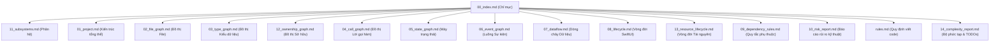

# Hướng dẫn Điều hướng CodeGraph - Dự án FreeBook

Tài liệu này đóng vai trò là điểm bắt đầu (Entrypoint) và bản đồ chỉ dẫn toàn bộ hệ thống tài liệu CodeGraph sống (Living Documentation) của dự án **FreeBook**.

## Ghi chú thủ công (Human Notes)
*Khu vực này dành riêng cho ghi chú thủ công của con người.*

<!-- GENERATED START -->
## Modern Reader chapter list bottom sheet presentation (1.3.215)

* `ReaderView` presents `ReaderChapterListView` via native SwiftUI `.sheet(isPresented: $showingChapterList)` with `.presentationDetents([.fraction(0.85), .large])`, `.presentationDragIndicator(.visible)`, and `.presentationBackground(selectedTheme.backgroundColor)`.
* Replaced custom ZStack overlay `readerChapterListOverlay` and custom drag handle `Capsule()` with native sheet gestures while preserving lazy/paged loading, search filtering, sorting, refresh, and accessibility escape.
* `ReaderChapterListStore` exposes `activeSearchQuery` (internal) to restore search state seamlessly across sheet mount/unmount cycles; `ReaderChapterListView` explicitly cancels `deferredVisiblePageTask` in `onDisappear`.

## Badge tên nguồn (extension / Local) trong danh sách chương Reader và BookListItemView (1.3.214)

* `ReaderChapterListView.header` hiển thị thêm badge pill xanh bên cạnh dòng `"N chương"`: sách local (`isLocalTXTBook`) hiện `"Local"`, sách online hiện `ext.name` (khi `ext != nil` và name không rỗng). Giữ nguyên `Spacer(minLength: 4)` và nút refresh/sort.
* `BookDisplayable` (trong `BookListItemView.swift`) thêm `isLocalBook: Bool` với default `false`; `Book` thoả mãn qua computed property `Book.isLocalBook`, `ExtensionItemResult` dùng default. Pill nguồn trong `BookListItemView` hiện `"Local"` khi `isLocalBook`, ngược lại hiện `sourceName`.

## Revert về c78d042: bỏ fullScreenCover Detail + Bottom Sheet danh sách chương, giữ lại các tính năng logic (1.3.213)

* Hoàn tác chuỗi trình bày sau `c78d042` — Detail trở lại mở bằng `NavigationLink` push trong NavigationStack của tab (tab bar hiện), Reader mở bằng `.fullScreenCover(item: $readerRoute)` cục bộ trong `BookDetailView`, danh sách chương quay lại overlay custom (`readerChapterListOverlay` + Capsule + `dismissGesture`). Bỏ `DetailRouter`/`ReaderRouter`/root presentation hub, `BookDetailRoute`/`ReaderRouterRoute`, `ReaderRouter.swift`, và các fix trình bày reader (re-creation loop, transparent detail, top-chrome, ignoresSafeArea).
* Giữ nguyên (thêm lại) các tính năng logic phát triển sau `c78d042`: chuẩn hóa `VietPhraseTokenizer` (tiếng Việt có dấu, số thập phân, gom cụm Latin/ASCII), `TranslateUtils` gom token tên tác giả, cải tiến `ExpandableTextView` (căn lề 2 bên Description, layout-safe, sửa nút "Xem thêm", fix comment, `WrappingLabel` public cho CI) kèm `Tests/ExpandableTextViewTests.swift`, khôi phục chính xác chunk TTS trong `TTSManager`, tối ưu `TTSQuickTimerSheet` (spacing, nút cài đặt, detents 0.85), tối ưu `BookListItemView`/`BookDetailHeaderView`, cải tiến Lịch Sử Đọc trong `ShelfView` (sort theo `lastReadDate`, `removeFromHistory` thông minh khi sách còn trên kệ), và toast thông minh cập nhật mục lục trong `ReaderChapterListView+Refresh`.

## newVisibleBrowser API parity, full runtime syntax checking and integrated line number gutter in Script Editor (1.3.200)

* `VisibleWebViewLoader` and `JSExecutor` upgraded to achieve full feature parity with headless `newBrowser`:
  - Added `launchAsync(url)`, `html(timeout)`, `waitUrl(urls, timeout)` supporting array of target URLs, `block(patterns)`, `urls()` (intercepted URLs up to 200), and `getVariable(name)`.
  - Added native bridge blocks: `_nativeBrowserLaunchAsyncVisible`, `_nativeBrowserBlockVisible`, `_nativeBrowserGetUrlsVisible`, and multi-target `_nativeBrowserWaitUrlVisible`.
* Added `JSExecutor.validateSyntax(_ scriptContent: String)` for evaluating script syntax with full VBook runtime globals (`load`, `Qt`, `UserAgent`, `Crypto`, `Engine`, `Response`, `localStorage`, `localConfig`, etc.).
* `ExtensionScriptEditorView` and `HighlightingCodeEditor` enhancements:
  - `CodeEditorTextView`: Line number gutter drawn directly in `draw(_ rect:)` via `layoutManager.lineFragmentRect(forGlyphAt:)`, guaranteeing 100% pixel-perfect vertical alignment even when long lines wrap into multiple visual lines.
  - Searchable Script Picker: Replaced horizontal pill scroll with searchable select dropdown sheet (`SearchableScriptPickerSheet`) displaying file icons, file names (`displayName`), relative paths, and modified indicators with real-time keyword filtering.

## Modern TTS sleep timer bottom sheet replacing confirmation dialog and alert (1.3.199)

* Introduced `TTSQuickTimerSheet` (`Sources/Views/TTSWidget/TTSQuickTimerSheet.swift`) presented as a modern SwiftUI bottom sheet (`presentationDetents([.fraction(0.68), .large])`).
* Replaced plain system `.confirmationDialog` and text field `.alert` in `TTSFloatingWidgetView`.
* Features real-time countdown status banner with quick cancellation, 6 preset duration tiles (`15m`, `30m`, `45m`, `60m`, `90m`, and `Hết chương`), custom stepper/slider (5–180m), and quick settings shortcut.

## Separate description and content fields in ExtensionItemResult and enhanced comment presentation (1.3.198)

* `ExtensionItemResult` expanded with dedicated `content: String` property alongside `description: String`.
* `ExtensionManager.search` and `ExtensionManager.executeCustomScript` parse `description` (`desc`/`description`) and `content` (`content`) as separate fields, preventing comment text and metadata from conflating.
* `CommentSectionView` and `AllCommentsView` render `comment.name` with `comment.description` (timestamp, rating, chapter metadata) in the header, and `comment.content` (fallback to `description`) in the comment body.
* `SearchView` falls back gracefully across `description` -> `content` -> `author`.

## Rhino and VBook Android compatibility runtime enhancements (1.3.197)

* `JSExecutor`, `JSDom`, `WebViewLoader` and `JSCrypto` upgraded with comprehensive Rhino / VBook Android JavaScript compatibility APIs:
  - `Qt.translate`: Connects to `TranslateUtils` and `TranslationManager` native translation engine supporting `"vi"`, `"vp"`, `"hv"` modes, `chapter_name`, `first_line_chapter_name`, `first_capitalize`, `person_name`, and returns `{ translateText, segments }`.
  - `Storage`: Added `localStorage` (persistent per-extension), `cacheStorage` (in-memory RAM cache), `localConfig` (reads injected user and plugin config via `getItem`/`get`), and `localCookie` (`setCookie`, `getCookie`).
  - `fetch`: Extended `response` with `statusText`, `url`, `headers` (dictionary access + `.get()`), `header(key)`, `blob()`, `request` (`{ url, headers }`), and `options.timeout` (ms).
  - `JSDom`: Added `element.attributes()` (`[String: String]`), `elements.isEmpty()`, and `elements.map(callback)` directly on `JSElements`.
  - `Engine.newBrowser`: Added `launchAsync(url)`, `waitUrl(urls, timeout)` supporting array of URLs, `html(timeout)`, `block(patterns)`, `urls()`, and `getVariable(name)`.
  - `Utilities`: Added `Log.log(...)`, `UserAgent.system()`, and smart `Script.execute(scriptOrName, functionName, ...args)` supporting extension script file loading.

## TTS floating widget and Global Toast presented via dedicated passthrough UIWindows (1.3.195)

* `TTSFloatingWidgetWindowManager` presents `FloatingWidgetUIWindow` (`windowLevel = .alert - 1`, non-key, `isHidden = false/true`) on the active `UIWindowScene`, ensuring the TTS floating widget stays visible above `ReaderView` (`fullScreenCover`), `BypassWebView` (`fullScreenCover`), and `TabbedVisibleBrowserViewController` (`pageSheet`).
* `FloatingWidgetUIWindow.hitTest` provides the authoritative native hit-testing: when a `presentedViewController` is active (e.g. `confirmationDialog`, `.alert`, or `TTSSettingsSheet`), touches dispatch to `super.hitTest` for full dialog/sheet interaction; otherwise, points inside `widgetContainerView.bounds` dispatch to subviews, while outside points return `nil` to pass through to underlying reader/browsers.
* `FloatingWidgetContainerViewController` manages bounded widget sizing (212x56/80 or 52x52), native `UIPanGestureRecognizer` drag (instant 1:1 finger tracking, no SwiftUI diffing delay), `UITapGestureRecognizer` (enabled only in `.peeking` mode), and spring animation snap/resizing. `TTSSettingsSheet` is presented directly within `FloatingWidgetUIWindow` with injected `modelContainer`, enabling `@Query` SwiftData queries for TTS extensions without modal presentation conflicts with `ReaderView` on the main window.
* `CoverRotationState` (owned by `FloatingWidgetContainerViewController`) drives smooth 20s/rev (18°/s) vinyl disc rotation via `TimelineView(minimumInterval: 1/30s, paused: !shouldAnimateCover)`. Ticks are strictly read-only, angle freezes accurately on pause, catches up seamlessly after widget suppression, and resets only on distinct book transitions (`lastDistinctBookId`).
* `ToastManager` manages a dedicated passthrough `ToastUIWindow` (`windowLevel = .alert`, non-key, `hitTest = nil`), ensuring all application toasts float above full-screen reader, browser, and modal sheets without blocking touch events.

## Reader presented as fullScreenCover instead of navigation push (1.3.192)

* Reader is no longer pushed onto a tab's `NavigationStack` with `.toolbar(.hidden, for: .tabBar)`. All 4 entry points (`ShelfView` shelf/history rows + TTS-widget route, `ShelfSearchView`, `BookDetailView`) now present `ReaderView` via `.fullScreenCover(item:)` wrapped in its own `NavigationStack`. The main `TabView` hierarchy is never re-laid-out and the tab bar is never hidden/shown, so the tab bar no longer appears late (janky restoration) after closing the full-screen reader.
* `ReaderView` dropped `.toolbar(.hidden, for: .tabBar)`; its hidden `NavigationLink`s (BookDetail / change source) push onto the cover's own stack, and `@Environment(\.dismiss)` dismisses the cover. `ShelfReaderRoute` is reused by `ShelfSearchView`; `BookDetailView.ReaderRoute` stays as the `fullScreenCover(item:)` item.

## Return to shelf tab after successful source change (1.3.182)

* `SearchView.executeSourceChange` posts a new `sourceChangedNavigateToShelf` notification (userInfo `["shelfTab": 1|2]`) right before `onSourceChanged?()` on success. Target sub-tab = `createSnapshot.isOnShelf ? 1 : 2` (new book inherits `isOnShelf`/`isHistory` from the old book), matching `ShelfView.historyBooks = isHistory && !isOnShelf`.
* `MainTabView` observes `sourceChangedNavigateToShelf` → `selectedTab = 0` (Kệ Sách main tab). `ShelfView` observes it → internal `selectedTab` = the `shelfTab` value (1 = Kệ Sách, 2 = Lịch Sử).
* `ReaderView.onSourceChanged` now also `dismiss()`es the Reader after a 0.3s delay (existing `DispatchQueue.main.asyncAfter` pattern) so the flow always lands on the shelf root even when the change was triggered from the Reader (old book is deleted on success in the non-TTS branch).
* `BookDetailView.onSourceChanged` mirrors the Reader: it resets `navigateToChangeSource = false` first (SearchView was pushed via `NavigationLink(isActive:)`; calling `dismiss()` alone left the push "active" so the SearchView stayed stuck) then `dismiss()`es the detail after a 0.3s delay. The MainTabView observer handles the main-tab switch.

## Add "Xoá khỏi kệ sách" (off-shelf) to shelf context menu (1.3.173)

* `BookTransactionCoordinator.removeFromShelf(bookId:in:)` (new) sets `isOnShelf = false` + `isHistory = true` + `lastReadDate = Date()` and saves — unlike `setOnShelf(false)` (which forces `isHistory = false` and would hide the book from both tabs), this keeps the book visible in the Lịch sử tab (`historyBooks = isHistory && !isOnShelf`).
* `ShelfView` shelf-tab context menu: added a new "Xoá khỏi kệ sách" button (`bookmark.slash`) calling `removeFromShelfOnly(_:)` (off-shelf only), and renamed the existing destructive "Xóa khỏi kệ sách" to "Xoá" (`trash.fill`), keeping its full-delete behavior via `removeFromShelf(_:)` (`BookStorageManager.deleteBookAsync`).

## Widen FloatingSelectionMenu cells (1.3.173)

* `Sources/Views/Reader/Components/FloatingSelectionMenu.swift`: `buttonWidth` 46→52 (cells 2-4), `ngheWidth` 56→62 (Nghe column), and `menuWidth` 199→223 to stay in sync (`menuWidth = ngheWidth + 1 + 3*buttonWidth + 4`). Layout uses `HStack(spacing:0)` + explicit `.frame(width:)`, so cells widen automatically; keeping `menuWidth` correct preserves the x-clamp so the menu is not clipped at screen edges.

## Normalize JS object parsing via JSON round-trip (1.3.173)

* **Root cause**: `ExtensionManager.detail(...)` parsed the JS dictionary via `cleanVal.toDictionary()` then read `dict["name"] as? String`. `JSValue.toDictionary()` bridges the `name` value (a long CJK string going through `formatTocName()`) to a non-`String` type, so `as? String` returned `nil` → `""` while `author` (also a CJK string) bridged fine — the raw `Response.success` still contained `name`. This is why the shuhaige book name was not displayed in the detail screen (diagnostic log confirmed `detail parsed info: name= | author=???`).
* **Fix**: added `ExtensionManager.parseJSObject(_ jsValue:) -> [String: Any]?` which runs the JS object through `JSON.stringify` (reusing `stringify`) + `JSONSerialization`, normalizing every value to standard Foundation types (NSString/NSNumber/NSArray/NSDictionary) so `as? String` works reliably. Guards against empty/`"undefined"` (JSON.stringify failure).
* `detail` (`ExtensionManager.swift:409`) now uses `parseJSObject(cleanVal)` instead of `cleanVal.toDictionary()`, which fixes `name`/`author`/`cover`/`description`/`detail`/`host`/`link` **and** the genres/suggests/comments `item["title"]/["input"]/["script"] as? String` reads in one place (they flow from the same `dict`).
* `executeCustomScript` fallback dict branches (`:632`, `:636`) also switched to `parseJSObject(cleanVal)` for consistency.
* **Kept as-is for performance**: the main `executeCustomScript` array path (`:727`), `toc`/`search`/`genre`/`home` (all read via `?.toString()` on JSValue) — lightweight and already correct; JSON round-trip is only applied to small objects to avoid heavy 3-4x memory/CPU cost on large payloads (base64 TTS, chapter content, large book arrays).

## Enable detail parsed name diagnostic log (1.3.172)

* `ExtensionManager.detail(...)` uncomments (previously disabled) the app-side log at `ExtensionManager.swift:470`: `AppLogger.shared.log("✅ [ExtensionManager] detail parsed info: name=\(result.name) | author=\(result.author)")`. Purpose: while investigating why the shuhaige extension's book name is not displayed in the detail screen, capture the exact `NovelDetailResult.name` the app parsed from the JS dictionary (the raw `Response.success` already logs the name, but the parsed DTO value was not logged). Run once on a Mac/CI to confirm whether the parsed name is populated or empty; then revert this diagnostic log if no longer needed.

## Rename SearchNovelResult to ExtensionItemResult & pure data-driven filtering (1.3.173)

* Renamed DTO `SearchNovelResult` to `ExtensionItemResult` in `Sources/Services/Extensions/Manager/ExtensionManager.swift` to reflect its true generic role for novels, genres, similar recommendations, and comments/reviews. Added `public typealias SearchNovelResult = ExtensionItemResult` for backward compatibility.
* `ExtensionManager.executeCustomScript` eliminates script-name hardcoding (`isCommentScript` via `scriptFileName.contains("comment")`), replacing it with 100% data-driven validation: `guard hasLink || hasContent else { continue }` where `hasLink = !link.isEmpty` (novel items) and `hasContent = !(dict["content"]?.toString() ?? "").isEmpty` (comment/review items like `book_review.js`, `review.js`, `comment.js`). `author` fallback changed to `""`.
* All consumer components synchronized: `PaginatedNovelLoader`, `NovelListUtils`, `BookListItemView` (`ExtensionItemResult: BookDisplayable`), `CommentSectionView`, `AllCommentsView`, `SuggestRowView`, and `SearchView`.

## Keep reader highlight on TTS pause (1.3.172)

* `ReaderView.chapterContentView` no longer requires `ttsState.snapshot.isPlaying` to render the TTS reading highlight. `pause()` calls `publishLifecycleState(isPlaying: false)` without `isStopped`, so `highlightRange`/`currentParentParagraphIndex`/`playingBookId`/`playingChapterIndex` are preserved; dropping the `isPlaying` guard keeps the current chunk highlighted while paused. Stop (`isStopped: true`) still nils range/bookId/parentIndex, so highlight disappears on stop and on book/chapter change (other guards) as before.

## Unify genres/discovery/search list loading (1.3.172)

* New `Sources/Common/Utils/NovelListUtils.swift` centralizes the previously file-local list helpers: `normalizeLink(_:)` (strip scheme/host, ensure leading "/") and `filterAndDeduplicate(_:)` (drop empty name/link, dedupe by normalized link). The four `fileprivate func normalizeLink` copies (`CategoryNovelsListView`, `DiscoveryView`, `SearchView`, `SuggestRowView`) and `SearchView.filterAndDeduplicate` are removed; `SuggestRowView` and `SearchView` now call the shared helpers directly.
* New `Sources/Services/Extensions/PaginatedNovelLoader.swift` (`@MainActor`, `ObservableObject`, `import Combine` — no SwiftUI) encapsulates the paginated `executeCustomScript` flow: `novels/isLoading/isLoadingMore/errorMessage/canLoadMore`, `loadInitial()/loadMore()/reload()`, dedupe across pages, retry 3×/2s on load-more failure, and the unified `canLoadMore = results.count >= 10 && (nextPage != nil || input.contains("{0}"))` rule.
* `CategoryNovelsListView` (genres) and `DiscoveryCategoryTabView` (home tabs) are refactored to own a `@StateObject PaginatedNovelLoader` instead of local `@State`; discovery keeps its lazy-tab `checkAndLoadData`/`scheduleInitialLoad` (delegating to `loader.loadInitial()`) and both keep the scroll lazy-load footer (`ProgressView` `.onAppear` → `loader.loadMore()`). The two accepted behavior deltas are now unified: `canLoadMore` follows discovery's rule, and pull-to-refresh (`reload()`) dedupes for both (fixing discovery's previous reload that set `novels = results` with no dedupe).

## Paste button & dictionary share between books (1.3.172)

* `ReaderDefinitionOverlayView.suggestionChipsView` adds a paste button (`doc.on.clipboard`) between the gear button and the chip `ScrollView`, same round blue-icon style. `pasteFromClipboard()` reads `UIPasteboard.general.string`; empty clipboard → toast "Không có nội dung trong clipboard", otherwise it replaces `customMeaning` (consistent with tapping a chip).
* `DictionaryListView` (per-book only, `bookId != nil`) adds a toolbar menu item "Chia sẻ sang truyện khác" opening `BookShareTargetSheet` (moved to its own file), which lists all `Book`s sorted by `lastReadDate` desc (excluding the current book). Picking a target asks for a mode: "Thay thế hoàn toàn" / "Gộp (trùng key thì thay mới)".
* The per-book book row is extracted into a shared generic component `BookListItemView<Item: BookDisplayable>` (`Sources/Views/Common/BookListItemView.swift`). `BookDisplayable` is a display protocol (`bookId/title/author/coverUrl/sourceName/description/currentChapterTitle/currentChapterIndex`) conformed by `Book` (via `desc`) and `SearchNovelResult` (name→title, cover→coverUrl, link→bookId). The row shows cover (`BookCoverView`, size-configurable) + translated title, then either description (when `showDescription` is true) or author (Hán-Việt) + source pill, plus an optional "Đang đọc" chapter line (`showChapter`, default true). It is now reused by `ShelfView`, `BookShareTargetSheet`, `CategoryNovelsListView` (genre, `showDescription: true`), and `DiscoveryCategoryTabView` (home tabs, `showDescription: true` — its raw `AsyncImage` cover is replaced by `BookCoverView`). `SuggestRowView` keeps its own 2-column grid card (already uses `BookCoverView`).
* Refactor for reuse: the per-book merge/replace logic is extracted once into `DictionaryTextFileStore.mergedRecords(imported:existing:isMerge:)`, used by both `importFile` and `shareToBook`; the shared mode-selection dialog is extracted into a `dictionaryModeDialog` ViewModifier (`DictionaryImportModeDialog.swift`) reused by import and the share sheet. `shareToBook` reads source records from `books/{source}/{type}.txt`, writes merged/replaced records to `books/{target}/{type}.txt`, then clears caches (`TranslateUtils.clearCache()`, `TranslationManager.clearBookDictCache(for: target)`); an empty source shows a toast and aborts.

## Reader selection menu label 7pt & marquee revert (1.3.171)

The marquee (scrolling-text) feature introduced in 1.3.169/1.3.170 was fully reverted. `Sources/Views/Reader/Components/MarqueeText.swift` was deleted; `FloatingSelectionMenu.menuItemContent` uses a plain `Text(label)` again — label at 7pt bold with `lineLimit(1)`, centered horizontally (`.frame(maxWidth: .infinity)`) and vertically (`.frame(height: 15, alignment: .center)`), while the icon stays 15pt and both rows share a 15pt frame so icon and text have equal height. Layout is unchanged: 46×46 square cells, Nghe 56×93 merging both rows, one faint vertical divider between Nghe and the rest, faint horizontal divider between the two rows. `ReaderHeaderFooterOverlayView` restores plain `Text` with `lineLimit(1)/truncationMode(.tail)` for the book title (16 bold) and chapter title (13 medium), keeping colors, layout, and the `onOpenChapterList` action.

## Reader selection "Đọc" speed 1.5 (1.3.168)

`ReaderView.readSelectedText()` now synthesizes Google TTS with `speed: 1.5` (was 1.0). The Siri fallback `fallbackSiriReadSelectedText()` sets `utterance.rate = AVSpeechUtteranceMaximumSpeechRate` (the fastest AVSpeechSynthesizer allows, max 1.0).

## Reader FloatingSelectionMenu layout & clamping fix (1.3.167)

`FloatingSelectionMenu` was restructured so the "Nghe" button truly merges both rows in column 1 (full menu height `80 + 1 + 42 = 123pt`), replacing the old `Color.clear` spacer. Columns 2-4 are a two-row `VStack` — row 1: Phiên âm / Copy / Đọc (80pt); horizontal divider only within columns 2-4; row 2 reordered to Dịch / Thay thế / Xoá (42pt). UI is more compact: `buttonWidth` 52→46, `gap` 36→24, icon 16→15, menu height 145→123. A new `screenHeight` parameter is threaded from `ReaderView` (via `ReaderFloatingMenuOverlayView`) so the menu's y position is clamped: prefer placing above the selection (`localMinY - gap - menuHeight/2`) when it fits, otherwise below (`localMaxY + gap + menuHeight/2`), finally clamped into `[margin + menuHeight/2, screenHeight - margin - menuHeight/2]` (`margin = 16`). This keeps the menu fully on-screen near edges (no lost rounded corners) and away from the selected text whenever space allows.

## Reader AddWordSheet suggest chips (1.3.166)

`AddWordSheet` (shown from Reader's "Phiên âm" selection action via `showSuggestions: true`) no longer auto-fills the value field. It renders a "Gợi ý phiên âm" section with up to three tappable chips: the library transliteration (`TextPreprocessor.lookupWord`, blue) when present, plus always-visible rule chips from `JapaneseTransliterator.transliterateRomaji` and `EnglishTransliterator.transliterateWord` (gray). Tapping a chip fills the value. The library lookup is debounced 300ms through a cancellable `suggestionLoadTask` on every key change and canceled on disappear. `TTSDictionaryEditView` keeps `showSuggestions` false, so its add flow stays unchanged.

## NghiTTS safeCachedTimeSeconds prefetch update (1.3.116)

NghiTTS now uses a user-configurable, persistent `nghittsSafeCachedTimeSeconds` duration setting (`UserDefaults` key `"nghittsSafeCachedTimeSeconds"`, default 8s, range 4-20s). The scheduler calculates `cachedTime` across a contiguous playable chain (stopping at the first missing gap), schedules a single deadline wake task (`nghiWakeTask`), caps audio reserve at max 5 logical payloads, and coordinates inference via a 4-level priority queue (`PiperSynthesisCoordinator`). Thermal state is diagnostic-only. See state, call, ownership, lifecycle, and risk documents for the revised pipeline.

## Sơ đồ cấu trúc tài liệu CodeGraph

```mermaid
graph TD
    Index["00_index.md (Chỉ mục)"] --> Subsystems["11_subsystems.md (Phân hệ)"]
    Index --> Project["01_project.md (Kiến trúc tổng thể)"]
    
    Index --> Files["02_file_graph.md (Đồ thị File)"]
    Index --> Types["03_type_graph.md (Đồ thị Kiểu dữ liệu)"]
    Index --> Ownership["12_ownership_graph.md (Đồ thị Sở hữu)"]
    Index --> Calls["04_call_graph.md (Đồ thị Lời gọi hàm)"]
    Index --> States["05_state_graph.md (Máy trạng thái)"]
    Index --> Events["06_event_graph.md (Luồng Sự kiện)"]
    
    Index --> Dataflow["07_dataflow.md (Dòng chảy Dữ liệu)"]
    Index --> Lifecycles["08_lifecycle.md (Vòng đời SwiftUI)"]
    Index --> ResLifecycles["13_resource_lifecycle.md (Vòng đời Tài nguyên)"]
    
    Index --> DepRules["09_dependency_rules.md (Quy tắc phụ thuộc)"]
    Index --> Risks["10_risk_report.md (Báo cáo rủi ro kỹ thuật)"]
    Index --> Rules["rules.md (Quy định viết code)"]
    Index --> Complexity["14_complexity_report.md (Độ phức tạp & TODOs)"]
```

---

## Chi tiết các Tài liệu

### 1. Kiến trúc & Thiết kế Phân hệ
*   **[01_project.md](01_project.md)**: Phác thảo kiến trúc phân tầng của dự án FreeBook (Common, Models, Services, Views) và định nghĩa các nguyên tắc phát triển hệ thống.
*   **[11_subsystems.md](11_subsystems.md)**: Phân tích 14 phân hệ (Subsystems) chính của ứng dụng như Reader, TTS, Download, Audio, Extension Engine...

### 2. Đồ thị & Quan hệ thành phần
*   **[02_file_graph.md](02_file_graph.md)**: Đồ thị quan hệ phụ thuộc (Uses / Used by) và Import Graph của từng file trong số 87 file mã nguồn Swift.
*   **[03_type_graph.md](03_type_graph.md)**: Chi tiết về các lớp, struct, enum, protocol, actor và extension.
*   **[12_ownership_graph.md](12_ownership_graph.md)**: Biểu diễn mối quan hệ sở hữu đối tượng theo cấu trúc cây từ View -> ViewModel -> Manager -> Service.
*   **[04_call_graph.md](04_call_graph.md)**: Đồ thị cuộc gọi hàm quan trọng kèm theo đánh giá mức độ tin cậy và đánh dấu UNKNOWN cho các dynamic dispatch.
*   **[05_state_graph.md](05_state_graph.md)**: Phân tích các máy trạng thái điều khiển TTS, Tải xuống, Trình đọc truyện và Widget.
*   **[06_event_graph.md](06_event_graph.md)**: Bản đồ luồng sự kiện và cơ chế giao tiếp đa luồng.

### 3. Dòng chảy & Vòng đời
*   **[07_dataflow.md](07_dataflow.md)**: Dòng chảy dữ liệu qua các tầng và cơ chế bộ nhớ đệm (Cache).
*   **[08_lifecycle.md](08_lifecycle.md)**: Vòng đời của các SwiftUI Views và cơ chế hủy Task chạy ngầm.
*   **[13_resource_lifecycle.md](13_resource_lifecycle.md)**: Vòng đời các tài nguyên hệ thống đặc biệt (`AVAudioEngine`, background `Task`, SwiftData context, `WKWebView`).

### 4. Quy tắc phát triển & Phân tích rủi ro
*   **[09_dependency_rules.md](09_dependency_rules.md)**: Quy tắc phụ thuộc hợp lệ trong dự án để bảo toàn tính toàn vẹn của cấu trúc Clean Architecture.
*   **[10_risk_report.md](10_risk_report.md)**: Báo cáo rủi ro kỹ thuật phân loại theo Severity và Likelihood, liên kết trực tiếp với các tệp nguồn và tài liệu liên quan.
*   **[rules.md](rules.md)**: Hướng dẫn quy định lập trình chi tiết cho dự án, bao gồm cả Source of Truth, Maintenance Rules và Trigger Rules.
*   **[14_complexity_report.md](14_complexity_report.md)**: Báo cáo kích thước file, Cyclomatic Complexity ước lượng, nested closures, và TODOs.

#### Reader/TTS unified pipeline (2026-07)

- `ChapterTextNormalizer` is the single source for LF newlines, trimmed non-empty lines, compact paragraph IDs, and UTF-16 ranges. `ChapterContentRepository` produces one normalized `ChapterDocument` for both Reader and TTS.
- Reader uses `ReaderLoadState` with bootstrap retry/clamping, typed failures, generation checks, cache-first rendering, and a short opacity crossfade only for newly fetched content. `ReaderRoute.chapterIndex` preserves the selected TOC index through navigation.
- `TTSParagraphBuilder` chunks normalized lines without renumbering parent paragraph IDs; replacement output is checked before synthesis. TTS asynchronous work is guarded by session identity and TTS owns progress while playing.
- `ReadingProgressStore` coalesces RAM snapshots in an actor and flushes from background contexts on checkpoints, dismissal, and app backgrounding. Legacy window/tab Reader, duplicate progress repository, and `TTSSession` mirror are removed.
- `TTSFloatingWidgetView` now renders a horizontal capsule with circular cover/play/next/close controls. `FloatingWidgetViewModel` persists edge/vertical placement, expands while dragged away from the edge, and peeks as a cover half-disc after idle or edge snapping.
- The TTS capsule uses a compact 174x56 layout, reduced control sizes, and zero horizontal inset in the expanded state so its selected edge is flush with the screen while the overlay remains bounded to the widget frame.
- Reader bootstrap resolves a local chapter snapshot directly from `ModelContext` when the parent `@Query` is not ready, and propagates late online TOC updates into the active ViewModel. The TTS widget keeps only its own bounds in the overlay layout so Reader content remains tappable.
- Chapter loading is local-first through shared memory, `ChapterPersistenceStore`/SwiftData, then extension fetch. Reader/TTS share immutable documents and in-flight work while retaining independent book/session/navigation ownership.
- Shared chapter memory is bounded by a 12-entry/12-MiB cost-aware LRU. In-flight work keeps per-consumer waiters, allowing Reader cancellation to return immediately while preserving a load still needed by TTS and canceling the underlying extension task after the final waiter leaves.
- Repository rows use an explicit confirmed trash action instead of swipe-delete/toggle, preserving horizontal page gestures between extension tabs.
- `BookStorageManager` acts as the single coordinator for book deletion, handling database deletion and side-effects (canceling downloads, stopping TTS, clearing reader fallback progress) before asynchronously deleting sandbox files (such as `.bin` and cover `.jpg` files) in a background thread. Failed deletions are pushed to a `UserDefaults` queue and retried at app launch.
- Cover images and chapter `.bin` files use SHA-256 hashed filenames of `bookId` with automatic path safety validation and secure legacy fallback.
- `ReaderChapterListStore` restricts memory footprint for TOC rows via page fetching (TOC pagination) and a sliding window of 3 adjacent pages (maximum 300 active rows) for large books.
- `Chapter.generateId(bookId:url:index:)` generates length-prefixed identifiers to prevent collision, while legacy chapter IDs remain intact.
- Improved cooperative cancellation checks in `DownloadManager` during download and text export tasks.
- Dictionary updates enqueue one cancelable Reader refresh that rebuilds the displayed chapter first, then loaded/preloaded chapters by distance. Translation work runs off the MainActor and updates full `ParagraphItem` mappings without clearing live TTS audio prefetch; pressing Reader's listen action starts a new TTS session from the refreshed VP/Name content.
- `TranslateUtils.tokenize` pre-scans VietPhrase candidates ($L \ge 2$) and resolves overlaps by prioritizing longer length (`length DESC`), then earlier start index (`lowerBound ASC`), while preserving single Chinese character fallback lookup in `performTranslation`.

- Google/Ext giữ cửa sổ cache tối đa ba chunk nhưng tổng hợp qua một `RemoteTTSSynthesisCoordinator`; chỉ một operation chạy tại một thời điểm, ưu tiên chunk hiện tại và dừng prefetch ở thermal `.serious/.critical`.
- Ext TTS dùng `ExtTTSRuntime` actor để tái sử dụng một `JSExecutor` theo script/config, trong khi các script bóc tách nội dung vẫn dùng executor ngắn hạn.
- NghiTTS dùng `NghiSynthesisPolicy` để giới hạn ONNX/XNNPACK ở một worker, giữ buffer 2.5–5 giây khi nominal, chỉ chèn cooldown từ N+2, giữ N+1 tại `.serious`, và chuyển sang demand-only tại `.critical`.

<!-- GENERATED END -->
