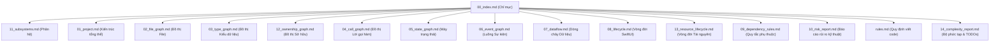

# Hướng dẫn Điều hướng CodeGraph - Dự án FreeBook

Tài liệu này đóng vai trò là điểm bắt đầu (Entrypoint) và bản đồ chỉ dẫn toàn bộ hệ thống tài liệu CodeGraph sống (Living Documentation) của dự án **FreeBook**.

## Ghi chú thủ công (Human Notes)
*Khu vực này dành riêng cho ghi chú thủ công của con người.*

<!-- GENERATED START -->
## Reader AddWordSheet suggest chips (1.3.166)

`AddWordSheet` (shown from Reader's "Phiên âm" selection action via `showSuggestions: true`) no longer auto-fills the value field. It renders a "Gợi ý phiên âm" section with up to three tappable chips: the library transliteration (`TextPreprocessor.lookupWord`, blue) when present, plus always-visible rule chips from `JapaneseTransliterator.transliterateRomaji` and `EnglishTransliterator.transliterateWord` (gray). Tapping a chip fills the value. The library lookup is debounced 300ms through a cancellable `suggestionLoadTask` on every key change and canceled on disappear. `TTSDictionaryEditView` keeps `showSuggestions` false, so its add flow stays unchanged.

## NghiTTS safeCachedTimeSeconds prefetch update (1.3.116)

NghiTTS now uses a user-configurable, persistent `nghittsSafeCachedTimeSeconds` duration setting (`UserDefaults` key `"nghittsSafeCachedTimeSeconds"`, default 8s, range 4-20s). The scheduler calculates `cachedTime` across a contiguous playable chain (stopping at the first missing gap), schedules a single deadline wake task (`nghiWakeTask`), caps audio reserve at max 5 logical payloads, and coordinates inference via a 4-level priority queue (`PiperSynthesisCoordinator`). Thermal state is diagnostic-only. See state, call, ownership, lifecycle, and risk documents for the revised pipeline.

## Sơ đồ cấu trúc tài liệu CodeGraph

```mermaid
graph TD
    Index["00_index.md (Chỉ mục)"] --> Subsystems["11_subsystems.md (Phân hệ)"]
    Index --> Project["01_project.md (Kiến trúc tổng thể)"]
    
    Index --> Files["02_file_graph.md (Đồ thị File)"]
    Index --> Types["03_type_graph.md (Đồ thị Kiểu dữ liệu)"]
    Index --> Ownership["12_ownership_graph.md (Đồ thị Sở hữu)"]
    Index --> Calls["04_call_graph.md (Đồ thị Lời gọi hàm)"]
    Index --> States["05_state_graph.md (Máy trạng thái)"]
    Index --> Events["06_event_graph.md (Luồng Sự kiện)"]
    
    Index --> Dataflow["07_dataflow.md (Dòng chảy Dữ liệu)"]
    Index --> Lifecycles["08_lifecycle.md (Vòng đời SwiftUI)"]
    Index --> ResLifecycles["13_resource_lifecycle.md (Vòng đời Tài nguyên)"]
    
    Index --> DepRules["09_dependency_rules.md (Quy tắc phụ thuộc)"]
    Index --> Risks["10_risk_report.md (Báo cáo rủi ro kỹ thuật)"]
    Index --> Rules["rules.md (Quy định viết code)"]
    Index --> Complexity["14_complexity_report.md (Độ phức tạp & TODOs)"]
```

---

## Chi tiết các Tài liệu

### 1. Kiến trúc & Thiết kế Phân hệ
*   **[01_project.md](01_project.md)**: Phác thảo kiến trúc phân tầng của dự án FreeBook (Common, Models, Services, Views) và định nghĩa các nguyên tắc phát triển hệ thống.
*   **[11_subsystems.md](11_subsystems.md)**: Phân tích 14 phân hệ (Subsystems) chính của ứng dụng như Reader, TTS, Download, Audio, Extension Engine...

### 2. Đồ thị & Quan hệ thành phần
*   **[02_file_graph.md](02_file_graph.md)**: Đồ thị quan hệ phụ thuộc (Uses / Used by) và Import Graph của từng file trong số 87 file mã nguồn Swift.
*   **[03_type_graph.md](03_type_graph.md)**: Chi tiết về các lớp, struct, enum, protocol, actor và extension.
*   **[12_ownership_graph.md](12_ownership_graph.md)**: Biểu diễn mối quan hệ sở hữu đối tượng theo cấu trúc cây từ View -> ViewModel -> Manager -> Service.
*   **[04_call_graph.md](04_call_graph.md)**: Đồ thị cuộc gọi hàm quan trọng kèm theo đánh giá mức độ tin cậy và đánh dấu UNKNOWN cho các dynamic dispatch.
*   **[05_state_graph.md](05_state_graph.md)**: Phân tích các máy trạng thái điều khiển TTS, Tải xuống, Trình đọc truyện và Widget.
*   **[06_event_graph.md](06_event_graph.md)**: Bản đồ luồng sự kiện và cơ chế giao tiếp đa luồng.

### 3. Dòng chảy & Vòng đời
*   **[07_dataflow.md](07_dataflow.md)**: Dòng chảy dữ liệu qua các tầng và cơ chế bộ nhớ đệm (Cache).
*   **[08_lifecycle.md](08_lifecycle.md)**: Vòng đời của các SwiftUI Views và cơ chế hủy Task chạy ngầm.
*   **[13_resource_lifecycle.md](13_resource_lifecycle.md)**: Vòng đời các tài nguyên hệ thống đặc biệt (`AVAudioEngine`, background `Task`, SwiftData context, `WKWebView`).

### 4. Quy tắc phát triển & Phân tích rủi ro
*   **[09_dependency_rules.md](09_dependency_rules.md)**: Quy tắc phụ thuộc hợp lệ trong dự án để bảo toàn tính toàn vẹn của cấu trúc Clean Architecture.
*   **[10_risk_report.md](10_risk_report.md)**: Báo cáo rủi ro kỹ thuật phân loại theo Severity và Likelihood, liên kết trực tiếp với các tệp nguồn và tài liệu liên quan.
*   **[rules.md](rules.md)**: Hướng dẫn quy định lập trình chi tiết cho dự án, bao gồm cả Source of Truth, Maintenance Rules và Trigger Rules.
*   **[14_complexity_report.md](14_complexity_report.md)**: Báo cáo kích thước file, Cyclomatic Complexity ước lượng, nested closures, và TODOs.

#### Reader/TTS unified pipeline (2026-07)

- `ChapterTextNormalizer` is the single source for LF newlines, trimmed non-empty lines, compact paragraph IDs, and UTF-16 ranges. `ChapterContentRepository` produces one normalized `ChapterDocument` for both Reader and TTS.
- Reader uses `ReaderLoadState` with bootstrap retry/clamping, typed failures, generation checks, cache-first rendering, and a short opacity crossfade only for newly fetched content. `ReaderRoute.chapterIndex` preserves the selected TOC index through navigation.
- `TTSParagraphBuilder` chunks normalized lines without renumbering parent paragraph IDs; replacement output is checked before synthesis. TTS asynchronous work is guarded by session identity and TTS owns progress while playing.
- `ReadingProgressStore` coalesces RAM snapshots in an actor and flushes from background contexts on checkpoints, dismissal, and app backgrounding. Legacy window/tab Reader, duplicate progress repository, and `TTSSession` mirror are removed.
- `TTSFloatingWidgetView` now renders a horizontal capsule with circular cover/play/next/close controls. `FloatingWidgetViewModel` persists edge/vertical placement, expands while dragged away from the edge, and peeks as a cover half-disc after idle or edge snapping.
- The TTS capsule uses a compact 174x56 layout, reduced control sizes, and zero horizontal inset in the expanded state so its selected edge is flush with the screen while the overlay remains bounded to the widget frame.
- Reader bootstrap resolves a local chapter snapshot directly from `ModelContext` when the parent `@Query` is not ready, and propagates late online TOC updates into the active ViewModel. The TTS widget keeps only its own bounds in the overlay layout so Reader content remains tappable.
- Chapter loading is local-first through shared memory, `ChapterPersistenceStore`/SwiftData, then extension fetch. Reader/TTS share immutable documents and in-flight work while retaining independent book/session/navigation ownership.
- Shared chapter memory is bounded by a 12-entry/12-MiB cost-aware LRU. In-flight work keeps per-consumer waiters, allowing Reader cancellation to return immediately while preserving a load still needed by TTS and canceling the underlying extension task after the final waiter leaves.
- Repository rows use an explicit confirmed trash action instead of swipe-delete/toggle, preserving horizontal page gestures between extension tabs.
- `BookStorageManager` acts as the single coordinator for book deletion, handling database deletion and side-effects (canceling downloads, stopping TTS, clearing reader fallback progress) before asynchronously deleting sandbox files (such as `.bin` and cover `.jpg` files) in a background thread. Failed deletions are pushed to a `UserDefaults` queue and retried at app launch.
- Cover images and chapter `.bin` files use SHA-256 hashed filenames of `bookId` with automatic path safety validation and secure legacy fallback.
- `ReaderChapterListStore` restricts memory footprint for TOC rows via page fetching (TOC pagination) and a sliding window of 3 adjacent pages (maximum 300 active rows) for large books.
- `Chapter.generateId(bookId:url:index:)` generates length-prefixed identifiers to prevent collision, while legacy chapter IDs remain intact.
- Improved cooperative cancellation checks in `DownloadManager` during download and text export tasks.
- Dictionary updates enqueue one cancelable Reader refresh that rebuilds the displayed chapter first, then loaded/preloaded chapters by distance. Translation work runs off the MainActor and updates full `ParagraphItem` mappings without clearing live TTS audio prefetch; pressing Reader's listen action starts a new TTS session from the refreshed VP/Name content.
- `TranslateUtils.tokenize` pre-scans VietPhrase candidates ($L \ge 2$) and resolves overlaps by prioritizing longer length (`length DESC`), then earlier start index (`lowerBound ASC`), while preserving single Chinese character fallback lookup in `performTranslation`.

- Google/Ext giữ cửa sổ cache tối đa ba chunk nhưng tổng hợp qua một `RemoteTTSSynthesisCoordinator`; chỉ một operation chạy tại một thời điểm, ưu tiên chunk hiện tại và dừng prefetch ở thermal `.serious/.critical`.
- Ext TTS dùng `ExtTTSRuntime` actor để tái sử dụng một `JSExecutor` theo script/config, trong khi các script bóc tách nội dung vẫn dùng executor ngắn hạn.
- NghiTTS dùng `NghiSynthesisPolicy` để giới hạn ONNX/XNNPACK ở một worker, giữ buffer 2.5–5 giây khi nominal, chỉ chèn cooldown từ N+2, giữ N+1 tại `.serious`, và chuyển sang demand-only tại `.critical`.

<!-- GENERATED END -->
