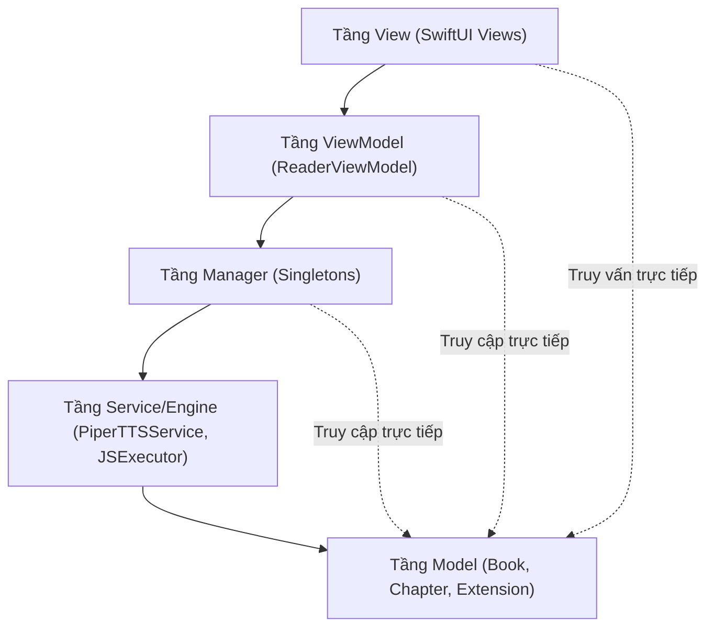

# Kiến trúc Tổng thể & Quy tắc Thiết kế

Tài liệu này phác thảo kiến trúc tổng thể, sơ đồ thư mục, các tính năng cốt lõi và các quy tắc kiến trúc đang được áp dụng trong dự án FreeBook.

## Ghi chú thủ công (Human Notes)
*Ghi chú thủ công của con người.*

<!-- GENERATED START -->
## 1. Sơ đồ Thư mục & Module

Dự án được tổ chức theo cấu trúc phân tầng rõ rệt dưới thư mục `Sources`:

```
Sources
 ├── App
 │    └── FreeBookApp.swift (Điểm khởi chạy ứng dụng)
 ├── Common
 │    ├── Extensions (Các tiện ích mở rộng hệ thống: String+HTML, View+Keyboard...)
 │    └── Services (Các service chia sẻ: ImageCacheManager, ToastManager)
 ├── Models
 │    ├── Database (Các thực thể lưu trữ SwiftData: Book, Chapter, Extension, Repository, DownloadTaskModel)
 │    └── Dictionaries (Các cấu trúc dữ liệu tra cứu: DoubleArrayTrie, SearchEngine, TextDictionary)
 ├── Services
 │    ├── Download (Quản lý tải xuống: DownloadManager)
 │    ├── Extensions
 │    │    ├── Engine (Nhân chạy JS: JSExecutor, JSDom, JSCrypto)
 │    │    └── Manager (Quản lý cài đặt & chạy extension: ExtensionManager)
 │    ├── Logging (Ghi log hệ thống: AppLogger)
 │    ├── Translation
 │    │    ├── Manager (Quản lý từ điển: TranslationManager)
 │    │    └── Utils (Các tiện ích dịch thuật: DictionaryCache, TranslateUtils)
 │    └── TTS
 │         ├── Preprocessing (Tiền xử lý văn bản: EnglishTransliterator, VietnameseNumberSpeller...)
 │         ├── NghiTTS (Piper Engine offline: PiperTTSService, ModelStore, NghiTTSClient)
 │         ├── Siri (TTS native: SiriTTSService)
 │         ├── Ext (TTS thông qua extension JS: ExtTTSService)
 │         └── TTSManager.swift (Bộ điều khiển TTS trung tâm)
 └── Views
      ├── Shelf (Kệ sách chính: ShelfView)
      ├── Discovery (Khám phá truyện: DiscoveryView)
      ├── BookDetail (Chi tiết truyện: BookDetailView)
      ├── Search (Tìm kiếm truyện: SearchView)
      ├── Reader (Trình đọc truyện: ReaderView, ReaderViewModel)
      ├── TTSWidget (Floating Widget điều khiển TTS: TTSFloatingWidgetView)
      ├── Dictionary (Tra từ điển & quản lý từ điển: DictionaryHubView)
      ├── Download (Theo dõi tiến trình tải: DownloadTrackerView)
      ├── Extensions (Quản lý repo và store tiện ích: RepositoryManagerView)
      ├── Settings (Cấu hình hệ thống: SettingsView)
      └── Common (Các view dùng chung: BypassWebView, BookCoverView, SkeletonView)
```

---

## 2. Các Tính năng Cốt lõi (Features)

1.  **Đọc sách Offline & Online (Reader)**: Đọc nội dung truyện từ các nguồn web thông qua JS extension hoặc đọc offline từ database đã lưu. Hỗ trợ cuộn mượt, tùy chỉnh cỡ chữ và tự động prefetch chương kế tiếp.
2.  **Đọc truyện thành tiếng (TTS)**: Hỗ trợ 3 công cụ đọc (Siri, Piper offline giọng đọc AI tự nhiên, và các JS Extension TTS). Hỗ trợ điều khiển nhạc nền từ màn hình khóa, tua ngược/tiến đoạn văn và bôi đen (highlight) từ đang đọc.
3.  **Dịch Hán Việt trực tiếp (Translation)**: Dịch thuật nội dung truyện chữ Trung Quốc sang dạng Hán Việt hoặc dịch nghĩa (VietPhrase) ngay khi đọc nhờ công cụ TrieDictionary nhị phân hiệu năng cao.
4.  **Tải xuống & Xuất bản Ebook (Download & Export)**: Cho phép tải truyện về máy để đọc ngoại tuyến hoặc gom toàn bộ nội dung sách xuất thành tệp văn bản TXT phục vụ lưu trữ hoặc chia sẻ.
5.  **Cơ chế Plugin động (Extension System)**: Mở rộng nguồn truyện và chức năng TTS bằng cách cài đặt các gói plugin zip chứa tệp cấu hình `plugin.json` và mã nguồn JavaScript.

---

## 3. Mối quan hệ phụ thuộc giữa các Module (Dependency Graph)

Mối quan hệ phụ thuộc tổng thể tuân thủ cấu trúc từ ngoài vào trong:



---

## 4. Quy tắc Kiến trúc Cốt lõi (Architecture Rules)

1.  **Quy tắc một chiều (Unidirectional Dependency)**: 
    *   Tầng **View** chỉ tương tác với tầng **ViewModel** hoặc gọi trực tiếp **Manager** (singleton). View không được tự ý thực thi các logic nghiệp vụ phức tạp của tầng Service.
    *   Tầng **ViewModel** điều phối dữ liệu từ **Manager** hoặc **Repository** để hiển thị lên View.
    *   Tầng **Manager** / **Service** đóng gói toàn bộ logic nghiệp vụ (business logic) và tương tác trực tiếp với **Database / Cache / Networks**.
    *   *Vi phạm cấm kỵ*: Tầng **Manager** hoặc **Service** không được phép import `SwiftUI` hoặc giữ tham chiếu đến bất kỳ thành phần giao diện (View) nào để tránh rò rỉ bộ nhớ.
2.  **SwiftData Thread Safety**:
    *   Mọi truy cập và thay đổi thực thể database (`@Model`) ở background thread phải tạo và sử dụng một `ModelContext` riêng biệt khởi tạo từ `ModelContainer` dùng chung.
    *   Không được chuyển các thực thể `@Model` giữa các luồng khác nhau. Phải truyền định danh và thực hiện fetch lại trên luồng đích.
3.  **Không chạy JS đồng bộ trên Main Thread**:
    *   Hành động chạy Javascript thông qua `JSExecutor` có thể tốn thời gian. Tất cả các phương thức trong `ExtensionManager` phải được đánh dấu `async` và chạy bất đồng bộ để tránh chặn Main Thread.

#### Reader/TTS unified pipeline (2026-07)

- `ChapterTextNormalizer` is the single source for LF newlines, trimmed non-empty lines, compact paragraph IDs, and UTF-16 ranges. `ChapterContentRepository` produces one normalized `ChapterDocument` for both Reader and TTS.
- Reader uses `ReaderLoadState` with bootstrap retry/clamping, typed failures, generation checks, cache-first rendering, and a short opacity crossfade only for newly fetched content. `ReaderRoute.chapterIndex` preserves the selected TOC index through navigation.
- `TTSParagraphBuilder` chunks normalized lines without renumbering parent paragraph IDs; replacement output is checked before synthesis. TTS asynchronous work is guarded by session identity and TTS owns progress while playing.
- `ReadingProgressStore` coalesces RAM snapshots in an actor and flushes from background contexts on checkpoints, dismissal, and app backgrounding. Legacy window/tab Reader, duplicate progress repository, and `TTSSession` mirror are removed.

<!-- GENERATED END -->
