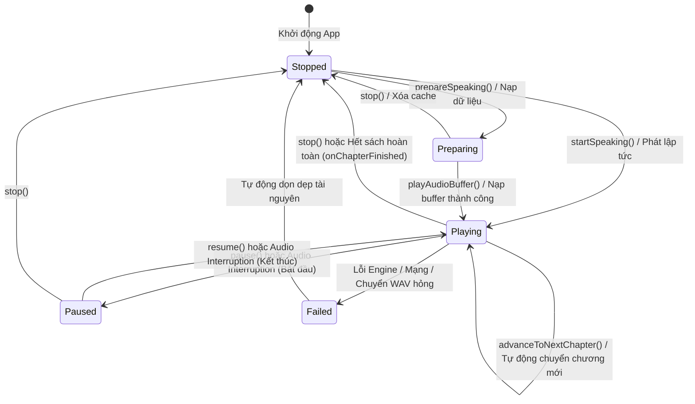
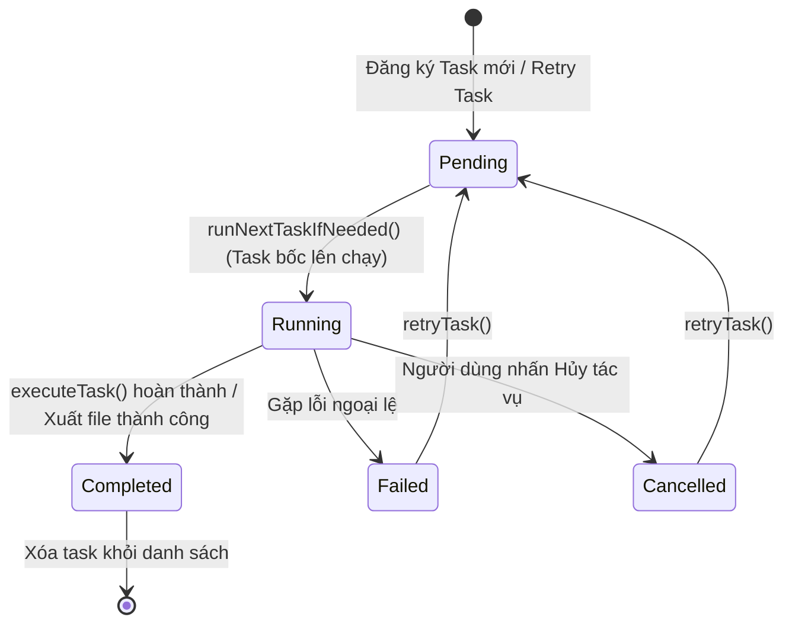
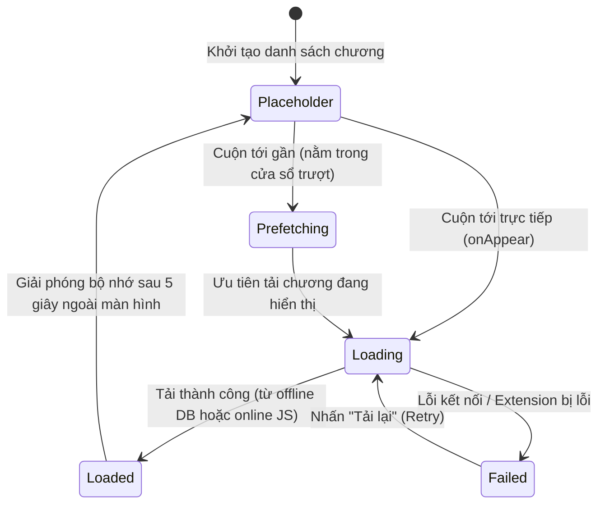

# Máy Trạng thái (State Graph)

Tài liệu này phân tích chi tiết các máy trạng thái (State Machine) đang vận hành trong dự án FreeBook.

## Ghi chú thủ công (Human Notes)
*Ghi chú thủ công của con người.*

<!-- GENERATED START -->
## 1. Máy Trạng thái Phát Giọng đọc (TTS Playback State Machine)

Máy trạng thái này điều khiển việc phát âm thanh trong `TTSManager.swift`, đồng bộ hóa với Floating Widget (`FloatingWidgetViewModel` và `WidgetState`).

### 1.1. Sơ đồ Máy Trạng thái TTS

### 1.2. Triggers & Transitions (Chuyển đổi trạng thái)
*   **`Stopped` -> `Preparing`**: Được kích hoạt khi gọi `prepareSpeaking(...)`. Trình phát nạp danh sách chương, phân đoạn văn bản sạch, định vị trang hiện tại nhưng không phát ra tiếng.
*   **`Stopped` / `Preparing` -> `Playing`**: Kích hoạt qua `startSpeaking(...)`. Cấu hình `AVAudioSession`, khởi động `AVAudioEngine`, bắt đầu phát ra âm thanh và cập nhật Now Playing.
*   **`Playing` -> `Paused`**: Kích hoạt qua `pause()` hoặc khi nhận thông báo ngắt `AVAudioSession.interruptionNotification`. Tạm dừng phát của playerNode nhưng giữ trạng thái session.
*   **`Paused` -> `Playing`**: Kích hoạt qua `resume()` hoặc khi cuộc gọi kết thúc (interruption ended). Nếu tạm dừng quá 5 giây (hoặc mất buffer) thì nạp và phát lại đoạn âm thanh hiện tại từ đầu để tránh mất tiếng do OS giải phóng buffer, ngược lại tiếp tục phát mượt mà từ vị trí cũ.
*   **`Playing` -> `Playing`**: Kích hoạt qua `advanceToNextChapter(nextIdx:)` khi phát hết chương và chaptersQueue còn chương tiếp theo. TTSManager tự nạp RAM/DB cache hoặc fetch online và tiếp tục phát không gián đoạn.
*   **`Playing` / `Paused` -> `Stopped`**: Kích hoạt qua `stop()`. Gọi `playerNode.stop()`, hủy tất cả các task prefetch WAV, làm rỗng RAM cache `preloadedWavs` và set `isPlaying = false`.
*   **`Playing` -> `Stopped`**: Khi phát hết chương cuối cùng của sách, chuyển về trạng thái `Stopped` và gọi `onChapterFinished?()`.

### 1.3. Invalid Transitions (Chuyển đổi không hợp lệ)
*   `Stopped` -> `pause()` / `resume()`: Không thể tạm dừng hoặc tiếp tục phát khi chưa có sách nào được chuẩn bị.
*   `Paused` -> `prepareSpeaking()`: Không được phép nạp chương mới khi đang trong trạng thái tạm dừng phát chương cũ (phải gọi `stopCurrentPlayback` trước).

---

## 2. Máy Trạng thái Tác vụ Tải xuống (Download Task State Machine)

Định nghĩa qua enum `TaskStatus` trong `DownloadManager.swift`, quản lý vòng đời của các tác vụ chạy nền tải truyện offline hoặc xuất tệp TXT.

### 2.1. Sơ đồ Máy Trạng thái Tác vụ

### 2.2. Triggers & Transitions (Chuyển đổi trạng thái)
*   **`[*] -> Pending`**: Người dùng bấm tải sách hoặc xuất TXT. Task được lưu xuống DB dưới dạng `pending`.
*   **`Pending -> Running`**: Hàng đợi chạy tác vụ kiểm tra nếu không có task nào đang chạy, sẽ chọn task `pending` đầu tiên, chuyển trạng thái sang `running` và kích hoạt `Task.detached` để chạy nền.
*   **`Running -> Completed`**: Tải xong tất cả các chương được chỉ định, lưu cache thành công, chuyển trạng thái sang `completed`.
*   **`Running -> Failed`**: Phát sinh lỗi trong quá trình chạy. Ghi nhận `errorMessage` và đánh dấu `failed`.
*   **`Running -> Cancelled`**: Người dùng nhấn nút hủy trên giao diện `DownloadTrackerView`. Tiến trình nền phát hiện cờ hủy, dừng vòng lặp tải và đánh dấu `cancelled`.
*   **`Failed / Cancelled -> Pending`**: Gọi `retryTask(taskId:)`, reset số lượng chương đã tải về 0 và đưa trở lại trạng thái `pending` để chạy lại.

### 2.3. Invalid Transitions (Chuyển đổi không hợp lệ)
*   `Completed` -> `Running` / `Failed`: Tác vụ đã hoàn thành là trạng thái cuối cùng, không thể chuyển sang chạy lại hoặc báo lỗi.
*   `Pending` -> `Completed` / `Cancelled`: Không thể hoàn thành hoặc hủy một tác vụ chưa từng bắt đầu chạy.

---

## 3. Máy Trạng thái Nạp Chương Trình đọc (Book/Chapter Loading State Machine)

Quản lý luồng tải nội dung chương truyện để hiển thị trên trình đọc cuộn dọc liên tục (`ReaderViewModel.swift` và `ChapterCache`).

### 3.1. Sơ đồ Máy Trạng thái Nạp Chương

### 3.2. Triggers & Transitions (Chuyển đổi trạng thái)
*   **`Placeholder -> Prefetching`**: Khi chương nằm trong cửa sổ trượt xung quanh chương hiện tại, hệ thống đưa vào hàng đợi tải trước.
*   **`Placeholder / Prefetching -> Loading`**: Khi chương thực sự xuất hiện trên màn hình qua `.onAppear`, hệ thống lập tức nâng mức ưu tiên để tải ngay nội dung.
*   **`Loading -> Loaded`**: Đọc thành công dữ liệu từ DB (truyện offline) hoặc chạy JS bóc tách thành công (truyện online). Nội dung chương được bóc thành các `ParagraphItem` và render lên màn hình.
*   **`Loading -> Failed`**: Tải thất bại do lỗi mạng hoặc extension. Hiển thị thông báo lỗi cục bộ trên container chương kèm nút "Tải lại".
*   **`Loaded -> Placeholder`**: Khi người dùng cuộn đi qua chương đó và chương nằm ngoài vùng hiển thị quá 5 giây, `ChapterCache` sẽ giải phóng nội dung chữ để tiết kiệm RAM, chuyển trạng thái về `placeholder`.
<!-- GENERATED END -->
