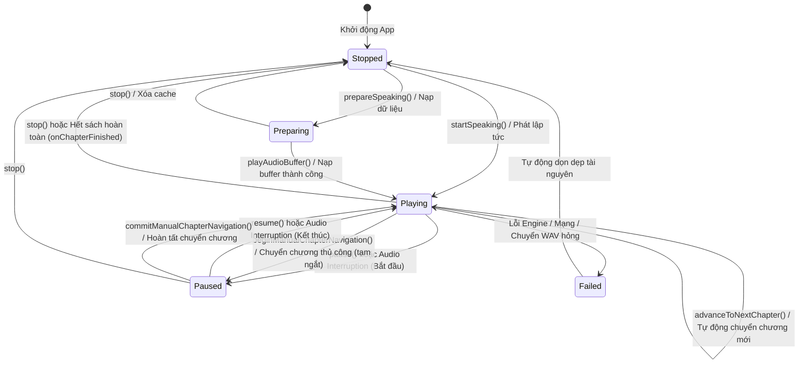
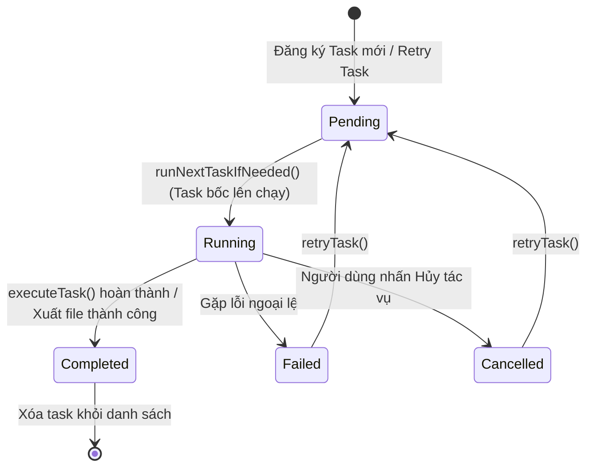
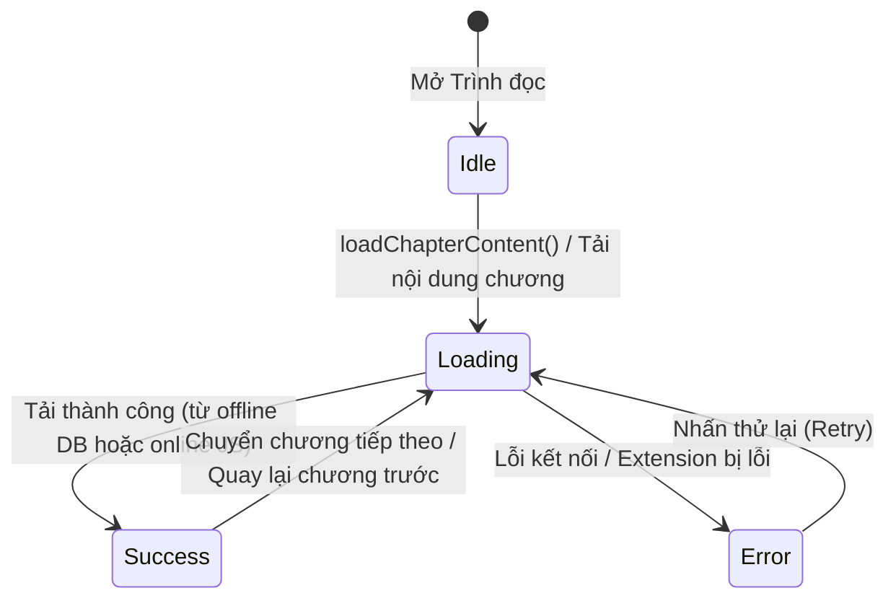

# Máy Trạng thái (State Graph)

Tài liệu này phân tích chi tiết các máy trạng thái (State Machine) đang vận hành trong dự án FreeBook.

## Ghi chú thủ công (Human Notes)
*Ghi chú thủ công của con người.*

<!-- GENERATED START -->
## Book storage and pagination state transitions (1.3.34)

* **Book Deletion State Machine**: Controlled by `BookStorageManager`, moving from `Idle` -> `Confirmation` -> `Database Committed` (deleted from DB and saved) -> `Asynchronous Sandbox Deletion` (deleting `.bin`/`.jpg` on a background thread). If the background file deletion fails, it transitions to `Retry Queue Enqueue` (stored in `UserDefaults` queue) and undergoes retry attempts at app startup via `drainRetryQueue()` until succeeding or reaching the 3-attempt limit.
* **TOC Page State Machine**: Inside `ReaderChapterListStore`, each page (100 chapters) transitions between `Unloaded (Placeholder)` -> `Loading` -> `Loaded` (cached in `loadedRowStates`). Under the 3-page sliding window constraint, pages outside the active window are evicted and transition back to `Unloaded (Placeholder)`.
* **Cooperative Cancellation**: `DownloadManager` tasks check `Task.isCancelled` and `isTaskCancelled` at each chapter boundary. When cancellation triggers, the task transitions immediately from `Running` to `Cancelled` without executing further downloads or file writes.

## Reader single-chapter navigation state (1.3.13, supersedes 1.3.11)

* Reader commits only `displayedChapterIndex`, but presents `pendingNavigationIndex ?? displayedChapterIndex`. An uncached pending target immediately replaces old content with its title and skeleton rows.
* Manual requests are debounced for 300 ms and replace `queuedNavigation`; one worker executes requests serially. Only the current generation may commit content or expose an error.
* A failure replaces the reading surface with chapter title, exact source message, and retry state. Retry keeps the panel visible and disables duplicate requests.
* Successful manual navigation opens at the top. History and TTS commits may carry a paragraph target.
* Opening starts from history. TTS changes visual position only on a later paragraph event and never persists temporary visual sync as reading history.
* Speculative loading is limited to N+1 after 750 ms idle and is disabled while TTS owns the same book.
* Horizontal drag is not a state transition. Manual chapter changes come from footer buttons or the chapter list.

* The floating TTS widget has a compact expanded capsule (252x56) whose left/right resting centers place its bounds directly on the selected screen edge; the peeking state keeps only a 52-point half-disc visible.

## 1. Máy Trạng thái Phát Giọng đọc (TTS Playback State Machine)

Máy trạng thái này điều khiển việc phát âm thanh trong `TTSManager.swift`, đồng bộ hóa với Floating Widget (`FloatingWidgetViewModel` và `WidgetState`).

### 1.1. Sơ đồ Máy Trạng thái TTS

### 1.2. Triggers & Transitions (Chuyển đổi trạng thái)
*   **`Stopped` -> `Preparing`**: Được kích hoạt khi gọi `prepareSpeaking(...)`. Trình phát nạp danh sách chương, phân đoạn văn bản sạch, định vị trang hiện tại nhưng không phát ra tiếng.
*   **`Stopped` / `Preparing` -> `Playing`**: Kích hoạt qua `startSpeaking(...)`. Cấu hình `AVAudioSession`, khởi động `AVAudioEngine`, bắt đầu phát ra âm thanh và cập nhật Now Playing.
*   **`Playing` -> `Paused`**: Kích hoạt qua `pause()` hoặc khi nhận thông báo ngắt `AVAudioSession.interruptionNotification`. Tạm dừng phát của playerNode nhưng giữ trạng thái session.
*   **`Playing` -> `Paused` (Chuyển chương thủ công)**: Kích hoạt qua `beginManualChapterNavigation(targetIndex:)` khi người dùng chuyển chương thủ công trong lúc TTS đang phát. Hệ thống tạm dừng phát âm thanh trên `playerNode` hiện tại nhưng giữ nguyên kết nối `AVAudioEngine` và trạng thái `AVAudioSession`, tăng thế hệ `ttsProcessingGeneration` để hủy bỏ các tiến trình xử lý cũ.
*   **`Paused` -> `Playing` (Hoàn tất chuyển chương thủ công)**: Kích hoạt qua `commitManualChapterNavigation(targetIndex:chapterContent:)`. Tải nội dung chương mới nhất được gộp từ các thao tác bấm liên tiếp, thực hiện phân đoạn trên luồng nền thông qua `TTSBackgroundProcessor` và bắt đầu phát từ câu đầu tiên.
*   **`Paused` -> `Paused` (Hủy/Lỗi chuyển chương thủ công)**: Kích hoạt qua `abortManualChapterNavigation()`. Reset trạng thái chuyển chương thủ công về `nil`, đưa hệ thống về trạng thái tạm dừng an toàn để người dùng có thể thử lại.
*   **`Paused` -> `Playing`**: Kích hoạt qua `resume()` hoặc khi cuộc gọi kết thúc (interruption ended). Nếu tạm dừng quá 5 giây (hoặc mất buffer) thì nạp và phát lại đoạn âm thanh hiện tại từ đầu để tránh mất tiếng do OS giải phóng buffer, ngược lại tiếp tục phát mượt mà từ vị trí cũ.
*   **`Playing` -> `Playing`**: Kích hoạt qua `advanceToNextChapter(nextIdx:)` khi phát hết chương và chaptersQueue còn chương tiếp theo. TTSManager tự nạp RAM/DB cache hoặc fetch online và tiếp tục phát không gián đoạn.
*   **`Playing` / `Paused` -> `Stopped`**: Kích hoạt qua `stop()`. Gọi `playerNode.stop()`, hủy tất cả các task prefetch WAV, làm rỗng RAM cache `preloadedWavs` và set `isPlaying = false`.
*   **`Playing` -> `Stopped`**: Khi phát hết chương cuối cùng của sách, chuyển về trạng thái `Stopped` và gọi `onChapterFinished?()`.

### 1.3. Invalid Transitions (Chuyển đổi không hợp lệ)
*   `Stopped` -> `pause()` / `resume()`: Không thể tạm dừng hoặc tiếp tục phát khi chưa có sách nào được chuẩn bị.
*   `Paused` -> `prepareSpeaking()`: Không được phép nạp chương mới khi đang trong trạng thái tạm dừng phát chương cũ (phải gọi `stopCurrentPlayback` trước).
*   `Paused` (trong thời gian chuyển chương thủ công) -> `resume()`: Cuộc gọi `resume()` bị bỏ qua (no-op) nếu `isManualNavigating == true` để ngăn cản phát lại chương cũ.

---

## 2. Máy Trạng thái Tác vụ Tải xuống (Download Task State Machine)

Định nghĩa qua enum `TaskStatus` trong `DownloadManager.swift`, quản lý vòng đời của các tác vụ chạy nền tải truyện offline hoặc xuất tệp TXT.

### 2.1. Sơ đồ Máy Trạng thái Tác vụ

### 2.2. Triggers & Transitions (Chuyển đổi trạng thái)
*   **`[*] -> Pending`**: Người dùng bấm tải sách hoặc xuất TXT. Task được lưu xuống DB dưới dạng `pending`.
*   **`Pending -> Running`**: Hàng đợi chạy tác vụ kiểm tra nếu không có task nào đang chạy, sẽ chọn task `pending` đầu tiên, chuyển trạng thái sang `running` và kích hoạt `Task.detached` để chạy nền.
*   **`Running -> Completed`**: Tải xong tất cả các chương được chỉ định, lưu cache thành công, chuyển trạng thái sang `completed`.
*   **`Running -> Failed`**: Phát sinh lỗi trong quá trình chạy. Ghi nhận `errorMessage` và đánh dấu `failed`.
*   **`Running -> Cancelled`**: Người dùng nhấn nút hủy trên giao diện `DownloadTrackerView`. Tiến trình nền phát hiện cờ hủy, dừng vòng lặp tải và đánh dấu `cancelled`.
*   **`Failed / Cancelled -> Pending`**: Gọi `retryTask(taskId:)`, reset số lượng chương đã tải về 0 và đưa trở lại trạng thái `pending` để chạy lại.

### 2.3. Invalid Transitions (Chuyển đổi không hợp lệ)
*   `Completed` -> `Running` / `Failed`: Tác vụ đã hoàn thành là trạng thái cuối cùng, không thể chuyển sang chạy lại hoặc báo lỗi.
*   `Pending` -> `Completed` / `Cancelled`: Không thể hoàn thành hoặc hủy một tác vụ chưa từng bắt đầu chạy.

---

## 3. Máy Trạng thái Nạp Chương Trình đọc (Book/Chapter Loading State Machine)

Quản lý luồng tải nội dung chương truyện để hiển thị trên trình đọc (`ReaderViewModel.swift`).

### 3.1. Sơ đồ Máy Trạng thái Nạp Chương

### 3.2. Triggers & Transitions (Chuyển đổi trạng thái)
*   **`Idle -> Loading`**: Mở chương truyện lần đầu tiên hoặc chuyển chương. Kích hoạt cờ loading của chương đó.
*   **`Loading -> Success`**: Đọc thành công dữ liệu từ DB (truyện offline) hoặc chạy JS bóc tách thành công (truyện online). Nội dung chương được hiển thị lên màn hình.
*   **`Loading -> Error`**: Tải thất bại. Hiển thị view thông báo lỗi kèm nút "Thử lại".

#### Reader/TTS unified pipeline (2026-07)

- `ChapterTextNormalizer` is the single source for LF newlines, trimmed non-empty lines, compact paragraph IDs, and UTF-16 ranges. `ChapterContentRepository` produces one normalized `ChapterDocument` for both Reader and TTS.
- Reader uses `ReaderLoadState` with bootstrap retry/clamping, typed failures, generation checks, cache-first rendering, and a short opacity crossfade only for newly fetched content. `ReaderRoute.chapterIndex` preserves the selected TOC index through navigation.
- `TTSParagraphBuilder` chunks normalized lines without renumbering parent paragraph IDs; replacement output is checked before synthesis. TTS asynchronous work is guarded by session identity and TTS owns progress while playing.
- `ReadingProgressStore` coalesces RAM snapshots in an actor and flushes from background contexts on checkpoints, dismissal, and app backgrounding. Legacy window/tab Reader, duplicate progress repository, and `TTSSession` mirror are removed.
- TTS widget state is `revealed` or `peeking`: drag cancels auto-hide, snapping near an edge enters peeking, and an idle revealed widget collapses without changing playback state or persisted placement.
- Reader bootstrap no longer waits for a chapter-list presentation to discover local/late online chapter counts; snapshot availability transitions directly into the existing loading/ready state.
- Shared chapter entries transition from missing to memory-backed immediately after fetch while persistence runs pending/retry in `ChapterPersistenceStore`; reload is the only path that bypasses local tiers.
- Reader/TTS synchronization is enabled only when book IDs match. Opening another Reader leaves both playing and paused TTS sessions unchanged until an explicit start replaces the session.
- Repository deletion UI transitions idle -> confirmation -> deleted/blocked; no row swipe or enable/disable state participates in the page gesture.
- Book deletion transitions from idle -> confirmation -> SQLite database deleted and committed -> background physical file deletion. Physical file deletion failures transition to the `UserDefaults` retry queue and undergo retry attempts at app startup via `drainRetryQueue()`.
- Download and export tasks support cooperative cancellation, transitioning immediately from `Running` to `Cancelled` when `Task.isCancelled` is detected at chapter boundaries.
- TOC pages transition between `Unloaded` -> `Loading` -> `Loaded` within `ReaderChapterListStore`'s active sliding window, while pages outside the active window are evicted and transition back to `Unloaded`.

<!-- GENERATED END -->
