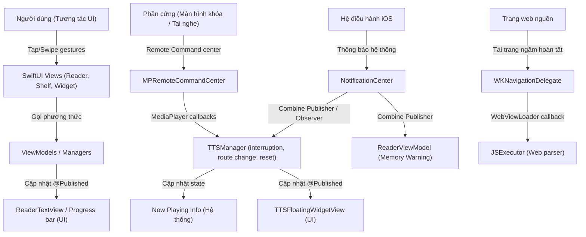

# Bản đồ Sự kiện & Cơ chế Giao tiếp (Event Graph)

Tài liệu này liệt kê các loại sự kiện, luồng truyền tải sự kiện (UI Gestures, Notifications, Combine, AsyncStream, Delegates, MediaPlayer Remote Commands, Timers, Tasks) trong hệ thống FreeBook.

## Ghi chú thủ công (Human Notes)
*Ghi chú thủ công của con người.*

<!-- GENERATED START -->
## 1. Bản đồ các Luồng Sự kiện chính (Event Flow Map)

---

## 2. Chi tiết các Luồng Sự kiện

### 2.1. Sự kiện Tương tác Giao diện (UI Gestures)
*   **Tap "Đọc truyện"** (`BookDetailView.swift`): Kích hoạt chuyển cảnh sang `ReaderView`, khởi tạo `ReaderViewModel` và nạp chương.
*   **Tap nút "TTS Play"** (`ReaderView` / `TTSFloatingWidgetView`): Kích hoạt `TTSManager.shared.startSpeaking(...)`.
*   **Swipe/Scroll vuốt dọc** (`ReaderView`): Kích hoạt sự kiện thay đổi dòng hiển thị, gửi index đoạn văn hiện tại đến `ReaderViewModel.updateProgress(...)`.
*   **Thay đổi thông số TTS** (`TTSSettingsView` / `NghiTTSSettingsView`): Thay đổi `tool`, `speed`, `pitch`, `selectedVoice`. Sự kiện `didSet` của các thuộc tính này kích hoạt cập nhật thông số trực tiếp lên `AVAudioUnitTimePitch` và Now Playing Info.

### 2.2. Thông báo Hệ thống (Notification Center)
*   **`AVAudioSession.interruptionNotification`**:
    *   *Mục đích*: Nhận biết khi có cuộc gọi đến, Siri kích hoạt, hoặc âm thanh bị ngắt bởi app khác.
    *   *Xử lý (`TTSManager.swift`)*: 
        *   Nếu ngắt bắt đầu (`.began`): Tạm dừng phát TTS (`pause()`), ghi nhận cờ `wasPlayingBeforeInterruption = true`.
        *   Nếu ngắt kết thúc (`.ended`): Kiểm tra cờ hồi phục (`.shouldResume`). Nếu có, tự động gọi `resume()` phát tiếp âm thanh.
*   **`AVAudioSession.routeChangeNotification`**:
    *   *Mục đích*: Nhận biết khi tai nghe (Bluetooth/dây) bị rút ra hoặc ngắt kết nối.
    *   *Xử lý (`TTSManager.swift`)*: Kiểm tra nếu lý do ngắt kết nối là rút tai nghe (`.oldDeviceUnavailable`), tự động gọi `pause()` để ngăn việc phát âm thanh ra loa ngoài điện thoại.
*   **`AVAudioSession.mediaServicesWereResetNotification`**:
    *   *Mục đích*: Nhận biết khi dịch vụ âm thanh lõi của iOS bị crash hoặc reset.
    *   *Xử lý (`TTSManager.swift`)*: Giải phóng AudioEngine cũ, khởi tạo lại toàn bộ node graph âm thanh (`setupAudioEngine`) và kích hoạt lại session.
*   **`UIApplication.didReceiveMemoryWarningNotification`**:
    *   *Mục đích*: Hệ điều hành cảnh báo ứng dụng sắp hết bộ nhớ RAM.
    *   *Xử lý (`ReaderViewModel` / `TranslationManager`)*: 
        *   `ReaderViewModel` giải phóng bộ đệm chương truyện `cache.clear()`.
        *   `TranslationManager` giải phóng cache từ điển của sách `clearBookDictCache()`.
*   **`ttsDidAdvanceToNextChapter`**:
    *   *Mục đích*: Nhận biết khi `TTSManager` tự chuyển sang chương tiếp theo độc lập.
    *   *Xử lý (`ReaderView.swift`)*: Nhận thông báo chứa `bookId` và `chapterIndex` để thực hiện đồng bộ giao diện hiển thị (chuyển tab, cuộn) mà không trigger lệnh phát TTS lặp lại.

### 2.3. Sự kiện Combine (Publishers)
*   **`@Published` Properties**:
    *   `TTSManager` phát các thay đổi về trạng thái `isPlaying`, `currentParagraphIndex`, `downloadingVoices` sang giao diện `TTSFloatingWidgetView` và `TTSPlayStateReader`.
    *   `DownloadManager` phát các thay đổi về tiến trình `tasks` lên giao diện `DownloadTrackerView`.
*   **`memoryWarningSubscription`**:
    *   *Định nghĩa*: Đăng ký lắng nghe thông báo bộ nhớ bằng Combine publisher trong `ReaderViewModel.setupSubscriptions()`.
    *   *Giải phóng*: Được hủy tự động qua deinit khi ViewModel bị hủy.

### 2.4. Sự kiện Hệ thống Remote (Remote Command Center)
Đăng ký trong `TTSManager.setupRemoteCommandCenter()` qua thư viện `MediaPlayer`:
*   `playCommand` / `resumeCommand` -> Kích hoạt `TTSManager.resume()`.
*   `pauseCommand` -> Kích hoạt `TTSManager.pause()`.
*   `togglePlayPauseCommand` -> Đảo ngược trạng thái phát.
*   `nextTrackCommand` -> Gọi `TTSManager.skipForward()` (tự chuyển chương qua `advanceToNextChapter` nếu hết đoạn cuối chương).
*   `previousTrackCommand` -> Gọi `TTSManager.skipBackward()` (tua lùi đoạn).
*   `skipForwardCommand` -> Tua tiến đoạn văn (`skipForward()`).
*   `skipBackwardCommand` -> Tua lùi đoạn văn (`skipBackward()`).

### 2.5. Sự kiện Trình duyệt Ngầm (WKNavigationDelegate)
*   **`didFinish navigation`**:
    *   *Định nghĩa*: Tọa lạc tại `WebViewLoader` trong `JSExecutor.swift`.
    *   *Luồng đi*: Khi `WKWebView` tải xong mã HTML của trang web động cào về -> delegate bắt sự kiện hoàn tất -> trích xuất nội dung HTML -> kích hoạt callback chuyển tiếp chuỗi HTML về JS Engine thông qua Semaphore giải tỏa luồng chặn (`semaphore.signal()`).
<!-- GENERATED END -->
