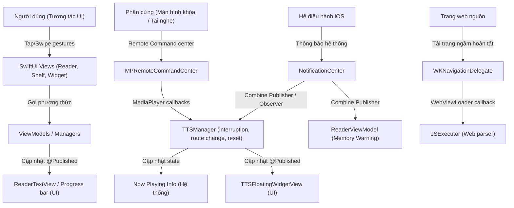

# Bản đồ Sự kiện & Cơ chế Giao tiếp (Event Graph)

Tài liệu này liệt kê các loại sự kiện, luồng truyền tải sự kiện (UI Gestures, Notifications, Combine, AsyncStream, Delegates, MediaPlayer Remote Commands, Timers, Tasks) trong hệ thống FreeBook.

## Ghi chú thủ công (Human Notes)
*Ghi chú thủ công của con người.*

<!-- GENERATED START -->
## Book storage and deletion events (1.3.34)

* **Deletion Events**: Tapping delete/remove in `ShelfView` or `BookDetailView` triggers database deletion (`BookStorageManager`) and side-effect cancellation (stops playback via `TTSManager.stop` and cancels downloads via `DownloadManager.cancelTasksForBook`).
* **Background Cleanup Events**: A successful DB commit dispatches asynchronous file deletions via a background `Task`. If deletion fails, a failure event enqueues the file path in `UserDefaults` (`failed_file_deletions_queue`).
* **Startup Retry Event**: At app startup, `drainRetryQueue()` is called to process the failed deletion queue, trying up to 3 times before discarding the item.
* **TOC Paging Events**: Scrolling a placeholder list item into view triggers a `loadPageIfNeeded` event in `ReaderChapterListStore` which asynchronously fetches chapter metadata.
* **Cancellation Event**: Task cancellation during download/export propagates cooperative cancellation checks at chapter boundaries, raising a cancellation event that aborts subsequent chapters.

## Reader translation-selection events (1.3.14)

* Invoking “📖 Dịch” sends the current `UITextView.selectedRange` in UTF-16, not selected text plus derived sentence offsets.
* `ParagraphCardView` adds the paragraph id, and `ReaderView` resolves the item inside the matching chapter before opening the existing definition sheet.
* Translation toggle, dictionary edits, and chapter-title visibility rebuild paragraph items and their mappings from original chapter data.

## Reader event updates (1.3.13, supersedes 1.3.11)

* Footer buttons emit relative steps and chapter-list rows emit absolute targets. Horizontal drags no longer emit chapter-navigation events.
* Text selection remains local to `ReaderTextView` until the user invokes lookup/copy/speak actions; selection-activity plumbing used only by the removed swipe gesture is gone.
* A TTS paragraph event requests `.ttsSync` without persistence. A manual jump does not seek TTS; the next TTS paragraph may move the display back when auto-scroll is enabled.
* Reader disappearance cancels navigation debounce, navigation worker, DB debounce, and Reader prefetch while leaving independent TTS playback alive.
* Menu commands use shared handlers: title visibility rebuilds paragraph items from RAM, and reload force-fetches the displayed chapter.
* A downward drag of at least 72 points on the chapter-list header closes the overlay; vertical gestures inside the list continue scrolling.

## 1. Bản đồ các Luồng Sự kiện chính (Event Flow Map)

---

## 2. Chi tiết các Luồng Sự kiện

### 2.1. Sự kiện Tương tác Giao diện (UI Gestures)
*   **Tap "Đọc truyện"** (`BookDetailView.swift`): Kích hoạt chuyển cảnh sang `ReaderView`, khởi tạo `ReaderViewModel` và nạp chương.
*   **Tap nút "TTS Play"** (`ReaderView` / `TTSFloatingWidgetView`): Kích hoạt `TTSManager.shared.startSpeaking(...)`.
*   **Swipe/Scroll vuốt dọc** (`ReaderView`): Kích hoạt sự kiện thay đổi dòng hiển thị, gửi index đoạn văn hiện tại đến `ReaderViewModel.updateProgress(...)`.
*   **Thay đổi thông số TTS** (`TTSSettingsView` / `NghiTTSSettingsView`): Thay đổi `tool`, `speed`, `pitch`, `selectedVoice`. Sự kiện `didSet` của các thuộc tính này kích hoạt cập nhật thông số trực tiếp lên `AVAudioUnitTimePitch` và Now Playing Info.

### 2.2. Thông báo Hệ thống (Notification Center)
*   **`AVAudioSession.interruptionNotification`**:
    *   *Mục đích*: Nhận biết khi có cuộc gọi đến, Siri kích hoạt, hoặc âm thanh bị ngắt bởi app khác.
    *   *Xử lý (`TTSManager.swift`)*: 
        *   Nếu ngắt bắt đầu (`.began`): Tạm dừng phát TTS (`pause()`), ghi nhận cờ `wasPlayingBeforeInterruption = true`.
        *   Nếu ngắt kết thúc (`.ended`): Kiểm tra cờ hồi phục (`.shouldResume`). Nếu có, tự động gọi `resume()` phát tiếp âm thanh.
*   **`AVAudioSession.routeChangeNotification`**:
    *   *Mục đích*: Nhận biết khi tai nghe (Bluetooth/dây) bị rút ra hoặc ngắt kết nối.
    *   *Xử lý (`TTSManager.swift`)*: Kiểm tra nếu lý do ngắt kết nối là rút tai nghe (`.oldDeviceUnavailable`), tự động gọi `pause()` để ngăn việc phát âm thanh ra loa ngoài điện thoại.
*   **`AVAudioSession.mediaServicesWereResetNotification`**:
    *   *Mục đích*: Nhận biết khi dịch vụ âm thanh lõi của iOS bị crash hoặc reset.
    *   *Xử lý (`TTSManager.swift`)*: Giải phóng AudioEngine cũ, khởi tạo lại toàn bộ node graph âm thanh (`setupAudioEngine`) và kích hoạt lại session.
*   **`UIApplication.didReceiveMemoryWarningNotification`**:
    *   *Mục đích*: Hệ điều hành cảnh báo ứng dụng sắp hết bộ nhớ RAM.
    *   *Xử lý (`ReaderViewModel` / `TranslationManager`)*: 
        *   `ReaderViewModel` giải phóng bộ đệm chương truyện `cache.clear()`.
        *   `TranslationManager` giải phóng cache từ điển của sách `clearBookDictCache()`.
*   **`ttsDidAdvanceToNextChapter`**:
    *   *Mục đích*: Nhận biết khi `TTSManager` tự chuyển sang chương tiếp theo độc lập.
    *   *Xử lý (`ReaderView.swift`)*: Nhận thông báo chứa `bookId` và `chapterIndex` để thực hiện đồng bộ giao diện hiển thị (chuyển tab, cuộn) mà không trigger lệnh phát TTS lặp lại.
*   **Điều hướng Reader độc lập với TTS**:
    *   Next/Previous/Chapter List chỉ tạo request và commit trong `ReaderViewModel`; không phát sự kiện chuyển chương sang `TTSManager`.
    *   `prepareSpeaking(...)` chỉ prewarm cache chương Reader và không thay đổi chương TTS đang phát hoặc đang pause.

### 2.3. Sự kiện Combine (Publishers)
*   **`@Published` Properties**:
    *   `TTSManager` phát các thay đổi về trạng thái `isPlaying`, `currentParagraphIndex`, `downloadingVoices` sang giao diện `TTSFloatingWidgetView` và `TTSPlayStateReader`.
    *   `DownloadManager` phát các thay đổi về tiến trình `tasks` lên giao diện `DownloadTrackerView`.
*   **`memoryWarningSubscription`**:
    *   *Định nghĩa*: Đăng ký lắng nghe thông báo bộ nhớ bằng Combine publisher trong `ReaderViewModel.setupSubscriptions()`.
    *   *Giải phóng*: Được hủy tự động qua deinit khi ViewModel bị hủy.

### 2.4. Sự kiện Hệ thống Remote (Remote Command Center)
Đăng ký trong `TTSManager.setupRemoteCommandCenter()` qua thư viện `MediaPlayer`:
*   `playCommand` / `resumeCommand` -> Cập nhật đồng bộ `playbackState = .playing` và kích hoạt `TTSManager.resume()`.
*   `pauseCommand` -> Cập nhật đồng bộ `playbackState = .paused` và kích hoạt `TTSManager.pause()`.
*   `togglePlayPauseCommand` -> Đã được vô hiệu hóa để tránh xung đột sự kiện trùng lặp từ iOS (OS sẽ tự động chuyển đổi các nhấn nút trên tai nghe thành `playCommand` hoặc `pauseCommand` dựa vào `playbackState`).
*   `nextTrackCommand` -> Gọi `TTSManager.skipForward()` (tự chuyển chương qua `advanceToNextChapter` nếu hết đoạn cuối chương).
*   `previousTrackCommand` -> Gọi `TTSManager.skipBackward()` (tua lùi đoạn).
*   `skipForwardCommand` -> Tua tiến đoạn văn (`skipForward()`).
*   `skipBackwardCommand` -> Tua lùi đoạn văn (`skipBackward()`).

### 2.5. Sự kiện Trình duyệt Ngầm (WKNavigationDelegate)
*   **`didFinish navigation`**:
    *   *Định nghĩa*: Tọa lạc tại `WebViewLoader` trong `JSExecutor.swift`.
    *   *Luồng đi*: Khi `WKWebView` tải xong mã HTML của trang web động cào về -> delegate bắt sự kiện hoàn tất -> trích xuất nội dung HTML -> kích hoạt callback chuyển tiếp chuỗi HTML về JS Engine thông qua Semaphore giải tỏa luồng chặn (`semaphore.signal()`).

#### Reader/TTS unified pipeline (2026-07)

- `ChapterTextNormalizer` is the single source for LF newlines, trimmed non-empty lines, compact paragraph IDs, and UTF-16 ranges. `ChapterContentRepository` produces one normalized `ChapterDocument` for both Reader and TTS.
- Reader uses `ReaderLoadState` with bootstrap retry/clamping, typed failures, generation checks, cache-first rendering, and a short opacity crossfade only for newly fetched content. `ReaderRoute.chapterIndex` preserves the selected TOC index through navigation.
- `TTSParagraphBuilder` chunks normalized lines without renumbering parent paragraph IDs; replacement output is checked before synthesis. TTS asynchronous work is guarded by session identity and TTS owns progress while playing.
- `ReadingProgressStore` coalesces RAM snapshots in an actor and flushes from background contexts on checkpoints, dismissal, and app backgrounding. Legacy window/tab Reader, duplicate progress repository, and `TTSSession` mirror are removed.
- Tapping the widget cover emits `openCurrentlyPlayingReader`; Shelf routes to the TTS chapter or sends `navigateReaderToPlayingChapter` to an already visible Reader. Play/pause, next paragraph, close, drag, and auto-hide remain local UI events around `TTSManager`.
- A chapter request first emits memory/SwiftData lookup work; extension completion publishes the document to shared memory before a non-cancellable background upsert. Dismiss/background emits flush rather than cancellation.
- Repository-row trash taps open a confirmation alert; confirmation uninstalls owned local extensions and deletes the repository, while horizontal swipes remain owned by the parent paged tab.
- Book deletion taps on `ShelfView` and `BookDetailView` trigger database deletion, stops active TTS playback (`TTSManager.stop`), and cancels active downloads (`DownloadManager.cancelTasksForBook`) before dispatching background file cleanup.
- Physical file deletion failures raise an event to enqueue the path in the `UserDefaults` retry queue, and app launch triggers `drainRetryQueue()` to process failed items.
- Scrolling placeholder rows in the TOC triggers a `loadPageIfNeeded` event in `ReaderChapterListStore` which launches background tasks to fetch metadata for the visible window.
- Task cancellation in `DownloadManager` emits cooperative cancellation events at chapter boundaries to halt execution.

<!-- GENERATED END -->
