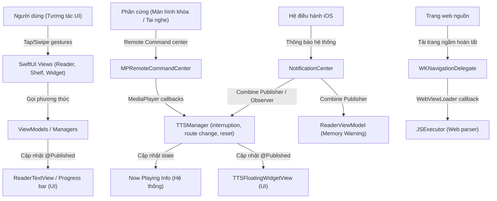

# Bản đồ Sự kiện & Cơ chế Giao tiếp (Event Graph)

Tài liệu này liệt kê các loại sự kiện, luồng truyền tải sự kiện (UI Gestures, Notifications, Combine, AsyncStream, Delegates, MediaPlayer Remote Commands, Timers, Tasks) trong hệ thống FreeBook.

## Ghi chú thủ công (Human Notes)
*Ghi chú thủ công của con người.*

<!-- GENERATED START -->
## NghiTTS deadline and energy events (1.3.115)

* An audio-finish event with no prepared handoff records `[NghiEnergy] Underrun`. If its index matches active refill, playback awaits that task and records `reusedInFlight=true` instead of submitting duplicate ONNX work.
* Thermal `.serious` cancels only nonessential refill and next-chapter audio; update-window preserves or starts N+1. `.critical` cancels all refill while current-demand synthesis remains available.
* Successful coordinator operations contribute queue wait, inference wall time, PCM duration, aggregate/max RTF, on-demand count, and reuse count to an in-memory summary emitted every 60 seconds or on pause/stop.

## Chapter memory/cancellation events (1.3.114)

* `UIApplication.didReceiveMemoryWarningNotification` reaches `MainTabView`, which asynchronously clears only `ChapterContentRepository`'s reusable normalized-document LRU.
* Reader/TTS task cancellation emits a subscriber-removal event for the matching `ChapterKey`. Remaining subscribers preserve the shared operation; removing the final subscriber cancels its repository-owned task and propagates through the extension executor.
* Stop, replacement start, and a newer TTS chapter-advance event cancel the owned fallback auto-advance task. Its `CancellationError` is classified as cancellation rather than a playback failure.

## TTS presentation energy events (1.3.112)

* Paragraph/playback events update the dynamic Lock Screen timeline immediately after static metadata is cached; they do not emit new translation, local-cover decode, or artwork-construction work.
* A book/chapter/cover/translation-key event cancels the previous metadata task and starts at most one replacement. Dictionary updates invalidate the matching cache and republish if the widget session remains active.
* Widget/root/Reader Combine events cross the main RunLoop before snapshots are reread, because `@Published` emits before assignment; equality checks suppress unchanged view invalidations.
* Selecting Nghi schedules delayed warm-up. Selecting any other engine emits cancellation of the pending warm-up task.

## Reader viewport and serious-buffer events (1.3.111)

* A TTS parent event whose paragraph midpoint remains inside the Reader safe viewport increments `scrollSkippedVisible` and emits no `scrollTarget`; an out-of-band target emits one `.ttsAuto` target and records execution when `ScrollViewProxy.scrollTo` runs.
* Paragraph geometry callbacks with less than 8 points of movement are counted but do not rewrite `ParagraphTracker` frame state.
* A remote thermal transition to `.serious` cancels distant/next-chapter work and schedules only N+1. `.critical` cancels the remaining remote prefetch; cooling rebuilds the configured window through the existing update event.

## Reader energy diagnostic events (1.3.110)

* Reader render, highlight, geometry, intrinsic-size, and TTS scroll-target events increment main-actor counters only. The diagnostic path emits no per-event file I/O.
* The next render event after approximately 60 seconds emits one `[ReaderEnergy] Summary`. Thermal-state change, app background, and Reader disappearance flush a partial window so Reader activity can be aligned with `[TTSEnergy]` transitions.

## Reader highlight event optimization (1.3.109)

* A TTS chunk highlight event mutates only text-storage color attributes in the matching `ReaderTextView`; it does not clear cached measurements or trigger intrinsic-size invalidation.
* A TTS parent-paragraph transition continues to update `ReaderView.scrollTarget`. `ReaderView` consumes that target through `ScrollViewReader`, making it the single owner of TTS auto-scroll; the embedded UIKit text view no longer emits a second animated content-offset event.

## Remote TTS energy diagnostic events (1.3.107)

* `UIApplication.didEnterBackgroundNotification` closes the current diagnostic window and switches the coordinator to `background`; `willEnterForegroundNotification` closes it again and switches to `foreground`. Each transition emits one `[TTSEnergy] AppState` line through `AppLogger`.
* `ProcessInfo.thermalStateDidChangeNotification` continues to drive prefetch policy and additionally emits a `[TTSEnergy] ThermalChange` line plus the partial window summary, allowing thermal escalation to be aligned with remote request cadence.
* A completed remote synthesis emits no per-request success log. It only updates actor-owned counters; the next interval boundary, lifecycle transition, thermal transition, or `cancelAll` event flushes one aggregate summary.

## Book storage and deletion events (1.3.34)

* **Deletion Events**: Tapping delete/remove in `ShelfView` or `BookDetailView` triggers database deletion (`BookStorageManager`) and side-effect cancellation (stops playback via `TTSManager.stop` and cancels downloads via `DownloadManager.cancelTasksForBook`).
* **Background Cleanup Events**: A successful DB commit dispatches asynchronous file deletions via a background `Task`. If deletion fails, a failure event enqueues the file path in `UserDefaults` (`failed_file_deletions_queue`).
* **Startup Retry Event**: At app startup, `drainRetryQueue()` is called to process the failed deletion queue, trying up to 3 times before discarding the item.
* **TOC Paging Events**: Scrolling a placeholder list item into view triggers a `loadPageIfNeeded` event in `ReaderChapterListStore` which asynchronously fetches chapter metadata.
* **Cancellation Event**: Task cancellation during download/export propagates cooperative cancellation checks at chapter boundaries, raising a cancellation event that aborts subsequent chapters.

## Reader translation-selection events (1.3.14)

* Invoking “📖 Dịch” sends the current `UITextView.selectedRange` in UTF-16, not selected text plus derived sentence offsets.
* `ParagraphCardView` adds the paragraph id, and `ReaderView` resolves the item inside the matching chapter before opening the existing definition sheet.
* Translation toggle, dictionary edits, and chapter-title visibility rebuild paragraph items and their mappings from original chapter data.

## Reader event updates (1.3.13, supersedes 1.3.11)

* Footer buttons emit relative steps and chapter-list rows emit absolute targets. Horizontal drags no longer emit chapter-navigation events.
* Text selection remains local to `ReaderTextView` until the user invokes lookup/copy/speak actions; selection-activity plumbing used only by the removed swipe gesture is gone.
* A TTS paragraph event requests `.ttsSync` without persistence. A manual jump does not seek TTS; the next TTS paragraph may move the display back when auto-scroll is enabled.
* Reader disappearance cancels navigation debounce, navigation worker, DB debounce, and Reader prefetch while leaving independent TTS playback alive.
* Menu commands use shared handlers: title visibility rebuilds paragraph items from RAM, and reload force-fetches the displayed chapter.
* A downward drag of at least 72 points on the chapter-list header closes the overlay; the sheet no longer follows the finger during slow drags. Tapping the outside backdrop also closes the overlay, while vertical gestures inside the list continue scrolling.
* Starting TTS passes only a short initial queue from Reader. Full chapter-queue refresh is an independent `TTSManager.refreshChaptersQueueInBackground(...)` event and does not depend on Reader staying visible.
* Discovery category paging renders only the selected tab and adjacent tabs with real content; newly selected category loading is debounced briefly so the page-swipe animation is not paired with immediate list loading.

## 1. Bản đồ các Luồng Sự kiện chính (Event Flow Map)

```mermaid
graph TD
    %% Tác nhân bên ngoài
    User["Người dùng (Tương tác UI)"] -->|Tap/Swipe gestures| UIView["SwiftUI Views (Reader, Shelf, Widget)"]
    OS["Hệ điều hành iOS"] -->|Thông báo hệ thống| NotificationCenter["NotificationCenter"]
    Hardware["Phần cứng (Màn hình khóa / Tai nghe)"] -->|Remote Command center| RemoteCommand["MPRemoteCommandCenter"]
    WebNode["Trang web nguồn"] -->|Tải trang ngầm hoàn tất| WebDelegate["WKNavigationDelegate"]
    
    %% Thành phần nhận và xử lý
    UIView -->|Gọi phương thức| ViewModel["ViewModels / Managers"]
    NotificationCenter -->|Combine Publisher / Observer| TTSManager["TTSManager (interruption, route change, reset)"]
    NotificationCenter -->|Combine Publisher| ReaderViewModel["ReaderViewModel (Memory Warning)"]
    RemoteCommand -->|MediaPlayer callbacks| TTSManager
    WebDelegate -->|WebViewLoader callback| JSExecutor["JSExecutor (Web parser)"]
    
    %% Phản hồi và Cập nhật
    TTSManager -->|Cập nhật state| NowPlaying["Now Playing Info (Hệ thống)"]
    TTSManager -->|Cập nhật @Published| WidgetUI["TTSFloatingWidgetView (UI)"]
    ViewModel -->|Cập nhật @Published| ReaderUI["ReaderTextView / Progress bar (UI)"]
```

---

## 2. Chi tiết các Luồng Sự kiện

### 2.1. Sự kiện Tương tác Giao diện (UI Gestures)
*   **Tap "Đọc truyện"** (`BookDetailView.swift`): Kích hoạt chuyển cảnh sang `ReaderView`, khởi tạo `ReaderViewModel` và nạp chương.
*   **Tap nút "TTS Play"** (`ReaderView` / `TTSFloatingWidgetView`): Kích hoạt `TTSManager.shared.startSpeaking(...)`.
*   **Swipe/Scroll vuốt dọc** (`ReaderView`): Kích hoạt sự kiện thay đổi dòng hiển thị, gửi index đoạn văn hiện tại đến `ReaderViewModel.updateProgress(...)`.
*   **Thay đổi thông số TTS** (`TTSSettingsView` / `NghiTTSSettingsView`): Thay đổi `tool`, `speed`, `pitch`, `selectedVoice`. Sự kiện `didSet` của các thuộc tính này kích hoạt cập nhật thông số trực tiếp lên `AVAudioUnitTimePitch` và Now Playing Info.

### 2.2. Thông báo Hệ thống (Notification Center)
*   **`AVAudioSession.interruptionNotification`**:
    *   *Mục đích*: Nhận biết khi có cuộc gọi đến, Siri kích hoạt, hoặc âm thanh bị ngắt bởi app khác.
    *   *Xử lý (`TTSManager.swift`)*: 
        *   Nếu ngắt bắt đầu (`.began`): Tạm dừng phát TTS (`pause()`), ghi nhận cờ `wasPlayingBeforeInterruption = true`.
        *   Nếu ngắt kết thúc (`.ended`): Kiểm tra cờ hồi phục (`.shouldResume`). Nếu có, tự động gọi `resume()` phát tiếp âm thanh.
*   **`AVAudioSession.routeChangeNotification`**:
    *   *Mục đích*: Nhận biết khi tai nghe (Bluetooth/dây) bị rút ra hoặc ngắt kết nối.
    *   *Xử lý (`TTSManager.swift`)*: Kiểm tra nếu lý do ngắt kết nối là rút tai nghe (`.oldDeviceUnavailable`), tự động gọi `pause()` để ngăn việc phát âm thanh ra loa ngoài điện thoại.
*   **`AVAudioSession.mediaServicesWereResetNotification`**:
    *   *Mục đích*: Nhận biết khi dịch vụ âm thanh lõi của iOS bị crash hoặc reset.
    *   *Xử lý (`TTSManager.swift`)*: Giải phóng AudioEngine cũ, khởi tạo lại toàn bộ node graph âm thanh (`setupAudioEngine`) và kích hoạt lại session.
*   **`UIApplication.didReceiveMemoryWarningNotification`**:
    *   *Mục đích*: Hệ điều hành cảnh báo ứng dụng sắp hết bộ nhớ RAM.
    *   *Xử lý (`ReaderViewModel` / `TranslationManager`)*: 
        *   `ReaderViewModel` giải phóng bộ đệm chương truyện `cache.clear()`.
        *   `TranslationManager` giải phóng cache từ điển của sách `clearBookDictCache()`.
*   **`translationDictionariesDidUpdate`**:
    *   *Mục đích*: Đồng bộ chương hiện tại và các chương Reader đã preload sau khi người dùng sửa VP/Name.
    *   *Xử lý (`ReaderView` / `ReaderViewModel`)*: Xóa translation cache, hủy refresh cũ, rồi rebuild tuần tự chương đang hiển thị trước và các chương cache theo khoảng cách. Sự kiện không xóa audio prefetch của phiên TTS đang phát; nội dung mới được dùng khi người dùng bấm đọc lại hoặc khi TTS nạp chương kế tiếp từ repository.
*   **`ttsDidAdvanceToNextChapter`**:
    *   *Mục đích*: Nhận biết khi `TTSManager` tự chuyển sang chương tiếp theo độc lập.
    *   *Xử lý (`ReaderView.swift`)*: Nhận thông báo chứa `bookId` và `chapterIndex` để thực hiện đồng bộ giao diện hiển thị (chuyển tab, cuộn) mà không trigger lệnh phát TTS lặp lại.
*   **Điều hướng Reader độc lập với TTS**:
    *   Next/Previous/Chapter List chỉ tạo request và commit trong `ReaderViewModel`; không phát sự kiện chuyển chương sang `TTSManager`.
    *   `prepareSpeaking(...)` chỉ prewarm cache chương Reader và không thay đổi chương TTS đang phát hoặc đang pause.

### 2.3. Sự kiện Combine (Publishers)
*   **`@Published` Properties**:
    *   `TTSManager` phát trạng thái nguồn; `TTSWidgetStateReader`, `TTSRootPresentationReader` và `ReaderTTSStateReader` chỉ chuyển tiếp snapshot cần render sau equality gate. Settings vẫn quan sát đầy đủ cấu hình tải/model.
    *   `DownloadManager` phát các thay đổi về tiến trình `tasks` lên giao diện `DownloadTrackerView`.
*   **`memoryWarningSubscription`**:
    *   *Định nghĩa*: Đăng ký lắng nghe thông báo bộ nhớ bằng Combine publisher trong `ReaderViewModel.setupSubscriptions()`.
    *   *Giải phóng*: Được hủy tự động qua deinit khi ViewModel bị hủy.

### 2.4. Sự kiện Hệ thống Remote (Remote Command Center)
Đăng ký trong `TTSManager.setupRemoteCommandCenter()` và quản lý trạng thái khả dụng trong `syncRemoteCommandState()` qua thư viện `MediaPlayer`:
*   `playCommand` -> Đăng ký target handler trong `setupRemoteCommandCenter()`, bật khả dụng ban đầu trong `setRemoteCommandsEnabled(_:)` và cập nhật theo trạng thái tạm dừng (`isEnabled = paused`, với `paused = active && !isPlaying`) trong `syncRemoteCommandState()` (Phase J) để iOS MediaRemote UI hiển thị đúng biểu tượng Play/Pause trên Lock Screen.
*   `pauseCommand` -> Đăng ký target handler trong `setupRemoteCommandCenter()`, bật khả dụng ban đầu trong `setRemoteCommandsEnabled(_:)` và cập nhật theo trạng thái đang phát (`isEnabled = playing`, với `playing = active && isPlaying`) trong `syncRemoteCommandState()` (Phase J). Nếu nhận được sự kiện remote `.pause` (từ phụ kiện cũ), `handleRemoteTransportCommandOnMain(.pause)` tiếp tục kích hoạt cơ chế tương thích có phạm vi giới hạn (bounded compatibility fallback) gọi `resume()` khi paused.
*   `togglePlayPauseCommand` -> Bật khả dụng khi active (`isEnabled = active`) trong `setRemoteCommandsEnabled(_:)` và `syncRemoteCommandState()` (Phase J), gọi `pause()` nếu đang phát hoặc `resume()` nếu đang tạm dừng. Đồng thời, khi callback đi vào từ Main Thread (`Thread.isMainThread == true`), `dispatchRemoteTransportCommand` được thực thi đồng bộ via `MainActor.assumeIsolated` trước khi trả về `MPRemoteCommandHandlerStatus` phản ánh chính xác kết quả thực tế (Phase F), kết hợp xuất bản hợp đồng metadata timeline hữu hạn (Phase I) qua `setSystemNowPlayingPlaybackState` (`currentRate: 1.0/0.0`, `defaultRate: speed`, `elapsed`, `duration`, `progress`) và `updateNowPlayingInfo` phản hồi cho MediaRemote.
*   `nextTrackCommand` -> Gọi `TTSManager.skipForward()` (tự chuyển chương qua `advanceToNextChapter` nếu hết đoạn cuối chương).
*   `previousTrackCommand` -> Gọi `TTSManager.skipBackward()` (tua lùi đoạn).
*   `skipForwardCommand` -> Tua tiến đoạn văn (`skipForward()`).
*   `skipBackwardCommand` -> Tua lùi đoạn văn (`skipBackward()`).

### 2.5. Sự kiện Trình duyệt Ngầm (WKNavigationDelegate)
*   **`didFinish navigation`**:
    *   *Định nghĩa*: Tọa lạc tại `WebViewLoader` trong `JSExecutor.swift`.
    *   *Luồng đi*: Khi `WKWebView` tải xong mã HTML của trang web động cào về -> delegate bắt sự kiện hoàn tất -> trích xuất nội dung HTML -> kích hoạt callback chuyển tiếp chuỗi HTML về JS Engine thông qua Semaphore giải tỏa luồng chặn (`semaphore.signal()`).

#### Reader/TTS unified pipeline (2026-07)

- `ChapterTextNormalizer` is the single source for LF newlines, trimmed non-empty lines, compact paragraph IDs, and UTF-16 ranges. `ChapterContentRepository` produces one normalized `ChapterDocument` for both Reader and TTS.
- Reader uses `ReaderLoadState` with bootstrap retry/clamping, typed failures, generation checks, cache-first rendering, and a short opacity crossfade only for newly fetched content. `ReaderRoute.chapterIndex` preserves the selected TOC index through navigation.
- `TTSParagraphBuilder` chunks normalized lines without renumbering parent paragraph IDs; replacement output is checked before synthesis. TTS asynchronous work is guarded by session identity and TTS owns progress while playing.
- `ReadingProgressStore` coalesces RAM snapshots in an actor and flushes from background contexts on checkpoints, dismissal, and app backgrounding. Legacy window/tab Reader, duplicate progress repository, and `TTSSession` mirror are removed.
- Tapping the widget cover emits `openCurrentlyPlayingReader`; Shelf routes to the TTS chapter or sends `navigateReaderToPlayingChapter` to an already visible Reader. Play/pause, next paragraph, close, drag, and auto-hide remain local UI events around `TTSManager`.
- A chapter request first emits bounded-memory/SwiftData lookup work; extension completion publishes the document to shared memory before a non-cancellable background upsert. Reader dismissal cancels only its waiter (and the underlying load only when it was the final subscriber), while dismissal/background still flushes pending writes.
- Repository-row trash taps open a confirmation alert; confirmation uninstalls owned local extensions and deletes the repository, while horizontal swipes remain owned by the parent paged tab.
- Book deletion taps on `ShelfView` and `BookDetailView` trigger database deletion, stops active TTS playback (`TTSManager.stop`), and cancels active downloads (`DownloadManager.cancelTasksForBook`) before dispatching background file cleanup.
- Physical file deletion failures raise an event to enqueue the path in the `UserDefaults` retry queue, and app launch triggers `drainRetryQueue()` to process failed items.
- Scrolling placeholder rows in the TOC triggers a `loadPageIfNeeded` event in `ReaderChapterListStore` which launches background tasks to fetch metadata for the visible window.
- Task cancellation in `DownloadManager` emits cooperative cancellation events at chapter boundaries to halt execution.

- `ProcessInfo.thermalStateDidChangeNotification` updates both Nghi and remote prefetch policy. Remote `.serious` retains only playback-essential N+1 while `.critical` cancels paragraph prefetch; both states cancel next-chapter audio.
- For NghiTTS, the same notification cancels next-chapter audio outside `.nominal`; `.serious` narrows refill to N+1, `.critical` cancels refill, and cooling rebuilds the configured window through `updateNghiPrefetchWindow`.
- Pause/stop events cancel remote playback/prefetch waiters and reset the Ext runtime on full cache teardown; URLSession cancellation unblocks the synchronous extension fetch bridge.
- Paragraph-finished events update the depth-three cache window, but scheduler priority—not task creation count—determines execution order.

<!-- GENERATED END -->
