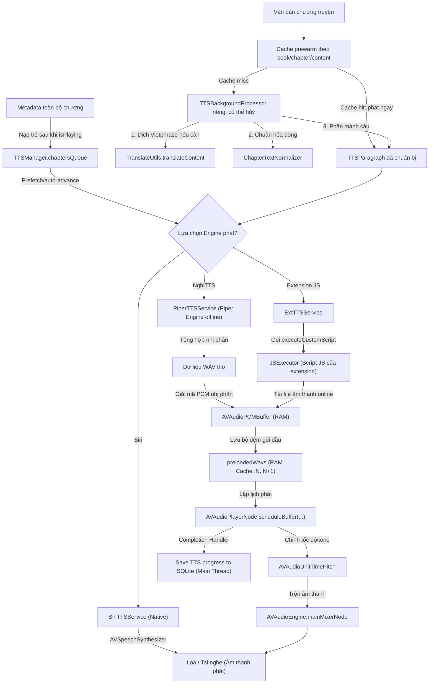

# Dòng chảy Dữ liệu & Cơ chế Cache (Data Flow & Caching)

Tài liệu này theo dõi chi tiết đường đi của dữ liệu qua các tầng kiến trúc (Input -> View -> ViewModel -> Manager -> Repository -> Database) và làm rõ toàn bộ các cơ chế bộ nhớ đệm (Cache) đang vận hành trong dự án FreeBook.

## Ghi chú thủ công (Human Notes)
*Ghi chú thủ công của con người.*

<!-- GENERATED START -->
## Book storage and pagination data flows (1.3.34)

* **Book Deletion Data Flow**: User action (`ShelfView`/`BookDetailView`) -> `BookStorageManager` -> Database deletes (`ModelContext.delete`) -> Database Save committed (`ModelContext.save()`) -> Background Thread -> Physical file deletions (`BookBinManager.deleteBinFile` and `ImageCacheManager.deleteCover`). If deletion fails, data flows into `UserDefaults` (`failed_file_deletions_queue`) and undergoes retry attempts at app startup via `drainRetryQueue()`.
* **TOC Paged Data Flow**: Scroll list item -> `loadPageIfNeeded` -> `loadPagesAround` -> background task -> `fetchPage` -> modelContext fetch within logical boundaries based on `totalCount` and `isAscending` -> updates `loadedRowStates` in RAM.
* **SHA-256 Caching Paths**: Cover images and book `.bin` files use SHA-256 hashes of `bookId` as filename identifiers (`covers/[sha256Hex].jpg` and `books/[sha256Hex].bin`) with automatic path safety validation and secure legacy fallback.

## Reader paragraph data flow (1.3.14)

* `originalContent` is split first; every original line produces exactly one translated result and one stable paragraph id, including blank and trailing lines.
* `translatedContent` is reconstructed only from the translated line array, preventing paragraph loss or line-count drift caused by translating the full chapter before splitting.
* Each translated paragraph carries UTF-16 spans back to `item.original`. Selection uses those spans first and falls back to historical sentence/token pairing only when mapping is absent or incomplete.
* Paragraph mappings live in Reader RAM/cache only; no SwiftData migration or persisted chapter schema changes are required.

## Reader data-flow updates (1.3.13, supersedes 1.3.11)

* The reading surface selects `pendingNavigationIndex ?? displayedChapterIndex`. A pending cache miss renders known chapter metadata and skeleton rows; only a successful generation commits real content and progress.
* Rapid manual input updates only the latest queued target. Stale generations may populate cache but cannot change displayed state.
* `ReaderChapterListStore` is created when Reader opens and remains mounted while hidden. Search, order, scroll position, and row identities survive repeated open/close operations.
* Successful chapter persistence emits one index to `markCached(index:)`; no chapter reload, sorting, or full list mapping occurs for an icon update.
* JavaScript `Response.error(message)` becomes `ExtensionManagerError.sourceResponse` and flows unchanged into `ReaderChapterLoadFailure.sourceMessage`.
* N+1 prefetch starts only after the displayed chapter is loaded and idle for 750 ms; active same-book TTS disables Reader speculation.
* Chapter changes originate from footer buttons, chapter-list selection, history, or TTS sync; horizontal content drags do not enter the ViewModel.
* TTS start data flow is split: Reader sends current chapter plus a few following `TTSChapterInfo` values for immediate playback, then `TTSManager` refreshes the full chapter queue in the background. Local queue refresh uses a background SwiftData `ModelContext`; online queue refresh uses the already available chapter snapshot.
* Shelf row data flow avoids touching `Book.chapters` during render; it displays `Book.currentChapterTitle` or a cheap chapter-number fallback.
* Discovery category tabs outside the selected-neighbor window carry no list data flow until they become adjacent or selected.

## 1. Dòng chảy dữ liệu chính (Core Data Flows)

### 1.1. Luồng tải chương truyện (Reader Chapter Loading Flow)

Luồng đi của dữ liệu khi người dùng chuyển chương truyện:

```mermaid
graph TD
    User["Người dùng chọn chương"] --> View["ReaderView (UI)"]
    View -->|Yêu cầu chương| VM["ReaderViewModel"]
    
    VM -->|1. Kiểm tra RAM Cache| Cache["ChapterCache (RAM)"]
    Cache -->|Có| ReturnVM["Trả nội dung hiển thị"]
    
    Cache -->|Không có| DB["SwiftData (Book/Chapter Models)"]
    DB -->|2. Đã tải offline (isCached)| SaveCache["Lưu vào ChapterCache"]
    
    DB -->|3. Chưa tải offline| ExtManager["ExtensionManager.shared.chap(...)"]
    ExtManager -->|Nạp script bóc tách| JS["JSExecutor (JavaScriptCore)"]
    JS -->|Tải mạng hoặc load web ngầm| Web["Nguồn truyện (HTML)"]
    
    Web -->|Trả về HTML thô| JS
    JS -->|Html.parse / Trích xuất nội dung| ExtResult["JSON kết quả chương"]
    ExtResult -->|Làm sạch mã HTML| Clean["cleanHTML()"]
    
    Clean -->|Tiền xử lý dịch thuật| Translation["TranslateUtils.translateContent(...)"]
    Translation -->|Nạp từ từ điển nhị phân| Trie["TranslationManager (VietPhrase.dat)"]
    
    Trie -->|Nội dung tiếng Việt sạch| SaveDB["Cập nhật Model Chapter & isCached = true"]
    SaveDB -->|modelContext.save()| Disk["Lưu xuống đĩa (SQLite)"]
    SaveDB --> SaveCache
    SaveCache --> ReturnVM
    ReturnVM -->|Phân đoạn hiển thị| ReaderText["ReaderTextView (Giao diện)"]
```

---

### 1.2. Luồng phát âm thanh TTS (TTS Audio Generation Flow)

Luồng dữ liệu chuyển đổi văn bản sang âm thanh nền:



---

## 2. Các Cơ chế Bộ nhớ Đệm (Caching Systems)

### 2.1. Bộ đệm Chương truyện (`ChapterCache`)
*   **Vị trí**: Nằm trong `ReaderViewModel.swift` (`let cache = ChapterCache()`).
*   **Mục tiêu**: Lưu trữ các đoạn văn đã định dạng trên RAM của chương hiện tại (N), chương trước (N-1) và chương sau (N+1).
*   **Giải phóng**: Tự giải phóng khi đổi sang chương xa hơn cửa sổ N±1 hoặc khi nhận cảnh báo bộ nhớ `didReceiveMemoryWarningNotification`.

### 2.2. Bộ đệm Âm thanh gối đầu (`preloadedWavs`)
*   **Vị trí**: Nằm trong `TTSManager.swift` (`private var preloadedWavs: [Int: AVAudioPCMBuffer]`).
*   **Mục tiêu**: Lưu trữ buffer âm thanh PCM của đoạn hiện tại đang nghe và đoạn tiếp theo (N+1) đã được tổng hợp trước trong nền để triệt tiêu độ trễ khi chuyển đoạn.
*   **Giải phóng**: Mỗi khi chuyển đoạn thành công, tự động xóa tất cả các buffer có index nằm ngoài cửa sổ `[N, N+1]` để tiết kiệm RAM.

### 2.3. Bộ đệm Từ điển (`DictionaryCache` & `bookDicts`)
*   **Vị trí**: Nằm trong `TranslationManager.swift` (`private var bookDicts: [String: (vietPhrase: TrieDictionary?, names: TrieDictionary?)]`).
*   **Mục tiêu**: Lưu cache các từ điển VietPhrase/Names nhị phân đã tải của các cuốn sách mở gần nhất.
*   **Giải phóng**: Xóa sạch toàn bộ từ điển trong RAM bằng hàm `clearBookDictCache()` khi hệ thống cảnh báo cạn kiệt RAM.

### 2.4. Bộ đệm Hình ảnh bìa sách (`ImageCacheManager`)
*   **Vị trí**: Nằm trong `Sources/Common/Services/ImageCacheManager.swift`.
*   **Mục tiêu**: Cache ảnh bìa truyện tải từ các URL web về đĩa/RAM để tránh tải trùng lặp khi người dùng cuộn kệ sách.
*   **Cơ chế**: Sử dụng `NSCache` tích hợp của Apple.

### 2.5. Nội dung chương dùng chung cho TTS
*   **Vị trí**: `ChapterContentRepository` và `ChapterPersistenceStore`; `TTSManager.chaptersQueue` chỉ giữ metadata chương.
*   **Mục tiêu**: TTS tải chương kế tiếp qua cùng pipeline `RAM → SwiftData → extension`, tránh cache nội dung thứ hai và vẫn hoạt động độc lập khi Reader đã đóng.
*   **Đồng bộ**: Kết quả TTS chỉ được commit nếu `sessionID + bookId + chapterIndex + url` còn hợp lệ; dữ liệu tải được repository giữ RAM và ghi nền vào SwiftData.

#### Reader/TTS unified pipeline (2026-07)

- `ChapterTextNormalizer` is the single source for LF newlines, trimmed non-empty lines, compact paragraph IDs, and UTF-16 ranges. `ChapterContentRepository` produces one normalized `ChapterDocument` for both Reader and TTS.
- Reader uses `ReaderLoadState` with bootstrap retry/clamping, typed failures, generation checks, cache-first rendering, and a short opacity crossfade only for newly fetched content. `ReaderRoute.chapterIndex` preserves the selected TOC index through navigation.
- `TTSParagraphBuilder` chunks normalized lines without renumbering parent paragraph IDs; replacement output is checked before synthesis. TTS asynchronous work is guarded by session identity and TTS owns progress while playing.
- `ReadingProgressStore` coalesces RAM snapshots in an actor and flushes from background contexts on checkpoints, dismissal, and app backgrounding. Legacy window/tab Reader, duplicate progress repository, and `TTSSession` mirror are removed.
- Chapter data flows `ChapterKey -> shared memory -> ChapterPersistenceStore/SwiftData -> extension fallback`; extension output is normalized once, returned immediately, and upserted with Book/TOC metadata in the background.
- TOC refresh reconciles by stable URL and preserves cached content/title translation for matched chapters instead of deleting and recreating the relationship.
- Book deletion coordinates database deletion and side-effect cancellation before dispatching background file deletions. Deletion failures are enqueued in `UserDefaults` queue dataflow and retried at launch.
- `ReaderChapterListStore` dynamically pages chapter DTO metadata via `BackgroundPagingWorker` actor, anti-jitter generation checks, per-page de-duplication, and deferred atomic swaps, maintaining <= 300 active row states in RAM without storing flat item arrays.
- Caching paths for books and covers use SHA-256 hex filename dataflow (`sha256Hex(bookId).bin` and `sha256Hex(bookId).jpg`) with automatic path safety validation.

<!-- GENERATED END -->
