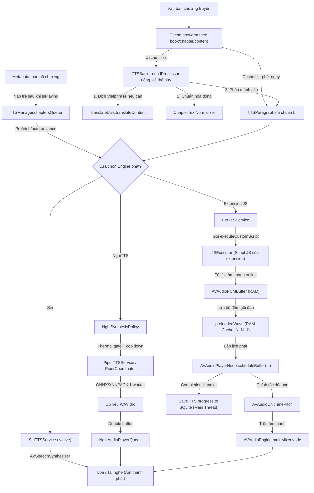

# Dòng chảy Dữ liệu & Cơ chế Cache (Data Flow & Caching)

Tài liệu này theo dõi chi tiết đường đi của dữ liệu qua các tầng kiến trúc (Input -> View -> ViewModel -> Manager -> Repository -> Database) và làm rõ toàn bộ các cơ chế bộ nhớ đệm (Cache) đang vận hành trong dự án FreeBook.

## Ghi chú thủ công (Human Notes)
*Ghi chú thủ công của con người.*

<!-- GENERATED START -->
## Bounded chapter content data flow (1.3.114)

* Chapter data flows `ChapterKey -> 12-entry/12-MiB cost-aware LRU -> persistent cache -> extension`. Each hit advances a monotonic recency sequence; insertion evicts least-recent entries until both limits hold, and oversized documents bypass shared RAM.
* Concurrent Reader/TTS consumers flow into UUID waiter continuations on one in-flight task. A canceled consumer exits immediately; the underlying local/extension flow continues only while another waiter remains.
* A memory warning flows from `MainTabView` to `trimMemoryCache`; active view/playback snapshots and disk content are outside that eviction path.
* Fallback next-chapter data now flows through an owned `TTSManager.chapterAdvanceTask`, with generation/session validation and cancellation-aware load/process stages before `applyNextChapter`.

## TTS presentation energy data flow (1.3.112)

* **Static Now Playing flow**: book/chapter/cover/translation identity -> one background translation/local-cover read -> one cached title/artwork record -> Lock Screen metadata.
* **Dynamic Now Playing flow**: paragraph index/count + play state + speed -> elapsed/duration/progress/rate fields; no title translation, image decode, or artwork allocation on a cache hit.
* **View projection flow**: selected `TTSManager` publishers -> next-main-RunLoop snapshot read -> equality gate -> root/widget/Reader render. An unrelated playing book maps Reader paragraph/highlight to stable inactive values. Widget book/cover identity loads one local/remote image into its parent-owned loader; expanded/peeking children consume the same decoded `UIImage`.
* **Nghi warm-up flow**: persisted/current engine selection -> Nghi-only delayed model preparation; Siri/Google/Ext initialization performs no Piper model warm-up.

## Reader viewport and serious N+1 data flow (1.3.111)

* **Viewport gate**: paragraph global frame -> `ParagraphTracker` -> target midpoint versus 15%/60–120 point safe inset -> skip counter or `.ttsAuto` `ScrollTarget` -> `ScrollViewProxy.scrollTo` -> executed counter.
* **Serious buffer**: current remote chunk N -> thermal-constrained target list `[N+1]` -> single coordinator slot -> `preloadedData[N+1]`; N+2/N+3 and next-chapter data do not enter the serious-state window.

## Remote TTS energy diagnostic data flow (1.3.107)

* **Energy summary flow**: Google/Ext text request -> coordinator `Job(engine, textLength, priority)` -> actual serialized operation -> elapsed time/result byte aggregation -> request/minute, bytes/minute, busy percentage, queue/dedup and thermal calculation -> `energyPrediction` -> one `[TTSEnergy] Summary` written by `AppLogger` approximately every 60 seconds.
* **Lifecycle segmentation flow**: UIKit background/foreground notification -> `TTSManager` MainActor observer -> coordinator `setApplicationState` -> flush previous window -> subsequent synthesis metrics attributed to the new screen/app state.
* The summary contains counts and sizes only. Raw paragraph text, replacement output, highlight ranges, Ext config JSON, and successful per-request script calls are no longer written by the commented verbose statements.

## AppLogger perf summaries and compact response data flows (1.3.86)

* **TTS & Reader Perf Summary Data Flow**: `TTSManager.advanceToNextChapter` -> MainActor context creation -> Async `ChapterContentRepository.load` & `TTSBackgroundProcessor.processChapter` -> Stage timing measurement (`loadMs`, `processMs`, `synthesisMs`, `playerSetupMs`) -> Idempotent metric finalization (`finishTTSAutoAdvancePerf`) -> `[TTSPerf] AutoAdvance` emitted to `AppLogger.shared.log`. Reader translation refresh updates follow a parallel path, emitting `[ReaderPerf] TranslationRefresh`.
* **Compact Extension Response Data Flow**: JS Extension execution -> `ExtensionManager.verifyJSResponse` -> `AppLogger.shared.isCompactSuccessLogEnabled` check -> Short structural description (`[Array: N items]`, `[Object: N keys]`, `[String: N chars]`, `[Value]`) -> `AppLogger.shared.log` without large payload allocations.

## TOC Database Optimization Data Flow (1.3.50)

* **TOC Save Data Flow**: `BookDetailView` / `ReaderChapterListView` -> `ChapterContentRepository.saveChapterList` -> `ChapterPersistenceStore.saveChapterList` (actor background `ModelContext`) -> `fetchBook(bookId:in:)` (Predicate with `fetchLimit = 1`) -> Reconcile chapters by URL/Index (preserving `isCached`, `offset`, `length`, `titleTrans`, and active `TTSManager` playing chapter) -> Single atomic `ModelContext.save()` off MainActor -> `refetchBook(bookId:)` on `@MainActor` -> UI state update.

## Web-extension DOM ready polling data flows (1.3.39)

* **Direct HTTP fetching**: Extension methods (`search`, `detail`, `toc`) fetch data directly via synchronous HTTP requests. The SangTacViet `home` and `genre` catalogs route paged discovery requests through `homecontent.js`, which POSTs to `/io/searchtp/searchBooks` and maps each 48-book page into `SearchNovelResult` records.
* **WebView Loader DOM ready check**: The `chap` method uses `Engine.Browser.newBrowser().waitForReady` inside JS. The bridge resolves on the background thread via `DispatchSemaphore` while checking readiness on the Main Actor via periodic `evaluateJavaScript` calls on `WKWebView` using `stablePasses` checks on `{chars, encoded}`.

## Book storage and pagination data flows (1.3.34)

* **Book Deletion Data Flow**: User action (`ShelfView`/`BookDetailView`) -> `BookStorageManager` -> Database deletes (`ModelContext.delete`) -> Database Save committed (`ModelContext.save()`) -> Background Thread -> Physical file deletions (`BookBinManager.deleteBinFile` and `ImageCacheManager.deleteCover`). If deletion fails, data flows into `UserDefaults` (`failed_file_deletions_queue`) and undergoes retry attempts at app startup via `drainRetryQueue()`.
* **TOC Paged Data Flow**: Scroll list item -> `loadPageIfNeeded` -> `loadPagesAround` -> background task -> `fetchPage` -> modelContext fetch within logical boundaries based on `totalCount` and `isAscending` -> updates `loadedRowStates` in RAM.
* **SHA-256 Caching Paths**: Cover images and book `.bin` files use SHA-256 hashes of `bookId` as filename identifiers (`covers/[sha256Hex].jpg` and `books/[sha256Hex].bin`) with automatic path safety validation and secure legacy fallback.

## Reader paragraph data flow (1.3.14)

* `originalContent` is split first; every original line produces exactly one translated result and one stable paragraph id, including blank and trailing lines.
* `translatedContent` is reconstructed only from the translated line array, preventing paragraph loss or line-count drift caused by translating the full chapter before splitting.
* Each translated paragraph carries UTF-16 spans back to `item.original`. Selection uses those spans first and falls back to historical sentence/token pairing only when mapping is absent or incomplete.
* Paragraph mappings live in Reader RAM/cache only; no SwiftData migration or persisted chapter schema changes are required.

## Reader data-flow updates (1.3.13, supersedes 1.3.11)

* The reading surface selects `pendingNavigationIndex ?? displayedChapterIndex`. A pending cache miss renders known chapter metadata and skeleton rows; only a successful generation commits real content and progress.
* Rapid manual input updates only the latest queued target. Stale generations may populate cache but cannot change displayed state.
* `ReaderChapterListStore` is created when Reader opens and remains mounted while hidden. Search, order, scroll position, and row identities survive repeated open/close operations.
* Successful chapter persistence emits one index to `markCached(index:)`; no chapter reload, sorting, or full list mapping occurs for an icon update.
* JavaScript `Response.error(message)` becomes `ExtensionManagerError.sourceResponse` and flows unchanged into `ReaderChapterLoadFailure.sourceMessage`.
* N+1 prefetch starts only after the displayed chapter is loaded and idle for 750 ms; active same-book TTS disables Reader speculation.
* Chapter changes originate from footer buttons, chapter-list selection, history, or TTS sync; horizontal content drags do not enter the ViewModel.
* TTS start data flow is split: Reader sends current chapter plus a few following `TTSChapterInfo` values for immediate playback, then `TTSManager` refreshes the full chapter queue in the background. Local queue refresh uses a background SwiftData `ModelContext`; online queue refresh uses the already available chapter snapshot.
* Shelf row data flow avoids touching `Book.chapters` during render; it displays `Book.currentChapterTitle` or a cheap chapter-number fallback.
* Discovery category tabs outside the selected-neighbor window carry no list data flow until they become adjacent or selected.

## 1. Dòng chảy dữ liệu chính (Core Data Flows)

### 1.1. Luồng tải chương truyện (Reader Chapter Loading Flow)

Luồng đi của dữ liệu khi người dùng chuyển chương truyện:

```mermaid
graph TD
    User["Người dùng chọn chương"] --> View["ReaderView (UI)"]
    View -->|Yêu cầu chương| VM["ReaderViewModel"]
    
    VM -->|1. Kiểm tra RAM Cache| Cache["ChapterCache (RAM)"]
    Cache -->|Có| ReturnVM["Trả nội dung hiển thị"]
    
    Cache -->|Không có| DB["SwiftData (Book/Chapter Models)"]
    DB -->|2. Đã tải offline (isCached)| SaveCache["Lưu vào ChapterCache"]
    
    DB -->|3. Chưa tải offline| ExtManager["ExtensionManager.shared.chap(...)"]
    ExtManager -->|Nạp script bóc tách| JS["JSExecutor (JavaScriptCore)"]
    JS -->|Tải mạng hoặc load web ngầm| Web["Nguồn truyện (HTML)"]
    
    Web -->|Trả về HTML thô| JS
    JS -->|Html.parse / Trích xuất nội dung| ExtResult["JSON kết quả chương"]
    ExtResult -->|Làm sạch mã HTML| Clean["cleanHTML()"]
    
    Clean -->|Tiền xử lý dịch thuật| Translation["TranslateUtils.translateContent(...)"]
    Translation -->|Nạp từ từ điển nhị phân| Trie["TranslationManager (VietPhrase.dat)"]
    
    Trie -->|Nội dung tiếng Việt sạch| SaveDB["Cập nhật Model Chapter & isCached = true"]
    SaveDB -->|modelContext.save()| Disk["Lưu xuống đĩa (SQLite)"]
    SaveDB --> SaveCache
    SaveCache --> ReturnVM
    ReturnVM -->|Phân đoạn hiển thị| ReaderText["ReaderTextView (Giao diện)"]
```

---

### 1.2. Luồng phát âm thanh TTS (TTS Audio Generation Flow)

Luồng dữ liệu chuyển đổi văn bản sang âm thanh nền:

```mermaid
graph TD
    TextSource["Văn bản chương truyện"] --> Prewarm["Cache prewarm theo book/chapter/content"]
    Prewarm -->|Cache hit: phát ngay| Paragraphs["TTSParagraph đã chuẩn bị"]
    Prewarm -->|Cache miss| Processor["TTSBackgroundProcessor riêng, có thể hủy"]
    Processor -->|1. Dịch Vietphrase nếu cần| Translate["TranslateUtils.translateContent"]
    Processor -->|2. Chuẩn hóa dòng| Normalizer["ChapterTextNormalizer"]
    Processor -->|3. Phân mảnh câu| Paragraphs
    ReaderQueue["Metadata toàn bộ chương"] -->|Nạp trễ sau khi isPlaying| Queue["TTSManager.chaptersQueue"]
    Queue -->|Prefetch/auto-advance| EngineSelect
    
    Paragraphs --> EngineSelect{"Lựa chọn Engine phát?"}
    
    %% Engine Siri
    EngineSelect -->|Siri| Siri["SiriTTSService (Native)"]
    Siri -->|AVSpeechSynthesizer| AudioOut["Loa / Tai nghe (Âm thanh phát)"]
    
    %% Engine NghiTTS
    EngineSelect -->|NghiTTS| Policy["NghiSynthesisPolicy"]
    Policy -->|Thermal gate + cooldown| Nghi["PiperTTSService / PiperCoordinator"]
    Nghi -->|ONNX/XNNPACK 1 worker| WavData["Dữ liệu WAV thô"]
    WavData -->|Double buffer| NghiQueue["NghiAudioPlayerQueue"]
    NghiQueue --> AudioOut
    
    %% Engine JS Extension
    EngineSelect -->|Extension JS| ExtTTS["ExtTTSService"]
    ExtTTS -->|Gọi executeCustomScript| JS["JSExecutor (Script JS của extension)"]
    JS -->|Tải file âm thanh online| PCMBuffer["AVAudioPCMBuffer (RAM)"]
    
    PCMBuffer -->|Lưu bộ đệm gối đầu| PreWav["preloadedWavs (RAM Cache: N, N+1)"]
    PreWav -->|Lập lịch phát| PlayerNode["AVAudioPlayerNode.scheduleBuffer(...)"]
    PlayerNode -->|Chỉnh tốc độ/tone| TimePitch["AVAudioUnitTimePitch"]
    TimePitch -->|Trộn âm thanh| Mixer["AVAudioEngine.mainMixerNode"]
    Mixer --> AudioOut
    
    %% Ghi nhận trạng thái
    PlayerNode -->|Completion Handler| DBProgress["Save TTS progress to SQLite (Main Thread)"]
```

---

## 2. Các Cơ chế Bộ nhớ Đệm (Caching Systems)

### 2.1. Bộ đệm Chương truyện (`ChapterCache`)
*   **Vị trí**: Nằm trong `ReaderViewModel.swift` (`let cache = ChapterCache()`).
*   **Mục tiêu**: Lưu trữ các đoạn văn đã định dạng trên RAM của chương hiện tại (N), chương trước (N-1) và chương sau (N+1).
*   **Giải phóng**: Tự giải phóng khi đổi sang chương xa hơn cửa sổ N±1 hoặc khi nhận cảnh báo bộ nhớ `didReceiveMemoryWarningNotification`.

### 2.2. Bộ đệm Âm thanh gối đầu (`preloadedWavs`)
*   **Vị trí**: Nằm trong `TTSManager.swift` (`private var preloadedWavs: [Int: AVAudioPCMBuffer]`).
*   **Mục tiêu**: Lưu trữ buffer âm thanh PCM của đoạn hiện tại đang nghe và đoạn tiếp theo (N+1) đã được tổng hợp trước trong nền để triệt tiêu độ trễ khi chuyển đoạn.
*   **Giải phóng**: Mỗi khi chuyển đoạn thành công, tự động xóa tất cả các buffer có index nằm ngoài cửa sổ `[N, N+1]` để tiết kiệm RAM.

### 2.3. Bộ đệm Từ điển (`DictionaryCache` & `bookDicts`)
*   **Vị trí**: Nằm trong `TranslationManager.swift` (`private var bookDicts: [String: (vietPhrase: TrieDictionary?, names: TrieDictionary?)]`).
*   **Mục tiêu**: Lưu cache các từ điển VietPhrase/Names nhị phân đã tải của các cuốn sách mở gần nhất.
*   **Giải phóng**: Xóa sạch toàn bộ từ điển trong RAM bằng hàm `clearBookDictCache()` khi hệ thống cảnh báo cạn kiệt RAM.

### 2.4. Bộ đệm Hình ảnh bìa sách (`ImageCacheManager`)
*   **Vị trí**: Nằm trong `Sources/Common/Services/ImageCacheManager.swift`.
*   **Mục tiêu**: Cache ảnh bìa truyện tải từ các URL web về đĩa/RAM để tránh tải trùng lặp khi người dùng cuộn kệ sách.
*   **Cơ chế**: Sử dụng `NSCache` tích hợp của Apple.

### 2.5. Nội dung chương dùng chung cho TTS
*   **Vị trí**: `ChapterContentRepository` và `ChapterPersistenceStore`; `TTSManager.chaptersQueue` chỉ giữ metadata chương.
*   **Mục tiêu**: TTS tải chương kế tiếp qua cùng pipeline `RAM → SwiftData → extension`, tránh cache nội dung thứ hai và vẫn hoạt động độc lập khi Reader đã đóng.
*   **Đồng bộ**: Kết quả TTS chỉ được commit nếu `sessionID + bookId + chapterIndex + url` còn hợp lệ; dữ liệu tải được repository giữ RAM và ghi nền vào SwiftData.

#### Reader/TTS unified pipeline (2026-07)

- `ChapterTextNormalizer` is the single source for LF newlines, trimmed non-empty lines, compact paragraph IDs, and UTF-16 ranges. `ChapterContentRepository` produces one normalized `ChapterDocument` for both Reader and TTS.
- Reader uses `ReaderLoadState` with bootstrap retry/clamping, typed failures, generation checks, cache-first rendering, and a short opacity crossfade only for newly fetched content. `ReaderRoute.chapterIndex` preserves the selected TOC index through navigation.
- `TTSParagraphBuilder` chunks normalized lines without renumbering parent paragraph IDs; replacement output is checked before synthesis. TTS asynchronous work is guarded by session identity and TTS owns progress while playing.
- `ReadingProgressStore` coalesces RAM snapshots in an actor and flushes from background contexts on checkpoints, dismissal, and app backgrounding. Legacy window/tab Reader, duplicate progress repository, and `TTSSession` mirror are removed.
- Dictionary-update data flows from `TranslationManager` notification to a cancelable, sequential Reader cache rebuild: current chapter first, then loaded/preloaded chapters. Existing TTS paragraph audio remains valid for the live session; a new listen action translates from cached `originalContent`, and next-chapter auto-advance translates raw repository content with the latest dictionaries.
- Chapter data flows `ChapterKey -> bounded shared LRU -> ChapterPersistenceStore/SwiftData -> extension fallback`; extension output is normalized once, returned immediately, and upserted with Book/TOC metadata in the background.
- TOC refresh reconciles by stable URL and preserves cached content/title translation for matched chapters instead of deleting and recreating the relationship.
- Book deletion coordinates database deletion and side-effect cancellation before dispatching background file deletions. Deletion failures are enqueued in `UserDefaults` queue dataflow and retried at launch.
- `ReaderChapterListStore` dynamically pages chapter DTO metadata via `BackgroundPagingWorker` actor, anti-jitter generation checks, per-page de-duplication, and deferred atomic swaps, maintaining <= 300 active row states in RAM without storing flat item arrays.
- Caching paths for books and covers use SHA-256 hex filename dataflow (`sha256Hex(bookId).bin` and `sha256Hex(bookId).jpg`) with automatic path safety validation.
- `Engine.Browser.waitForReady` passes a JSON string representing DOM readiness (`{ready, failed, reason, chars, encoded}`) from `WKWebView` on the Main Actor to the JS worker thread via native bridge parameters.

- Remote audio data flows `paragraph/voice/session key -> coordinator queue -> one service operation -> deduplicated waiters -> bounded preloadedData window -> AVAudioPlayer`.
- Google response bytes are deserialized once, inspected for API errors/audio, then Base64-decoded. Binary Ext fetch responses skip text decoding and flow directly through Base64 to `ExtTTSService`.
- Next-chapter content/paragraph DTOs may be prepared early, but first-paragraph audio enters the remote queue only when at most two parent paragraphs remain.

<!-- GENERATED END -->
