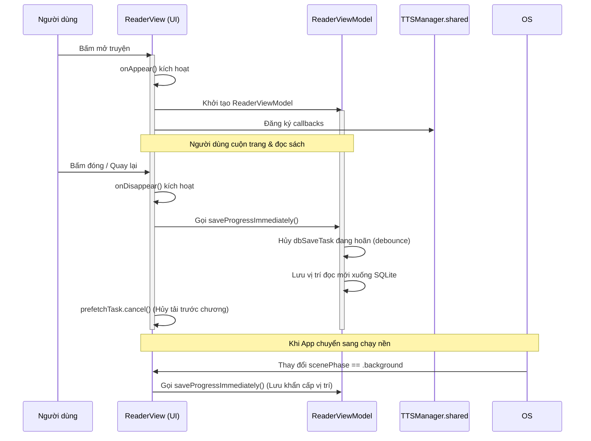

# Vòng đời các SwiftUI View (SwiftUI View Lifecycle)

Tài liệu này phân tích chi tiết cơ chế quản lý vòng đời của các màn hình chính trong ứng dụng FreeBook, bao gồm việc nạp trạng thái ban đầu (`onAppear`, `.task`), dọn dẹp khi đóng (`onDisappear`), theo dõi trạng thái ứng dụng (`scenePhase`), hủy task chạy ngầm và gỡ bỏ các observer.

## Ghi chú thủ công (Human Notes)
*Ghi chú thủ công của con người.*

<!-- GENERATED START -->
## Reader paragraph lifecycle (1.3.14)

* Chapter load, translation toggle, dictionary refresh, and title-visibility refresh rebuild paragraph items from immutable original title/content and replace the RAM cache atomically on the main actor.
* Selection ranges are read only when the custom menu action is invoked; `ReaderTextView` keeps no additional selection lifecycle or paragraph ownership state.
* Translation spans are discarded with their `CachedChapter`/`LoadedChapter` paragraph items and require no persistent cleanup.

## Reader lifecycle updates (1.3.13, supersedes 1.3.11)

* `ReaderView.onAppear` creates `ReaderChapterListStore` and mounts `ReaderChapterListView` once. Closing the overlay only changes offset, opacity, hit testing, and accessibility visibility.
* The initial navigation request restores caller-provided history and never replaces it with a TTS snapshot.
* The chapter list keeps search, order, scroll position, and row objects until Reader disappears.
* The mounted chapter list closes through its header drag gesture or Accessibility Escape; list scrolling does not alter presentation state.
* `ReaderView.onDisappear` calls `ReaderViewModel.shutdown(saveProgress:)`, canceling navigation debounce/worker, DB debounce, and prefetch.
* `ReaderTextView.dismantleUIView` clears delegate ownership; no Reader-level selection-activity state remains after horizontal navigation is removed.
* `TTSFloatingWidgetView` lays out only its compact widget bounds (174x56 when expanded, 52x52 when peeking), snaps the expanded capsule flush to the chosen horizontal edge, and keeps the full-screen Reader outside the overlay hit-test region.

## 1. Bản đồ Vòng đời của Trình đọc (`ReaderView.swift`)

Màn hình đọc truyện `ReaderView` quản lý các tài nguyên bao gồm ViewModel, Prefetcher và kết nối trực tiếp với TTS Widget.

---

## 2. Phân tích chi tiết vòng đời từng View chính

### 2.1. Trình đọc Truyện chữ (`ReaderView.swift`)
*   **Khi xuất hiện (`onAppear`)**:
    *   Đọc cấu hình hệ thống từ `UserDefaults`.
    *   Khởi tạo `ReaderViewModel` và nạp vị trí đọc được lưu từ phiên trước.
    *   Đăng ký 3 hàm callbacks để chuyển chương cho `TTSManager.shared`: `onChapterFinished`, `onChapterNext`, `onChapterPrev`.
*   **Vòng đời điều hướng chương thủ công tích hợp với TTS**:
    1. Khi người dùng bấm Next/Prev hoặc chọn chương mới, `ReaderView` kiểm tra active ownership (`ttsManager.hasActivePlaybackOwnership(for:)`).
    2. Nếu thuộc về TTS, `ReaderView` gọi `beginManualChapterNavigation(targetIndex:)` để tạm ngắt `playerNode` hiện tại, đồng thời chuyển sang trạng thái chờ nạp chương mới của Reader.
    3. `ReaderViewModel` thực hiện tải chương mới bất đồng bộ.
    4. Nếu tải thành công: `applyNavigationCommit` gọi `ttsManager.commitManualChapterNavigation(targetIndex:chapterContent:)`. Lệnh này xử lý bất đồng bộ thông qua `TTSBackgroundProcessor` trên luồng nền và tiếp tục phát mượt mà từ đầu chương mới.
    5. Nếu tải lỗi hoặc bị hủy: `onChange(of: viewModel.navigationFailure)` bắt được và gọi `ttsManager.abortManualChapterNavigation()` để khôi phục trạng thái tạm dừng của TTS, cho phép người dùng thao tác lại.
*   **Khi biến mất (`onDisappear`)**:
    *   Reset biến tĩnh `ReaderView.activeBookId = nil`.
    *   Hủy task prefetch chương truyện đang chạy ngầm (`prefetchTask?.cancel()`).
    *   Ghi đè vị trí đọc và lưu ngay xuống cơ sở dữ liệu (`viewModel?.saveProgressImmediately()`).
*   **Khi chuyển xuống chạy ngầm (`scenePhase == .background`)**:
    *   Tự động kích hoạt ghi đĩa vị trí đọc (`saveProgressImmediately()`) để tránh việc iOS chấm dứt ứng dụng đột ngột làm mất bookmark.

### 2.2. Kệ sách (`ShelfView.swift`)
*   **Khi xuất hiện (`onAppear`)**:
    *   Kích hoạt nạp lại trạng thái sách từ database (sắp xếp theo thời gian đọc gần nhất).
    *   Đồng bộ trạng thái tải xuống với `DownloadManager` nếu có sự thay đổi.

### 2.3. Bảng điều khiển giọng đọc (`TTSFloatingWidgetView.swift`)
*   **Khi biến mất (`onDisappear`)**:
    *   Lưu trạng thái đóng/mở của widget nổi vào bộ nhớ đệm hệ thống.
    *   Nếu người dùng đóng widget bằng nút Close, nó sẽ giải phóng liên kết UI nhưng không dừng AVAudioPlayerNode ngầm nếu nhạc đang phát.

### 2.4. Trình duyệt ngầm Bypass Cloudflare (`BypassWebView.swift`)
*   **Khi xuất hiện (`onAppear`)**:
    *   Khởi tạo và thiết lập các tham số cho `WKWebView`.
    *   Gửi cookie giả lập trình duyệt để cào mã nguồn HTML.
*   **Khi biến mất (`onDisappear`)**:
    *   Hủy toàn bộ các tiến trình tải trang web ngầm.
    *   Gỡ bỏ delegate `WKNavigationDelegate` để tránh rò rỉ bộ nhớ.

---

## 3. Quản lý Hủy Task & Gỡ bỏ Observer

### 3.1. Hủy Task chạy ngầm (Task Cancellation)
*   **`ReaderViewModel`**:
    *   Khi người dùng scroll liên tục, `updateProgress` liên tục tạo ra task debounce lưu vị trí mới. Task cũ sẽ được hủy ngay lập tức qua `dbSaveTask?.cancel()` để ngăn việc ghi đĩa trùng lặp liên tục.
*   **`DownloadManager`**:
    *   Background task chạy trong `Task.detached` thường xuyên kiểm tra cờ `isCancelled`. Nếu người dùng bấm hủy tác vụ, task nền sẽ bắt được cờ hủy này, thoát khỏi vòng lặp tải và đóng kết nối context an toàn.

### 3.2. Gỡ bỏ Observer (Notification/Observer Removal)
*   **`ReaderViewModel`**: Lắng nghe `didReceiveMemoryWarningNotification` qua Combine. Khi ViewModel deinit, subscription này tự động giải phóng thông qua cơ chế tự hủy của biến `AnyCancellable` lưu trong class.
*   **`TTSManager`**: Đăng ký các observer của `AVAudioSession` thông qua Combine publishers lưu trong một Set `cancellables`. Khi `TTSManager` tồn tại suốt vòng đời app, các observer này được duy trì vĩnh viễn và chỉ được giải phóng khi ứng dụng bị tắt hoàn toàn.

#### Reader/TTS unified pipeline (2026-07)

- `ChapterTextNormalizer` is the single source for LF newlines, trimmed non-empty lines, compact paragraph IDs, and UTF-16 ranges. `ChapterContentRepository` produces one normalized `ChapterDocument` for both Reader and TTS.
- Reader uses `ReaderLoadState` with bootstrap retry/clamping, typed failures, generation checks, cache-first rendering, and a short opacity crossfade only for newly fetched content. `ReaderRoute.chapterIndex` preserves the selected TOC index through navigation.
- `TTSParagraphBuilder` chunks normalized lines without renumbering parent paragraph IDs; replacement output is checked before synthesis. TTS asynchronous work is guarded by session identity and TTS owns progress while playing.
- `ReadingProgressStore` coalesces RAM snapshots in an actor and flushes from background contexts on checkpoints, dismissal, and app backgrounding. Legacy window/tab Reader, duplicate progress repository, and `TTSSession` mirror are removed.
- `TTSFloatingWidgetView` owns a cancellable auto-hide task through `FloatingWidgetViewModel`; the cover rotation is timeline-driven while playing and freezes at its current angle when paused. Stopping TTS removes the overlay through `TTSManager.showFloatingWidget`.
- The floating widget has a bounded layout equal to its capsule/peek bounds and uses an offset for screen placement; it no longer mounts a full-screen interactive `GeometryReader` over Reader.
- `ReaderViewModel.shutdown` may release UI chapter cache but shared repository memory/in-flight loads survive; Reader disappearance flushes pending writes, and app inactive/background flushes all chapter persistence alongside reading progress.
- A Reader only prepares or updates paused TTS when both book IDs match, so a TTS session outlives dismissal and unrelated Reader lifecycles.

<!-- GENERATED END -->
