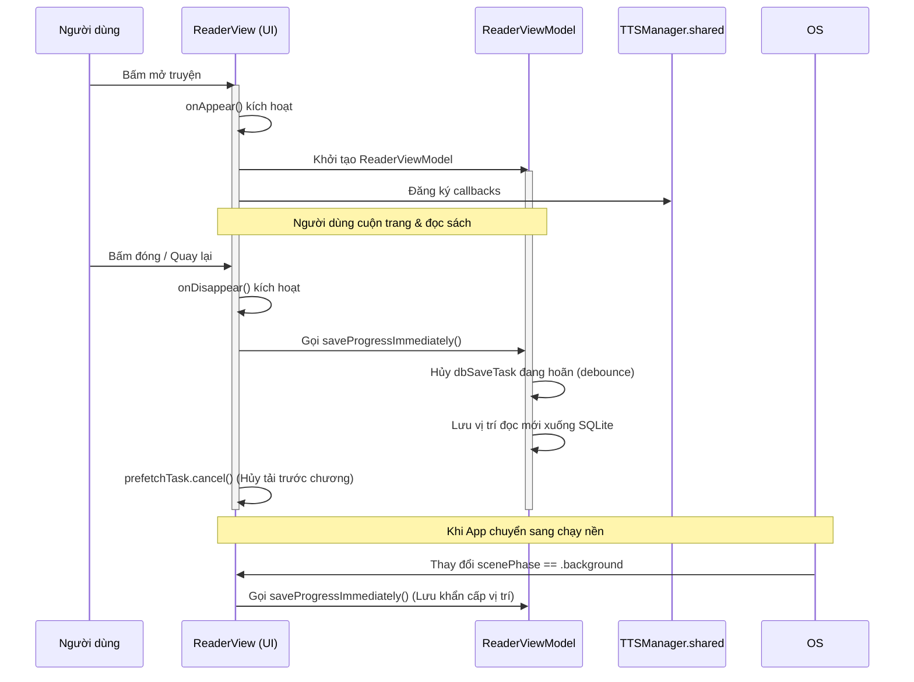

# Vòng đời các SwiftUI View (SwiftUI View Lifecycle)

Tài liệu này phân tích chi tiết cơ chế quản lý vòng đời của các màn hình chính trong ứng dụng FreeBook, bao gồm việc nạp trạng thái ban đầu (`onAppear`, `.task`), dọn dẹp khi đóng (`onDisappear`), theo dõi trạng thái ứng dụng (`scenePhase`), hủy task chạy ngầm và gỡ bỏ các observer.

## Ghi chú thủ công (Human Notes)
*Ghi chú thủ công của con người.*

<!-- GENERATED START -->
## Reader lifecycle updates (1.3.10)

* `ReaderView.onAppear` restores the caller-provided history position and does not replace it with `TTSSessionSnapshot`.
* The chapter-list view and row translation work exist only while the overlay is open. It reuses the Reader's `Book` and `Extension` objects instead of owning duplicate SwiftData queries.
* `ReaderView.onDisappear` cancels local work items and calls async `ReaderViewModel.shutdown(saveProgress:)`, which cancels the DB debounce and reader prefetch queue, conditionally force-saves when Reader owns progress, and clears the reader chapter cache. Active TTS progress is never overwritten by a temporary visual jump.
* The settled-adjacent-prefetch task is canceled on every window replacement, book change, and Reader shutdown.

## 1. Bản đồ Vòng đời của Trình đọc (`ReaderView.swift`)

Màn hình đọc truyện `ReaderView` quản lý các tài nguyên bao gồm ViewModel, Prefetcher và kết nối trực tiếp với TTS Widget.

---

## 2. Phân tích chi tiết vòng đời từng View chính

### 2.1. Trình đọc Truyện chữ (`ReaderView.swift`)
*   **Khi xuất hiện (`onAppear`)**:
    *   Đọc cấu hình hệ thống từ `UserDefaults`.
    *   Khởi tạo `ReaderViewModel` và nạp vị trí đọc được lưu từ phiên trước.
    *   Đăng ký 3 hàm callbacks để chuyển chương cho `TTSManager.shared`: `onChapterFinished`, `onChapterNext`, `onChapterPrev`.
*   **Khi biến mất (`onDisappear`)**:
    *   Reset biến tĩnh `ReaderView.activeBookId = nil`.
    *   Hủy task prefetch chương truyện đang chạy ngầm (`prefetchTask?.cancel()`).
    *   Ghi đè vị trí đọc và lưu ngay xuống cơ sở dữ liệu (`viewModel?.saveProgressImmediately()`).
*   **Khi chuyển xuống chạy ngầm (`scenePhase == .background`)**:
    *   Tự động kích hoạt ghi đĩa vị trí đọc (`saveProgressImmediately()`) để tránh việc iOS chấm dứt ứng dụng đột ngột làm mất bookmark.

### 2.2. Kệ sách (`ShelfView.swift`)
*   **Khi xuất hiện (`onAppear`)**:
    *   Kích hoạt nạp lại trạng thái sách từ database (sắp xếp theo thời gian đọc gần nhất).
    *   Đồng bộ trạng thái tải xuống với `DownloadManager` nếu có sự thay đổi.

### 2.3. Bảng điều khiển giọng đọc (`TTSFloatingWidgetView.swift`)
*   **Khi biến mất (`onDisappear`)**:
    *   Lưu trạng thái đóng/mở của widget nổi vào bộ nhớ đệm hệ thống.
    *   Nếu người dùng đóng widget bằng nút Close, nó sẽ giải phóng liên kết UI nhưng không dừng AVAudioPlayerNode ngầm nếu nhạc đang phát.

### 2.4. Trình duyệt ngầm Bypass Cloudflare (`BypassWebView.swift`)
*   **Khi xuất hiện (`onAppear`)**:
    *   Khởi tạo và thiết lập các tham số cho `WKWebView`.
    *   Gửi cookie giả lập trình duyệt để cào mã nguồn HTML.
*   **Khi biến mất (`onDisappear`)**:
    *   Hủy toàn bộ các tiến trình tải trang web ngầm.
    *   Gỡ bỏ delegate `WKNavigationDelegate` để tránh rò rỉ bộ nhớ.

---

## 3. Quản lý Hủy Task & Gỡ bỏ Observer

### 3.1. Hủy Task chạy ngầm (Task Cancellation)
*   **`ReaderViewModel`**:
    *   Khi người dùng scroll liên tục, `updateProgress` liên tục tạo ra task debounce lưu vị trí mới. Task cũ sẽ được hủy ngay lập tức qua `dbSaveTask?.cancel()` để ngăn việc ghi đĩa trùng lặp liên tục.
*   **`DownloadManager`**:
    *   Background task chạy trong `Task.detached` thường xuyên kiểm tra cờ `isCancelled`. Nếu người dùng bấm hủy tác vụ, task nền sẽ bắt được cờ hủy này, thoát khỏi vòng lặp tải và đóng kết nối context an toàn.

### 3.2. Gỡ bỏ Observer (Notification/Observer Removal)
*   **`ReaderViewModel`**: Lắng nghe `didReceiveMemoryWarningNotification` qua Combine. Khi ViewModel deinit, subscription này tự động giải phóng thông qua cơ chế tự hủy của biến `AnyCancellable` lưu trong class.
*   **`TTSManager`**: Đăng ký các observer của `AVAudioSession` thông qua Combine publishers lưu trong một Set `cancellables`. Khi `TTSManager` tồn tại suốt vòng đời app, các observer này được duy trì vĩnh viễn và chỉ được giải phóng khi ứng dụng bị tắt hoàn toàn.
<!-- GENERATED END -->
