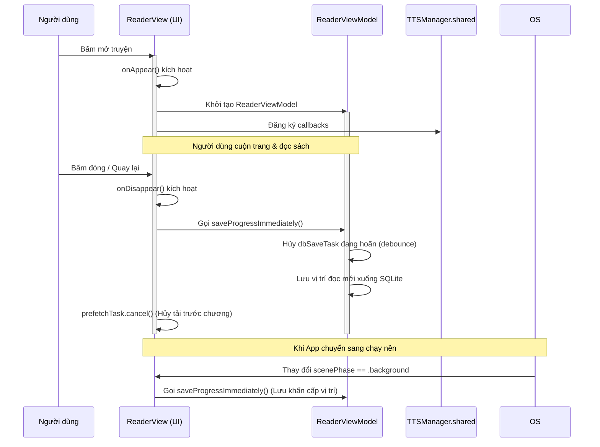

# Vòng đời các SwiftUI View (SwiftUI View Lifecycle)

Tài liệu này phân tích chi tiết cơ chế quản lý vòng đời của các màn hình chính trong ứng dụng FreeBook, bao gồm việc nạp trạng thái ban đầu (`onAppear`, `.task`), dọn dẹp khi đóng (`onDisappear`), theo dõi trạng thái ứng dụng (`scenePhase`), hủy task chạy ngầm và gỡ bỏ các observer.

## Ghi chú thủ công (Human Notes)
*Ghi chú thủ công của con người.*

<!-- GENERATED START -->
## Reader chapter list bottom sheet presentation lifecycle (1.3.215)

* `ReaderView` presents `ReaderChapterListView` using native `.sheet(isPresented: $showingChapterList)`. `onOpenChapterList` validates `getOrInitChapterListStore() != nil` before setting `showingChapterList = true`, ensuring no empty sheet is presented.
* When the sheet is dismissed, `ReaderChapterListView` deinitializes, and its `.onDisappear` explicitly cancels both `chapterPositioningTask` and `deferredVisiblePageTask` (with `!Task.isCancelled` guarded before UI scrolling and state mutations).
* `ReaderChapterListStore` remains owned by `ReaderView` across sheet appearances, retaining `loadedRowStates`, `isAscending`, and `activeSearchQuery`. Re-opening the sheet restores search query and sort order, and triggers `scrollToCurrentChapter` for an intentional chapter jump to the currently reading chapter.

## TTS floating widget and Toast window lifecycle (1.3.195)

* `TTSFloatingWidgetWindowManager` binds `FloatingWidgetUIWindow` to the active `UIWindowScene` on scene activation or app foreground. The window is non-key at all times, with visibility controlled strictly via `isHidden = false/true`. The app's `ModelContainer` is injected into the window's hosting controller and sheets, enabling SwiftData queries.
* `ToastManager` dynamically attaches `ToastUIWindow` (`windowLevel = .alert`) on demand when a toast is shown, and sets `isHidden = true` when the auto-hide animation completes after 3 seconds.
* `FloatingWidgetViewModel` remains the single source of truth for the 3-second auto-hide task and state persistence (`UserDefaults`), ensuring no duplicate or competing timers.

## Reader presentation lifecycle (1.3.192)

* Reader is presented with `.fullScreenCover(item:)` (own `NavigationStack`) from `ShelfView`, `ShelfSearchView`, and `BookDetailView` instead of a navigation push. The main `TabView` is never re-laid-out and the tab bar is never hidden (`.toolbar(.hidden, for: .tabBar)` removed from `ReaderView`), so dismissing the reader reveals the tabs instantly without the delayed tab-bar restore.
* Reader lifecycle callbacks are unchanged: `onAppear` scopes TTS state and starts the energy window, `onDisappear` runs `ReaderViewModel.shutdown(saveProgress:)` and flushes chapter persistence. `ReaderView`'s hidden `NavigationLink`s (BookDetail / change source) push onto the cover's own `NavigationStack`; `dismiss()` closes the cover.

## Shared chapter lifecycle update (1.3.114)

* `ChapterContentRepository.shared` retains at most 12 normalized documents and 12 MiB estimated content cost across Reader lifecycles. MainTab memory-warning handling releases that reusable LRU without touching caller-owned snapshots or persistence.
* An in-flight load exists only while at least one UUID waiter remains. Reader shutdown removes its waiter immediately; shared work survives only when TTS/another consumer still awaits the same key, and final-waiter cancellation reaches the extension operation.
* `TTSManager` owns one fallback auto-advance task. Start replacement, stop, and a newer advance cancel it; a generation-matched defer releases the finished task reference without clearing a newer task.

## TTS presentation energy lifecycle (1.3.112)

* The floating cover owns no playback animation clock; it renders a static image and releases the prior 30 FPS `TimelineView` lifecycle entirely. `TTSFloatingWidgetView` owns one `TTSCoverImageLoader`, so switching between expanded and peeking replaces only presentation children and retains the decoded image/load identity.
* Root, widget, and Reader projection readers own narrow Combine subscriptions for their view lifetime. They read after the publishing RunLoop turn, deduplicate snapshots, and release subscriptions with their `StateObject`.
* `ReaderTTSStateReader.scope(to:)` activates book filtering on Reader appearance. Paragraph/highlight events from another book remain an unchanged inactive projection.
* `TTSManager` owns one cancelable Now Playing static-metadata task and one cached artwork record. Stop clears both; a new identity/dictionary generation replaces them.
* Nghi warm-up has no app-wide eager lifecycle: it begins only for the selected Nghi engine and is canceled when another engine is selected.

## Viewport-gated Reader lifecycle (1.3.111)

* The root Reader geometry maintains global viewport bounds. Mounted paragraph frames remain owned by `ParagraphTracker`; sub-8-point changes are discarded and all state is cleared at chapter/lifecycle boundaries as before.
* TTS highlighting may advance repeatedly without scrolling while the target remains in the safe viewport. A scroll is created only at the boundary, reducing LazyVStack mount/unmount and frame-update cycles.

## Reader energy diagnostic lifecycle (1.3.110)

* `ReaderView.onAppear` starts a fresh `ReaderEnergyDiagnostics` window. Interval summaries reset the window while the Reader remains visible.
* A thermal transition or app background flushes and clears the partial window; Reader disappearance performs a final flush. The singleton retains counters only for the active window and owns no timer, observer, view, or task.

## Reader highlight layout lifecycle (1.3.109)

* Highlight-only updates preserve `ReaderTextView`'s cached width and height. Measurement is invalidated only when text or layout-affecting configuration changes, while theme-only recoloring retains geometry.
* `AutoSizingTextView` suppresses repeated intrinsic-size invalidation while `contentSize` remains effectively unchanged (within 0.5 point).
* TTS auto-scroll is owned by `ReaderView` for the duration of the Reader lifecycle; `ReaderTextView` performs no independent parent-scroll animation and still releases its observation in `dismantleUIView`.
* The header toolbar (`ReaderHeaderFooterOverlayView`) exposes a persistent toggle (icon `scroll`/`scroll.fill`) next to the reload button that flips `ReaderView.isAutoScrollDisabled` immediately. The per-book value is restored from UserDefaults key `disableAutoScroll_\(bookId)` at Reader bootstrap and takes effect without restarting playback.

## Reader paragraph lifecycle (1.3.14)

* Chapter load, translation toggle, dictionary refresh, and title-visibility refresh rebuild paragraph items from immutable original title/content and replace the RAM cache atomically on the main actor.
* Selection ranges are read only when the custom menu action is invoked; `ReaderTextView` keeps no additional selection lifecycle or paragraph ownership state.
* Translation spans are discarded with their `CachedChapter`/`LoadedChapter` paragraph items and require no persistent cleanup.

## Reader lifecycle updates (1.3.13, supersedes 1.3.11)

* `ReaderView.onAppear` creates `ReaderChapterListStore` and mounts `ReaderChapterListView` once. Closing the overlay changes offset, opacity, hit testing, and accessibility visibility; slow downward drags no longer mutate a per-frame sheet offset.
* The initial navigation request restores caller-provided history and never replaces it with a TTS snapshot.
* The chapter list keeps search, order, scroll position, and row objects until Reader disappears.
* The mounted chapter list closes through its header drag gesture, outside-backdrop tap, or Accessibility Escape; list scrolling does not alter presentation state.
* TTS queue refresh lifecycle is owned by `TTSManager`, not `ReaderView`. Reader dismissal does not cancel TTS auto-fetch; only stopping or replacing the TTS session cancels the queue refresh task.
* `ReaderView.onDisappear` calls `ReaderViewModel.shutdown(saveProgress:)`, canceling navigation debounce/worker, DB debounce, and prefetch.
* `ReaderTextView.dismantleUIView` clears delegate ownership; no Reader-level selection-activity state remains after horizontal navigation is removed.
* `TTSFloatingWidgetView` lays out only its compact widget bounds (174x56 when expanded, 52x52 when peeking), snaps the expanded capsule flush to the chosen horizontal edge, and keeps the full-screen Reader outside the overlay hit-test region.

## 1. Bản đồ Vòng đời của Trình đọc (`ReaderView.swift`)

Màn hình đọc truyện `ReaderView` quản lý các tài nguyên bao gồm ViewModel, Prefetcher và kết nối trực tiếp với TTS Widget.

```mermaid
sequenceDiagram
    participant User as Người dùng
    participant View as ReaderView (UI)
    participant VM as ReaderViewModel
    participant TTS as TTSManager.shared
    
    User->>View: Bấm mở truyện
    activate View
    View->>View: onAppear() kích hoạt
    View->>VM: Khởi tạo ReaderViewModel
    activate VM
    View->>TTS: Đăng ký callbacks
    
    Note over View, VM: Người dùng cuộn trang & đọc sách
    
    User->>View: Bấm đóng / Quay lại
    View->>View: onDisappear() kích hoạt
    View->>VM: Gọi saveProgressImmediately()
    VM->>VM: Hủy dbSaveTask đang hoãn (debounce)
    VM->>VM: Lưu vị trí đọc mới xuống SQLite
    View->>View: prefetchTask.cancel() (Hủy tải trước chương)
    deactivate VM
    deactivate View
    
    Note over View, OS: Khi App chuyển sang chạy nền
    OS->>View: Thay đổi scenePhase == .background
    View->>VM: Gọi saveProgressImmediately() (Lưu khẩn cấp vị trí)
```

---

## 2. Phân tích chi tiết vòng đời từng View chính

### 2.1. Trình đọc Truyện chữ (`ReaderView.swift`)
*   **Khi xuất hiện (`onAppear`)**:
    *   Đọc cấu hình hệ thống từ `UserDefaults`.
    *   Khởi tạo `ReaderViewModel` và nạp vị trí đọc được lưu từ phiên trước.
    *   Đăng ký 3 hàm callbacks để chuyển chương cho `TTSManager.shared`: `onChapterFinished`, `onChapterNext`, `onChapterPrev`.
*   **Vòng đời điều hướng Reader và TTS độc lập**:
    1. Next/Prev hoặc mục lục chỉ yêu cầu `ReaderViewModel` tải và commit chương Reader.
    2. Reader có thể prewarm nội dung chương đang hiển thị vào cache TTS, nhưng thao tác này không đổi trạng thái/chương của phiên TTS.
    3. TTS chỉ đổi chương khi người dùng chủ động bấm phát tại chương Reader hiện tại, hoặc khi TTS tự đọc hết chương và gọi `advanceToNextChapter`.
    4. Khi bấm phát, Reader chỉ truy vấn metadata chương hiện tại và chương kế; queue đầy đủ được cập nhật trễ qua `updateChaptersQueue(_:for:)` sau khi `isPlaying` để không chặn âm thanh đầu tiên.
*   **Khi biến mất (`onDisappear`)**:
    *   Reset biến tĩnh `ReaderView.activeBookId = nil`.
    *   Hủy task prefetch chương truyện đang chạy ngầm (`prefetchTask?.cancel()`).
    *   Ghi đè vị trí đọc và lưu ngay xuống cơ sở dữ liệu (`viewModel?.saveProgressImmediately()`).
*   **Khi chuyển xuống chạy ngầm (`scenePhase == .background`)**:
    *   Tự động kích hoạt ghi đĩa vị trí đọc (`saveProgressImmediately()`) để tránh việc iOS chấm dứt ứng dụng đột ngột làm mất bookmark.

### 2.2. Kệ sách (`ShelfView.swift`)
*   **Khi xuất hiện (`onAppear`)**:
    *   Kích hoạt nạp lại trạng thái sách từ database (sắp xếp theo thời gian đọc gần nhất).
    *   Đồng bộ trạng thái tải xuống với `DownloadManager` nếu có sự thay đổi.

### 2.3. Bảng điều khiển giọng đọc (`TTSFloatingWidgetView.swift`)
*   **Khi biến mất (`onDisappear`)**:
    *   Lưu trạng thái đóng/mở của widget nổi vào bộ nhớ đệm hệ thống.
    *   Nếu người dùng đóng widget bằng nút Close, nó sẽ giải phóng liên kết UI nhưng không dừng AVAudioPlayerNode ngầm nếu nhạc đang phát.

### 2.4. Trình duyệt ngầm Bypass Cloudflare (`BypassWebView.swift`)
*   **Khi xuất hiện (`onAppear`)**:
    *   Khởi tạo và thiết lập các tham số cho `WKWebView`.
    *   Gửi cookie giả lập trình duyệt để cào mã nguồn HTML.
*   **Khi biến mất (`onDisappear`)**:
    *   Hủy toàn bộ các tiến trình tải trang web ngầm.
    *   Gỡ bỏ delegate `WKNavigationDelegate` để tránh rò rỉ bộ nhớ.

---

## 3. Quản lý Hủy Task & Gỡ bỏ Observer

### 3.1. Hủy Task chạy ngầm (Task Cancellation)
*   **`ReaderViewModel`**:
    *   Khi người dùng scroll liên tục, `updateProgress` liên tục tạo ra task debounce lưu vị trí mới. Task cũ sẽ được hủy ngay lập tức qua `dbSaveTask?.cancel()` để ngăn việc ghi đĩa trùng lặp liên tục.
*   **`DownloadManager`**:
    *   Background task chạy trong `Task.detached` thường xuyên kiểm tra cờ `isCancelled`. Nếu người dùng bấm hủy tác vụ, task nền sẽ bắt được cờ hủy này, thoát khỏi vòng lặp tải và đóng kết nối context an toàn.

### 3.2. Gỡ bỏ Observer (Notification/Observer Removal)
*   **`ReaderViewModel`**: Lắng nghe `didReceiveMemoryWarningNotification` qua Combine. Khi ViewModel deinit, subscription này tự động giải phóng thông qua cơ chế tự hủy của biến `AnyCancellable` lưu trong class.
*   **`TTSManager`**: Đăng ký các observer của `AVAudioSession` thông qua Combine publishers lưu trong một Set `cancellables`. Khi `TTSManager` tồn tại suốt vòng đời app, các observer này được duy trì vĩnh viễn và chỉ được giải phóng khi ứng dụng bị tắt hoàn toàn.

#### Reader/TTS unified pipeline (2026-07)

- `ChapterTextNormalizer` is the single source for LF newlines, trimmed non-empty lines, compact paragraph IDs, and UTF-16 ranges. `ChapterContentRepository` produces one normalized `ChapterDocument` for both Reader and TTS.
- Reader uses `ReaderLoadState` with bootstrap retry/clamping, typed failures, generation checks, cache-first rendering, and a short opacity crossfade only for newly fetched content. `ReaderRoute.chapterIndex` preserves the selected TOC index through navigation.
- `TTSParagraphBuilder` chunks normalized lines without renumbering parent paragraph IDs; replacement output is checked before synthesis. TTS asynchronous work is guarded by session identity and TTS owns progress while playing.
- `ReadingProgressStore` coalesces RAM snapshots in an actor and flushes from background contexts on checkpoints, dismissal, and app backgrounding. Legacy window/tab Reader, duplicate progress repository, and `TTSSession` mirror are removed.
- `TTSFloatingWidgetView` owns a cancellable auto-hide task through `FloatingWidgetViewModel`; its cover is static during sustained playback. Stopping TTS removes the overlay through `TTSManager.showFloatingWidget`.
- The floating widget has a bounded layout equal to its capsule/peek bounds and uses an offset for screen placement; it no longer mounts a full-screen interactive `GeometryReader` over Reader.
- `ReaderViewModel.shutdown` releases UI chapter cache and its repository waiter. Bounded shared memory survives until LRU/memory-warning eviction, while an in-flight load survives only for another subscriber; Reader disappearance flushes pending writes, and app inactive/background flushes all chapter persistence alongside reading progress.
- A Reader only prepares or updates paused TTS when both book IDs match, so a TTS session outlives dismissal and unrelated Reader lifecycles.

<!-- GENERATED END -->
