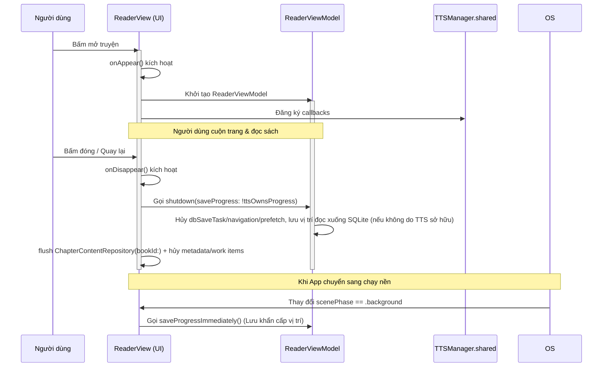

# Vòng đời các SwiftUI View (SwiftUI View Lifecycle)

Tài liệu này phân tích chi tiết cơ chế quản lý vòng đời của các màn hình chính trong ứng dụng FreeBook, bao gồm việc nạp trạng thái ban đầu (`onAppear`, `.task`), dọn dẹp khi đóng (`onDisappear`), theo dõi trạng thái ứng dụng (`scenePhase`), hủy task chạy ngầm và gỡ bỏ các observer.

## Ghi chú thủ công (Human Notes)
*Ghi chú thủ công của con người.*

<!-- GENERATED START -->
## Vòng đời mở rộng ban đầu của widget TTS khi nghe từ Reader (1.3.277)

* Reader gọi `requestRevealOnNextShow()` ngay trước `TTSManager.startSpeaking(...)`. Khi `startSpeaking` set `showFloatingWidget = true`, `AppLaunchRootView` vẫn là nơi refresh window như cũ; window manager chỉ consume cờ reveal nếu có.
* Không có timer mới: `FloatingWidgetViewModel.reveal()` tự bắt đầu auto-hide timer hiện có nếu `disableAutoHide == false`, nên widget mở dạng capsule ban đầu rồi vẫn tự thu về peeking như các lần reveal bằng tap/kéo.
* Cờ pending không sống qua vòng đời app và không persist vào `UserDefaults`; nếu không có container thì nó chỉ đợi lần `showWidget()` kế tiếp trong cùng process.

## Vòng đời vệt tô chuẩn bị TTS (1.3.276)

* Mỗi lượt `speakCurrent()` publish vệt tô chuẩn bị **sau** các guard bỏ qua đoạn rỗng và **trước** khi dispatch sang engine (`system`/`google`/`nghitts`/extension). Nhờ vậy người dùng thấy đoạn sắp nghe ngay cả khi tổng hợp audio mất thời gian.
* Vệt chuẩn bị tự kết thúc bằng snapshot active kế tiếp: khi byte audio thật bắt đầu, đường cũ `commitAudibleParagraphState(index:)` ghi `highlightRange`/`currentParentParagraphIndex`, và Reader ưu tiên active hơn preparing. Không cần task dọn riêng, timer riêng hay notification mới.
* Khi pause/stop/đổi phiên, snapshot lifecycle cũ vẫn là nguồn dọn state: các đường reset snapshot làm `preparingParentParagraphIndex` và `preparingHighlightRange` về `nil` qua giá trị mặc định. Reader ngoài sách đang phát cũng bị `ReaderTTSStateReader.scope(to:)` collapse về `nil` như active highlight.
* Không hook thêm `onDisappear` của Reader. Chu kỳ chuẩn bị/phát thuộc vòng đời TTSManager; Reader chỉ render projection hiện hành.

## Vòng đời hai panel mới của Reader và cơ chế deferral dịch lại (1.3.274)

* Cả hai công cụ mới (panel Copy nội dung gốc và màn Check rule) có 7 `@State` khai ở `ReaderView.swift` nhưng **mọi hành vi** nằm ở `ReaderView+RuleTools.swift` — extension không khai stored property được, nên `ReaderView.swift` chỉ nhận thêm phần khai báo và một dòng gọi `ruleToolsOverlay(in:)`.
* Mỗi panel có **một đường ra duy nhất** gom công việc khi đóng: tap vùng trống phía trên, kéo xuống > 50 pt và nút đóng trong panel đều đi qua cùng một closure (`bottomPanel` nhận `onDismiss` là đúng hàm với nút đóng trong panel) — `commitCopyOriginal()` (panel gốc: nút ✕ cũng **copy**, không có nút Hủy — chốt của chủ dự án) hoặc `closeRuleTracePanel()` (màn Check rule). Dùng đường đóng thứ hai là bỏ sót việc phải làm khi đóng.
* `closeRuleTracePanel` đọc cờ `didChangeRuleData` **đúng một lần** rồi reset: có thao tác ghi rule thành công trong lượt mở ⇒ gọi `applyTranslation()`; không đổi gì ⇒ không dựng lại đoạn văn. Kể cả khi không đổi gì vẫn phải gọi `checkAndReleaseDeferredTranslationRefresh()` — một thông báo từ điển có thể đã tới lúc sheet mở và đang bị `isAnySelectionOrOverlayActive` giữ lại (predicate này được cộng thêm `showingCopyOriginalSheet || showingRuleTraceSheet`).
* `refreshRuleTraces` chẩn đoán lại **cả đoạn** sau mỗi thao tác (bật/tắt/thêm/xoá); focus giữ theo id **xác định** (`rowID#location`) — chip cũ còn tồn tại thì giữ, mất thì tự về `nil`. Mở panel không khởi tạo gì nặng và không ghi trạng thái: `QuickTranslationRuleDiagnostics.diagnose` chạy với `notesComplexRules: false` nên không bơm `RULE_TOO_COMPLEX` vào `QuickTranslationRuleStore.status`.
* Bộ rule riêng **không prewarm**: compile lazy ở lần đọc đầu của từng truyện, LRU cap 3 (đẩy `lruOrder.first` khi vượt cap). **Không** thêm lời gọi nào vào `AppLaunchRootView.onAppear` — `QuickTranslationRuleStore.prewarm()` vẫn là điểm prewarm duy nhất và chỉ lo bộ chung, nên chuỗi khởi động mô tả ở 1.3.272 không đổi.
* Đọc snapshot/tập mẫu tắt trong lúc dựng view là an toàn: `QuickTranslationRuleBookStore.snapshot(for:)` và `QuickTranslationRuleDisableStore.disabledPatterns(for:)` chỉ điền cache dưới `NSLock`, **không** bump `revision` — `revision` (`@MainActor @Published`) chỉ đổi trên đường ghi (`setDisabled`, CRUD, `invalidate`, `merge`) vốn luôn chạy từ action của người dùng, nên không có "Modifying state during view update".

## Rule dịch Quick Translate: engine, màn hình quản lý và công tắc (1.3.272)

* **Bộ rule được compile một lần cho mỗi lần nạp, không compile theo từng lần dịch.** `AppLaunchRootView.onAppear` chạy `Task.detached(priority: .utility) { QuickTranslationRuleStore.shared.prewarm() }`; `prewarm()` đặt cờ `didPrewarm` **trước** khi làm việc nên lần gọi thứ hai (mở màn quản lý) trả về ngay, không chờ.
* **Cấu hình token có vòng đời khác với bộ rule.** Nó không nằm trong file, backup rule hay snapshot: mỗi lượt rewrite chụp `Configuration` mới từ `UserDefaults`, còn đổi Toggle chỉ dọn `TranslateUtils`/engine cache và phát một `notifyDictionariesDidUpdate()`. Vì `cacheTag` mang chữ ký cấu hình, Reader/TTS cũ cũng bị loại dù `generation` snapshot rule không đổi. Hai mode của ô Thử nhanh chỉ sống trong state màn đó và luôn bỏ qua công tắc tổng.
* **Vì sao chạy nền được mà không cần chặn**: cửa `guard TranslationManager.shared.isVietPhraseLoaded` trong `translateText` vẫn giữ mọi lượt dịch lại cho tới khi từ điển nạp xong, mà nạp từ điển lâu hơn parse 633 rule nhiều lần. Nếu vì lý do nào đó lượt dịch đầu chạy trước, `activeSnapshot` trả `nil` ⇒ rơi về đường dịch cũ, và entry cache của lượt đó mang `q:…:0` nên không bị tái dùng sau khi snapshot lên.
* **Vòng đời một lần đổi bộ rule là validate-then-swap, không có trạng thái nửa vời**: parse + validate + compile **toàn bộ vào staging** → có bất kỳ hard error thì trả `.rejected` và **không** ghi file, **không** swap (bộ đang chạy giữ nguyên) → không có hard error mới `Data.write(to:options:.atomic)` rồi swap snapshot dưới `NSLock`, `generation += 1`, dọn cache, phát notification. Không nạp một phần file lỗi.
* **Snapshot có hai lớp định danh với vòng đời khác nhau**: `sourceLine` vẫn là toạ độ vật lý/tiebreak của file, còn `QuickTranslationRuleSnapshot.Row.id` là UUID chỉ sống trong bộ nhớ để `List` diff. CRUD tay carry-forward UUID theo metadata insert/replace/delete; tải, nhập, khôi phục hoặc nạp dataset tạo UUID mới toàn bộ.
* **Xoá hàng là giao dịch revision-guarded**: mutation lock nối tiếp kiểm SHA-256 của text nguồn → tìm row UUID → FileEditor kiểm pattern/replacement tại `sourceLine` hiện hành → compile/validate → atomic write → swap. Revision lệch hoặc dòng không còn đúng thì trả lỗi trước khi ghi/swap; vì vậy rule trùng hoàn toàn vẫn xoá chính xác hàng người dùng vuốt.
* **`generation` là thứ quyết định vòng đời của snapshot Reader/TTS**, không phải notification: nó đi vào `translationGenerationToken(for:)` nên `TTSPreparedChapterKey`/`TTSPreparedNextChapterKey`/`NowPlayingStaticMetadataKey` dựng bằng bộ rule cũ không bao giờ khớp `consumeCache` và rơi về `fallbackAdvanceToNextChapter`.
* **Không có tài nguyên nào cần dọn khi màn quản lý đóng**: store là singleton sống suốt vòng đời app, matcher/`QuickTranslationDictionaryToken` được tạo và huỷ trong đúng một lượt `rewrite`, file tạm khi xuất nằm ở `NSTemporaryDirectory()`.

## Hai đồng hồ của lượt sao lưu tự động, và điểm chốt số truyện đã xoá (1.3.268)

`DriveAutoBackupPolicy` nay giữ **hai** mốc thời gian trong `UserDefaults`, phục vụ hai câu hỏi khác nhau:

1. `driveAutoBackupLastRunAt` — *đã sao lưu lần cuối lúc nào* (`shouldRun`/`markRun`, nhịp `cooldown`/`daily` theo cấu hình).
2. `driveAutoBackupLastLinkWarningAt` — *đã nhắc "chưa đăng nhập Drive" lần cuối lúc nào* (`shouldWarnDriveNotLinked`/`markDriveNotLinkedWarned`, cố định `linkWarningCooldown = 24 h`).

* **Vì sao phải là mốc riêng**: nhánh chưa-đăng-nhập rời `runAutoDriveBackup` **trước** `markRun()`. Nếu nó tiêu nhịp sao lưu, người dùng đăng nhập ngay sau khi thấy lời nhắc vẫn phải chờ hết cooldown mới có bản đầu tiên — đúng thứ tự xấu nhất. Ngược lại, nếu nhắc mà không ghi mốc nào thì mỗi lần mở app lại nhắc một lần.
* **Thứ tự guard trong `runAutoDriveBackup` (đã đổi)**: `isConfigured` → `isDriveSignedIn` (nhánh else: `force` trả ngay `.driveNotLinked`; lượt tự động thì hỏi cửa nhắc 24 h) → `!isBusy` → `force || shouldRun()` → `markRun()` → `setBusy(true)` + `defer { setBusy(false) }` → export → upload → prune → refresh. Nghĩa là **chỉ lượt thật sự bắt đầu làm việc mới tiêu nhịp**; ba guard đầu không chạm mốc `lastRunAt`.
* **Prune vẫn không rollback được và giờ nói ra điều đó**: hai hàm prune trả `(removed:incomplete:)`, `incomplete` chảy vào `.succeeded(…, pruneIncomplete:)`. Bản vừa upload luôn còn nguyên nên lượt vẫn tính là thành công; chỉ hạ `type` toast xuống `.info` và ghi thêm "; còn bản cũ chưa dọn được" vào `AppLogger`.
* **Điểm chốt của lượt dọn truyện cũ dịch xuống một tầng**: số báo cho người dùng nay lấy tại thời điểm `bgContext.save()` thành công trong `deleteBooksAsync` (`-> Int`), không phải tại thời điểm quét `staleBookIds`. Khoảng giữa hai mốc đó là nơi TTS có thể bắt đầu phát một truyện đã chọn — truyện đó bị loại **bên trong** `deleteBooksAsync` và giờ không còn bị đếm. `deletedCount == 0` ⇒ `.skipped`.
* **Phần vòng đời file vật lý không đổi**: `Task.detached(priority: .background)` xoá `.bin` → ChapterStore → cover sau khi DB đã commit, thất bại đẩy vào `failed_file_deletions_queue` và chỉ được thử lại ở lần khởi động sau (`drainRetryQueue`, tối đa 3 lần, im lặng). Đây vẫn là phần **không** có tín hiệu nào tới người dùng.

## Bàn phím: cài recognizer trễ thay vì lúc khởi động (1.3.266)

`AppLaunchRootView.onAppear` có thêm **một** lệnh, đặt trước hai lệnh drain của `BookStorageManager`: `KeyboardDismissGesture.shared.activate()`. Lệnh này **không** cài gì cả — nó chỉ đăng ký observer `keyboardWillShowNotification`; việc gắn `UITapGestureRecognizer` xảy ra ở lần bàn phím hiện đầu tiên.

* **Vì sao không cài ngay**: lúc `FreeBookApp.init` chưa có `UIWindow` nào (mirror lý do `NavigationBarAppearance` phải đi qua appearance proxy thay vì sửa từng thanh). Ngay cả `onAppear` cũng chỉ bảo đảm window chính đã có — window sinh sau (scene mới, LiveContainer, hoặc widget window vừa tạo) sẽ bị bỏ sót nếu chỉ quét một lần.
* **Hệ quả có chủ ý**: mỗi lần bàn phím hiện là một lần quét lại `connectedScenes → windows`. Không có bước "gỡ recognizer" trong vòng đời — recognizer sống cùng window, và `activate()` idempotent qua cờ `isObserving` nên `onAppear` chạy lại (đổi scene, quay lại foreground) không tạo observer thứ hai.
* **Không chen vào cổng từ điển**: lệnh này nằm trong `onAppear` của `AppLaunchRootView`, tức chạy **trước** khi `TranslationManager.shared.isInitialized` mở cổng cho `MainTabView` — nhưng nó không chờ gì và không chặn gì, nên thứ tự của phần bootstrap còn lại (drain retry queue → bơm `ModelContainer` cho widget → `BookTitleTranslationMigrator`) không đổi.

## Vòng đời lượt tự dọn truyện cũ và vòng đời ô số chương tuỳ chọn (1.3.263)

Lượt dọn là `.task` **thứ hai** của `MainTabView`, chạy song song với `.task` sao lưu chứ không nối sau nó. Hai lượt tự phân thứ tự bằng độ dài giấc ngủ:

1. `MainTabView.body` xuất hiện (đã sau cổng `TranslationManager.shared.isInitialized`) → `.task { await runStaleBookCleanupIfDue(container:) }`. Task thuộc vòng đời view ⇒ **mỗi lần khởi động tiến trình đúng một cơ hội chạy**, không `BGTaskScheduler`, không timer nền.
2. `guard StaleBookCleanupPolicy.shouldRun()` **trước** khi ngủ — lượt chưa tới hạn (hoặc cờ tắt, mà cờ mặc định là **tắt**) không giữ Task 40 giây.
3. `Task.sleep(40 s)` rồi `guard !Task.isCancelled`. **40 s > 25 s của lượt sao lưu là ràng buộc thứ tự có chủ ý**: bản sao lưu phải bắt đầu trước khi có gì bị xoá, và hai lượt nền không đấu CPU/băng thông cùng lúc với `DownloadManager.initialize`, `TTSManager.initialize` và lượt kiểm tra chương mới của `ShelfView`.
4. `StaleBookCleanupCoordinator.runIfDue` kiểm `shouldRun()` **lần thứ hai** (40 giây là đủ để một lượt tay trong Cài đặt xen vào) rồi `markRun()` **trước** phần việc. Hệ quả vòng đời cần biết: Task bị huỷ giữa lúc đang xoá vẫn đã tiêu nhịp của ngày hôm đó — thiết kế nghiêng về "xoá ít hơn dự kiến", không bao giờ xoá hai lượt liền.
5. Phần đọc DB sống trong `Task.detached(priority: .utility)` với `ModelContext(container)` **riêng** (`autosaveEnabled = false`), tạo và thả trong đúng một lần gọi — không giữ context nào qua biên lượt chạy. Việc xoá thật thuộc vòng đời của `BookStorageManager` (DB `save()` trước, file sau, thất bại đẩy vào `failed_file_deletions_queue` để retry ở lần khởi động sau).

`StaleBookCleanupSettingsView` có vòng đời riêng, độc lập với nhịp tự động: `.task` → `refreshStaleCount()`, `.onChange(of: inactiveDays)` → đếm lại (nên kéo thanh trượt là thấy ngay số truyện sẽ bị xoá). Nút "Dọn ngay" đi qua `confirmationDialog` rồi `runNow` — **bỏ qua** `shouldRun()`, tức bỏ cả cờ bật/tắt và nhịp chờ, nhưng vẫn `markRun()` nên nó đẩy lượt tự động kế tiếp ra xa. `isRunning` chặn bấm trùng trong vòng đời view; view bị dismiss giữa lượt thì Task chết theo và toast không hiện, còn việc xoá đã `save()` vẫn giữ nguyên.

Ô "Tuỳ chọn" của `TaskOptionsSheet` giữ `customLimit` trong `@State` của sheet nên **không sống lâu hơn sheet**: đóng ra mở lại là về mặc định (không ghi `@AppStorage`), và sentinel `.custom` (`-1`) chỉ tồn tại trong vòng đời sheet — `startTask()` quy đổi sang số thật trước khi `enqueueTask`, nên `DownloadTaskModel.limitRaw` trong DB không bao giờ mang `-1`.

## Vòng đời đầu dò cuộn, vệt tô kết quả tìm và lượt dọn kho (1.3.261)

* `ReaderUserScrollDetector` có **hai đường gắn và hai đường gỡ**, cố ý dư thừa: gắn chính ở `ProbeView.didMoveToWindow` (thời điểm sớm nhất chắc chắn có `UIScrollView` bao ngoài), lưới an toàn ở `updateUIView` cho trường hợp probe vào hierarchy trước khi tìm ra scroll view; gỡ chính ở `dismantleUIView` → `Coordinator.detach()`, gỡ dự phòng ở `Coordinator.deinit`. `attach(to:)` guard theo identity (`attachedScrollView !== scrollView`) nên hai đường gắn không bao giờ tạo recognizer thứ hai; `detach()` idempotent.
* Đầu dò sống theo **subtree nội dung chương**, không theo `ReaderView`: nó là `.background` của `LazyVStack` trong `singleChapterScrollView`, nên mỗi lần đổi chương (subtree bị dựng lại qua trạng thái skeleton, xem 1.3.242) là một vòng `dismantle` → `make` mới. Đây là lý do không được giữ trạng thái phiên nào trong `Coordinator` ngoài `didReportForCurrentDrag`.
* `searchHighlight` sống lâu hơn sheet tìm: sheet đóng ngay khi `onSelect` chạy, còn vệt tô chỉ bị xoá ở `.onChange(of: chapterIndex)` hoặc khi `ReaderView` bị huỷ (`@State` mất theo view). Không có `.onDisappear` nào dọn nó — đóng sheet mà xoá vệt thì người dùng không bao giờ thấy kết quả mình vừa bấm.
* Lượt đồng bộ kho nay có **hai transaction nối tiếp trong một vòng đời `syncExtensions`**: upsert trước, prune sau, và prune chỉ chạy khi upsert `.success`. Thứ tự này là bắt buộc vì tập giữ lại được suy ra từ chính danh sách command vừa ghi (`commands.map(\.packageId)`), không phải chuẩn hoá lại `items`. Cả hai điểm vào (`addNewRepository` cho kho mới, `refreshAllRepositories` cho refresh tay và `.onAppear`) đi qua đúng hàm này nên đều dọn.

## Vòng đời lượt tự động sao lưu Drive + appearance nút back (1.3.260)

Lượt tự động sao lưu **không** nằm trong chuỗi khởi động chặn app. Nó là bước thứ hai được treo vào `.task` của `MainTabView`, tức chỉ chạy sau khi cổng `TranslationManager.shared.isInitialized` của `AppLaunchRootView` mở:

1. `MainTabView.body` xuất hiện → `.task { await runAutoDriveBackupIfDue(container: modelContext.container) }`. Task thuộc vòng đời view: app bị kill là nó chết, không có `BGTaskScheduler`, không có timer nền. Nghĩa là mỗi lần khởi động app có **đúng một** cơ hội chạy.
2. `DriveAutoBackupPolicy.shouldRun()` — tắt trong Cài Đặt, chưa hết `cooldownHours` (mặc định 24, kẹp 6...168), hoặc chế độ "mỗi ngày một lần" mà chưa qua `dailyHour` (mặc định 22) ⇒ **thoát im lặng ngay**, không ngủ, không request nào.
3. `Task.sleep(startupDelayNanoseconds)` (~25 s) rồi `guard !Task.isCancelled` — nhường lúc `DownloadManager.initialize`/`TTSManager.initialize` và lượt kiểm tra chương mới của `ShelfView` đang tranh CPU/mạng. Người dùng đóng app trong 25 s đầu ⇒ lượt bị bỏ, mốc cooldown **chưa** bị đánh dấu nên lần mở sau vẫn chạy.
4. `runAutoDriveBackup` — `guard !isBusy` chặn chồng lượt với mọi việc sao lưu/khôi phục thủ công (cùng một khoá của `BackupCoordinator`), sau đó `markRun()` **trước** phần việc nặng: lượt thất bại cũng phải chờ tới lượt kế, không nén-và-tải lại mỗi lần mở app.
5. `setBusy(true)` + `defer { setBusy(false) }` bao trọn export → upload → dọn → `refreshLocal()`/`refreshDriveFiles()`. Vì `isBusy`/`progress` là `@Published`, màn Backup nếu đang mở sẽ thấy đúng tiến độ này; `defer` bảo đảm khoá được nhả cả trên nhánh `throw`.
6. Vòng đời file: mỗi lượt sinh một `freebook-auto-<yyyyMMdd-HHmmss>.fbbackup` **trong máy** rồi tải lên Drive; dọn chạy **sau** khi upload xong nên số bản luôn ≥ 1 kể cả khi việc xoá lỗi. Xem `13_resource_lifecycle.md` cho trần 5 bản ở hai phía.

Appearance nút back là hiệu ứng **một lần, toàn tiến trình**: `FreeBookApp.init()` gọi `NavigationBarAppearance.applyTitlelessBackButton()` cùng chỗ với hai lời gọi `UITabBar.appearance()`. Nó sửa **tại chỗ** object appearance đang có (không thay object mới) nên nền translucent mặc định của navigation bar giữ nguyên, và vì proxy UIKit chỉ ảnh hưởng view **được tạo sau đó**, chỗ gọi phải là `init()` của `App` — không View nào được gọi lại.

## Vòng đời preload Trung tâm thông báo + dọn chỉ mục cũ (1.3.258)

Trung tâm thông báo có store JSON riêng (`notifications.json`), nạp ngoài chuỗi chặn khởi động:

1. `MainTabView` mount **sau** cổng từ điển. `.onAppear` gọi `Self.cleanupLegacyChapterSearchIndex()` — best-effort **một lần** xoá thư mục `applicationSupportDirectory/search/` còn sót của người từng bật tìm toàn văn 1.3.257; lỗi/không tồn tại đều nuốt im lặng, không chặn UI.
2. `.task` gọi `await NotificationInboxManager.shared.loadIfNeeded()` — đọc `notifications.json` **một lần mỗi phiên** (cờ `didLoad`), các lượt sau chỉ RAM; decode lỗi ⇒ coi như rỗng, không crash.
3. Sau đó mọi `ToastManager.show` append record đồng bộ vào `@Published records` (badge cập nhật tức thì) rồi `Task` ghi nền qua actor store. Vòng đời badge chuông độc lập: `unreadCount` tắt bằng `markAllRead()`; phần chương mới vẫn tắt bằng `NewChapterInboxManager.markSeen(bookId:)` như cũ.

Không thêm bước nào vào `AppLaunchRootView` — phân hệ tìm toàn văn 1.3.257 (từng có đường dựng chỉ mục lúc ghi/xoá chương) đã bị gỡ hẳn, nên không còn vòng đời index nào.

## Vòng đời lượt kiểm tra chương mới (1.3.256)

Lượt tự động **không** nằm trong chuỗi khởi động. `AppLaunchRootView` vẫn chặn app tới khi `TranslationManager.shared.isInitialized`, `MainTabView` mount sau đó, và chỉ khi Kệ sách **đã hiện** thì `.task` mới chạy:

1. `ShelfView.body` xuất hiện → `.task { await runAutoNewChapterCheck() }`. Task này thuộc vòng đời của view: người dùng rời Kệ sách là nó bị cancel, không có timer nền nào.
2. `NewChapterInboxManager.loadIfNeeded()` — cờ `didLoad` khiến `new_chapters.json` chỉ được đọc **một lần mỗi phiên**; các lượt sau chỉ đọc RAM.
3. `prune(keeping:)` — record của truyện đã xoá khỏi kệ bị bỏ **trước** khi kiểm tra, và chỉ ghi đĩa khi thật sự có gì bị bỏ.
4. `NewChapterCheckPolicy.shouldRunBatch()` — tắt trong Cài Đặt, chưa hết `cooldownHours` (mặc định 6), hoặc chế độ "mỗi ngày một lần" mà chưa qua `dailyHour` ⇒ **thoát im lặng**, không toast, không request nào.
5. `run(_:)` — `guard !isChecking` chặn lượt thứ hai (ví dụ người dùng bấm refresh tay ngay lúc lượt tự động đang chạy); `isChecking`/`checkProgress` được `@Published` nên nút menu tự `disabled` và Cài Đặt hiện `ProgressView`.
6. Kết thúc: **một** lượt `NewChapterStore.save(batch)` → `markBatchRun()` (mốc cooldown) → trả `BatchSummary`. Lượt tự động im lặng khi rỗng; refresh tay luôn báo.

Vòng đời badge độc lập với vòng đời lượt kiểm tra: nó tắt ở `markSeen(bookId:)` — chạy đúng lúc người dùng **chạm dòng truyện** trong `ShelfView`, **trước** khi `readerPresentationRoute` được gán (xem `### 2.2. Kệ sách (ShelfView.swift)` bên dưới). Không có hook `.onDisappear` nào, và Reader không biết gì về hộp thư này.

## Vòng đời trình duyệt mở-thu-nhỏ và widget nổi thứ hai (1.3.244)

Khi cài đặt "Mở trình duyệt ở chế độ thu nhỏ" **bật**, `openTab` đi nhánh mới:

1. `VisibleBrowserTabManager.openTab(...)` tạo `VisibleBrowserTabItem` (đóng dấu `createdAt`) → `openContainer(initialActiveId:)`.
2. `prepareContainerMinimized()`: tạo `TabbedVisibleBrowserViewController`, gán `containerViewController`, để `navController = nil`, gọi `loadViewIfNeeded()`.
3. `loadViewIfNeeded()` kích `viewDidLoad` → `setupNavigationBar()` + `setupUI()` + `reloadTabs()` → `displayChildViewController(activeItem.loader.viewController)`. **`WKWebView` được attach và bắt đầu tải ở bước này**, dù chưa có `present(_:animated:)` nào — đây là điều làm nhánh thu nhỏ an toàn mà không cần một đường tải riêng.
4. `isPresented = false`, `isHidden = true`, `notifyStateChanged()` ⇒ ba subscriber cùng thức: presentation reader (hiện nút), pulse monitor (hẹn timer 10 s), window manager (dựng window widget).
5. `reopenContainer()` sau đó đi đúng đường present cũ; `dismissContainer()` gặp nhánh sớm `!isPresented` nên dọn được cả trạng thái "thu nhỏ từ đầu" mà chưa từng present.

Khi cài đặt **tắt**, bước 2–4 không tồn tại: `presentContainerView(initialActiveId:)` chạy y như trước 1.3.244.

Vòng đời widget nổi của trình duyệt (song song, không chồng lấn với TTS widget):

* Dựng: `BrowserFloatingWidgetWindowManager.refreshState()` thấy `TranslationManager.shared.isInitialized && isHidden && !tabs.isEmpty` → `showWidget()` → tạo `BrowserFloatingWidgetUIWindow` ở level `alert - 2` (TTS ở `alert - 1`, nên chỗ chồng nhau TTS nhận trước), `backgroundColor = .clear`, **không bao giờ** `makeKeyAndVisible()`.
* Duy trì: `UIScene.didActivateNotification` / `UIApplication.didBecomeActiveNotification` re-parent `windowScene` và gọi `setNeedsLayout()`; `viewWillTransition(to:with:)` layout lại theo kích thước mới; đổi `tabCount` chỉ layout lại khi **không** đang kéo.
* Ẩn: điều kiện trên sai ⇒ `hideWidget()` chỉ set `window?.isHidden = true` — window được **giữ lại để tái dùng**, không huỷ mỗi lần ẩn (cùng mẫu với TTS widget).
* Widget không còn nằm trong cây view của app: khối `VisibleBrowserReopenButton` với `zIndex(9998)` trong `ZStack` của `AppLaunchRootView` đã bị xoá, nên vòng đời của nó không còn dính vào vòng đời `MainTabView`/`AppLoadingView`.

Vòng đời nhịp nháy: `VisibleBrowserPulseMonitor.shared` là singleton sống theo tiến trình, nhưng **tài nguyên** nó giữ (một `Timer` one-shot) chỉ tồn tại trong khoảng "đang thu nhỏ, có tab, chưa tới 10 s". Đóng hết tab hoặc mở rộng trình duyệt ⇒ `evaluate()` `invalidate()` timer và không hẹn lại.

## Vòng đời chuyển chương: ai đánh thức SwiftUI (1.3.243)

Chuỗi 1.3.241/1.3.242 bên dưới mô tả *đúng* thứ tự các bước, nhưng thiếu một điều kiện: mỗi bước chỉ chạy khi SwiftUI thực sự chạy một update pass. Từ 1.3.243, nguồn đánh thức là `ReaderViewModelInvalidationRelay`, nên chuỗi đó mới chạy theo nhịp của chính cú bấm:

1. `t=0` — người dùng bấm Next/Prev. `requestChapter` set `pendingNavigationIndex = N`, `loadState = .loading` ⇒ `objectWillChange` ⇒ relay invalidate `ReaderView`.
2. `t≈1 frame` — pass đầu: cổng thấy `pendingNavigationIndex != displayedChapterIndex` → skeleton; `onAppear` ghi `skeletonHandshakeIndex = N` và log `[ReaderPerf] Skeleton`.
3. `t≈32 ms` — `memoryCommitTask` (đường RAM) hoặc worker commit: `pendingNavigationIndex = nil`, `displayedChapterIndex = N`, `navigationCommit` ⇒ relay invalidate lần hai.
4. `t≈32 ms + 1 frame` — pass thứ hai: cổng mở (`skeletonHandshakeIndex == N`) → dựng `singleChapterScrollView`; `.onChange(of: navigationCommit)` chạy `applyNavigationCommit` → `scrollTarget`, `paragraphTracker.removeAll()`, `scheduleDeepLandingScroll`.
5. `t+0.25 s` — `completeReaderPositionRestore` nhả `isRestoringReaderPosition`; auto-scroll TTS trở lại bình thường.

Trước 1.3.243, bước 2 và 4 **không có mốc thời gian riêng**: cả hai cùng chờ sự kiện invalidate vô can kế tiếp rồi chạy dồn trong một lần drain (log thiết bị: `Skeleton` và `Present` cách nhau 15–30 ms, nhưng cách cú bấm 0.6–4.3 s). Đó là lý do ba lần sửa trước (yield → sleep 32 ms → cổng bắt tay) đều không đổi được cảm giác đơ: chúng sắp lại thứ tự trong một pass mà chưa ai kích hoạt.

Đường chọn chương từ danh sách vốn không bị vì việc đóng sheet tự sinh một chuỗi pass; đường `ttsSync` từ widget có skeleton sớm (notification handler ghi `@State`) nhưng nội dung vẫn phải chờ — cả hai nay đi cùng một nhịp với Next/Prev.

## Vòng đời chuyển chương: skeleton là bước bắt buộc, không còn là bước may mắn (1.3.242)

Bổ sung cho chuỗi 1.3.241 bên dưới: bước 2 (skeleton) trước đây chỉ *có thể* xảy ra nếu SwiftUI kịp chạy một update pass trong nhịp 32 ms. Log thiết bị 2026-08-22 cho thấy khi chương đích đã nằm trong `ChapterCache` (`origin=memory`, `commitMs≈41`) thì pass đó thường không kịp: không có dòng `[ReaderPerf] Skeleton`, và `[ReaderPerf] Present` cách cú bấm 1.6–3.5 s. Ngược lại, mọi lượt *có* dòng `Skeleton` đều present sau commit ~20 ms.

Vòng đời từ 1.3.242:

1. Cú bấm → `ReaderView.requestChapter(at:…)` (log `Tap`), `pendingNavigationIndex = index`.
2. Update pass kế tiếp: cổng `isChapterSubtreeRenderable` chưa cho dựng chương mới → **luôn** vẽ `chapterInlineLoadingView` (log `Skeleton`), `onAppear` ghi `skeletonHandshakeIndex = index`.
3. `commitNavigation` (sau nhịp 32 ms, giữ nguyên) → `applyNavigationCommit`: `chapterIndex`, `scrollTarget` đầu chương.
4. Update pass sau khi bắt tay xong: dựng `singleChapterScrollView`, `onAppear` ghi `renderedChapterIndex` (log `Present`) rồi `restoreSingleChapterPosition`.
5. `scheduleDeepLandingScroll` sau 0.15 s: pha hai tới đoạn TTS (không đổi).

Điểm mấu chốt của bước 2–4: subtree TextKit-1 của chương cũ được tháo trong pass vẽ skeleton, còn subtree chương mới được dựng trong pass sau — hai việc này không bao giờ còn nằm trong **cùng một** update pass. Trường hợp reload đúng chương đang hiển thị không đi qua bước 2 (không nháy skeleton).

## Vòng đời chuyển chương: một frame skeleton, rồi mới neo sâu (1.3.241)

Thứ tự mới cho một lượt Next/Prev (cả khi chương đích là chương TTS đang phát):

1. Cú bấm → `stepChapterHonoringTTS` → `ReaderView.requestChapter(at:…)`: đặt `isRestoringReaderPosition = true`, `paragraphTracker.removeAll()`, log `[ReaderPerf] Tap`.
2. `ReaderViewModel.requestChapter`: `pendingNavigationIndex = index`, `loadState = .loading` → render gate vẽ skeleton (`[ReaderPerf] Skeleton sinceTapMs=`).
3. Nhịp chờ một frame **bằng `Task.sleep(32 ms)`**, không phải `Task.yield()`: yield chỉ đưa continuation về cuối hàng đợi main actor và run loop drain hết hàng đợi *trước* khi CoreAnimation commit, nên trước 1.3.241 không có frame skeleton nào được present. Áp cho cả đường RAM (`memoryCommitTask`) và đường worker (`startNavigationWorkerIfNeeded`).
4. `commitNavigation` → `applyNavigationCommit`: hạ cánh **đầu chương** (`paragraphIndex: -1`). Layout pass dựng chương vì vậy không phải realize/đo các card trung gian để giải neo sâu.
5. `singleChapterScrollView.onAppear` → `[ReaderPerf] Present sinceTapMs=` → `restoreSingleChapterPosition` tiêu thụ target đầu chương.
6. +0.15 s (timer chỉ nổ khi main thread rảnh, tức sau khi chương đã present): `scheduleDeepLandingScroll` đặt target sâu `reason: .initialRestore` → cuộn tới đoạn TTS đang đọc. Cờ restore được đặt lại `true` trước cú cuộn này.

Ba dòng log `Tap → Skeleton → Present` là cách phân biệt "main thread bị chiếm" (Skeleton muộn/không có) với "chương load lâu nhưng UI vẫn phản hồi" (Skeleton ~0 ms, Present muộn). Chi phí thêm cố định: 32 ms mỗi lượt điều hướng.

## Vòng đời một lượt chuyển chương của Reader (1.3.240)

* Chuỗi khi bấm Next/Prev với chương đích đã nằm trong RAM: turn 1 = `requestChapter` set `pendingNavigationIndex`/`.loading` và tạo `memoryCommitTask`; frame 1 = SwiftUI vẽ `chapterInlineLoadingView`; turn 2 = `commitNavigation` → `navigationCommit` → `.onChange` → `applyNavigationCommit` (set `isRestoringReaderPosition = true`, `paragraphTracker.removeAll()`, `scrollTarget`); frame 2 = subtree `singleChapterScrollView` mới (`.id("single-chapter-N")`) được dựng, `onAppear` → `restoreSingleChapterPosition` → `attemptScroll`; +0.25 s = `completeReaderPositionRestore` nhả cờ.
* Việc dựng subtree (teardown chương cũ, `ForEach` vài trăm `ParagraphItem`, tạo + layout `UITextView` TextKit 1, giải neo `LazyVStack`) vẫn nằm trong một turn — thay đổi này **không làm nó nhanh hơn**, chỉ đảm bảo có một frame skeleton trước nó nên UI không còn đứng im không phản hồi.
* Task mới `memoryCommitTask` thuộc cùng nhóm vòng đời với `navigationWorkerTask`/`navigationDebounceTask`/`settledPrefetchTask`: tạo trong `requestChapter`, cancel ở `requestChapter` kế tiếp, `failBootstrap` và `shutdown(saveProgress:)`. Không có timer hay observer mới.
* `ReaderEnergyDiagnostics` thêm hai mốc theo vòng đời session: `beginReaderSession()` reset bộ đếm card realize và `lastNavigationIndex`; `flush(reason:)` xả nốt dòng `[ReaderPerf] NavRealize` của chương cuối trước khi in `Summary` rồi bỏ window.

## Next-chapter prefix audio lifecycle (1.3.234)

* `TTSNextChapterPrefixCache.shared` sống suốt vòng đời app (singleton `@MainActor`), nhưng dữ liệu bên trong chỉ sống theo một `TTSPreparedNextChapterKey`: key mới là reset, `consume` là reset, stop/đổi engine/đổi giọng là reset.
* Vòng đời một chunk prefix: `request` mở `Task(priority: mặc định của Task {} trên MainActor)` → coordinator của engine xếp hàng ở mức ưu tiên thấp nhất → `finishSynthesis` ghi vào `chunks` nếu `generation`/`activeKey` còn khớp → `applyNextChapter` chuyển nó thành `preloadedData[index]` của chương mới, từ đó nó tuân theo đúng vòng đời cửa sổ trượt đã có (`cacheKeepIndices`, `clearCurrentParagraphPrefetchCache`).
* Pause chỉ hủy phần đang bay (`cancelPendingWork`), giữ chunk đã tổng hợp — cùng triết lý với `PiperSynthesisCoordinator.cancelPendingOptionalReserveRequests()` (cho phép inference đang chạy hoàn tất và cache lại).
* Không có timer, observer hay `Task.sleep` nào thuộc bộ đệm này; mọi lần đánh giá đều do sự kiện chuyển đoạn/chuyển chương/resume đẩy tới, nên nó không tạo tải nền khi app ở background ngoài chính phần tổng hợp âm thanh.

## Tạm ngưng Reader TTS auto-scroll khi ứng dụng không hiển thị (1.3.233)

* Reader sử dụng trạng thái `@State internal var isSceneActive` (đồng bộ tại `onAppear` và `.onChange(of: scenePhase)`) và số thế hệ `ttsAutoScrollGeneration` tăng dần mỗi khi đổi `scenePhase` để quản lý an toàn luồng auto-scroll mà không bị ảnh hưởng bởi struct snapshot capture của SwiftUI.
* Khi `isSceneActive == false`, mọi entry point auto-scroll TTS (`onChange` parent paragraph, `requestTTSScrollIfNeeded`, và `scrollToTTSHighlightIfNeeded` kể cả bên trong closure `DispatchQueue.main.asyncAfter` kiểm tra token `ttsAutoScrollGeneration == currentGen`) bị chặn hoàn toàn.
* Khi `scenePhase` chuyển sang inactive/background, `ttsAutoScrollGeneration` tăng lên làm vô hiệu hóa lập tức mọi callback `asyncAfter` đang chờ, đồng thời Reader tự động hủy `scrollTarget` có `reason == .ttsAuto`; các target navigation/manual/initial-restore vẫn được bảo toàn.
* Ngay tại đường thực thi `proxy.scrollTo` (`attemptScroll` & `onChange(of: scrollTarget)`), bất kỳ target `.ttsAuto` dư thừa nào nếu phát sinh khi `isSceneActive == false` sẽ lập tức bị hủy mà không thực thi.
* Khi ứng dụng trở lại `scenePhase == .active`, `ttsAutoScrollGeneration` tiếp tục tăng để loại bỏ các callback cũ, và lên lịch resync 1-shot duy nhất (`scrollToTTSHighlightIfNeeded`) khớp với thế hệ mới nhất để cuộn về vị trí câu TTS hiện tại mà không replay lịch sử scroll ngầm.

## Local TXT confirmation/import lifecycle (1.3.224)

* Confirmation preview owns only a derived six-index list (plus an omitted-count row) and recomputes it whenever reanalysis replaces `parsed`; it never mounts the full chapter list.
* On confirmation, `isImporting` remains active while detached title translation/metadata creation runs. The existing success lifecycle removes the temp file and selects Shelf; the existing error lifecycle removes the temp file, closes the wait layer, and reports failure.
* Only newly imported local books receive `titleTrans` automatically. Previously imported books retain their stored state until the existing manual `Dịch lại tên chương` action is used.

## TXT parsing overlay and confirmation-sheet lifecycle (1.3.223)

* `isParsingTXT` bắt đầu trước tác vụ parse nền. Thành công giữ overlay sống qua thời điểm tạo `pendingImport` và chỉ giải phóng khi confirmation sheet `onAppear`; lỗi giải phóng ngay sau cleanup file tạm.
* Hủy sheet vẫn xóa file tạm và clear `pendingImport`; xác nhận vẫn clear pending rồi chuyển sang lifecycle `isImporting`. Không thay đổi ownership của file tạm.

## Original chapter-title progress lifecycle (1.3.222)

* Trong Reader session, cache giữ đồng thời `originalTitle` và display `title`; mọi checkpoint định kỳ, flush khi background và checkpoint khi đóng Reader lấy `originalTitle` qua `originalChapterTitle(at:)`.
* `ReadingProgressStore.persist` ghi title gốc không rỗng vào `Book.currentChapterTitle`, fallback sang TOC gốc khi snapshot không có title. Không có startup migration cho record cũ theo phạm vi 1.3.222; record cũ chỉ đổi khi một progress mới hợp lệ được persist.

## Reader per-book traditional-to-simplified translation lifecycle (1.3.220)

* Reader bootstrap khôi phục `convertTraditionalToSimplified_<bookId>` trước khi tạo `ReaderViewModel`/`ReaderChapterListStore`. Cờ này đi cùng lifecycle của Reader session nhưng được lưu lâu dài theo sách.
* Đổi cờ hủy refresh bản dịch trước đó qua revision hiện có, build lại chương hiện tại từ `originalTitle`/`originalContent`, và gắn cờ vào `CachedChapter`. Cache của chương khác cùng cache TOC/search được invalidation, nên không có bản dịch từ cấu hình cũ được commit khi điều hướng.
* TTS capture cờ này vào session khi bắt đầu phát và đưa nó vào identity của prepared/current/next chapter. Nếu đổi option trong lúc phát, manager giữ audio chương hiện tại để không giật/ngắt tiếng, nhưng hủy prefetch và metadata cũ; lần dựng chương tiếp theo dùng cờ mới.

## TTS floating widget and Toast window lifecycle (1.3.195)

* `TTSFloatingWidgetWindowManager` binds `FloatingWidgetUIWindow` to the active `UIWindowScene` on scene activation or app foreground. The window is non-key at all times, with visibility controlled strictly via `isHidden = false/true`. The app's `ModelContainer` is injected into the window's hosting controller and sheets, enabling SwiftData queries.
* `ToastManager` dynamically attaches `ToastUIWindow` (`windowLevel = .alert`) on demand when a toast is shown, and sets `isHidden = true` when the auto-hide animation completes after 3 seconds.
* `FloatingWidgetViewModel` remains the single source of truth for the 3-second auto-hide task and state persistence (`UserDefaults`), ensuring no duplicate or competing timers.

## Reader presentation lifecycle (1.3.192)

* Reader is presented with `.fullScreenCover(item:)` (own `NavigationStack`) from `ShelfView`, `ShelfSearchView`, and `BookDetailView` instead of a navigation push. The main `TabView` is never re-laid-out and the tab bar is never hidden (`.toolbar(.hidden, for: .tabBar)` removed from `ReaderView`), so dismissing the reader reveals the tabs instantly without the delayed tab-bar restore.
* Reader lifecycle callbacks are unchanged: `onAppear` scopes TTS state and starts the energy window, `onDisappear` runs `ReaderViewModel.shutdown(saveProgress:)` and flushes chapter persistence. `ReaderView`'s hidden `NavigationLink`s (BookDetail / change source) push onto the cover's own `NavigationStack`; `dismiss()` closes the cover.

## Shared chapter lifecycle update (1.3.114)

* `ChapterContentRepository.shared` retains at most 12 normalized documents and 12 MiB estimated content cost across Reader lifecycles. MainTab memory-warning handling releases that reusable LRU without touching caller-owned snapshots or persistence.
* An in-flight load exists only while at least one UUID waiter remains. Reader shutdown removes its waiter immediately; shared work survives only when TTS/another consumer still awaits the same key, and final-waiter cancellation reaches the extension operation.
* `TTSManager` owns one fallback auto-advance task. Start replacement, stop, and a newer advance cancel it; a generation-matched defer releases the finished task reference without clearing a newer task.

## TTS presentation energy lifecycle (1.3.112)

* The floating cover owns no playback animation clock; it renders a static image and releases the prior 30 FPS `TimelineView` lifecycle entirely. `TTSFloatingWidgetView` owns one `TTSCoverImageLoader`, so switching between expanded and peeking replaces only presentation children and retains the decoded image/load identity.
* Root, widget, and Reader projection readers own narrow Combine subscriptions for their view lifetime. They read after the publishing RunLoop turn, deduplicate snapshots, and release subscriptions with their `StateObject`.
* `ReaderTTSStateReader.scope(to:)` activates book filtering on Reader appearance. Paragraph/highlight events from another book remain an unchanged inactive projection.
* `TTSManager` owns one cancelable Now Playing static-metadata task and one cached artwork record. Stop clears both; a new identity/dictionary generation replaces them.
* Nghi warm-up has no app-wide eager lifecycle: it begins only for the selected Nghi engine and is canceled when another engine is selected.

## Viewport-gated Reader lifecycle (1.3.111)

* The root Reader geometry maintains global viewport bounds. Mounted paragraph frames remain owned by `ParagraphTracker`; sub-8-point changes are discarded and all state is cleared at chapter/lifecycle boundaries as before.
* TTS highlighting may advance repeatedly without scrolling while the target remains in the safe viewport. A scroll is created only at the boundary, reducing LazyVStack mount/unmount and frame-update cycles.

## Reader energy diagnostic lifecycle (1.3.110)

* `ReaderView.onAppear` starts a fresh `ReaderEnergyDiagnostics` window. Interval summaries reset the window while the Reader remains visible.
* A thermal transition or app background flushes and clears the partial window; Reader disappearance performs a final flush. The singleton retains counters only for the active window and owns no timer, observer, view, or task.

## Reader highlight layout lifecycle (1.3.109)

* Highlight-only updates preserve `ReaderTextView`'s cached width and height. Measurement is invalidated only when text or layout-affecting configuration changes, while theme-only recoloring retains geometry.
* `AutoSizingTextView` suppresses repeated intrinsic-size invalidation while `contentSize` remains effectively unchanged (within 0.5 point).
* TTS auto-scroll is owned by `ReaderView` for the duration of the Reader lifecycle; `ReaderTextView` performs no independent parent-scroll animation and still releases its observation in `dismantleUIView`.
* The header toolbar (`ReaderHeaderFooterOverlayView`) exposes a persistent toggle (icon `scroll`/`scroll.fill`) next to the reload button that flips `ReaderView.isAutoScrollDisabled` immediately. The per-book value is restored from UserDefaults key `disableAutoScroll_\(bookId)` at Reader bootstrap and takes effect without restarting playback.

## Reader paragraph lifecycle (1.3.14)

* Chapter load, translation toggle, dictionary refresh, and title-visibility refresh rebuild paragraph items from immutable original title/content and replace the RAM cache atomically on the main actor.
* Selection ranges are read only when the custom menu action is invoked; `ReaderTextView` keeps no additional selection lifecycle or paragraph ownership state.
* Translation spans are discarded with their `CachedChapter`/`LoadedChapter` paragraph items and require no persistent cleanup.

## Reader lifecycle updates (1.3.13, supersedes 1.3.11)

* `ReaderView.onAppear` creates `ReaderChapterListStore` and mounts `ReaderChapterListView` once. Closing the overlay changes offset, opacity, hit testing, and accessibility visibility; slow downward drags no longer mutate a per-frame sheet offset.
* The initial navigation request restores caller-provided history and never replaces it with a TTS snapshot.
* The chapter list keeps search, order, scroll position, and row objects until Reader disappears.
* The mounted chapter list closes through its header drag gesture, outside-backdrop tap, or Accessibility Escape; list scrolling does not alter presentation state.
* TTS queue refresh lifecycle is owned by `TTSManager`, not `ReaderView`. Reader dismissal does not cancel TTS auto-fetch; only stopping or replacing the TTS session cancels the queue refresh task.
* `ReaderView.onDisappear` calls `ReaderViewModel.shutdown(saveProgress:)`, canceling navigation debounce/worker, DB debounce, and prefetch.
* `ReaderTextView.dismantleUIView` clears delegate ownership; no Reader-level selection-activity state remains after horizontal navigation is removed.
* `TTSFloatingWidgetView` lays out only its compact widget bounds (174x56 when expanded, 52x52 when peeking), snaps the expanded capsule flush to the chosen horizontal edge, and keeps the full-screen Reader outside the overlay hit-test region.

## 1. Bản đồ Vòng đời của Trình đọc (`ReaderView.swift`)

Màn hình đọc truyện `ReaderView` quản lý các tài nguyên bao gồm ViewModel, Prefetcher và kết nối trực tiếp với TTS Widget.

```mermaid
sequenceDiagram
    participant User as Người dùng
    participant View as ReaderView (UI)
    participant VM as ReaderViewModel
    participant TTS as TTSManager.shared
    
    User->>View: Bấm mở truyện
    activate View
    View->>View: onAppear() kích hoạt
    View->>VM: Khởi tạo ReaderViewModel
    activate VM
    View->>TTS: Đăng ký callbacks
    
    Note over View, VM: Người dùng cuộn trang & đọc sách
    
    User->>View: Bấm đóng / Quay lại
    View->>View: onDisappear() kích hoạt
    View->>VM: Gọi shutdown(saveProgress: !ttsOwnsProgress)
    VM->>VM: Hủy dbSaveTask/navigation/prefetch, lưu vị trí đọc xuống SQLite (nếu không do TTS sở hữu)
    View->>View: flush ChapterContentRepository(bookId:) + hủy metadata/work items
    deactivate VM
    deactivate View
    
    Note over View, OS: Khi App chuyển sang chạy nền
    OS->>View: Thay đổi scenePhase == .background
    View->>VM: Gọi saveProgressImmediately() (Lưu khẩn cấp vị trí)
```

---

## 2. Phân tích chi tiết vòng đời từng View chính

### 2.1. Trình đọc Truyện chữ (`ReaderView.swift`)
*   **Khi xuất hiện (`onAppear`)**:
    *   Đọc cấu hình hệ thống từ `UserDefaults`.
    *   Khởi tạo `ReaderViewModel` và nạp vị trí đọc được lưu từ phiên trước.
    *   Đăng ký callback chuyển chương cho `TTSManager.shared`: chỉ còn **một** callback `onChapterFinished` (hai callback cũ `onChapterNext`/`onChapterPrev` đã bị xóa).
*   **Vòng đời điều hướng Reader và TTS độc lập**:
    1. Next/Prev hoặc mục lục chỉ yêu cầu `ReaderViewModel` tải và commit chương Reader.
    2. Reader có thể prewarm nội dung chương đang hiển thị vào cache TTS, nhưng thao tác này không đổi trạng thái/chương của phiên TTS.
    3. TTS chỉ đổi chương khi người dùng chủ động bấm phát tại chương Reader hiện tại, hoặc khi TTS tự đọc hết chương và gọi `advanceToNextChapter`.
    4. Khi bấm phát, Reader chỉ truy vấn metadata chương hiện tại và chương kế; queue đầy đủ được cập nhật trễ qua `updateChaptersQueue(_:for:)` sau khi `isPlaying` để không chặn âm thanh đầu tiên.
*   **Khi biến mất (`onDisappear`)** (theo `ReaderView.swift:896-913`):
    *   Flush diagnostics (`ReaderEnergyDiagnostics.shared.flush(reason: "reader_disappear")`).
    *   Hủy các task/work item đang chạy: `metadataTask`, `updateProgressWorkItem`, `updateTTSPositionWorkItem`, `prepareTTSTask`.
    *   Reset biến tĩnh `ReaderView.activeBookId = nil` (chỉ khi còn khớp `bookId`) và `paragraphTracker.removeAll()`.
    *   Gọi `viewModel.shutdown(saveProgress: !ttsOwnsProgress)` rồi `ChapterContentRepository.shared.flush(bookId:)` trong một `Task`; `ttsOwnsProgress` đúng khi TTS đang phát chính `bookId` này (khi đó TTS sở hữu tiến độ nên Reader **không** lưu đè).
    *   **Lưu ý**: `onDisappear` **không** gọi `saveProgressImmediately()` — lưu tức thời chỉ thuộc nhánh `scenePhase == .background`.
*   **Khi chuyển xuống chạy ngầm (`scenePhase == .background`)**:
    *   Flush diagnostics với lý do `"app_background"`, và nếu TTS **không** đang phát chính sách này thì gọi `viewModel?.saveProgressImmediately()` để tránh iOS chấm dứt ứng dụng đột ngột làm mất bookmark.

### 2.2. Kệ sách (`ShelfView.swift`)
*   **Khi xuất hiện (`onAppear`)**:
    *   Kích hoạt nạp lại trạng thái sách từ database (sắp xếp theo thời gian đọc gần nhất).
    *   Đồng bộ trạng thái tải xuống với `DownloadManager` nếu có sự thay đổi.

### 2.3. Bảng điều khiển giọng đọc (`TTSFloatingWidgetView.swift`)
*   **Khi biến mất (`onDisappear`)**:
    *   Lưu trạng thái đóng/mở của widget nổi vào bộ nhớ đệm hệ thống.
    *   Nếu người dùng đóng widget bằng nút Close, nó sẽ giải phóng liên kết UI nhưng không dừng AVAudioPlayerNode ngầm nếu nhạc đang phát.

### 2.4. Trình duyệt ngầm Bypass Cloudflare (`BypassWebView.swift`)
*   **Khi xuất hiện (`onAppear`)**:
    *   Khởi tạo và thiết lập các tham số cho `WKWebView`.
    *   Gửi cookie giả lập trình duyệt để cào mã nguồn HTML.
*   **Khi biến mất (`onDisappear`)**:
    *   Hủy toàn bộ các tiến trình tải trang web ngầm.
    *   Gỡ bỏ delegate `WKNavigationDelegate` để tránh rò rỉ bộ nhớ.

---

## 3. Quản lý Hủy Task & Gỡ bỏ Observer

### 3.1. Hủy Task chạy ngầm (Task Cancellation)
*   **`ReaderViewModel`**:
    *   Khi người dùng scroll liên tục, `updateProgress` liên tục tạo ra task debounce lưu vị trí mới. Task cũ sẽ được hủy ngay lập tức qua `dbSaveTask?.cancel()` để ngăn việc ghi đĩa trùng lặp liên tục.
*   **`DownloadManager`**:
    *   Background task chạy trong `Task.detached` thường xuyên kiểm tra cờ `isCancelled`. Nếu người dùng bấm hủy tác vụ, task nền sẽ bắt được cờ hủy này, thoát khỏi vòng lặp tải và đóng kết nối context an toàn.

### 3.2. Gỡ bỏ Observer (Notification/Observer Removal)
*   **`ReaderViewModel`**: Lắng nghe `didReceiveMemoryWarningNotification` qua Combine. Khi ViewModel deinit, subscription này tự động giải phóng thông qua cơ chế tự hủy của biến `AnyCancellable` lưu trong class.
*   **`TTSManager`**: Đăng ký các observer của `AVAudioSession` thông qua Combine publishers lưu trong một Set `cancellables`. Khi `TTSManager` tồn tại suốt vòng đời app, các observer này được duy trì vĩnh viễn và chỉ được giải phóng khi ứng dụng bị tắt hoàn toàn.

#### Reader/TTS unified pipeline (2026-07)

- `ChapterTextNormalizer` is the single source for LF newlines, trimmed non-empty lines, **sparse paragraph IDs (`ChapterTextLine.id` is the raw line index and counts blank lines, so IDs are not array offsets and must be looked up by `id`, never used as an array index)**, and UTF-16 ranges. Because those ranges are computed before blank lines are dropped, `ChapterTextLine.utf16Range` must not be used to slice `NormalizedChapterText.content`. `ChapterContentRepository` produces one normalized `ChapterDocument` for both Reader and TTS.
- Reader uses `ReaderLoadState` with bootstrap retry/clamping, typed failures, generation checks, cache-first rendering, and a short opacity crossfade only for newly fetched content. `ReaderRoute.chapterIndex` preserves the selected TOC index through navigation.
- `TTSParagraphBuilder` chunks normalized lines without renumbering parent paragraph IDs; replacement output is checked before synthesis. TTS asynchronous work is guarded by session identity and TTS owns progress while playing.
- `ReadingProgressStore` coalesces RAM snapshots in an actor and flushes from background contexts on checkpoints, dismissal, and app backgrounding. Legacy window/tab Reader, duplicate progress repository, and `TTSSession` mirror are removed.
- `TTSFloatingWidgetView` owns a cancellable auto-hide task through `FloatingWidgetViewModel`; its cover is static during sustained playback. Stopping TTS removes the overlay through `TTSManager.showFloatingWidget`.
- The floating widget has a bounded layout equal to its capsule/peek bounds and uses an offset for screen placement; it no longer mounts a full-screen interactive `GeometryReader` over Reader.
- `ReaderViewModel.shutdown` releases UI chapter cache and its repository waiter. Bounded shared memory survives until LRU/memory-warning eviction, while an in-flight load survives only for another subscriber; Reader disappearance flushes pending writes, and app inactive/background flushes all chapter persistence alongside reading progress.
- A Reader only prepares or updates paused TTS when both book IDs match, so a TTS session outlives dismissal and unrelated Reader lifecycles.

<!-- GENERATED END -->
