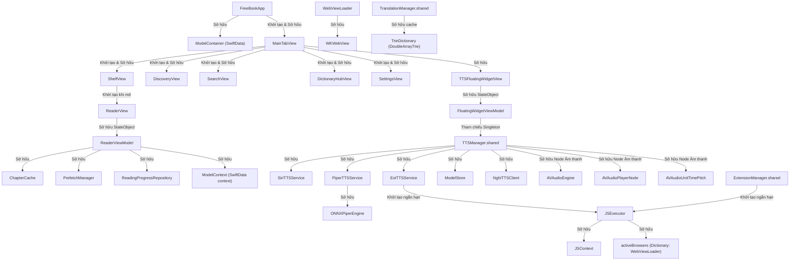

# Đồ thị Sở hữu Đối tượng (Ownership Graph)

Tài liệu này mô tả mối quan hệ sở hữu đối tượng (Object Ownership) trong dự án FreeBook.

## Ghi chú thủ công (Human Notes)
*Ghi chú thủ công của con người.*

<!-- GENERATED START -->
## 1. Sơ đồ cây Sở hữu Tổng thể

---

## 2. Chi tiết các mối quan hệ sở hữu chính

### 2.1. Phân hệ Giao diện & Trình đọc (UI & Reader)
*   **`FreeBookApp`** sở hữu:
    *   `ModelContainer`: Tồn tại vĩnh viễn cùng vòng đời của ứng dụng.
    *   `MainTabView`: Root view của ứng dụng.
*   **`ReaderView`** sở hữu:
    *   `ReaderViewModel` (thông qua `@StateObject`): Vòng đời của ViewModel gắn liền với sự tồn tại của `ReaderView` trên màn hình. Khi người dùng đóng trình đọc, `ReaderViewModel` sẽ bị hủy.
*   **`ReaderViewModel`** sở hữu:
    *   `ChapterCache`: Cache quản lý vị trí cuộn trên RAM.
    *   `PrefetchManager`: Quản lý các task tải trước nội dung chương.
    *   `ReadingProgressRepository`: Cầu nối trung gian để lưu vị trí đọc.
    *   `ModelContext`: Ngữ cảnh ghi đĩa của SwiftData trên Main Thread.

### 2.2. Phân hệ Giọng đọc & Âm thanh (TTS & Audio)
*   **`TTSManager`** (Singleton - `TTSManager.shared`):
    *   Là một Singleton sở hữu lâu dài toàn bộ vòng đời ứng dụng.
    *   Sở hữu các node tín hiệu âm thanh `AVAudioEngine`, `AVAudioPlayerNode`, `AVAudioUnitTimePitch`.
    *   Sở hữu các dịch vụ phát âm độc lập: `SiriTTSService`, `ExtTTSService`, `PiperTTSService`.
    *   Sở hữu bộ lưu trữ model giọng đọc `ModelStore` và API client `NghiTTSClient`.
*   **`PiperTTSService`** sở hữu:
    *   `ONNXPiperEngine`: Nhân Piper C++ chạy qua thư viện ONNX để sinh giọng đọc offline.

### 2.3. Phân hệ Extension & JS Runtime (Extension Engine)
*   **`ExtensionManager`** (Singleton):
    *   Không trực tiếp sở hữu lâu dài các engine chạy JS.
    *   Khởi tạo ngắn hạn các đối tượng `JSExecutor` cho từng tác vụ bóc tách. Đối tượng `JSExecutor` sẽ bị hủy và giải phóng hoàn toàn sau khi tác vụ bất đồng bộ hoàn thành, giải phóng bộ nhớ `JSContext`.
*   **`JSExecutor`** sở hữu:
    *   `JSContext`: Ngữ cảnh chạy JS biệt lập.
    *   `activeBrowsers`: Từ điển quản lý các `WebViewLoader` hoạt động phục vụ headless browser.
*   **`WebViewLoader`** sở hữu:
    *   `WKWebView`: Thực thể browser chạy ngầm để bypass Cloudflare hoặc nạp nội dung động.

### 2.4. Phân hệ Dịch thuật & Từ điển (Translation)
*   **`TranslationManager`** (Singleton):
    *   Sở hữu các thực thể từ điển khổng lồ `vietPhraseDict`, `namesDict`, `pronounsDict`, `luatNhanDict` kiểu `TrieDictionary`. Các từ điển này được nạp vào bộ nhớ RAM khi ứng dụng khởi chạy và được giữ lại để dịch nhanh.
    *   Sở hữu cache dịch thuật của từng cuốn sách `bookDicts`. Cache này sẽ được dọn dẹp khi nhận được cảnh báo bộ nhớ từ hệ điều hành.

---

## 3. Rủi ro về Sở hữu (Ownership Risks)

1.  **Strong Reference Cycles (Vòng lặp tham chiếu mạnh)**:
    *   Các closure callback trong `TTSManager` nếu capture `self` dưới dạng strong reference sẽ khiến `TTSManager` giữ chặt các tài nguyên xung quanh. Việc dùng `[weak self]` ở các callback này là bắt buộc.
2.  **Rò rỉ WKWebView trong WebViewLoader**:
    *   `WebViewLoader` giữ `WKWebView`. Nếu `deinit` của `WebViewLoader` không chạy đúng cách hoặc `activeBrowsers` không được giải phóng khi đóng JS context, `WKWebView` sẽ bị lọt (leak), tiêu hao bộ nhớ rất nhanh.
<!-- GENERATED END -->
