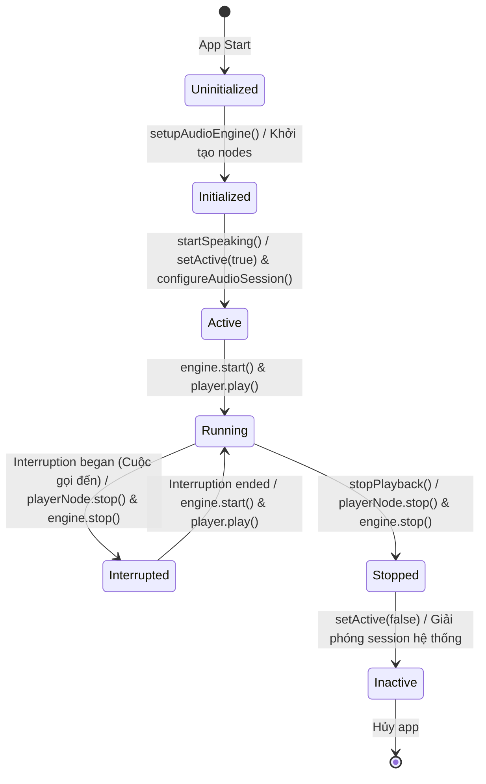

# Vòng đời Tài nguyên Hệ thống (Resource Lifecycle)

Tài liệu này chi tiết hóa vòng đời (khởi tạo, phân bổ, sử dụng, thu hồi và giải phóng) của các tài nguyên hệ thống đặc biệt trong dự án FreeBook: Phiên âm thanh (`AVAudioEngine`, `AVAudioSession`), các tác vụ nền (`Task`), thông báo hệ thống (`NotificationCenter`), ngữ cảnh cơ sở dữ liệu (`ModelContext` của SwiftData) và trình duyệt ngầm (`WKWebView`).

## Ghi chú thủ công (Human Notes)
*Ghi chú thủ công của con người.*

<!-- GENERATED START -->
## Reader resource lifecycle update (1.3.11, supersedes 1.3.10)

The navigation debounce holds only the newest manual target for 300 ms. One navigation worker waits for any started extension fetch to return, then checks generation before committing. Shutdown cancels both tasks and clears queued navigation.

Speculative loading owns a separate 750 ms settled timer and requests only N+1. It is canceled by navigation, Reader shutdown, or same-book TTS playback. `PrefetchManager` retains concurrency slots until cancellation-insensitive extension work actually returns.

The chapter-list store and its lazy list stay allocated while Reader is alive, then release together. Individual cache icon updates mutate one row object and allocate no replacement list.

## 1. Vòng đời AVAudioEngine & AVAudioSession (Âm thanh nền)

Dự án FreeBook sử dụng các thư viện đa phương tiện cấp thấp để phát TTS ổn định dưới nền.



### Chi tiết các bước vòng đời:
1.  **Khởi tạo (Initialization)**: `audioEngine`, `playerNode` và `timePitchNode` được khởi tạo và kết nối một lần duy nhất qua `setupAudioEngine()`. Định dạng kết nối ban đầu là `nil`.
2.  **Kích hoạt Session (Activation)**: `configureAudioSession()` cấu hình category `.playback`, mode `.spokenAudio` và gọi `setActive(true)`. Lúc này, hệ thống iOS cấp quyền chiếm dụng kênh phát âm thanh cho FreeBook.
3.  **Lập lịch phát (Scheduling & Playback)**: 
    *   Buffer âm thanh PCM được nạp vào RAM cache `preloadedWavs`.
    *   Gọi `player.scheduleBuffer(buffer, completionHandler:)`.
    *   Gọi `try engine.start()` và `player.play()`.
4.  **Tách/Kết nối lại động (Re-connection)**: Để tránh tiếng pop/click do re-sync codec, `TTSManager` so sánh định dạng buffer. Chỉ khi `lastBufferFormat != buffer.format`, nó mới thực hiện `disconnectNodeOutput` và `connect` lại các node.
5.  **Dừng & Thu hồi (Deactivation)**: Khi dừng phát hoàn toàn (`stopPlayback` với `keepWidget = false`), hệ thống gọi `playerNode.stop()`, `audioEngine.stop()`, sau đó trả lại kênh âm thanh cho hệ thống qua `AVAudioSession.sharedInstance().setActive(false)`.

---

## 2. Vòng đời của Task chạy ngầm (Asynchronous Tasks)

FreeBook quản lý nhiều tác vụ bất đồng bộ thông qua mô hình Structured Concurrency của Swift:

1.  **Debounce DB Save Task (`dbSaveTask`)**:
    *   *Khởi tạo*: Tạo mới trong `ReaderViewModel.updateProgress` khi vị trí đọc thay đổi.
    *   *Trì hoãn*: Thực thi `try await Task.sleep` chờ 3 giây.
    *   *Hủy bỏ*: Nếu người dùng cuộn tiếp trước khi hết 3 giây, task cũ bị hủy lập tức qua `dbSaveTask?.cancel()`.
2.  **Download Tasks (Tác vụ tải nền)**:
    *   *Khởi tạo*: Kích hoạt qua `Task.detached(priority: .background)` để đẩy hoàn toàn tác vụ I/O và mạng ra khỏi Main Thread.
    *   *Giám sát*: Vòng lặp tải chương thường xuyên kiểm tra cờ `Task.isCancelled` hoặc `isCancelled` từ `DownloadManager`.
    *   *Hủy bỏ*: Khi phát hiện cờ hủy, task tự giải phóng các đối tượng kết nối và thoát vòng lặp an toàn.

---

## 3. Vòng đời của Ngữ cảnh Cơ sở dữ liệu (ModelContext)

Để tránh lỗi tranh chấp dữ liệu (Data Race) trong SwiftData, việc quản lý vòng đời `ModelContext` được tách biệt:

*   **Main Thread Context**: `@Query` và `modelContext` trong `ReaderViewModel` được gắn với Main Actor để phục vụ hiển thị trực tiếp lên giao diện SwiftUI. Tự động lưu qua hệ thống quản lý của SwiftUI.
*   **Background Context**:
    *   *Khởi tạo*: Trong các background task, một context mới được tạo: `let bgContext = ModelContext(container)`.
    *   *Sử dụng*: Mọi thao tác truy vấn, cập nhật nội dung chương, hoặc tạo mới book được thực hiện trên `bgContext`.
    *   *Ghi đĩa*: Gọi `try? bgContext.save()` để ghi xuống file SQLite ngầm.
    *   *Giải phóng*: Context bị hủy và giải phóng hoàn toàn sau khi hàm kết thúc.

---

## 4. Vòng đời Trình duyệt Ngầm (WKWebView)

WKWebView được sử dụng để tải các trang web chứa mã bảo vệ Cloudflare hoặc nội dung động.

*   **Khởi tạo**: Khởi tạo `WebViewLoader()` bên trong `JSExecutor.browserNewBlock` (luôn ép buộc chạy trên Main Thread thông qua `DispatchQueue.main.sync` hoặc `DispatchQueue.main.async`).
*   **Tải trang**: Gọi `loader.load(...)` và chặn luồng gọi bằng `DispatchSemaphore` cho đến khi delegate `didFinish navigation` báo hoàn thành.
*   **Thu hồi**: Được giải phóng trong `WebViewLoader.deinit`. Để tránh crash bộ nhớ trên iOS, việc hủy `WKWebView` được chuyển tiếp an toàn về Main Thread:
    ```swift
    deinit {
        let wv = self.webView
        DispatchQueue.main.async {
            wv.configuration.userContentController.removeAllUserScripts()
            wv.navigationDelegate = nil
        }
    }
    ```

---

## 5. Vòng đời của các Callbacks/Closures trên Singleton (Tránh rò rỉ tham chiếu)
*   **Vấn đề**: Khi một View đăng ký lắng nghe callbacks từ một dịch vụ Singleton (như `TTSManager.shared.onChapterFinished = { ... }`), dịch vụ Singleton sẽ giữ chặt tham chiếu đến View (thông qua closure gán). Điều này dẫn đến việc View không thể deinit (bị rò rỉ bộ nhớ dưới dạng Ghost Reference) ngay cả khi đã bị đóng/dismiss khỏi UI.
*   **Giải pháp trong FreeBook**:
    *   *Khởi tạo*: View (như `ReaderView.swift`) đăng ký callbacks cho `TTSManager` khi xuất hiện (`.onAppear` hoặc khi khởi chạy TTS).
    *   *Giải phóng*: Khi View biến mất, modifier `.onDisappear` bắt buộc phải dọn dẹp các callbacks này:
        ```swift
        ttsManager.onChapterFinished = nil
        ttsManager.onChapterNext = nil
        ttsManager.onChapterPrev = nil
        ```
    *   *Độc lập hóa nghiệp vụ*: Trình quản lý singleton (`TTSManager`) tự động hóa các tiến trình nội bộ (như tự chuyển chương qua `advanceToNextChapter` mà không cần callbacks trung gian điều khiển từ View).

#### Reader/TTS unified pipeline (2026-07)

- `ChapterTextNormalizer` is the single source for LF newlines, trimmed non-empty lines, compact paragraph IDs, and UTF-16 ranges. `ChapterContentRepository` produces one normalized `ChapterDocument` for both Reader and TTS.
- Reader uses `ReaderLoadState` with bootstrap retry/clamping, typed failures, generation checks, cache-first rendering, and a short opacity crossfade only for newly fetched content. `ReaderRoute.chapterIndex` preserves the selected TOC index through navigation.
- `TTSParagraphBuilder` chunks normalized lines without renumbering parent paragraph IDs; replacement output is checked before synthesis. TTS asynchronous work is guarded by session identity and TTS owns progress while playing.
- `ReadingProgressStore` coalesces RAM snapshots in an actor and flushes from background contexts on checkpoints, dismissal, and app backgrounding. Legacy window/tab Reader, duplicate progress repository, and `TTSSession` mirror are removed.
- Shared chapter fetch tasks are unstructured repository-owned work so Reader cancellation cannot abort a load needed by TTS; force refresh cancels only the superseded load for the same key.
- Pending SwiftData writes retry up to three times, survive Reader dismissal, and are flushed by Reader/app lifecycle checkpoints. Cached chapter models survive TOC reconciliation when their URL remains present.

<!-- GENERATED END -->
