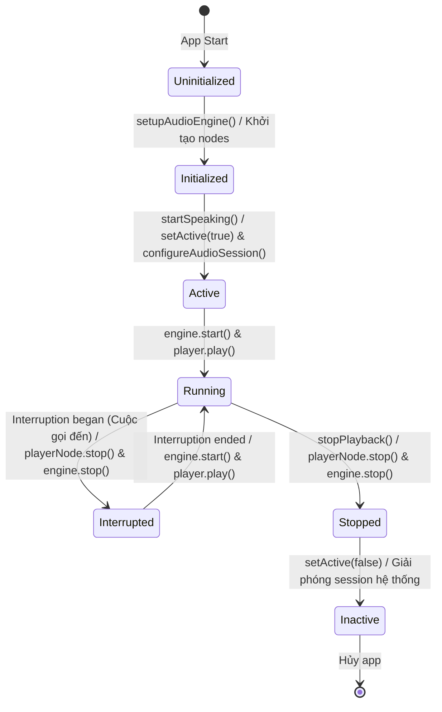

# Vòng đời Tài nguyên Hệ thống (Resource Lifecycle)

Tài liệu này chi tiết hóa vòng đời (khởi tạo, phân bổ, sử dụng, thu hồi và giải phóng) của các tài nguyên hệ thống đặc biệt trong dự án FreeBook: Phiên âm thanh (`AVAudioEngine`, `AVAudioSession`), các tác vụ nền (`Task`), thông báo hệ thống (`NotificationCenter`), ngữ cảnh cơ sở dữ liệu (`ModelContext` của SwiftData) và trình duyệt ngầm (`WKWebView`).

## Ghi chú thủ công (Human Notes)
*Ghi chú thủ công của con người.*

<!-- GENERATED START -->
## NghiTTS refill failure lifecycle (1.3.147)

* Mỗi lỗi refill được sở hữu bởi khóa `sessionID + chapterIndex + paragraphIndex`; success xóa state, lỗi không retry hoặc attempt thứ hai chuyển state sang blocked.
* Lần retry duy nhất được giữ bởi `nghiRefillRetryTask`. Trong cooldown 1 giây, scheduler không tạo refill mới; task sở hữu generation xóa reference của chính nó trước khi gọi lại cửa sổ prefetch.
* `cancelNghiRefill()` tăng refill generation, hủy synthesis/retry task và xóa failure states khi cache/session/chapter bị thay thế. Cancellation path không mutate dictionary và stale context bị loại trước khi ghi state.
* Audio khoảng lặng dùng dữ liệu WAV/PCM thông thường và không tạo thêm engine hoặc tài nguyên phát riêng.

## NghiTTS safeCachedTimeThreshold task lifecycle (1.3.141)

* Refill tasks allocate single paragraph requests when `cachedTime < threshold` and optional reserve items < 2 (max 5 logical payloads total). When `cachedTime >= threshold`, `nghiWakeTask` holds a cancellable deadline sleep task ($\Delta t = \text{cachedTime} - \text{threshold}$).
* Pause releases `nghiWakeTask` and queued optional requests in `PiperSynthesisCoordinator.cancelPendingRequests()`. Active ONNX inference completes and caches into `preloadedData[index]`.
* Settings lifecycle: `prepareForSettings` captures `TTSSettingsSnapshot`. If only `nghittsSafeCachedTimeThreshold` changes, `resumeAfterSettings` restores `wasPlaying` state without clearing audio buffers or restarting audio.

## Chapter repository resource lifecycle (1.3.114)

* Shared normalized documents are held by a dual-limit LRU (12 entries and 12 MiB estimated cost). Least-recent entries are released on insertion pressure; all reusable entries are released on memory warning, while active consumer values and persistent storage remain intact.
* Each repository-owned in-flight task retains only active UUID waiters. Canceling a waiter resumes it with `CancellationError`; zero remaining waiters cancel and release the task. Completion/failure resumes all remaining waiters exactly once and removes the entry.
* `chapterAdvanceTask` is retained by `TTSManager` only for fallback next-chapter loading/processing. A monotonic generation prevents an older task's cleanup from releasing a newer task reference.

## TTS presentation resource lifecycle (1.3.112)

* The floating cover allocates no recurring timeline/display-rate resource during playback. Its parent-owned loader retains one decoded `UIImage` and a book/URL key; expanded/peeking transitions reuse them and only a true cover-identity change initiates local/remote loading.
* Projection readers own only selected Combine subscriptions and one small Equatable snapshot. Reader book scoping prevents another session's paragraph/highlight stream from producing view publications.
* Now Playing owns at most one static metadata task and one cached `MPMediaItemArtwork`. A matching key reuses both; replacement, stop, or dictionary invalidation cancels/clears them. Cover download is requested at most once per static key and a successful save rebuilds the cache.
* Nghi model warm-up is delayed and cancelable. App initialization schedules it only when Nghi is already selected; switching to Siri/Google/Ext cancels pending preparation.

## Web-extension DOM ready polling resource lifecycle (1.3.39)

* **Exactly-once completion**: Polling registers a `DispatchQueue.main.asyncAfter` work item. Closing the browser or launching a new wait cancels any pending polling timer and resolves the wait immediately (exactly-once callback).
* **Single wait constraint**: A browser instance supports a single active wait constraint; any new wait request automatically cancels the previous wait task.

## Book storage and pagination resource lifecycle (1.3.34)

* **Background Deletion Tasks**: Deleting a book commits model context changes first. Upon successful database saving, physical file cleanup (covers/bin) is spawned inside a detached background `Task`. If deletion fails, resources enter the `UserDefaults` queue, surviving application restarts.
* **Retry Queue Persistence**: At launch in `FreeBookApp` startup, `drainRetryQueue()` is executed to process the failed deletion queue. It retries physical deletion of each path up to 3 times before discarding to prevent resource leaks.
* **Paged Rows Memory Lifecycle**: The table-of-contents store keeps one lightweight `ReaderChapterRowState` per loaded row in `rows`; pages are fetched lazily by display position (100 rows/page) and loaded rows are never evicted, so memory scales with the pages actually visited, not the total chapter count. Placeholder metadata (`ChapterRowItem`) remains lightweight and placeholder rows are materialized on demand.

## Reader resource lifecycle update (1.3.11, supersedes 1.3.10)

The navigation debounce holds only the newest manual target for 300 ms. One navigation worker waits for any started extension fetch to return, then checks generation before committing. Shutdown cancels both tasks and clears queued navigation.

Speculative loading owns a separate 750 ms settled timer and requests only N+1. It is canceled by navigation, Reader shutdown, or same-book TTS playback. `PrefetchManager` retains concurrency slots until cancellation-insensitive extension work actually returns.

The chapter-list store and its lazy list stay allocated while Reader is alive, then release together. Individual cache icon updates mutate one row object and allocate no replacement list.

## 1. Vòng đời AVAudioEngine & AVAudioSession (Âm thanh nền)

Dự án FreeBook sử dụng các thư viện đa phương tiện cấp thấp để phát TTS ổn định dưới nền.


```mermaid
stateDiagram-v2
    [*] --> Uninitialized : App Start
    Uninitialized --> Initialized : setupAudioEngine() / Khởi tạo nodes
    
    Initialized --> Active : startSpeaking() / setActive(true) & configureAudioSession()
    Active --> Running : engine.start() & player.play()
    
    Running --> Interrupted : Interruption began (Cuộc gọi đến) / playerNode.stop() & engine.stop()
    Interrupted --> Running : Interruption ended / engine.start() & player.play()
    
    Running --> Stopped : stopPlayback() / playerNode.stop() & engine.stop()
    Stopped --> Inactive : setActive(false) / Giải phóng session hệ thống
    Inactive --> [*] : Hủy app
```

### Chi tiết các bước vòng đời:
1.  **Khởi tạo (Initialization)**: `audioEngine`, `playerNode` và `timePitchNode` được khởi tạo và kết nối một lần duy nhất qua `setupAudioEngine()`. Định dạng kết nối ban đầu là `nil`.
2.  **Kích hoạt Session (Activation)**: `configureAudioSession()` cấu hình category `.playback`, mode `.spokenAudio` với options `.duckOthers` + `.allowBluetoothA2DP` và gọi `setActive(true)`. Lúc này, hệ thống iOS cấp quyền chiếm dụng kênh phát âm thanh cho FreeBook. Ghi chú (1.3.180): option `.allowBluetooth` (HFP) đã được bỏ vì không hợp lệ với category `.playback` — kết hợp này khiến `setCategory` ném `OSStatus -50` (`AVAudioSessionErrorCodeBadParam`), làm `setActive(true)` không bao giờ chạy.
3.  **Lập lịch phát (Scheduling & Playback)**: 
    *   Buffer âm thanh PCM được nạp vào RAM cache `preloadedWavs`.
    *   Gọi `player.scheduleBuffer(buffer, completionHandler:)`.
    *   Gọi `try engine.start()` và `player.play()`.
4.  **Tách/Kết nối lại động (Re-connection)**: Để tránh tiếng pop/click do re-sync codec, `TTSManager` so sánh định dạng buffer. Chỉ khi `lastBufferFormat != buffer.format`, nó mới thực hiện `disconnectNodeOutput` và `connect` lại các node.
5.  **Dừng & Thu hồi (Deactivation)**: Khi dừng phát hoàn toàn (`stopPlayback` với `keepWidget = false`), hệ thống gọi `playerNode.stop()`, `audioEngine.stop()`, sau đó trả lại kênh âm thanh cho hệ thống qua `AVAudioSession.sharedInstance().setActive(false)`.

---

## 2. Vòng đời của Task chạy ngầm (Asynchronous Tasks)

FreeBook quản lý nhiều tác vụ bất đồng bộ thông qua mô hình Structured Concurrency của Swift:

1.  **Debounce DB Save Task (`dbSaveTask`)**:
    *   *Khởi tạo*: Tạo mới trong `ReaderViewModel.updateProgress` khi vị trí đọc thay đổi.
    *   *Trì hoãn*: Thực thi `try await Task.sleep` chờ 3 giây.
    *   *Hủy bỏ*: Nếu người dùng cuộn tiếp trước khi hết 3 giây, task cũ bị hủy lập tức qua `dbSaveTask?.cancel()`.
2.  **Download Tasks (Tác vụ tải nền)**:
    *   *Khởi tạo*: Kích hoạt qua `Task.detached(priority: .background)` để đẩy hoàn toàn tác vụ I/O và mạng ra khỏi Main Thread.
    *   *Giám sát*: Vòng lặp tải chương thường xuyên kiểm tra cờ `Task.isCancelled` hoặc `isCancelled` từ `DownloadManager`.
    *   *Hủy bỏ*: Khi phát hiện cờ hủy, task tự giải phóng các đối tượng kết nối và thoát vòng lặp an toàn.

---

## 3. Vòng đời của Ngữ cảnh Cơ sở dữ liệu (ModelContext)

Để tránh lỗi tranh chấp dữ liệu (Data Race) trong SwiftData, việc quản lý vòng đời `ModelContext` được tách biệt:

*   **Main Thread Context**: `@Query` và `modelContext` trong `ReaderViewModel` được gắn với Main Actor để phục vụ hiển thị trực tiếp lên giao diện SwiftUI. Tự động lưu qua hệ thống quản lý của SwiftUI.
*   **Background Context**:
    *   *Khởi tạo*: Trong các background task, một context mới được tạo: `let bgContext = ModelContext(container)`.
    *   *Sử dụng*: Mọi thao tác truy vấn, cập nhật nội dung chương, hoặc tạo mới book được thực hiện trên `bgContext`.
    *   *Ghi đĩa*: Gọi `try? bgContext.save()` để ghi xuống file SQLite ngầm.
    *   *Giải phóng*: Context bị hủy và giải phóng hoàn toàn sau khi hàm kết thúc.

---

## 4. Vòng đời Trình duyệt Ngầm (WKWebView)

WKWebView được sử dụng để tải các trang web chứa mã bảo vệ Cloudflare hoặc nội dung động.

*   **Khởi tạo**: Khởi tạo `WebViewLoader()` bên trong `JSExecutor.browserNewBlock` (luôn ép buộc chạy trên Main Thread thông qua `DispatchQueue.main.sync` hoặc `DispatchQueue.main.async`).
*   **Tải trang**: Gọi `loader.load(...)` và chặn luồng gọi bằng `DispatchSemaphore` cho đến khi delegate `didFinish navigation` báo hoàn thành.
*   **Thu hồi**: Được giải phóng trong `WebViewLoader.deinit`. Để tránh crash bộ nhớ trên iOS, việc hủy `WKWebView` được chuyển tiếp an toàn về Main Thread:
    ```swift
    deinit {
        let wv = self.webView
        DispatchQueue.main.async {
            wv.configuration.userContentController.removeAllUserScripts()
            wv.navigationDelegate = nil
        }
    }
    ```

---

## 5. Vòng đời của các Callbacks/Closures trên Singleton (Tránh rò rỉ tham chiếu)
*   **Vấn đề**: Khi một View đăng ký lắng nghe callbacks từ một dịch vụ Singleton (như `TTSManager.shared.onChapterFinished = { ... }`), dịch vụ Singleton sẽ giữ chặt tham chiếu đến View (thông qua closure gán). Điều này dẫn đến việc View không thể deinit (bị rò rỉ bộ nhớ dưới dạng Ghost Reference) ngay cả khi đã bị đóng/dismiss khỏi UI.
*   **Giải pháp trong FreeBook**:
    *   *Khởi tạo*: View (như `ReaderView.swift`) đăng ký callbacks cho `TTSManager` khi xuất hiện (`.onAppear` hoặc khi khởi chạy TTS).
    *   *Giải phóng*: Khi View biến mất, modifier `.onDisappear` bắt buộc phải dọn dẹp các callbacks này:
        ```swift
        ttsManager.onChapterFinished = nil
        ttsManager.onChapterNext = nil
        ttsManager.onChapterPrev = nil
        ```
    *   *Độc lập hóa nghiệp vụ*: Trình quản lý singleton (`TTSManager`) tự động hóa các tiến trình nội bộ (như tự chuyển chương qua `advanceToNextChapter` mà không cần callbacks trung gian điều khiển từ View).

#### Reader/TTS unified pipeline (2026-07)

- `ChapterTextNormalizer` is the single source for LF newlines, trimmed non-empty lines, compact paragraph IDs, and UTF-16 ranges. `ChapterContentRepository` produces one normalized `ChapterDocument` for both Reader and TTS.
- Reader uses `ReaderLoadState` with bootstrap retry/clamping, typed failures, generation checks, cache-first rendering, and a short opacity crossfade only for newly fetched content. `ReaderRoute.chapterIndex` preserves the selected TOC index through navigation.
- `TTSParagraphBuilder` chunks normalized lines without renumbering parent paragraph IDs; replacement output is checked before synthesis. TTS asynchronous work is guarded by session identity and TTS owns progress while playing.
- `ReadingProgressStore` coalesces RAM snapshots in an actor and flushes from background contexts on checkpoints, dismissal, and app backgrounding. Legacy window/tab Reader, duplicate progress repository, and `TTSSession` mirror are removed.
- Shared chapter fetch tasks are repository-owned and subscriber-aware. Reader cancellation removes only its waiter, so a TTS waiter preserves the load; when the final waiter leaves, the underlying task is canceled. Force refresh cancels the superseded load and resumes all of its prior waiters with cancellation.
- `ReaderViewModel.translationRefreshTask` owns dictionary-driven chapter rebuilds. A newer dictionary update cancels the previous refresh, loaded chapter snapshots are processed sequentially with the displayed chapter first, and deinit cancels the remaining work. Live TTS audio-prefetch tasks are not canceled by this Reader event.
- Pending SwiftData writes retry up to three times, survive Reader dismissal, and are flushed by Reader/app lifecycle checkpoints. Cached chapter models survive TOC reconciliation when their URL remains present.
- Book deletion database context changes commit first, spawning a background task (`Task.detached`) for physical file cleanup. Physical file cleanup failures enter a persistent retry queue in `UserDefaults` and undergo retry cycles at app launch up to 3 times before discard.
- TOC pagination keeps loaded row states in `rows` without eviction; pages are loaded lazily per display position (100 rows/page) and only pages actually visited consume memory, with in-flight tasks deduplicated via `inFlightPages` and a single 300ms retry for failed pages.

- Remote TTS jobs enter a single priority queue. A job owns its service operation until completion; duplicate callers own only continuations. At `.serious`, only the current/N+1 lifecycle may survive and distant/next-chapter work is released; `.critical`, pause, or stop cancels the applicable remaining continuations/tasks.
- `ExtTTSRuntime` keeps its `JSExecutor` across chunks of the same extension/config. It cancels registered network tasks and releases the context when identity changes, an execution fails, or full TTS cache cleanup requests reset.
- Native sync fetch registers each `URLSessionDataTask`, cancels it on Swift task cancellation/timeout, and waits a bounded interval for its completion callback before returning from the JS bridge.
- The cached NghiTTS ORT session keeps one worker for its lifetime and prefers XNNPACK when available. Essential N+1 refill has no sleep and survives `.serious`; N+2+ may sleep and is removed under pressure, while `.critical` cancels all refill until a later window update after cooling.

<!-- GENERATED END -->
