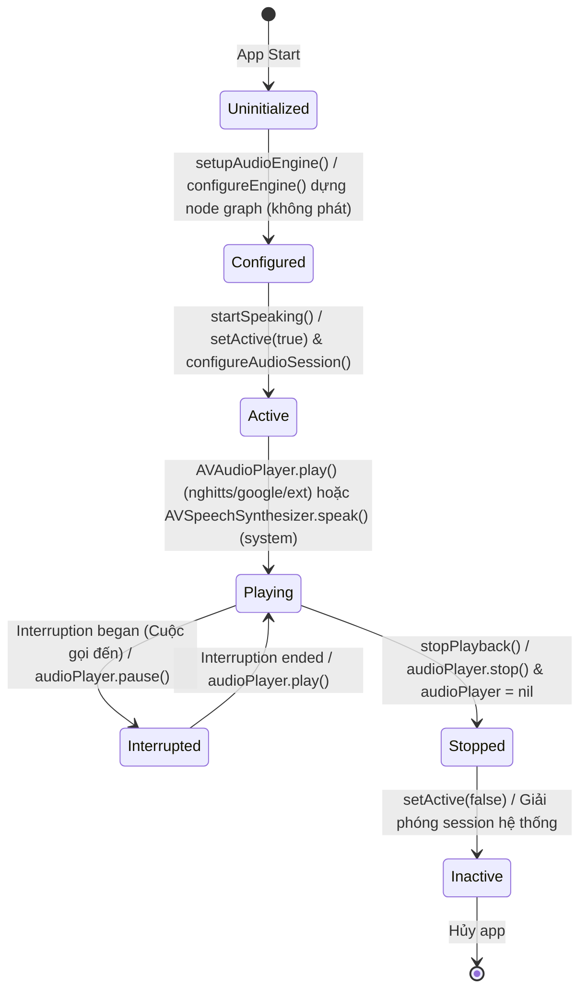

# Vòng đời Tài nguyên Hệ thống (Resource Lifecycle)

Tài liệu này chi tiết hóa vòng đời (khởi tạo, phân bổ, sử dụng, thu hồi và giải phóng) của các tài nguyên hệ thống đặc biệt trong dự án FreeBook: Phiên âm thanh (`AVAudioSession` cùng đường phát thật `AVAudioPlayer`/`AVSpeechSynthesizer`; đồ thị `AVAudioEngine` được dựng nhưng không tham gia phát), các tác vụ nền (`Task`), thông báo hệ thống (`NotificationCenter`), ngữ cảnh cơ sở dữ liệu (`ModelContext` của SwiftData) và trình duyệt ngầm (`WKWebView`).

## Ghi chú thủ công (Human Notes)
*Ghi chú thủ công của con người.*

<!-- GENERATED START -->
## Tài nguyên của request mở rộng widget TTS (1.3.277)

* Tài nguyên mới chỉ là một `Bool` pending trong singleton `TTSFloatingWidgetWindowManager`. Nó được xoá ngay khi reveal chạy, không persist và không có cơ chế thu hồi riêng.
* Không thêm window, timer hay gesture recognizer. Request dùng lại window/container/widget view model hiện có; auto-hide timer vẫn là `FloatingWidgetViewModel.autoHideTask` sẵn có.
* Nếu widget chưa được tạo, pending bool giữ ý định cho lần `showWidget()` kế tiếp; nếu widget đã tồn tại, request reveal chạy ngay và không giữ thêm tài nguyên.

## Không tài nguyên mới cho highlight chuẩn bị TTS (1.3.276)

* Lượt này chỉ thêm hai `NSRange?`/`Int?` trong snapshot và một cờ render `Bool`; không thêm task nền, timer, observer, file, cache hay buffer audio.
* Không có vòng đời thu hồi riêng: snapshot reset/replace của `TTSManager` làm các field chuẩn bị về `nil`; UIKit text view chỉ repaint attribute nền như đường highlight cũ.
* Vì state chuẩn bị không giữ audio payload và không chạy synthesis riêng, các trần cache PCM/preload của NghiTTS/Google/Ext không đổi.

## Tài nguyên mới của phân hệ rule dịch (1.3.274)

| Tài nguyên | Trần | Dọn khi nào |
|---|---|---|
| `QuickTranslationRuleBookStore.snapshots` | **LRU cap 3** truyện | Đẩy phần tử `lruOrder.first` khi vượt cap; `invalidate(bookId:)` khi đổi nguồn hoặc CRUD phạm vi đó |
| `QuickTranslationRuleDisableStore` cache mẫu | không cap (một `[String]` mỗi phạm vi, vài chục mẫu) | `invalidateCache(for:)`; ghi file thành công thì thay tại chỗ |
| Memo `QuickTranslationRuleEngine.cache` | 64 entry (không đổi) | `TranslateUtils.invalidateCache` gọi `clearCache()` ở dòng đầu |

* **Bộ rule riêng compile lazy, không prewarm.** Lần đọc đầu của một truyện mới compile file của nó; bộ riêng nhỏ nên compile lại sau khi bị LRU đẩy ra là rẻ. Không thêm lời gọi nào vào `FreeBookApp.onAppear` — `QuickTranslationRuleStore.prewarm()` vẫn là điểm prewarm duy nhất, và nó chỉ lo bộ chung.
* **Đọc snapshot trong lúc dựng view là an toàn**: `snapshot(for:)` và `disabledPatterns(for:)` chỉ điền cache, **không** bump `revision`, nên không có "Modifying state during view update". Chỉ đường ghi (`setDisabled`, CRUD, `invalidate`) mới publish, và luôn từ action của người dùng.
* **File tắt hết mẫu thì bị xoá** thay vì để lại file rỗng — `translate/` không tích rác sau khi người dùng bật lại hết rule.
* Hai `NSLock` của `QuickTranslationRuleBookStore` luôn khoá theo một chiều `mutationLock → lock` (giao dịch sửa file ở ngoài, đọc/ghi cache ở trong); `QuickTranslationRuleDisableStore` đọc file **ngoài** vùng khoá rồi mới khoá để ghi cache, nên `NSLock` không đệ quy vẫn an toàn.

## Rule dịch Quick Translate: engine, màn hình quản lý và công tắc (1.3.269)

* **Bộ nhớ mới thường trú, nhỏ nhưng phải biết**: một `QuickTranslationRuleSnapshot` giữ toàn bộ rule đã compile (AST + template + literal) cộng `QuickTranslationLiteralIndex`. Với bộ mặc định 633 rule (nguồn 36 KB, tải từ HuggingFace) đây là cỡ vài trăm KB; với `Rule_new.txt` (nguồn 690 KB, 17.278 rule) là cỡ vài MB và **không có cơ chế nhả** — snapshot sống tới khi bị thay bằng snapshot khác. Đây là đánh đổi có chủ ý: compile mỗi lần dịch là không dùng được.
* **Chỉ tồn tại đúng một snapshot tại một thời điểm.** Swap là gán một biến dưới `NSLock`, snapshot cũ được ARC thu ngay khi lượt `rewrite` đang chạy (nếu có) kết thúc — vì bên đọc giữ *giá trị* nên không có cửa sổ nào hai bộ rule cùng nằm trong RAM lâu dài.
* **Memo của engine có trần cứng**: `NSCache` countLimit **64** entry, khoá `generation|bookId|md5`, giá trị là `QuickTranslationRewriteResult` (text + mảng segment). Nó tồn tại để lượt dựng span không phải chạy lại matcher, và bị dọn ở `TranslateUtils.clearCache()`/`invalidateCache(bookId:)` cùng nhịp với cache dịch. Khoá có `generation` nên entry của bộ rule cũ không bao giờ bị đọc lại kể cả khi chưa bị dọn.
* **Cấp phát tạm mỗi lượt `rewrite`** (cần biết khi đo hiệu năng): `Array(text.utf16)` **hai lần** (một ở engine, một trong matcher), một `NSString` bridge, một dictionary `[Int: [Int]]` cho tập vị trí bắt đầu, và một `NSString.substring` cho mỗi ứng viên độ dài của token số/từ điển. Tất cả chết cuối lượt; không có buffer nào được giữ lại giữa hai lượt.
* **Danh sách issue bị cắt cứng ở 400 phần tử** (`maxStoredIssues`) trước khi vào `status`, vì `Rule_new.txt` sinh 166 cảnh báo space và có thể nhiều hơn ở bộ khác — số **tổng** vẫn được giữ riêng (`warningCount`) để UI báo đúng.
* **File tạm khi xuất bộ rule** nằm ở `NSTemporaryDirectory()/QuickTranslateRules.txt`, ghi đè mỗi lần xuất, do hệ thống dọn — khác `Documents/Exports/` của đường xuất TXT truyện (có `ExportFileNaming` cấp phát tên).
* **Lượt tải bộ rule giữ toàn bộ file trong RAM** (`URLSession.shared.data(from:)`, không dùng file tạm) vì bộ rule đã biết chỉ 36 KB – 690 KB; có trần cứng 8 MB (`maxRuleFileBytes`) chặn trước cả khi parse. Không có tài nguyên nào cần dọn sau khi tải: `Data` chết cuối hàm, file đích ghi bằng `options: .atomic`.

## Không tài nguyên mới; lỗi dọn bản cũ thôi bị chôn (1.3.268)

* **Lượt này không thêm tài nguyên nào phải thu hồi**: không recognizer, không timer, không task nền, không file mới, không buffer. Hai khoá `UserDefaults` mới/cũ (`driveAutoBackupLastRunAt`, `driveAutoBackupLastLinkWarningAt`) là hai `Date` — chi phí không đáng kể và không có vòng đời cần dọn.
* **Bổ sung cho mục 1.3.260 ở dưới**: câu "xoá lỗi chỉ `AppLogger` rồi bỏ qua và số đếm không tăng" vẫn đúng, nhưng nay lỗi **không còn bị chôn hoàn toàn** — `pruneRemoteAutoBackups`/`pruneLocalAutoBackups` trả `(removed:incomplete:)`, `incomplete` gộp cả lỗi `listBackups()` và lỗi xoá từng file, đi tiếp vào `.succeeded(…, pruneIncomplete:)` rồi hiện trong chính toast của lượt. Hệ quả dung lượng không đổi: bản vừa upload còn nguyên, phần vượt `maxVersions` được thử dọn lại ở lượt sau, và **vẫn không** có cơ chế dọn bù nào khác.
* **Vòng đời xoá sách của `BookStorageManager` không đổi một bước nào**: `deleteBooksAsync` chỉ thêm giá trị trả về (`-> Int`, đếm bản ghi đã `delete` + `save`). Thứ tự vẫn là DB commit trước → `Task.detached(priority: .background)` xoá `.bin` → ChapterStore → cover; thất bại vẫn vào `failed_file_deletions_queue`/`failed_chapterstore_deletions_queue` và chỉ được thử lại lúc khởi động (tối đa 3 lần rồi bỏ). Số đếm được lấy **trước** khi task nền chạy, nên nó là số bản ghi DB đã mất, **không** phải bằng chứng file đã được thu hồi — đây là khoảng lệch đã biết giữa con số báo cho người dùng và dung lượng thật sự giải phóng.

## Recognizer thứ hai của repo — lần này cố ý không thu hồi (1.3.266)

* **`UITapGestureRecognizer` của [KeyboardDismissGesture](../../Sources/Common/Utils/KeyboardDismissGesture.swift#L1) là đối lập có chủ ý của recognizer ở 1.3.261.** Cái ở `ReaderUserScrollDetector` **phải** có ba đường thu hồi vì nó gắn lên `UIScrollView` sống lâu hơn subtree chương, nên mỗi lần đổi chương mà không `detach()` là một recognizer chết cộng thêm. Cái này gắn lên **`UIWindow`** — vòng đời của nó *là* vòng đời window, và `target` là singleton sống suốt app, nên không có `dismantleUIView`/`deinit` nào cần dọn.
* **Chốt chống nhân bản không phải là danh sách, mà là chính recognizer**: `installIfNeeded()` so `UIGestureRecognizer.name == "FreeBookKeyboardDismissTap"` trước khi gắn. Cố ý không giữ `NSHashTable<UIWindow>` weak: giữ danh sách thì phải đồng bộ với việc window bị hủy, còn đọc từ chính window thì trạng thái luôn đúng và window chết mang recognizer đi cùng.
* **Vòng tham chiếu recognizer → singleton là có chủ ý** (không `[weak self]`): `#selector`, không phải closure, và singleton vốn không bao giờ bị hủy. Cùng lý do đó, observer `keyboardWillShowNotification` **không** được `removeObserver` — cờ `isObserving` bảo đảm chỉ có đúng một observer, và nó chết cùng process.
* **Window ở level quanh `.alert` không nhận recognizer nào**: `windowLevel == .normal && !isHidden` loại window của toast/TTS widget/widget trình duyệt. Nghĩa là chu kỳ tạo–hủy liên tục của các window đó (`refreshState()` gọi rất thường) không kéo theo bất kỳ tài nguyên nào của phân hệ bàn phím.

## Recognizer là tài nguyên phải thu hồi tay (1.3.261)

* Tài nguyên duy nhất mà 1.3.261 thêm vào là `UIPanGestureRecognizer` của `ReaderUserScrollDetector`. Nó **không** tự biến mất theo `@State`: `UIScrollView` giữ nó strong, mà scroll view sống lâu hơn subtree nội dung chương. Ba đường thu hồi: `dismantleUIView` → `detach()` (đường thường), `attach(to:)` gọi `detach()` trước khi gắn recognizer mới (đổi scroll view), và `Coordinator.deinit` (lưới cuối). Thiếu bất kỳ đường nào thì mỗi lần đổi chương để lại một recognizer chết trên scroll view và `onUserScroll` bị gọi nhiều lần cho một cú kéo.
* Không có timer, task nền, buffer hay file nào mới. Đầu dò **không giữ** dữ liệu chương, không giữ `ReaderViewModel`, chỉ giữ hai closure/giá trị (`threshold`, `onUserScroll`) được ghi lại mỗi `updateUIView` — nên nó không bao giờ giữ một `body` cũ sống quá một vòng cập nhật.
* Vệt tô kết quả tìm không tiêu tài nguyên nào cần thu hồi: `NSRange` được **tính lại mỗi lần render** rồi bỏ, `searchHighlight` chỉ giữ hai số và một chuỗi truy vấn. Đây là lý do chọn state "ý nghĩa" thay vì cache range — không có gì phải invalidate khi chuỗi hiển thị đổi.
* Lượt dọn kho **chỉ thu hồi bản ghi SwiftData**, không thu hồi file: tiện ích đã cài (`localPath` khác rỗng) bị loại ở bộ lọc nên không có `extensions/<packageId>/` nào bị bỏ mồ côi. Với tiện ích chưa cài thì `localPath` rỗng đồng nghĩa không có thư mục nào từng được tạo.


## Trần 5 bản `freebook-auto-*.fbbackup` ở hai phía và ngân sách của lượt nền (1.3.260)

* **Tài nguyên đắt nhất của đợt này là dung lượng — trên Drive *và* trong máy — nên trần được áp ở cả hai phía.** Mỗi lượt tự động sinh một archive trong `backups/` (`LocalBackupStore` vẫn là chủ duy nhất thư mục này) rồi tải lên; ngay sau upload, `pruneRemoteAutoBackups()` và `pruneLocalAutoBackups()` bỏ phần vượt `DriveAutoBackupPolicy.maxVersions = 5`. Không dọn thì thư mục `backups/` phình vô hạn: **file `.fbbackup` không bao giờ được app tự xoá theo tuổi**, khác `app_logs.txt` (ngưỡng 5 MB) và `chapters/`.
* **Thứ tự cố ý: upload xong mới dọn.** Nghĩa là đỉnh chiếm chỗ tức thời là 6 bản, không phải 5; đổi lại nếu upload thất bại thì không bản cũ nào bị mất. `.dropFirst(5)` chạy trên danh sách đã sắp mới-nhất-trước (`createdAt` cho Drive, thứ tự sẵn có của `LocalBackupStore.list()` cho máy).
* **Hàng rào an toàn của phép xoá là tiền tố tên file.** Chỉ file khớp `BackupPaths.isAutoBackupFileName` (`freebook-auto-` + đuôi `.fbbackup`) được đếm và được xoá — bản thủ công `freebook-*`, bản người dùng đổi tên, bản tải lên Drive bằng tay đều **vô hình** với hai hàm dọn, dù nằm cùng thư mục `FreeBookBackups`. Đổi tiền tố ở `BackupPaths` là đổi luôn tập file có thể bị xoá: đây là chỗ duy nhất phải cẩn thận khi thêm loại archive mới.
* **Xoá lỗi không bao giờ làm hỏng lượt.** Mỗi file được xoá trong `do/catch` riêng, lỗi chỉ `AppLogger` rồi bỏ qua và số đếm `prunedRemote`/`prunedLocal` không tăng — bản vừa tải lên vẫn nguyên nên không có gì phải rollback. Lần sau chạy sẽ thử xoá lại đúng những file đó.
* **Ngân sách mạng/CPU của lượt nền bị chặn ở ba lớp**: `DriveAutoBackupPolicy.shouldRun()` chặn *lượt* (cooldown mặc định 24 h, hoặc mốc giờ trong ngày); `startupDelayNanoseconds` (~25 s) đẩy việc nén + upload ra khỏi lúc khởi động đang tranh tài nguyên với nạp từ điển/`TTSManager.initialize`/lượt kiểm tra chương mới; `defaultScopes` bỏ `.content` và `.dictShared` nên archive hằng ngày không kéo theo chương offline lẫn từ điển chung vài trăm MB. Mỗi lần mở app có **tối đa một** lượt.
* **Không có tài nguyên nào phải giải phóng tay ở đường mới.** `setBusy(true)` được nhả bằng `defer` (kể cả nhánh `throw`); thư mục staging của `BackupExportWorker` cũng đã tự dọn bằng `defer` như mọi lượt thủ công. Nhưng `BackupZipArchive.makeArchive(from:to:)` ghi **thẳng** ra file đích trong `backups/` (không có `.part` như bên Export), nên app bị kill giữa lúc nén để lại một `freebook-auto-*.fbbackup` **dở** — nó vẫn khớp tiền tố nên lượt sau đếm vào trần và cuối cùng bị dọn theo tuổi; không có cơ chế nào phát hiện archive hỏng sớm hơn lúc người dùng thử khôi phục. `.task` của `MainTabView` bị cancel thì `guard !Task.isCancelled` sau khi ngủ chặn trước khi có bất kỳ I/O nào, và mốc cooldown khi đó **chưa** bị đánh dấu.

## `new_chapters.json` và ngân sách request của lượt dò mục lục (1.3.256)

* **Một file mới trong `applicationSupportDirectory`, một chủ duy nhất.** [NewChapterStore.swift](../../Sources/Services/NewChapters/NewChapterStore.swift#L17) là actor sở hữu `new_chapters.json`: không có nơi nào khác trong `Sources/` mở đường dẫn này. Đọc đĩa **một lần mỗi phiên** (`records: [String: NewChapterRecord]?` là `nil` cho tới lượt truy cập đầu), ghi bằng `Data.write(to:options: .atomic)` nên bị kill giữa lúc ghi thì file cũ còn nguyên chứ không thành JSON dở. Decode lỗi ⇒ `AppLogger` + coi như rỗng: hộp thư mất mốc là chuyện một lượt tải mục lục dựng lại được, còn crash lúc mở Kệ sách thì không.
* **Ghi một lần cho cả batch, không ghi từng truyện.** `run(_:)` gom `[NewChapterRecord]` rồi gọi `save(_ batch:)` đúng một lần ⇒ lượt 20 truyện là **1** lượt ghi file, không phải 20. `markSeen` thoát sớm khi `!hasNew` nên chạm những truyện không có chương mới **không** sinh I/O nào.
* **File không phình theo thời gian**: `prune(keeping:)` chạy mỗi lần mở Kệ sách, bỏ record của truyện đã rời kệ, và **chỉ** ghi đĩa khi thật sự có record bị bỏ. Mỗi record là ~10 field vô hướng nên ngay cả kệ nghìn truyện vẫn ở mức trăm KB — không có ngưỡng dọn theo kích thước như `app_logs.txt`.
* **Tài nguyên đắt nhất của đợt này là request mạng, và nó bị chặn ở ba lớp**: `shouldRunBatch` (cooldown/giờ trong ngày) chặn *lượt*; `prefix(maxBooksPerBatch = 20)` chặn *số truyện*; `maxTOCPagesPerCheck = 8` chặn *số trang mỗi truyện* — nguồn 50 trang chỉ tốn **1** request (trang cuối) thay vì 50. Cộng thêm `interBookDelayNanoseconds = 0.4` s giữa hai truyện để một lượt không dội 20 request liên tiếp vào cùng một host.
* **Không có tài nguyên nào phải giải phóng tay.** `NewChapterProbe` không mở `FileHandle`, không giữ `WKWebView`; mỗi lượt bóc tách vẫn tạo `JSExecutor` mới rồi giải phóng bên trong `ExtensionManager` như mọi đường extension khác. `.task` của `ShelfView` bị cancel khi rời Kệ sách, và vì probe **không** ghi đĩa (mọi lưu trữ do manager quyết sau khi có `Outcome`), lượt bị cancel giữa đường không để lại trạng thái nửa vời.

## `.part` dùng chung, thư mục tạm của MOBI và bàn giao share sheet (1.3.253)

* **`FileHandle` của bản xuất giờ có đúng một chủ cho cả 4 định dạng.** [ExportStagingFile.swift](../../Sources/Services/Export/ExportStagingFile.swift) thay `TxtExportFileWriter` (bị xoá): `init` xoá `.part` sót lại của lần bị kill trước rồi mở `FileHandle(forWritingTo:)` ([#L19](../../Sources/Services/Export/ExportStagingFile.swift#L19)); `commit()` đóng handle → xoá file đích cũ → `moveItem` ([#L54](../../Sources/Services/Export/ExportStagingFile.swift#L54)); `discard()` đóng handle → xoá `.part` ([#L64](../../Sources/Services/Export/ExportStagingFile.swift#L64)); `deinit` **chỉ** `try? handle.close()`, không rename và cũng không xoá, vì quyết định thuộc về hai hàm trên. Cờ `isClosed` khiến đóng hai lần vô hại và `write` sau khi đóng bị `guard` bỏ qua. Bất biến rác của `Documents/Exports/` giữ nguyên và nay áp cho cả `.epub`/`.fb2`/`.mobi`: xấu nhất là còn một `.part`, không bao giờ là một file ebook dở dang mà người dùng tưởng hợp lệ — và vì tên file mang timestamp (`ExportFileNaming`), bản xuất trước cũng không bị ghi đè.
* **`renderer?.discard()` là điểm giải phóng của **mọi** nhánh thoát.** `renderer` được khai **ngoài** khối `do` trong [DownloadManager.swift](../../Sources/Services/Download/DownloadManager.swift) nên nhánh lỗi, nhánh `CancellationError` và nhánh "không chương nào render được" đều với tới được nó trước khi `markFailed`/`markCancelled`. Không có đường nào rời hàm mà để lại handle mở.
* **MOBI là định dạng duy nhất giữ *hai* file tạm cùng lúc, và cái thứ hai được dọn bằng `defer`.** Vì `filepos` của mục lục MOBI6 là offset byte tuyệt đối, toàn văn phải hoàn tất trước khi biết được nó: [MobiExportRenderer.swift](../../Sources/Services/Export/MobiExportRenderer.swift) ghi text vào một `ExportStagingFile` riêng, `commit()` nó ra file tạm, rồi mở `ExportStagingFile` thứ hai cho file `.mobi` thật và **stream copy 4096 byte/record** (vá tại chỗ 10 chữ số `filepos`) — nên đỉnh RAM là **một record**, không phải cả sách. `defer` xoá file tạm ở cả nhánh thành công lẫn thất bại.
* **EPUB giữ nội dung trong RAM theo entry, không theo sách.** [ZipStoreWriter.swift](../../Sources/Services/Export/ZipStoreWriter.swift) ghi mỗi entry xuống `ExportStagingFile` ngay khi có, chỉ tích **central directory** (tên + CRC + size + offset mỗi entry) tới `finish()`; `archiveTooLarge` chặn trước khi tràn giới hạn 4 GiB của ZIP32 thay vì sinh archive hỏng.
* **Share sheet là tài nguyên UIKit có vòng đời riêng, tách khỏi Services.** [ExportShareCoordinator.swift](../../Sources/Views/Common/ExportShareCoordinator.swift) là chủ duy nhất của `UIActivityViewController`; khi không tìm được view controller đang hiển thị (app ở background) nó **giữ** yêu cầu lại thay vì bỏ, và `MainTabView` xả ở `scenePhase == .active`. Vì vậy `DownloadManager` không còn `import UIKit` và không giữ tham chiếu UI nào.

## File handle xuất TXT, `ModelContext` của task và cache đường dẫn `.bin` (1.3.250)

* **`FileHandle` của bản xuất TXT giờ sống suốt một tác vụ, và chủ đóng nó là ba đường tường minh.** `TxtExportFileWriter.init` (file **đã xoá ở 1.3.253**, vai trò chuyển sang `ExportStagingFile`) tạo `<tên>.txt.part` rồi mở `FileHandle(forWritingTo:)` giữ cả phiên; `finish()` đóng handle → xoá `.txt` cũ → `moveItem` sang tên thật, `discard()` đóng handle → xoá `.part`, và `deinit` chỉ `try? handle.close()` — **không** rename, **không** xoá, vì quyết định thuộc về hai hàm trên. `closeHandleIfNeeded()` có cờ `isClosed` nên đóng hai lần là vô hại, và `append` sau khi đóng bị `guard` bỏ qua thay vì throw.
* **Bất biến rác của `Documents/Exports/`**: trường hợp xấu nhất khi bị kill giữa tác vụ là còn một `.part`, không bao giờ là một `.txt` dở dang mà người dùng tưởng hợp lệ. Lượt xuất kế tiếp cùng tên tự `removeItem` `.part` cũ trước khi tạo mới nên phần sót không bị cộng vào bản mới. Đổi lại `String` cộng dồn cũ: đỉnh RAM không còn bằng cả file, chỉ còn bằng một chương.
* **`ModelContext` của `DownloadTaskModel` chuyển từ per-call sang per-session.** `taskStoreContext()` tạo một lần từ `container` rồi giữ ở `taskContext` ([DownloadManager+TaskStore.swift:15](../../Sources/Services/Download/DownloadManager+TaskStore.swift#L15)) — vẫn là context **riêng** của phân hệ Download, không dùng chung context của View, đúng luật "tác vụ nền phải tạo `ModelContext` riêng". Vòng đời gắn với `DownloadManager.shared` (singleton) nên không có điểm giải phóng; đây là đánh đổi có chủ ý so với việc trả giá tạo context + fetch full table cho **mỗi chương**.
* **`save()` là tài nguyên bị tiết chế, không phải bị bỏ.** `updateTaskInDB(taskId:coalesce:)` chỉ ghi khi đã cách lần trước ≥ `taskSaveCoalesceInterval` ([#L36](../../Sources/Services/Download/DownloadManager+TaskStore.swift#L36)); `markCompleted` ([#L198](../../Sources/Services/Download/DownloadManager+TaskStore.swift#L198)), `markFailed` ([#L219](../../Sources/Services/Download/DownloadManager+TaskStore.swift#L219)), `markCancelled` ([#L236](../../Sources/Services/Download/DownloadManager+TaskStore.swift#L236)) và `initialize` để mặc định `coalesce: false` nên ghi chắc chắn. Giá trị mới vẫn được áp vào `@Model` ở **mọi** lần gọi — chỉ fsync bị gộp, nên trạng thái trong RAM không bao giờ trễ. `lastProgressPublishAt[taskId]` được `removeValue` ở mọi đường kết thúc/xoá task, nên dictionary này không phình theo số task đã chạy.
* **Cache đường dẫn `.bin` là tài nguyên phái sinh, có đúng một điểm dọn.** `BookBinManager.resolvedBinURLs[bookId]` ([BookBinManager.swift:80](../../Sources/Services/ChapterText/BookBinManager.swift#L80)) giữ URL đã qua `sha256Hex` + `validatePathSafety` + kiểm migrate legacy, và bị `removeValue` trong `deleteBinFile` ([#L133](../../Sources/Services/ChapterText/BookBinManager.swift#L133)). Vì `BookStorageManager` là điều phối viên xoá duy nhất và nó đi qua `deleteBinFile`, cache không thể trỏ tới file đã bị xoá. Không handle nào được giữ mở ở đây — đây là **lệch có chủ ý** so với plan (`openReader(bookId:)`): một handle mang `FileHandle` không `Sendable` nên không qua được ranh giới actor, còn cache đường dẫn cho cùng phần tiết kiệm và có lợi cho mọi caller.
* **Transaction sqlite của mục lục không còn được mở vô điều kiện.** Nhánh `.unchanged` của `ChapterTOCDiff` trả kết quả từ dữ liệu đã có trong RAM nên **không** `BEGIN`, không cấp phát statement nào; `.appendOnly` chỉ bind phần đuôi và bỏ pass xoá stale. Tài nguyên bị bỏ hẳn: lượt `fetchOrderedTOC` **thứ hai** (materialize lại N hàng chỉ để tính checksum) — thay bằng một `countChapters(bookId:)` O(1).

## Thư mục tạm, file handle và phiên mạng của phân hệ backup (1.3.246)

* **Thư mục tạm export sống trong đúng một hàm**: `BackupExportWorker.export` mở `defer { try? FileManager.default.removeItem(at: staging) }` ngay sau khi tạo ([BackupExportWorker.swift:28](../../Sources/Services/Backup/BackupExportWorker.swift#L28)), nên thất bại giữa đường hay bị throw đều không để lại rác. File `.fbbackup` đích là tài nguyên bền duy nhất mà export tạo ra.
* **Thư mục tạm restore sống lâu hơn một hàm — và người gọi phải dọn**: `prepare(archive:)` trả `Prepared` mang `cleanUp()`; nếu decode manifest/slugs thất bại thì nó tự `removeItem` rồi mới throw ([BackupRestoreWorker.swift:94](../../Sources/Services/Backup/BackupRestoreWorker.swift#L94)). Chủ dọn dẹp là `BackupCoordinator`: `cancelPreparedRestore` và `runRestore` đều gọi `preparedRestore?.cleanUp()` ([BackupCoordinator.swift:103](../../Sources/Services/Backup/BackupCoordinator.swift#L103)). Đây là lý do `BackupHubView` giữ cờ `isConfirmingRestore` — nếu `sheet.onDismiss` dọn thư mục trong khi worker đang chạy thì restore mất dữ liệu nguồn giữa đường.
* **`FileHandle` của `.bin` chỉ mở ở nhánh merge và luôn được đóng**: `FileHandle(forReadingFrom:)` + `defer { try? handle.close() }` ([BackupChapterRestorer.swift:144](../../Sources/Services/Backup/BackupChapterRestorer.swift#L144)); `readChunk` chỉ `seek` + đọc đúng `length` byte, không map cả file vào RAM. Nhánh `importFresh` không mở handle nào — nó copy nguyên file rồi giữ offset.
* **Nhịp nhường CPU khi restore nhiều chương**: `Task.sleep(1ms)` mỗi 50 chương ở vòng lặp merge (cùng mẫu với vòng import TXT của `ShelfView`), đủ để UI cập nhật tiến độ mà không dựng thêm queue nào.
* **Hard link thay vì copy khi dựng archive**: `BackupZipArchive.stage(fileAt:)` thử `linkItem` trước `copyItem`, nên nhóm `content` (`.bin` append-only, có thể rất lớn) và `dictShared` (`.dat` vài chục MB) không nhân đôi dung lượng đĩa trong lúc staging. Đánh đổi: `.bin` không có compaction nên archive mang theo cả phần đã phình.
* **File tải về từ Drive nằm trong thư mục riêng, do người gọi xoá**: `GoogleDriveClient.download` chuyển file của `URLSession.download` vào một thư mục `fb-backup-download` rồi trả URL; `BackupCoordinator.downloadFromDrive` đặt `defer { try? removeItem(at: temporaryURL.deletingLastPathComponent()) }` ([BackupCoordinator.swift:179](../../Sources/Services/Backup/BackupCoordinator.swift#L179)) — xoá cả thư mục cha, không chỉ file.
* **Không phiên `URLSession` dài hạn nào được cấp phát**: `GoogleDriveUploader` và `GoogleDriveClient` dùng `URLSession.shared`; upload resumable giữ **một** `uploadURL` (chuỗi) làm trạng thái, đọc file theo chunk 8 MiB nên bộ nhớ đỉnh không phụ thuộc dung lượng archive. Retry 5xx tối đa 3 lần với backoff tuyến tính; hết lượt thì throw chứ không báo thành công giả.
* **Vòng đời `ASWebAuthenticationSession`**: tạo mỗi lần đăng nhập, giữ mạnh trong `GoogleDriveAuthService` chỉ tới khi callback về (nếu thả sớm, session bị hệ thống đóng), `PresentationProvider` chỉ trả key window nên không kéo dài tuổi thọ view nào. `codeVerifier` sống trong biến cục bộ của một lần đăng nhập.
* **Token**: access token là cache trong bộ nhớ có biên 60 s (`expiresAt` trừ skew) nên mất khi app khởi động lại; refresh token là **tài nguyên bền duy nhất** của kênh Drive, do `GoogleDriveTokenStore` giữ trong Keychain (`kSecAttrAccessibleAfterFirstUnlock`) với fallback file `FileProtectionType.completeUntilFirstUserAuthentication`, và bị thu hồi bằng `clear()` khi đăng xuất. Không giá trị nào trong hai loại token được ghi log.
* **`TaskGroup` của đồng bộ ext là tài nguyên trong-hàm**: `ExtensionSyncCommandBuilder.build` giữ cửa sổ trượt tối đa 6 task, mỗi task một request `URLSession` có `timeoutIntervalForRequest = 10` (trước đây là mặc định 60 s cho từng request tuần tự). Group kết thúc cùng hàm nên không có task nào sống sót sau khi đóng màn quản lý kho.
* **Số transaction SwiftData khi đồng bộ kho giảm về 1**: trước đây mỗi ext một `context.save()` và mỗi save kéo `@Query` render lại; nay `upsertExtensions` áp mọi field rồi `save()` một lần. Đây là phần tiết kiệm tài nguyên đứng sau phần tiết kiệm chính (network song song).
* **Ảnh bìa người dùng chọn**: `PhotosPicker` trả `Data` sống trong một `Task` của `BookInfoEditView`; `ImageCacheManager.saveCover` downscale ≤ 1024 px, nén JPEG 0.85 rồi ghi `covers/<sha256(bookId)>.jpg` — không cache thêm tầng nào. Giới hạn đã biết: `BookCoverView` giữ ảnh trong `@State` nên bìa mới chỉ chắc chắn hiện lại khi view xuất hiện lại.
* Phân hệ backup **không** thêm timer, KVO, observer `NotificationCenter` dài hạn hay window nào. Tín hiệu duy nhất nó phát khi xong là `notifyDictionariesDidUpdate()` và một lần `NotificationCenter.post("extensionDidUpdate")` — cả hai đã tồn tại trước đó.

## Vòng đời `UINavigationController` của trình duyệt và hẹn giờ kiểm tra present (1.3.245)

* **Nav container nay được tái dùng thay vì cấp phát mỗi lần bấm.** Trước đây `reopenContainer()` tạo `UINavigationController(rootViewController: container)` **trước** khi biết có host để present hay không; khi không có host, nav đó bị bỏ nhưng `container` đã mắc `parent` là nó, và UIKit không cho một VC có hai parent. Nay thứ tự đảo lại (tìm host trước, bọc nav sau) và `navigationController(wrapping:)` tái dùng nav cũ nếu `container.parent` vẫn là một nav chưa được present có `viewControllers.first === container`; chỉ khi không tái dùng được mới `willMove(toParent: nil)` → `view.removeFromSuperview()` → `removeFromParent()` rồi tạo nav mới. Nhờ vậy mỗi lần thu nhỏ/mở lại không sinh thêm nav mồ côi.
* **Một hẹn giờ one-shot, không lưu handle**: `verifyReopenPresented(_:)` dùng `DispatchQueue.main.asyncAfter(deadline: .now() + 1.2)` với `[weak self, weak nav]`. Không có `Timer` nào được giữ nên không có gì phải `invalidate()`; nếu trạng thái đã đổi thì guard `self.navController === nav` cho nó thoát vô hại. `nav` sống được tới lúc kiểm tra là nhờ `navController` giữ mạnh — khi `navController` đã bị gán lại/nil thì `weak nav` có thể `nil` và closure cũng thoát.
* Vòng đời `TabbedVisibleBrowserViewController` (container) **không đổi**: vẫn do manager giữ mạnh, vẫn chỉ bị thả ở `dismissContainer()`. `prepareContainerMinimized()` vẫn `loadViewIfNeeded()` một lần; sau 1.3.245 container này có thể sống cả phiên **mà chưa bao giờ vào window** khi cài đặt "mở thu nhỏ" bật — webview vẫn được attach vào view của container, chỉ không có window (xem `10_risk_report.md`).
* `activateTab(id:)` không cấp phát gì: đổi `activeTabId`, gọi `reloadTabs()` (tái dùng child VC sẵn có) và phát notification.
* Nhịp nháy đỏ không thêm tài nguyên: `VisibleBrowserReopenButton` vẫn đúng **một** `@State Bool` (`isDimmed` → `isPulseBright`), màu được tính trong computed property, animation `repeatForever` vẫn do SwiftUI sở hữu và tự dừng khi `isPulsing = false`. Timer one-shot của `VisibleBrowserPulseMonitor` mô tả ở mục 1.3.244 giữ nguyên từng chi tiết.

## Timer nháy, window overlay thứ hai và cử chỉ của widget trình duyệt (1.3.244)

* **Một `Timer` one-shot cho toàn app**, do `VisibleBrowserPulseMonitor.shared` giữ. Cấp phát: cuối `evaluate()` khi đang thu nhỏ, có tab, và tab già nhất **chưa** đủ 10 s — hẹn đúng `max(0.2, 10 - tuổi)`. Thu hồi: dòng đầu tiên của `evaluate()` luôn `timer?.invalidate(); timer = nil`, và `evaluate()` chạy lại ở mọi `stateDidChangeNotification`. Ở trạng thái "đang nháy" hoặc "không có tab" thì **không tồn tại timer nào**. Closure timer bắt `[weak self]` và chỉ `Task { @MainActor in self?.evaluate() }` — không giữ tab, không giữ view.
* Không có timer nào cho từng tab và không có vòng polling: tuổi tab được suy ra từ `VisibleBrowserTabItem.createdAt` (giá trị bất biến, không phải tài nguyên phải giải phóng).
* **Một `AnyCancellable`** trong `VisibleBrowserPulseMonitor` (subscription `stateDidChangeNotification`) và **một** trong `BrowserFloatingWidgetWindowManager` (cùng notification), cộng hai observer `NotificationCenter` kiểu selector của window manager (`UIScene.didActivateNotification`, `UIApplication.didBecomeActiveNotification`). Cả hai type là singleton sống theo tiến trình nên các đăng ký này cố ý **không** được huỷ — cùng mẫu với `TTSFloatingWidgetWindowManager`. Sink dùng `[weak self]`.
* **`BrowserFloatingWidgetUIWindow` được tạo một lần rồi tái dùng**: `showWidget()` chỉ tạo khi `window == nil`, các lần sau đổi `windowScene` nếu scene khác và set `isHidden = false`; `hideWidget()` chỉ set `isHidden = true` — window và container VC **không bị huỷ** mỗi lần thu nhỏ/mở rộng. Đây là chủ ý (tránh dựng lại `UIHostingController` liên tục), đánh đổi là một window nền trong suốt sống hết phiên. `containerViewController` được giữ mạnh bởi manager và bằng `weak` trong window (`weak var containerViewController`) nên không có chu trình giữ.
* **`UIHostingController<VisibleBrowserReopenButton>`** là child VC của container, tạo một lần trong `viewDidLoad`; đổi `tabCount` chỉ gán lại `rootView` (không tạo controller mới). `bindState()` giữ một `AnyCancellable` trong `cancellables` của container, sống theo container.
* **Hai `UIGestureRecognizer`** (`pan`, `tap`) gắn trên `widgetContainerView`, `delegate = self` — vòng đời theo view, không cần thu hồi tay. `panStartCenter` là `CGPoint` (không giữ đối tượng). Animation nhả tay là `UIView.animate` 0.34 s (`.beginFromCurrentState`) nên kéo tiếp trong lúc đang animate không tích luỹ animation cũ.
* Đường copy từ điển **không tạo tài nguyên dài hạn nào**: mỗi lần chạm là một `Task { @MainActor }` sống đúng một lần ghi, và hai API ghi tự nạp lại từ điển rồi phát tín hiệu invalidate. Không file handle nào được giữ mở (`DictionaryTextFileStore.persist` ghi rồi đóng), không cache mới được cấp phát.
* `BookSearchBarView` không giữ tài nguyên: lọc bằng computed property, không `Task`, không debounce timer.

## Subscription Combine của Reader (1.3.243)

* Tài nguyên mới duy nhất: **một** `AnyCancellable` trong `ReaderViewModelInvalidationRelay`, giữ subscription tới `ReaderViewModel.objectWillChange`. Nó do `@StateObject` của `ReaderView` sở hữu nên sống theo màn hình Reader.
* Vòng đời: tạo ở `ensureViewModel` (ngay sau `viewModel = newViewModel`), huỷ ở `.onDisappear` bằng `observe(nil)`, và tự thay thế nếu view model được dựng lại (`observe(_:)` so identity rồi gán `cancellable` mới — bản cũ được `deinit` giải phóng). Tham chiếu tới view model là `weak`, nên relay không kéo dài tuổi thọ view model.
* Sink dùng `[weak self]` và chỉ gọi `objectWillChange.send()` — không giữ giá trị, không tạo Task, không đọc `UserDefaults`. Không có timer, KVO hay observer NotificationCenter nào được thêm.

## Timer hạ cánh sâu và nhịp chờ frame (1.3.241)

* `memoryCommitTask` giữ nguyên chủ sở hữu (`ReaderViewModel`) và mọi điểm cancel (đầu `requestChapter`, `shutdown`), chỉ đổi cách chờ: `Task.sleep(32 ms)` thay `Task.yield()`, kèm `guard !Task.isCancelled` trước khi commit. Task của worker (`navigationWorkerTask`) cũng chờ đúng nhịp đó trước khi vào `runNavigationWorker`.
* Tài nguyên mới duy nhất: một `DispatchQueue.main.asyncAfter(0.15)` do `scheduleDeepLandingScroll` tạo mỗi lượt commit có `paragraphIndex >= 0`. Không giữ handle để cancel — đây là chủ ý: block tự vô hiệu bằng ba điều kiện (generation commit, `pendingNavigationIndex == nil`, `displayedChapterIndex`), giống mẫu `restoreReaderPositionIfNeeded`/`completeReaderPositionRestore` đang dùng. Không có tham chiếu mạnh nào ngoài `ReaderView` (struct) và `ReaderViewModel` (đã sống theo màn hình).
* `ReaderEnergyDiagnostics` thêm hai biến mốc (`navigationTapUptime`, `navigationTapIndex`) reset ở `beginReaderSession()`; chúng chỉ chứa giá trị số nên không giữ đối tượng nào. Mọi API mới vẫn thoát ngay bằng cờ `isEnabled` đã latch — log tắt thì không đọc đồng hồ.

## Vòng đời `memoryCommitTask` và bộ đếm card realize (1.3.240)

* `ReaderViewModel.memoryCommitTask` là task duy nhất được thêm: sống đúng một turn main actor (`await Task.yield()` rồi commit), không giữ tài nguyên nào ngoài `[weak self]`. Cancel ở đầu `requestChapter`, `failBootstrap` và `shutdown(saveProgress:)` — cùng bộ ba đang cancel `navigationWorkerTask`, nên không có đường nào để nó sống quá vòng đời Reader.
* `navigationStartUptime` là mốc `TimeInterval` dùng-một-lần: đặt ở đầu `requestChapter` **chỉ khi** log đang bật (`0` nghĩa là tắt, không đọc đồng hồ hệ thống), tiêu thụ và reset về `0` ở cuối `commitNavigation`. Nếu một request thất bại (`failNavigation`) thì mốc đó bị request kế tiếp ghi đè — không rò rỉ gì ngoài một dòng log thiếu.
* Bộ đếm `paragraphsRealizedSinceNavigation` của `ReaderEnergyDiagnostics` chỉ là số nguyên trong window: reset ở `beginReaderSession()` và mỗi lần `recordNavigationCommit(index:)`, xả nốt lần cuối ở `flush(reason:)`. Nó không giữ reference tới card nào nên không có nguy cơ giữ sống view.

## Vòng đời KVO `contentOffset` và cửa sổ đo năng lượng của Reader (1.3.239)

* Tài nguyên được quản lý: một `NSKeyValueObservation` (`Coordinator.offsetObservation`) trên `contentOffset` của `UIScrollView` bao ngoài Reader, và một `Window` (class) của `ReaderEnergyDiagnostics` giữ bộ đếm + `Set<ObjectIdentifier>`.
* **Cấp phát observer nay theo selection, không theo vòng đời view**: `setupScrollObservation(for:)` chỉ được gọi từ `textViewDidChangeSelection` khi `selectedRange.length > 0` và tự guard `offsetObservation == nil` nên không bao giờ cài trùng. Trước đây `updateUIView` gọi vô điều kiện ⇒ số observer bằng số paragraph đang realized; giờ trần là **1 observer cho toàn Reader** (chỉ text view đang có selection giữ observer).
* Ba đường thu hồi, không đường nào rò: `teardownScrollObservation()` khi selection về rỗng (gồm cả nhánh deselect/tap ra ngoài), `dismantleUIView` khi SwiftUI tháo view, và `Coordinator.deinit`. Cả ba đều `invalidate()` rồi set `nil`. Closure KVO bắt `[weak self]` nên không tạo chu trình giữ Coordinator.
* `lastPublishedSelection` là cache giá trị thuần (`NSRange` + hai `CGFloat?`), không giữ tham chiếu đối tượng; nó bị ghi đè ở mỗi publish và biến mất cùng Coordinator.
* Vòng đời `Window`: tạo ở `beginReaderSession()` **chỉ khi log bật**, thay mới sau mỗi lần `emitSummary(resetWindow: true)` (mốc 60 giây), giải phóng (`window = nil`) ở `flush(reason:)` và ở `beginReaderSession()` khi log tắt. Vì `Window` là `final class`, mọi `record*` mutate in-place — hết chuỗi copy-on-write toàn bộ `Set<ObjectIdentifier>` mà bản struct cũ gây ra ở mỗi event.
* Chi phí syscall: `ProcessInfo.systemUptime` chỉ được đọc ở `beginReaderSession`, ở `emitSummary`, và mỗi 64 event (`clockSampleStride`) trong `updateWindow`. `AppLogger.shared.isLoggingEnabled` (getter chạm `UserDefaults`) chỉ đọc **một lần mỗi session Reader**.
* `ParagraphTracker.frames`/`visibleParagraphs` giữ nguyên vòng đời cũ trừ một điểm: `completeReaderPositionRestore` không còn `removeAll()`, nên frame map của các đoạn đang hiển thị (những đoạn không `onAppear` lại) được giữ qua bước restore vị trí. Các điểm thu hồi còn lại vẫn là `onDisappear`, `onChange(of: chapterIndex)`, đường navigate, `applyNavigationCommit`, `reloadCurrentChapterFromMenu`.

## Next-chapter prefix audio resource lifecycle (1.3.234)

* Tài nguyên được quản lý: các `Data` audio (WAV cho Nghi, MP3/nhị phân cho remote) của chunk đầu chương kế, thời lượng tương ứng (`durations`), cộng một `Task<Void, Never>` cho mỗi chunk đang tổng hợp.
* **Trần chiếm dụng**: `chunks.count + tasks.count <= capacity` do caller truyền vào — Google/Ext `max(0, count - inChapterTargetCount - 1)` (giữ độ sâu phía trước đúng bằng `count`); NghiTTS `max(0, NghiSynthesisPolicy.maxTotalAudioPayloads - heldPayloads)` và chỉ khi `cachedTime` chưa đạt ngưỡng. Vì vậy tổng payload audio trong RAM giữ nguyên trần cũ (`count + 1` cho remote; 5 payload logic cho Nghi).
* `trim(toCapacity:)` là điểm thu hồi duy nhất khi capacity co lại: hủy task và xóa `chunks` + `durations` có index vượt trần, snapshot khoá bằng `Array(...)` trước khi mutate dictionary.
* Giải phóng: `consume(matching:)` (chuyển quyền sở hữu sang `preloadedData`), `reset()` (stop/đổi engine/đổi giọng/key khác), `cancelPendingWork()` (pause — chỉ giải phóng task, giữ `Data`).
* Sau khi được nhồi vào `preloadedData`, các `Data` này chịu đúng cơ chế thu hồi cũ: `cacheKeepIndices` của `updatePrefetchWindow` (remote) và `clearCurrentParagraphPrefetchCache()` ở mỗi lần chuyển chương/stop. Không có đường nào giữ tham chiếu kép.
* Không có file tạm nào được tạo bởi bộ đệm này; với extension TTS, việc dọn file tạm vẫn thuộc `extService.cleanupAllTempFiles()` như trước.

## NghiTTS refill failure lifecycle (1.3.147)

* Mỗi lỗi refill được sở hữu bởi khóa `sessionID + chapterIndex + paragraphIndex`; success xóa state, lỗi không retry hoặc attempt thứ hai chuyển state sang blocked.
* Lần retry duy nhất được giữ bởi `nghiRefillRetryTask`. Trong cooldown 1 giây, scheduler không tạo refill mới; task sở hữu generation xóa reference của chính nó trước khi gọi lại cửa sổ prefetch.
* `cancelNghiRefill()` tăng refill generation, hủy synthesis/retry task và xóa failure states khi cache/session/chapter bị thay thế. Cancellation path không mutate dictionary và stale context bị loại trước khi ghi state.
* Audio khoảng lặng dùng dữ liệu WAV/PCM thông thường và không tạo thêm engine hoặc tài nguyên phát riêng.

## NghiTTS safeCachedTimeThreshold task lifecycle (1.3.141)

* Refill tasks allocate single paragraph requests when `cachedTime < threshold` and optional reserve items < 2 (max 5 logical payloads total). When `cachedTime >= threshold`, `nghiWakeTask` holds a cancellable deadline sleep task ($\Delta t = \text{cachedTime} - \text{threshold}$).
* Pause releases `nghiWakeTask` and queued optional requests in `PiperSynthesisCoordinator.cancelPendingRequests()`. Active ONNX inference completes and caches into `preloadedData[index]`.
* Settings lifecycle: `prepareForSettings` captures `TTSSettingsSnapshot`. If only `nghittsSafeCachedTimeThreshold` changes, `resumeAfterSettings` restores `wasPlaying` state without clearing audio buffers or restarting audio.

## Chapter repository resource lifecycle (1.3.114)

* Shared normalized documents are held by a dual-limit LRU (12 entries and 12 MiB estimated cost). Least-recent entries are released on insertion pressure; all reusable entries are released on memory warning, while active consumer values and persistent storage remain intact.
* Each repository-owned in-flight task retains only active UUID waiters. Canceling a waiter resumes it with `CancellationError`; zero remaining waiters cancel and release the task. Completion/failure resumes all remaining waiters exactly once and removes the entry.
* `chapterAdvanceTask` is retained by `TTSManager` only for fallback next-chapter loading/processing. A monotonic generation prevents an older task's cleanup from releasing a newer task reference.

## TTS presentation resource lifecycle (1.3.112)

* The floating cover allocates no recurring timeline/display-rate resource during playback. Its parent-owned loader retains one decoded `UIImage` and a book/URL key; expanded/peeking transitions reuse them and only a true cover-identity change initiates local/remote loading.
* Projection readers own only selected Combine subscriptions and one small Equatable snapshot. Reader book scoping prevents another session's paragraph/highlight stream from producing view publications.
* Now Playing owns at most one static metadata task and one cached `MPMediaItemArtwork`. A matching key reuses both; replacement, stop, or dictionary invalidation cancels/clears them. Cover download is requested at most once per static key and a successful save rebuilds the cache.
* Nghi model warm-up is delayed and cancelable. App initialization schedules it only when Nghi is already selected; switching to Siri/Google/Ext cancels pending preparation.

## Web-extension DOM ready polling resource lifecycle (1.3.39)

* **Exactly-once completion**: Polling registers a `DispatchQueue.main.asyncAfter` work item. Closing the browser or launching a new wait cancels any pending polling timer and resolves the wait immediately (exactly-once callback).
* **Single wait constraint**: A browser instance supports a single active wait constraint; any new wait request automatically cancels the previous wait task.

## Book storage and pagination resource lifecycle (1.3.34)

* **Background Deletion Tasks**: Deleting a book commits model context changes first. Upon successful database saving, physical file cleanup (covers/bin) is spawned inside a detached background `Task`. If deletion fails, resources enter the `UserDefaults` queue, surviving application restarts.
* **Retry Queue Persistence**: At launch in `FreeBookApp` startup, `drainRetryQueue()` is executed to process the failed deletion queue. It retries physical deletion of each path up to 3 times before discarding to prevent resource leaks.
* **Paged Rows Memory Lifecycle**: Memory for the table of contents is bounded: only 3 pages (300 rows) are kept loaded at any time in `loadedRowStates`. When a new page is loaded, the page outside the sliding window is evicted, freeing its memory, while placeholder metadata (`ChapterRowItem`) remains lightweight.

## Reader resource lifecycle update (1.3.11, supersedes 1.3.10)

The navigation debounce holds only the newest manual target for 300 ms. One navigation worker waits for any started extension fetch to return, then checks generation before committing. Shutdown cancels both tasks and clears queued navigation.

Speculative loading owns a separate 750 ms settled timer and requests only N+1. It is canceled by navigation, Reader shutdown, or same-book TTS playback. `PrefetchManager` retains concurrency slots until cancellation-insensitive extension work actually returns.

The chapter-list store and its lazy list stay allocated while Reader is alive, then release together. Individual cache icon updates mutate one row object and allocate no replacement list.

## 1. Vòng đời phát âm thanh & AVAudioSession (Âm thanh nền)

FreeBook phát TTS ổn định dưới nền. **Lưu ý quan trọng**: đường phát thực tế **không** dùng `AVAudioEngine` node-streaming. `TTSManager` khởi tạo một `TTSAudioEngineController` và gọi `configureEngine(...)` để dựng đồ thị node (`audioEngine`/`playerNode`/`timePitchNode`/`eqNode`), nhưng `audioEngineController.play()` (chứa `engine.start()` + `player.play()` + `scheduleBuffer`) **không có caller nào** — đồ thị node được dựng rồi bỏ không, và trong repo hiện tại **không tồn tại lệnh `scheduleBuffer`** nào. Âm thanh thật được phát qua:

| `tool` | Cơ chế phát thật |
|---|---|
| `nghitts` | `AVAudioPlayer` double-buffer qua `NghiAudioPlayerQueue` |
| `google` / *(ext)* | `AVAudioPlayer` (`TTSManager.audioPlayer`, delegate `audioPlayerDidFinishPlaying`) |
| `system` | `AVSpeechSynthesizer` (`SiriTTSService`) |


```mermaid
stateDiagram-v2
    [*] --> Uninitialized : App Start
    Uninitialized --> Configured : setupAudioEngine() / configureEngine() dựng node graph (không phát)

    Configured --> Active : startSpeaking() / setActive(true) & configureAudioSession()
    Active --> Playing : AVAudioPlayer.play() (nghitts/google/ext) hoặc AVSpeechSynthesizer.speak() (system)

    Playing --> Interrupted : Interruption began (Cuộc gọi đến) / audioPlayer.pause()
    Interrupted --> Playing : Interruption ended / audioPlayer.play()

    Playing --> Stopped : stopPlayback() / audioPlayer.stop() & audioPlayer = nil
    Stopped --> Inactive : setActive(false) / Giải phóng session hệ thống
    Inactive --> [*] : Hủy app
```

### Chi tiết các bước vòng đời:
1.  **Khởi tạo (Initialization)**: `setupAudioEngine()` gọi `audioEngineController.configureEngine(...)` để dựng và kết nối `audioEngine`/`playerNode`/`timePitchNode`/`eqNode` một lần. Đồ thị này hiện **không tham gia phát**; nó chỉ tồn tại như hạ tầng dự phòng.
2.  **Kích hoạt Session (Activation)**: `configureAudioSession()` cấu hình category `.playback`, mode `.spokenAudio` với options `.duckOthers` + `.allowBluetoothA2DP` và gọi `setActive(true)`. Ghi chú (1.3.180): option `.allowBluetooth` (HFP) đã được bỏ vì không hợp lệ với category `.playback` — kết hợp này khiến `setCategory` ném `OSStatus -50` (`AVAudioSessionErrorCodeBadParam`), làm `setActive(true)` không bao giờ chạy.
3.  **Phát (Playback)**:
    *   Buffer WAV/MP3 đã tổng hợp được nạp vào RAM cache `preloadedData` (kèm `preloadedDurations`).
    *   Với `nghitts`/`google`/ext: khởi tạo `AVAudioPlayer` từ dữ liệu preloaded rồi gọi `player.play()`; `nghitts` xoay vòng hai player qua `NghiAudioPlayerQueue`.
    *   Với `system`: đẩy `AVSpeechUtterance` vào `AVSpeechSynthesizer`.
4.  **Chuyển đoạn (Advance)**: `audioPlayerDidFinishPlaying` (delegate `AVAudioPlayer`) hoặc callback tương ứng của `AVSpeechSynthesizer` kích hoạt đoạn kế; không có bước `disconnectNodeOutput`/`connect` lại node vì đường node-streaming không được dùng.
5.  **Dừng & Thu hồi (Deactivation)**: Khi dừng phát hoàn toàn (`stopPlayback` với `keepWidget = false`), hệ thống gọi `audioPlayer?.stop()`, giải phóng `audioPlayer = nil`, rồi trả kênh âm thanh cho hệ thống qua `AVAudioSession.sharedInstance().setActive(false)`.

---

## 2. Vòng đời của Task chạy ngầm (Asynchronous Tasks)

FreeBook quản lý nhiều tác vụ bất đồng bộ thông qua mô hình Structured Concurrency của Swift:

1.  **Debounce DB Save Task (`dbSaveTask`)**:
    *   *Khởi tạo*: Tạo mới trong `ReaderViewModel.updateProgress` khi vị trí đọc thay đổi.
    *   *Trì hoãn*: Thực thi `try await Task.sleep` chờ 3 giây.
    *   *Hủy bỏ*: Nếu người dùng cuộn tiếp trước khi hết 3 giây, task cũ bị hủy lập tức qua `dbSaveTask?.cancel()`.
2.  **Download Tasks (Tác vụ tải nền)**:
    *   *Khởi tạo*: Kích hoạt qua `Task.detached(priority: .background)` để đẩy hoàn toàn tác vụ I/O và mạng ra khỏi Main Thread.
    *   *Giám sát*: Vòng lặp tải chương thường xuyên kiểm tra cờ `Task.isCancelled` hoặc `isCancelled` từ `DownloadManager`.
    *   *Hủy bỏ*: Khi phát hiện cờ hủy, task tự giải phóng các đối tượng kết nối và thoát vòng lặp an toàn.

---

## 3. Vòng đời của Ngữ cảnh Cơ sở dữ liệu (ModelContext)

Để tránh lỗi tranh chấp dữ liệu (Data Race) trong SwiftData, việc quản lý vòng đời `ModelContext` được tách biệt:

*   **Main Thread Context**: `@Query` và `modelContext` trong `ReaderViewModel` được gắn với Main Actor để phục vụ hiển thị trực tiếp lên giao diện SwiftUI. Tự động lưu qua hệ thống quản lý của SwiftUI.
*   **Background Context**:
    *   *Khởi tạo*: Trong các background task, một context mới được tạo: `let bgContext = ModelContext(container)`.
    *   *Sử dụng*: Mọi thao tác truy vấn, cập nhật nội dung chương, hoặc tạo mới book được thực hiện trên `bgContext`.
    *   *Ghi đĩa*: Gọi `try? bgContext.save()` để ghi xuống file SQLite ngầm.
    *   *Giải phóng*: Context bị hủy và giải phóng hoàn toàn sau khi hàm kết thúc.

---

## 4. Vòng đời Trình duyệt Ngầm (WKWebView)

WKWebView được sử dụng để tải các trang web chứa mã bảo vệ Cloudflare hoặc nội dung động.

*   **Khởi tạo**: Khởi tạo `WebViewLoader()` bên trong `JSExecutor.browserNewBlock` (luôn ép buộc chạy trên Main Thread thông qua `DispatchQueue.main.sync` hoặc `DispatchQueue.main.async`).
*   **Tải trang**: Gọi `loader.load(...)` và chặn luồng gọi bằng `DispatchSemaphore` cho đến khi delegate `didFinish navigation` báo hoàn thành.
*   **Thu hồi**: Được giải phóng trong `WebViewLoader.deinit`. Để tránh crash bộ nhớ trên iOS, việc hủy `WKWebView` được chuyển tiếp an toàn về Main Thread:
    ```swift
    deinit {
        let wv = self.webView
        DispatchQueue.main.async {
            wv.configuration.userContentController.removeAllUserScripts()
            wv.navigationDelegate = nil
        }
    }
    ```

---

## 5. Vòng đời của các Callbacks/Closures trên Singleton (Tránh rò rỉ tham chiếu)
*   **Vấn đề**: Khi một View đăng ký lắng nghe callbacks từ một dịch vụ Singleton (như `TTSManager.shared.onChapterFinished = { ... }`), dịch vụ Singleton sẽ giữ chặt tham chiếu đến View (thông qua closure gán). Điều này dẫn đến việc View không thể deinit (bị rò rỉ bộ nhớ dưới dạng Ghost Reference) ngay cả khi đã bị đóng/dismiss khỏi UI.
*   **Giải pháp trong FreeBook**:
    *   *Khởi tạo*: View (như `ReaderView.swift`) đăng ký callbacks cho `TTSManager` khi xuất hiện (`.onAppear` hoặc khi khởi chạy TTS).
    *   *Giải phóng*: `TTSManager` giờ chỉ còn **một** callback do View gán là `onChapterFinished`; hai callback cũ `onChapterNext`/`onChapterPrev` đã bị xóa. Reader không nil hóa callback trong `.onDisappear` nữa vì phiên TTS được thiết kế sống lâu hơn vòng đời Reader:
        ```swift
        ttsManager.onChapterFinished = { ... } // đăng ký khi bắt đầu phát
        ```
    *   *Độc lập hóa nghiệp vụ*: Trình quản lý singleton (`TTSManager`) tự động hóa các tiến trình nội bộ (như tự chuyển chương qua `advanceToNextChapter` mà không cần callbacks trung gian điều khiển từ View).

#### Reader/TTS unified pipeline (2026-07)

- `ChapterTextNormalizer` is the single source for LF newlines, trimmed non-empty lines, **sparse paragraph IDs (`ChapterTextLine.id` is the raw line index and counts blank lines, so IDs are not array offsets and must be looked up by `id`, never used as an array index)**, and UTF-16 ranges. Because those ranges are computed before blank lines are dropped, `ChapterTextLine.utf16Range` must not be used to slice `NormalizedChapterText.content`. `ChapterContentRepository` produces one normalized `ChapterDocument` for both Reader and TTS.
- Reader uses `ReaderLoadState` with bootstrap retry/clamping, typed failures, generation checks, cache-first rendering, and a short opacity crossfade only for newly fetched content. `ReaderRoute.chapterIndex` preserves the selected TOC index through navigation.
- `TTSParagraphBuilder` chunks normalized lines without renumbering parent paragraph IDs; replacement output is checked before synthesis. TTS asynchronous work is guarded by session identity and TTS owns progress while playing.
- `ReadingProgressStore` coalesces RAM snapshots in an actor and flushes from background contexts on checkpoints, dismissal, and app backgrounding. Legacy window/tab Reader, duplicate progress repository, and `TTSSession` mirror are removed.
- Shared chapter fetch tasks are repository-owned and subscriber-aware. Reader cancellation removes only its waiter, so a TTS waiter preserves the load; when the final waiter leaves, the underlying task is canceled. Force refresh cancels the superseded load and resumes all of its prior waiters with cancellation.
- `ReaderViewModel.translationRefreshTask` owns dictionary-driven chapter rebuilds. A newer dictionary update cancels the previous refresh, loaded chapter snapshots are processed sequentially with the displayed chapter first, and deinit cancels the remaining work. Live TTS audio-prefetch tasks are not canceled by this Reader event.
- Pending SwiftData writes retry up to three times, survive Reader dismissal, and are flushed by Reader/app lifecycle checkpoints. Cached chapter models survive TOC reconciliation when their URL remains present.
- Book deletion database context changes commit first, spawning a background task (`Task.detached`) for physical file cleanup. Physical file cleanup failures enter a persistent retry queue in `UserDefaults` and undergo retry cycles at app launch up to 3 times before discard.
- TOC pagination bounds the memory lifecycle: only 3 pages (300 rows) are kept loaded at any time in `loadedRowStates`. When a new page is loaded, pages outside the active window are evicted and their state objects are destroyed, freeing memory.

- Remote TTS jobs enter a single priority queue owned by `RemoteTTSSynthesisCoordinator`. A job owns its service operation until completion; duplicate callers own only continuations. Retry (max 2 attempts) lives inside the coordinator, not `TTSManager`. Pause or stop cancels the applicable remaining continuations/tasks. Thermal state is telemetry-only: `.serious`/`.critical` do not release or throttle distant/next-chapter work.
- `ExtTTSRuntime` keeps its `JSExecutor` across chunks of the same extension/config. It cancels registered network tasks and releases the context when identity changes, an execution fails, or full TTS cache cleanup requests reset.
- Native sync fetch registers each `URLSessionDataTask`, cancels it on Swift task cancellation/timeout, and waits a bounded interval for its completion callback before returning from the JS bridge.
- The cached NghiTTS ORT session keeps one worker for its lifetime and prefers XNNPACK when available. The prefetch window keeps the current paragraph `N` and mandatory next `N+1`, plus up to `NghiSynthesisPolicy.maxOptionalReserveItems` (2) optional reserve items from `N+2` gated by the cached-time watermark (`defaultSafeCachedTimeThreshold = 8.0`s); reserve items are dropped under memory pressure. Thermal state is diagnostic-only and never cancels or gates refill; `TTSManager` owns the refill retry (max 2 attempts, 1 s backoff).

<!-- GENERATED END -->
